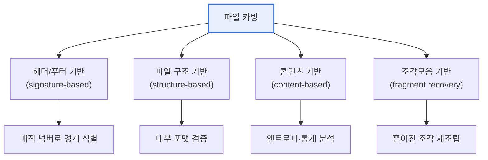
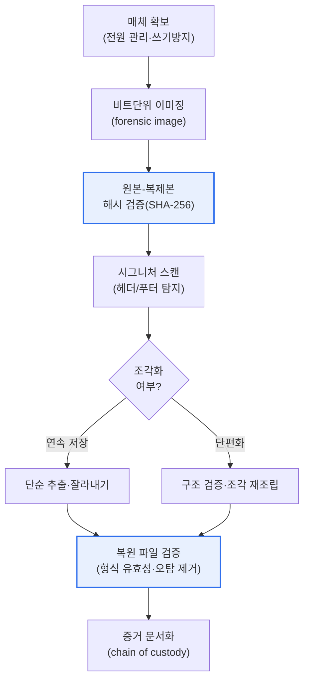

# 파일 카빙(File Carving)

## 1. 개요

### 가. 정의

> **파일 카빙(File Carving)** 은 파일 시스템의 메타데이터(파일의 위치·크기·이름 정보)에 의존하지 않고, **저장매체의 원시 데이터(raw data)에서 파일 고유의 특징(시그니처·내부 구조)을 근거로 파일을 복원** 하는 디지털 포렌식 증거수집 기술이다.

파일 카빙이 포렌식에서 강력한 무기가 되는 이유는 '**파일 시스템이 지워져도 데이터 조각으로 파일을 되살린다**'는 데 있다. 이를 이해하려면 먼저 운영체제가 파일을 어떻게 관리하는지 짚어야 한다. 우리가 파일을 열 때, 실제로는 파일 시스템(NTFS의 MFT, ext4의 inode 등)이 유지하는 메타데이터가 "이 파일은 디스크의 몇 번 블록부터 몇 바이트에 걸쳐 저장돼 있다"고 알려준다. 파일 시스템은 이 메타데이터라는 '색인'을 따라 흩어진 데이터 블록을 모아 하나의 파일로 조립해 보여준다.

그런데 여기에 포렌식의 결정적 단서가 숨어 있다. 파일을 삭제하거나 매체를 포맷(quick format)할 때, 성능상의 이유로 시스템은 대개 **메타데이터(색인)만 지우거나 '사용 가능' 표시로 바꿀 뿐, 실제 데이터 블록은 그대로 남겨둔다.** 파일 시스템의 관점에서는 '존재하지 않는 파일'이지만, 물리적 데이터 자체는 새로운 데이터가 그 자리를 덮어쓰기 전까지 디스크에 온전히 남아 있는 것이다. 파일 카빙은 바로 이 간극(gap)을 파고든다. 색인이 사라졌으니 색인을 따라갈 수는 없지만, 파일마다 고유하게 가지는 **시작 표식(헤더, header)과 끝 표식(푸터, footer)**, 그리고 내부 구조를 직접 단서로 삼아 원시 바이트 스트림에서 파일을 찾아 잘라내는(carve) 것이다.

가장 고전적인 예가 JPEG 이미지다. 모든 JPEG 파일은 `FF D8 FF` 시퀀스로 시작(SOI, Start Of Image)해서 `FF D9`로 끝난다(EOI, End Of Image). 따라서 디스크 전체를 바이트 단위로 훑다가 `FF D8 FF`를 만나면 그 지점을 파일의 시작으로 보고, 이후 처음 나타나는 `FF D9`까지를 하나의 파일로 잘라내면 삭제된 사진을 복구할 수 있다. 이처럼 파일 카빙은 삭제·손상·포맷된 매체에서 증거를 찾아내는 핵심 수단이 되며, 사건 현장에서 용의자가 삭제한 사진·문서·영상을 되살리는 데 결정적 역할을 한다. [[digital-forensics]]

### 나. 등장 배경 및 특징

파일 카빙이 독립된 기술로 발전한 배경에는 두 가지 현실이 있다. 첫째, **안티포렌식(anti-forensic)의 보편화** 다. 증거 인멸을 시도하는 자는 파일을 삭제하거나 디스크를 포맷하여 흔적을 지우려 하는데, 이 경우 파일 시스템 기반의 일반적인 복구 도구(undelete)는 메타데이터가 함께 손상되면 무력해진다. 파일 시스템에 의존하지 않는 카빙만이 이 상황을 돌파할 수 있다. 둘째, **비할당 영역(unallocated space)과 슬랙 공간(slack space)에 남은 잔존 데이터** 의 증거 가치다. 디스크에는 현재 어떤 파일에도 할당되지 않은 방대한 영역과, 클러스터 단위 할당의 특성상 파일 끝과 클러스터 경계 사이에 남는 자투리 공간이 존재하며, 여기에 과거 파일의 조각이 남아 있는 경우가 많다.

파일 카빙의 특징은 세 가지로 요약된다. **파일 시스템 독립성** — FAT·NTFS·ext4 등 파일 시스템 종류와 무관하게, 심지어 파일 시스템 자체가 손상돼도 작동한다. **원시 데이터 기반** — 논리적 구조가 아닌 물리적 바이트 패턴에 근거한다. 그리고 **조각화(fragmentation)에 취약** — 파일이 디스크에 연속으로 저장되지 않고 여러 조각으로 흩어져 있으면, 헤더와 푸터 사이에 다른 파일의 데이터가 끼어들어 정확한 복원이 어려워진다. 이 조각화 문제가 파일 카빙의 최대 난제이자, 여러 고급 기법이 등장한 이유다.

## 2. 파일 카빙의 유형(4종 기법)

파일 카빙은 무엇을 단서로 삼느냐에 따라 크게 네 가지 기법으로 나뉜다. 아래는 그 전체 분류 구조다.

```mermaid
flowchart TB
  FC["파일 카빙"] --> H["헤더/푸터 기반<br/>(signature-based)"]
  FC --> S["파일 구조 기반<br/>(structure-based)"]
  FC --> C["콘텐츠 기반<br/>(content-based)"]
  FC --> F["조각모음 기반<br/>(fragment recovery)"]
  H --> H1["매직 넘버로 경계 식별"]
  S --> S1["내부 포맷 검증"]
  C --> C1["엔트로피·통계 분석"]
  F --> F1["흩어진 조각 재조립"]
  style FC fill:#e8f0fe,stroke:#2f6fed,stroke-width:2px
```

### 가. 헤더/푸터 기반 기법(Signature-based)

가장 기본적이고 널리 쓰이는 방식이다. 이 기법은 파일 유형별로 정해진 고유 **시그니처(매직 넘버, magic number)** 를 데이터베이스로 갖추고, 저장매체를 처음부터 끝까지 스캔하며 헤더 패턴과 푸터 패턴 사이의 영역을 잘라낸다. 앞서 본 JPEG의 `FF D8 FF`~`FF D9`, PNG의 `89 50 4E 47`(‰PNG), PDF의 `25 50 44 46`(%PDF)~`%%EOF`, ZIP의 `50 4B 03 04`(PK)가 대표적이다.

이 방식의 장점은 단순하고 빠르며, 시그니처만 알면 어떤 파일이든 시도할 수 있다는 점이다. 그러나 두 가지 근본적 한계가 있다. 첫째, 푸터가 없는 파일 형식(예: 일부 텍스트·실행 파일)은 어디까지 잘라야 할지 판단하기 어려워, 정해진 최대 크기까지 잘라내는 방식을 쓰면 불필요한 데이터가 뒤에 붙는다. 둘째이자 더 심각한 문제로, 파일이 **연속 저장되지 않고 조각나 있으면** 헤더와 푸터 사이에 무관한 데이터가 끼어들어 복원된 파일이 손상된다. 이 때문에 헤더/푸터 기반은 조각화되지 않은(contiguous) 파일에서만 신뢰할 수 있다.

### 나. 파일 구조 기반 기법(Structure-based)

헤더/푸터의 한계를 보완하기 위해, 파일 내부의 포맷과 구조 정보를 능동적으로 활용하는 기법이다. 많은 파일 형식은 헤더 안에 파일 크기, 내부 섹션의 오프셋, 청크(chunk) 구조 같은 메타 정보를 담고 있다. 예를 들어 PNG는 여러 개의 청크로 구성되며 각 청크는 길이 필드와 CRC 체크섬을 가진다. 구조 기반 카빙은 이 정보를 읽어 파일의 실제 크기를 계산하고, 청크의 유효성을 검증하며, 체크섬이 맞는지 확인함으로써 복원의 정확도를 크게 높인다.

이 기법의 핵심 가치는 **검증(validation)** 에 있다. 단순히 바이트를 잘라내는 데 그치지 않고 "잘라낸 결과가 정말 유효한 파일인가"를 형식 규격에 비추어 확인하므로, 오탐(false positive)을 줄이고 조각화된 파일도 어느 정도 다룰 수 있다. 다만 파일 형식마다 별도의 구조 파서를 구현해야 하므로 개발 부담이 크고, 형식을 모르는 파일에는 적용할 수 없다는 제약이 있다.

### 다. 콘텐츠 기반 기법(Content-based)

시그니처나 명시적 구조가 없거나 손상된 경우, 데이터의 내용적 특성 자체를 분석하는 기법이다. 대표적으로 **엔트로피(entropy)** 분석이 있다. 암호화·압축된 데이터는 엔트로피가 높고(무작위에 가까움), 일반 텍스트는 엔트로피가 낮으며, 특정 형식의 데이터는 고유한 통계 분포를 보인다. 이러한 통계·문자 패턴·바이트 분포를 근거로 데이터 영역의 유형을 추정하고 경계를 판별한다.

콘텐츠 기반 기법은 시그니처가 훼손된 상황에서도 대략적인 데이터 유형을 가늠할 수 있다는 강점이 있으나, 정밀도가 상대적으로 낮고 추정에 의존하므로 다른 기법을 보조하는 용도로 병행되는 경우가 많다. 최근에는 머신러닝을 활용해 조각(fragment)의 파일 유형을 분류하는 연구가 이 범주에서 활발히 진행되고 있다.

### 라. 조각모음(단편화) 기반 기법(Fragment Recovery Carving)

파일 카빙의 최대 난제인 조각화를 정면으로 다루는 가장 진보된 기법이다. 하나의 파일이 디스크의 여러 비연속 영역에 흩어져 저장된 경우, 헤더로 시작점을 찾은 뒤 흩어진 조각들을 올바른 순서로 재조립(reassembly)해야 한다. 이때 어떤 조각이 어느 파일에 속하며 어떤 순서로 이어지는지를 판단하기 위해, 구조 검증·콘텐츠 유사도·조각 간 연속성(예: 이미지 픽셀의 연속성)을 종합적으로 평가한다.

이 문제는 조합 폭발(combinatorial explosion) 성격을 띠어 계산 비용이 크다. Garfinkel이 제안한 '**bifragment gap carving**'처럼 두 조각으로 나뉜 흔한 경우를 효율적으로 다루는 기법이나, 파일 형식의 디코더를 이용해 재조립 후보의 유효성을 검증하는 방식 등이 연구·적용되고 있다. 실무에서는 완벽한 자동 재조립이 어렵기 때문에, 분석가의 수작업 검토와 결합해 사용되는 경우가 많다.

| 기법 | 단서 | 강점 | 한계 |
|---|---|---|---|
| **헤더/푸터 기반** | 매직 넘버(시그니처) | 단순·고속, 범용 | 조각화·무푸터 파일에 취약 |
| **파일 구조 기반** | 내부 포맷·크기·체크섬 | 검증으로 정확도↑, 오탐↓ | 형식별 파서 필요 |
| **콘텐츠 기반** | 엔트로피·통계·패턴 | 시그니처 훼손 시에도 추정 | 정밀도 낮음, 보조적 |
| **조각모음 기반** | 조각 간 연속성·유사도 | 단편화 파일 복원 | 계산 비용 큼, 완전자동 곤란 |

## 3. 파일 카빙 수행 절차(프로세스)

실제 카빙 작업은 단순히 도구를 실행하는 것이 아니라, 증거의 무결성을 지키며 단계적으로 진행되는 절차다. 아래는 매체 확보부터 증거 검증까지의 표준적 흐름을 나타낸 것이다.

```mermaid
flowchart TB
  A["매체 확보<br/>(전원 관리·쓰기방지)"] --> B["비트단위 이미징<br/>(forensic image)"]
  B --> C["원본-복제본<br/>해시 검증(SHA-256)"]
  C --> D["시그니처 스캔<br/>(헤더/푸터 탐지)"]
  D --> E{"조각화<br/>여부?"}
  E -->|연속 저장| F["단순 추출·잘라내기"]
  E -->|단편화| G["구조 검증·조각 재조립"]
  F --> H["복원 파일 검증<br/>(형식 유효성·오탐 제거)"]
  G --> H
  H --> I["증거 문서화<br/>(chain of custody)"]
  style C fill:#e8f0fe,stroke:#2f6fed,stroke-width:2px
  style H fill:#e8f0fe,stroke:#2f6fed,stroke-width:2px
```

이 절차에서 특히 강조되는 두 단계가 있다. 첫째는 **해시 검증(위 파란색 C)** 으로, 카빙에 앞서 원본과 복제본의 해시값이 일치함을 확인함으로써 이후 모든 분석이 원본과 동일한 데이터 위에서 이루어졌음을 보장한다. 둘째는 **복원 파일 검증(H)** 으로, 잘라낸 결과가 실제로 열리는 유효한 파일인지 형식 규격에 비추어 확인하고 시그니처 우연 일치로 인한 오탐을 걸러낸다. 이 두 관문을 통과해야만 복원 결과가 증거로서의 신뢰성을 확보한다.

## 4. 활용, 도구, 한계

파일 카빙은 디지털 포렌식의 여러 국면에서 활용된다. 첫째, 용의자가 고의로 삭제한 파일의 복구다. 아동 성착취물 사건이나 기업 기밀 유출 사건에서 삭제된 이미지·문서를 카빙으로 되살려 결정적 증거로 삼은 사례가 다수 보고된다. 둘째, 비할당 영역·슬랙 공간에 남은 잔존 증거의 확보다. 셋째, 파일 시스템이 손상된 매체(물리적 손상, 랜섬웨어 등)에서의 데이터 복원이다.

대표적인 오픈소스 도구로는 **Foremost**(미 공군 특수수사대가 개발), **Scalpel**(Foremost를 성능 개선한 파생 도구), 그리고 삭제된 사진 복구에 특화된 **PhotoRec** 이 있다. 이들은 설정 파일에 시그니처를 정의하여 다양한 파일 형식을 카빙할 수 있으며, 상용 통합 포렌식 도구(EnCase, FTK, X-Ways)도 카빙 기능을 내장하고 있다.

한계도 분명하다. 데이터가 **덮어쓰기(overwrite)** 된 경우 물리적으로 복원이 불가능하며(SSD의 TRIM 명령은 삭제 즉시 데이터를 물리적으로 지워 복구를 어렵게 만든다), 심한 단편화나 암호화가 적용된 경우 복원이 크게 제약된다. 또한 시그니처 패턴이 우연히 일치하는 데이터를 파일로 오인하는 **오탐** 이 발생할 수 있어, 복원 결과에 대한 검증이 반드시 뒤따라야 한다.

## 5. 심화 — SSD·TRIM 환경과 무결성 이슈, 최신 동향

파일 카빙 기술은 저장매체의 변화에 따라 새로운 도전에 직면하고 있다. 과거 HDD 시대에는 삭제된 데이터가 덮어쓰기 전까지 오래 남아 카빙의 성공률이 높았다. 그러나 **SSD의 확산** 은 판도를 바꿨다. SSD는 성능과 수명 관리를 위해 **TRIM** 명령을 사용하는데, 이는 파일이 삭제되면 해당 블록을 백그라운드에서 즉시 물리적으로 비워버린다(garbage collection). 그 결과 삭제 후 짧은 시간만 지나도 데이터가 완전히 사라져, 전통적 카빙으로 복구할 수 없게 되는 경우가 많다. 이는 포렌식 수사에서 매체를 발견하는 즉시 전원을 차단하고 신속히 이미징하는 절차의 중요성을 한층 높였다.

또 하나의 심화 이슈는 **무결성과 연계보관성(chain of custody)** 이다. 카빙으로 복원한 데이터가 법정에서 증거로 인정받으려면, 원본 매체를 변경 없이 획득했음을 입증해야 한다. 이를 위해 쓰기 방지 장치(write blocker)를 사용해 원본을 보호하고, 비트 단위 복제본(forensic image)을 만든 뒤 원본과 복제본의 **해시값(MD5/SHA-256)이 일치함** 을 확인한다. 모든 카빙 작업은 이 검증된 복제본 위에서 수행되며, 복원 과정과 담당자·시각을 기록하여 증거의 신뢰성을 담보한다. 무결성 절차가 지켜지지 않으면 아무리 중요한 파일을 복원해도 증거능력을 상실할 수 있다.

최신 동향으로는 **머신러닝 기반 조각 분류** 가 주목받는다. 시그니처가 없는 조각(fragment)의 파일 유형을 딥러닝으로 판별하여 재조립 정확도를 높이려는 연구가 활발하다. 또한 클라우드·가상화 환경에서의 카빙, 스마트폰·IoT 기기의 플래시 메모리 카빙 등 대상 매체가 다변화되고 있으며, 국제 표준 측면에서는 디지털 증거 처리 절차를 규정한 **ISO/IEC 27037**(증거의 식별·수집·획득·보존) 등이 카빙을 포함한 포렌식 활동의 신뢰성 기준으로 참조된다.

## 6. 고려사항 및 시사점

파일 카빙을 실제 수사·감사에 적용할 때, 기술사 관점에서 다음을 종합적으로 고려해야 한다.

1. **단편화 대응이 기술적 핵심이다.** 파일이 여러 조각으로 흩어져 저장되면 헤더/푸터 기반만으로는 정확한 복원이 불가능하다. 따라서 파일 구조 검증·콘텐츠 분석·조각 재조립 기법을 병행하고, 상황에 따라 여러 도구를 교차 사용하여 복원 성공률과 정확도를 함께 끌어올려야 한다.

2. **무결성과 연계보관성 확보가 법적 효력의 전제다.** 아무리 정교하게 복원해도 절차적 정당성이 없으면 증거로 쓸 수 없다. 쓰기 방지 장치 사용, 비트 단위 이미징, 해시 기반 원본-복제본 동일성 검증, 작업 이력 기록을 통해 무결성과 chain of custody를 엄격히 준수해야 한다. [[file-slack]]

3. **매체 특성 변화에 선제적으로 대응해야 한다.** SSD의 TRIM은 삭제 데이터를 즉시 소거하므로, 매체 확보 시점의 신속성과 전원 관리가 복원 성공을 좌우한다. HDD 중심의 전통적 접근을 넘어 SSD·플래시·클라우드 각각의 특성에 맞는 수집·분석 전략을 마련해야 한다.

4. **안티포렌식·암호화에 대비한 복합 분석이 필요하다.** 완전 삭제(와이핑)·암호화·데이터 은닉(스테가노그래피) 같은 안티포렌식 기법에 맞서, 파일 카빙만으로는 한계가 있다. 메모리 포렌식·네트워크 포렌식·로그 분석 등 다른 기법과 결합하여 증거력을 확보하는 다각적 접근이 요구된다. [[anti-forensic]]

5. **오탐 관리와 검증 체계를 갖춰야 한다.** 시그니처의 우연한 일치로 인한 오탐은 불가피하므로, 복원 결과를 형식 규격·해시·수작업 검토로 검증하는 절차를 표준화하여 잘못된 증거 채택을 방지해야 한다.

## 참고자료

- Simson Garfinkel, "Carving contiguous and fragmented files with fast object validation", DFRWS, https://www.dfrws.org/
- ForensicsWiki, "File Carving", https://forensics.wiki/file_carving/
- CGSecurity, "PhotoRec", https://www.cgsecurity.org/wiki/PhotoRec
- ISO/IEC 27037, Guidelines for identification, collection, acquisition and preservation of digital evidence

---

> **한 줄 요약**: 파일 카빙은 *파일 시스템 메타데이터 없이 원시 데이터의 시그니처·구조로 파일을 복원* 하는 포렌식 기술로, 헤더/푸터·파일구조·콘텐츠·조각모음의 4기법이 있으며, 삭제·포맷 매체 복구에 쓰이되 단편화 대응·무결성 확보·SSD TRIM 환경 대응이 관건이다.
