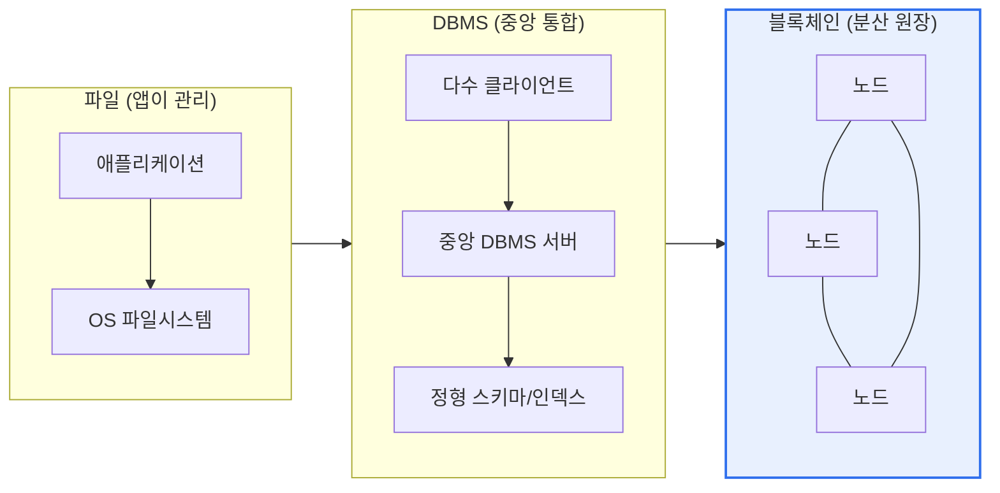
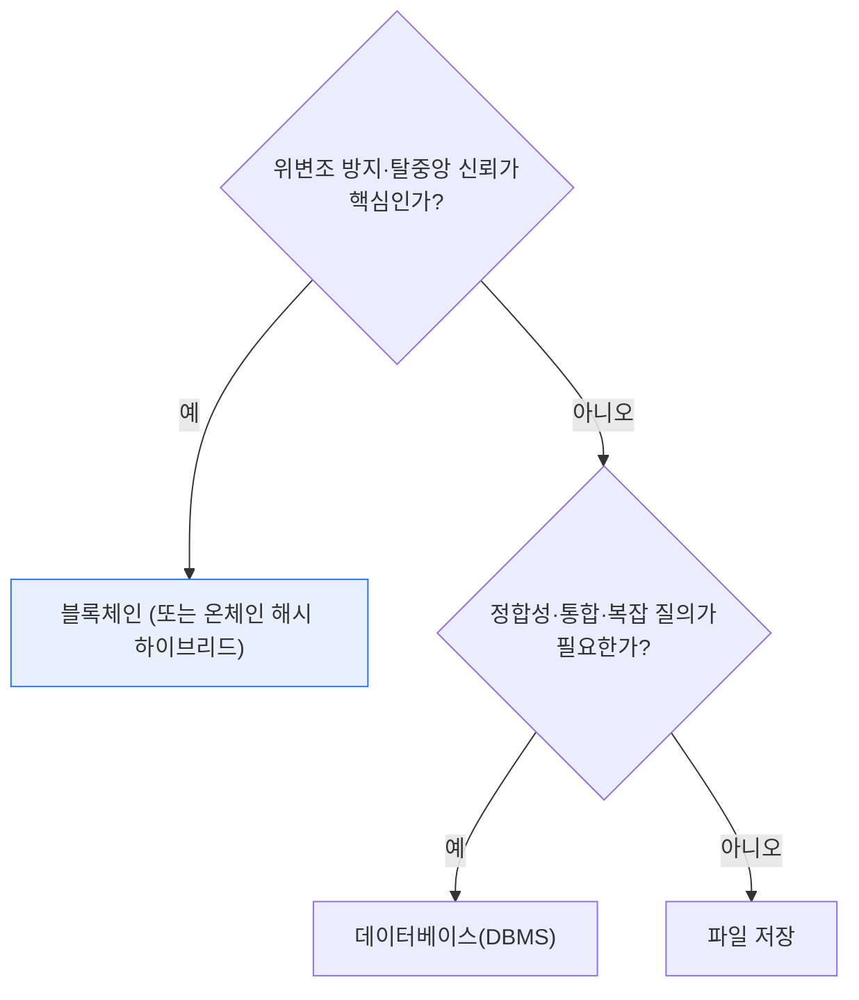

# 데이터 저장: 파일 · 데이터베이스 · 블록체인 비교

## 1. 개요

### 가. 정의

> 데이터를 저장·관리하는 세 가지 대표 방식으로, **파일**은 운영체제의 파일 단위 저장, **데이터베이스(DBMS)** 는 스키마로 구조화된 데이터의 통합·중앙 관리, **블록체인**은 다수의 분산 노드에 블록을 체인으로 연결해 보관하는 불변(immutable)의 분산 원장(distributed ledger)이다.

세 방식을 관통하는 핵심 구별점은 '**데이터의 신뢰(trust)를 어디에 두는가**'이다. 파일은 애플리케이션이 형식·정합성을 알아서 관리하므로 신뢰의 책임이 전적으로 앱에 있다. 데이터베이스는 중앙의 DBMS 서버(그리고 이를 운영하는 관리자)가 접근 제어·트랜잭션·제약조건으로 데이터를 통제하며 신뢰를 보장한다. 반면 블록체인은 중앙 관리자 없이 **다수 노드의 합의(Consensus)** 로 신뢰를 만든다는 점에서 근본적으로 다르다. 누구도 혼자서는 기록을 위·변조할 수 없고, 한번 확정(finality)된 데이터는 사실상 되돌릴 수 없다.

이 '신뢰 주체'의 차이가 무결성(integrity)·성능(performance)·가용성(availability)이라는 세 특성을 서로 다르게 가른다. 신뢰를 앱에 맡기면 단순하고 빠르지만 정합성이 약하고, 중앙 서버에 맡기면 강한 정합성과 최적화된 성능을 얻는 대신 그 서버가 단일 신뢰점이자 잠재적 단일 장애점이 되며, 다수 노드의 합의에 맡기면 위·변조 저항성과 투명성을 얻는 대신 합의 과정의 오버헤드로 성능·비용을 크게 치른다. 그래서 어떤 방식을 쓸지는 언제나 "이 데이터에 어느 수준의 신뢰·성능·투명성이 필요한가"라는 요구사항 질문으로 귀결된다.

### 나. 등장 배경과 필요성

데이터의 성격은 제각각이다. 시스템 설정 파일이나 서버 로그처럼 구조가 단순하고 정합성 요구가 낮은 데이터가 있는가 하면, 은행 계좌 잔액·재고 수량처럼 조금의 불일치도 허용되지 않는 거래 데이터가 있고, 학위·자격 증명이나 공급망 이력처럼 '누구도 몰래 고칠 수 없어야' 가치가 생기는 데이터도 있다. 세 방식이 공존하는 이유는 이 다양성 때문이다. 하나의 만능 저장소가 모든 요구를 최적으로 만족시킬 수 없으므로, 데이터의 성격에 맞는 방식을 골라야 비용·성능·신뢰를 동시에 최적화할 수 있다. 이 선택 문제는 단순 개념 비교를 넘어, 시스템 아키텍처 설계의 초기 의사결정에 직접 영향을 주므로 기술사 관점에서 중요하다.

역사적으로도 이 세 방식은 '이전 방식의 한계를 넘기 위해' 순차적으로 등장했다. 초기 정보 시스템은 파일 시스템으로 데이터를 관리했으나 중복·불일치·동시성 문제(이른바 데이터 종속성·중복성 문제)에 부딪혀 1970년대 이후 DBMS로 넘어갔다. DBMS는 중앙 통합으로 이 문제를 해결했지만, 여러 주체가 서로를 신뢰하기 어려운 환경(다자간 거래·탈중앙 서비스)에서는 '중앙을 누가 믿느냐'는 새로운 신뢰 문제가 남았고, 2009년 비트코인 이후 블록체인이 이를 합의 기반 탈중앙으로 풀려는 시도로 부상했다. 즉 세 방식은 대체재라기보다, 서로 다른 신뢰·규모 요구를 충족하기 위해 축적된 선택지에 가깝다.

## 2. 세 방식의 구조

세 저장 방식은 데이터를 담는 물리적·논리적 구조부터 다르다. 아래 구조도는 신뢰의 소재지(앱 → 중앙 서버 → 분산 네트워크)가 오른쪽으로 갈수록 분산되는 흐름을 보여준다.

**파일 방식**은 데이터를 파일 단위로 저장하고, 그 내용의 형식(CSV·JSON·바이너리 등)과 무결성은 이를 읽고 쓰는 애플리케이션이 책임진다. DBMS라는 중간 계층이 없어 구조가 가볍고 접근이 직접적이지만, 같은 데이터가 여러 파일에 중복되기 쉽고 동시에 여러 프로그램이 수정하면 정합성이 깨지기 쉽다. 데이터 간 관계·제약조건을 강제할 장치가 없어 규모가 커질수록 관리 비용이 급증한다. 초기 정보 시스템이 '파일 시스템의 한계'를 겪으며 DBMS로 넘어간 역사가 이 지점에서 비롯된다.

**데이터베이스(DBMS)** 는 데이터를 스키마로 정의된 구조(관계형이라면 테이블·행·열)로 통합 관리하고, 중앙 서버가 트랜잭션·병행제어·접근권한·백업을 일괄 통제한다. 여러 애플리케이션이 같은 데이터를 공유하면서도 중복을 없애고(정규화) 일관성을 유지하도록 설계되어, 정합성이 중요한 대부분의 기업 업무에서 사실상의 표준이 되었다. 다만 모든 신뢰가 이 중앙 서버에 집중되므로, 서버 관리자는 데이터를 수정할 권한을 가지며 서버 장애는 곧 서비스 중단으로 이어질 수 있어 이중화·복제 같은 가용성 대책이 필수다.

**블록체인**은 데이터를 블록에 담고 각 블록이 직전 블록의 해시값을 포함해 사슬처럼 연결한다. 이 원장을 다수 노드가 동일하게 복제·보관하고, 새 블록은 합의 알고리즘(PoW·PoS 등)을 통과해야만 추가된다. 어떤 블록의 내용을 고치면 그 해시가 바뀌어 이후 모든 블록의 연결이 깨지고, 이를 정당화하려면 네트워크 다수의 계산력·지분을 장악해야 하므로 사실상 위·변조가 불가능하다. 중앙 관리자가 없어 특정 주체의 통제·검열에 강하지만, 모든 노드가 같은 데이터를 저장하고 합의에 참여해야 해 저장 비용·처리 지연이 크다.

## 3. 무결성·성능·가용성의 상세 비교

세 방식을 구조·관리주체·무결성·성능·가용성 측면에서 나란히 놓으면 각각의 위치가 뚜렷해진다. 아래 표는 비교의 뼈대이고, 그 아래 산문은 '왜 그런 차이가 생기는가'를 설명한다.

| 구분 | 파일 | 데이터베이스 | 블록체인 |
|---|---|---|---|
| **구조** | 파일 단위 | 스키마·관계형 | 블록 체인(분산 원장) |
| **관리 주체** | 애플리케이션 | 중앙 DBMS | 분산 노드(탈중앙) |
| **무결성** | 낮음(중복·불일치) | 트랜잭션(ACID) | 불변성·위변조 방지 |
| **동시성·통합** | 취약 | 강함(병행제어) | 합의 지연 |
| **성능** | 단순·빠름 | 인덱스로 최적화 | 느림(합의 오버헤드) |
| **가용성** | 단일 장애점 | 이중화로 대응 | 탈중앙·고가용 |
| **투명성·감사** | 낮음 | 로그 의존 | 매우 높음(공개 검증) |
| **적합** | 단순·소량 | 정형·통합 업무 | 신뢰 필요·탈중앙(거래·이력) |

**무결성의 차이는 정합성을 강제하는 장치가 어디에 있는가에서 생긴다.** 파일은 강제 장치가 없어 앱의 실수·동시 접근이 곧 불일치로 이어진다. DBMS는 트랜잭션의 ACID(원자성·일관성·고립성·지속성)와 제약조건·병행제어로 정합성을 시스템 차원에서 보장한다. 예를 들어 계좌 이체에서 출금과 입금을 하나의 트랜잭션으로 묶어 '전부 반영되거나 전부 취소'를 강제한다. 블록체인은 합의와 해시 체인으로 '한번 확정된 기록은 바뀌지 않는다'는 형태의 무결성을 제공하는데, 이는 DBMS의 정합성과는 결이 다른 '사후 위·변조 저항성'에 가깝다.

**성능의 차이는 신뢰를 만드는 비용에서 갈린다.** 파일은 중간 계층 없이 바로 읽고 쓰므로 단순 접근은 가장 빠르다. DBMS는 인덱스·쿼리 최적화·캐시로 대량 데이터에서도 복잡한 질의를 빠르게 처리한다. 블록체인은 모든 거래를 다수 노드가 검증·합의·복제해야 하므로 처리량이 낮다. 실제 수치로도 격차가 크다 — 전통적 관계형 DB와 상용 결제망은 초당 수천~수만 건 이상을 처리하는 반면, 비트코인은 초당 약 7건, 이더리움은 수십 건 수준(레이어2·업그레이드로 개선 중)으로 알려져 있어, 대량·실시간 처리에는 그대로 쓰기 어렵다.

**가용성의 차이는 신뢰의 소재지와 직결된다.** 파일은 그 파일이 놓인 저장소가 곧 단일 장애점이다. DBMS는 중앙 집중이지만 복제(replication)·클러스터링·이중화로 장애에 대응한다 — 다만 이 대비는 추가 설계·비용을 요구한다. 블록체인은 다수 노드가 동일 원장을 보유하므로 일부 노드가 죽어도 네트워크는 계속 동작하는, 구조적으로 높은 가용성을 갖는다. 즉 '단일 신뢰점을 없앤' 설계가 가용성 측면에서는 강점으로 되돌아온다.

**투명성·감사(audit) 특성도 세 방식이 크게 다르다.** 파일은 누가 언제 무엇을 바꿨는지 별도 장치 없이는 추적하기 어렵고, DBMS는 감사 로그(audit log)를 설정하면 변경 이력을 남길 수 있으나 그 로그 자체가 관리자 권한으로 수정될 수 있다는 한계가 있다. 블록체인은 모든 거래가 원장에 공개적으로 기록되고 다수 노드가 검증하므로, 사후에 특정 주체가 이력을 몰래 지우거나 바꾸는 것이 사실상 불가능하다. 이 '검증 가능한 투명성'은 다자간 거래·규제 보고처럼 '신뢰할 수 없는 상대와도 사실을 공유해야 하는' 상황에서 블록체인만의 차별적 가치가 된다.

## 4. 선택 기준과 하이브리드 사례

무엇을 쓸지는 데이터 요구사항으로 결정된다. 아래 의사결정 흐름은 실무에서 자주 쓰이는 판단 순서다.

위·변조 방지·투명성·탈중앙 신뢰가 핵심이면 블록체인이 적합하지만, 성능·저장 비용·규제 대응이 부담이다. 정합성·통합·복잡한 질의·트랜잭션이 중요하면 DBMS가 최적이며 대부분의 기업 업무(회계·주문·재고·고객관리)가 여기에 해당한다. 단순 설정·로그·대용량 미디어 저장은 파일(또는 오브젝트 스토리지)이 가장 경제적이다. 실제 시스템은 이 셋을 조합해 쓴다.

선택을 판단할 때 특히 조심할 점은, '탈중앙이 필요하다'는 요구와 '데이터가 중요하다'는 요구를 혼동하지 않는 것이다. 데이터가 아무리 중요해도 그 데이터를 관리하는 주체가 단일 신뢰 기관(은행·기관 서버)이라면 대개 DBMS로 충분하며, 블록체인의 이점은 오히려 '서로 신뢰하기 어려운 다수 참여자'가 하나의 원장을 공유해야 할 때 발현된다. 반대로 참여자가 하나이거나 이미 신뢰가 성립한 조직 내부라면 블록체인은 과잉 설계가 되기 쉽다. 이 구분을 놓치면 화제성만 좇아 잘못된 저장소를 고르게 된다.

구체 사례로 세 방식의 조합을 보면 이해가 분명해진다. 첫째, **공급망 이력 추적**(예: 유통·식품 이력)에서는 원본 문서·이미지는 오프체인(파일·오브젝트 스토리지)에 두고, 각 단계의 검증 해시만 블록체인에 올려 '누가 언제 무엇을 기록했는지'를 위·변조 없이 증명한다. 둘째, **전자 문서·증명서 진위 확인**(졸업증명·계약서)에서는 문서 본문은 기관 DBMS에, 그 해시(지문)는 블록체인에 기록해 나중에 원본과 해시를 대조하는 방식으로 위조를 잡아낸다. 셋째, **대규모 서비스의 로그·미디어**는 파일/오브젝트 스토리지에 저장하되, 그 메타데이터·인덱스는 DBMS로 관리해 검색·집계 성능을 확보한다. 이처럼 '무거운 원본은 싸고 빠른 곳에, 신뢰 증거는 위·변조 없는 곳에'라는 역할 분담이 현실적 설계다.

## 5. 심화 — 온체인/오프체인 하이브리드와 최근 동향

블록체인의 성능·저장 한계를 정면으로 인정하면서 그 신뢰 특성만 취하려는 것이 **온체인/오프체인 하이브리드** 패턴이다. 대용량 원본 데이터(문서·이미지·대량 레코드)는 오프체인(DBMS·파일·분산 파일시스템 IPFS 등)에 저장하고, 그 데이터의 **해시값(지문)만 온체인**에 올린다. 원본이 조금이라도 바뀌면 해시가 달라지므로, 온체인 해시와 오프체인 원본을 대조하기만 하면 위·변조 여부를 검증할 수 있다. 이렇게 하면 블록체인에 대용량을 올릴 때의 비용·지연을 피하면서 '증명 가능성'이라는 핵심 가치는 지킨다.

이 하이브리드 사고는 최근 데이터베이스 자체에도 스며들고 있다. 일부 상용·오픈소스 DBMS는 '변경 불가 원장 테이블(ledger/immutable table)'이나 암호학적 검증(해시 체인) 기능을 내장해, 블록체인 없이도 '위·변조 감지'라는 특성 일부를 중앙 DB 안에서 제공하려 한다. 이는 '탈중앙까지는 필요 없지만 위·변조 증거는 남기고 싶다'는 중간 수요를 겨냥한 것으로, 저장 방식의 경계가 고정된 것이 아니라 요구사항에 맞춰 서로의 장점을 흡수하며 진화하고 있음을 보여준다.

기술사 관점에서 눈여겨볼 최근 흐름은 다음과 같다. 첫째, **성능 확장(레이어2)** — 이더리움 진영은 롤업(Optimistic·ZK-Rollup) 등 레이어2로 다수 거래를 오프체인에서 처리하고 요약본만 온체인에 기록해 처리량을 끌어올리고 있다. 둘째, **엔터프라이즈용 허가형 블록체인** — Hyperledger Fabric 같은 프라이빗/컨소시엄 체인은 참여 노드를 제한해 합의 오버헤드를 줄이고 규제·프라이버시 요구에 맞춘다. 셋째, **데이터 규제와의 충돌** — 블록체인의 불변성은 개인정보보호법의 '잊힐 권리(삭제권)'와 충돌하므로, 개인정보 원문은 절대 온체인에 올리지 않고 해시·참조만 두는 설계가 사실상 표준 권고가 되었다. 넷째, **폴리글랏 퍼시스턴스(Polyglot Persistence)** — 하나의 시스템 안에서도 데이터 성격별로 관계형 DB·NoSQL·파일·블록체인을 나눠 쓰는 접근이 보편화되고 있다. (개별 프로젝트의 최신 처리량·표준 수치는 빠르게 바뀌므로, 실제 설계 시에는 각 플랫폼의 최신 공식 문서로 확인하는 것이 바람직하다.)

## 6. 고려사항 및 시사점

기술사 관점에서 세 저장 방식의 비교는 '기술 그 자체'가 아니라 '요구사항에 맞는 신뢰·성능·비용의 균형'을 설계하는 문제로 읽어야 한다.

1. **블록체인은 만능이 아니다.** 위·변조 방지·투명성·탈중앙 신뢰가 정말로 필요한 경우(공급망 추적, 증명서, 다자간 거래 이력)에만 가치가 있다. 그렇지 않은 일반 업무 데이터에 블록체인을 쓰면 성능 저하·저장 비용·운영 복잡성만 얻는, DBMS의 열등한 대안이 된다. '블록체인이 필요한가'를 먼저 냉정하게 판정하는 것이 설계의 출발점이다.

2. **하이브리드가 현실적 해법이다.** 대용량 원본은 오프체인(DBMS·파일)에, 검증 해시만 온체인에 두는 절충은 성능·비용과 신뢰를 동시에 잡는 사실상의 정석이다. 순수 온체인 저장을 고집하기보다 '무엇을 온체인에 올릴지'를 최소화하는 설계 감각이 중요하다.

3. **데이터 특성 기반 설계(폴리글랏)를 원칙으로 삼아야 한다.** 하나의 시스템도 데이터 종류에 따라 파일·DB·블록체인을 나눠 써, 각 방식의 장점만 취하고 단점을 피한다. 이때 데이터의 정합성·수명·접근 패턴·규제 요구를 분류하는 데이터 거버넌스가 선행되어야 한다.

4. **규제·컴플라이언스를 저장 방식 선택의 1급 요건으로 다뤄야 한다.** 특히 블록체인의 불변성은 개인정보 삭제권과 충돌하므로, 개인식별정보는 온체인에서 배제하고 해시·참조만 두는 원칙을 아키텍처 단계에서 못 박아야 한다. 국내외 개인정보보호 규제와 금융 감독 요건은 저장소 선택을 좌우하는 강한 제약이다.

5. **총소유비용(TCO)과 운영 성숙도까지 고려해야 한다.** 블록체인·분산 시스템은 개발·운영·인력 확보 비용이 높고 기술 성숙도·표준이 아직 유동적이다. 신기술의 화제성만 보고 도입하기보다, 조직의 운영 역량과 장기 유지보수 비용을 함께 저울질하는 트레이드오프 판단이 필요하다.

## 참고자료

- AWS, "파일·블록·오브젝트 스토리지 및 데이터베이스 개념" — https://aws.amazon.com/products/storage/
- Hyperledger Foundation, "Hyperledger Fabric Documentation" — https://hyperledger-fabric.readthedocs.io/
- Ethereum, "Scaling / Layer 2" — https://ethereum.org/en/developers/docs/scaling/

---

> **한 줄 요약**: 파일(앱 관리·단순·빠름)·DBMS(중앙 통합·ACID·최적화)·블록체인(분산 원장·불변성·탈중앙)은 '신뢰를 어디에 두는가'에 따라 무결성·성능·가용성이 갈리며, 통합·정합성·복잡 질의는 DBMS, 위·변조 방지·투명성·탈중앙 신뢰는 블록체인이 적합하되, 현실에서는 온체인 해시+오프체인 원본의 하이브리드와 데이터 특성별 폴리글랏 저장으로 절충한다.
