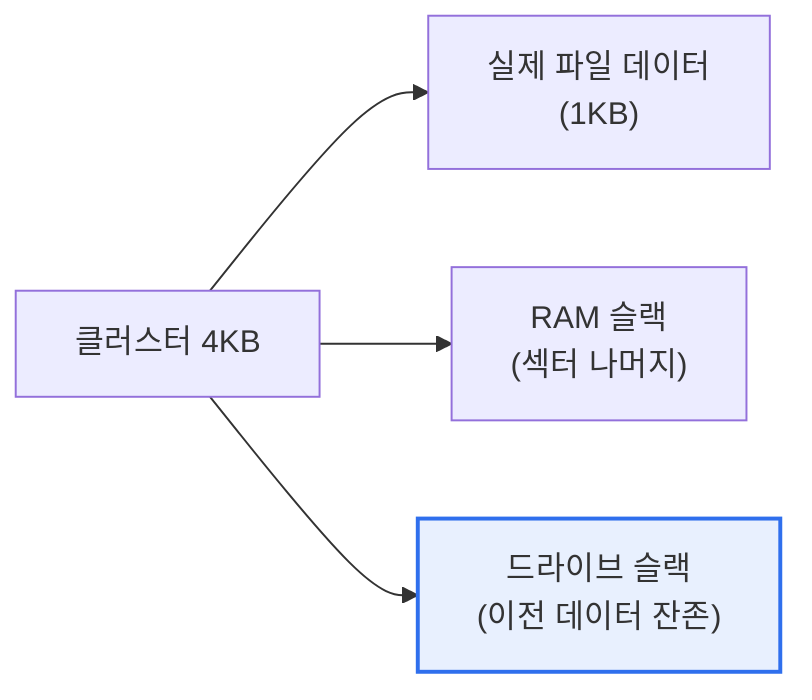

# 파일 슬랙(File Slack)

## 1. 개요

### 가. 정의
> **파일 슬랙**은 파일이 저장 단위(클러스터)를 꽉 채우지 못해 생기는 **마지막 할당 공간의 남는 빈 영역**으로, 디지털 포렌식에서 삭제되거나 은닉된 데이터가 남아 있을 수 있는 증거 공간이다.

파일 슬랙이 포렌식에서 중요한 이유는 '**버려진 틈에 과거의 데이터가 숨어 있다**'는 데 있다. 저장장치는 데이터를 바이트 단위가 아니라 클러스터(예: 4KB)라는 고정 단위로 할당한다. 그런데 파일 크기가 이 단위의 배수가 아닌 경우가 대부분이다. 예를 들어 4KB 클러스터에 1KB 파일을 저장하면, 나머지 3KB는 이 파일이 쓰지 않는 낭비 공간이 된다. 바로 이 남는 공간이 파일 슬랙이다. 핵심은 이 공간이 **완전히 지워지지 않는다**는 점이다. 이전에 그 자리에 있던 다른 파일의 데이터 조각이나 메모리 내용이 그대로 남아 있을 수 있다. 사용자는 파일을 지웠다고 생각하지만, 슬랙 공간에는 흔적이 남는다. 포렌식 수사관은 이 슬랙을 분석해 삭제된 데이터, 은닉된 정보를 복원한다. 반대로 공격자는 이 공간에 데이터를 숨기는 은닉(스테가노그래피적) 수법에 악용하기도 한다.

### 나. 발생 원리
파일 크기와 클러스터 크기의 불일치로 마지막 클러스터에 필연적으로 낭비 공간이 발생하며, 이 영역이 이전 데이터를 보존해 증거가 된다.

## 2. 파일 슬랙의 구조

파일 슬랙은 다시 둘로 나뉜다. **RAM 슬랙**은 파일의 끝부터 그 섹터 끝까지의 공간으로, 과거엔 메모리 내용이 채워졌다. **드라이브 슬랙**은 그 다음 섹터부터 클러스터 끝까지로, 이전에 그 위치에 있던 삭제 파일의 데이터가 남아 있는 영역이다.

| 구분 | 내용 |
|---|---|
| **RAM 슬랙** | 파일 끝 ~ 섹터 끝, 과거 메모리 잔존 |
| **드라이브 슬랙** | 섹터 끝 ~ 클러스터 끝, 이전 파일 잔존 |

## 3. 포렌식 활용과 위협

| 관점 | 내용 |
|---|---|
| **증거 복원** | 삭제·이전 파일 조각 복구, 은닉 데이터 발견 |
| **데이터 은닉 위협** | 공격자가 슬랙에 정보 은닉(안티포렌식) |
| **분석 도구** | EnCase, FTK 등으로 슬랙 영역 추출·분석 |

## 4. 고려사항 및 시사점

1. **삭제가 곧 소거가 아님을 보여준다.** 파일 삭제나 일반 포맷으로는 슬랙에 남은 데이터가 지워지지 않으므로, 민감 데이터는 완전 삭제(와이핑·물리적 파기)로 제거해야 한다. [[anti-forensic]]
2. **은닉 채널로 악용될 수 있다.** 슬랙 공간에 데이터를 숨기는 안티포렌식·정보 유출 수법이 있으므로, 보안 관점에서 슬랙 영역까지 점검·통제할 필요가 있다.
3. **정당한 절차와 무결성 확보**가 전제다. 슬랙 분석으로 확보한 증거가 법적 효력을 가지려면, 이미지 획득·해시 검증 등 무결성 유지 절차(chain of custody)를 준수해야 한다. [[digital-forensics]]

---

> **한 줄 요약**: 파일 슬랙은 *파일이 클러스터를 다 못 채워 남는 공간* 으로 RAM 슬랙·드라이브 슬랙으로 나뉘며, 삭제·이전 데이터가 잔존해 포렌식 증거가 되는 동시에 데이터 은닉에 악용될 수 있어 완전 삭제와 슬랙 분석이 중요하다.
