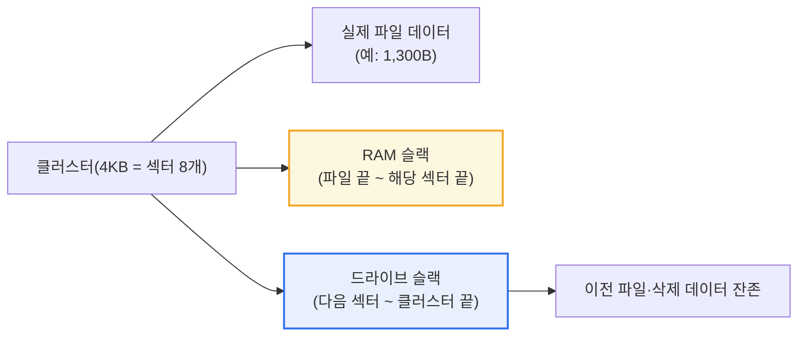
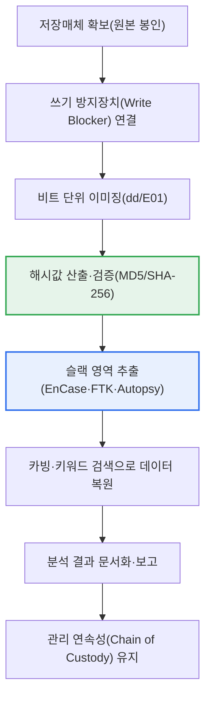

# 파일 슬랙(File Slack)

## 1. 개요

### 가. 정의
> **파일 슬랙(File Slack)** 은 파일이 저장 단위(클러스터)를 정확히 채우지 못해 마지막 할당 공간에 남는 **사용되지 않는 빈 영역**으로, 디지털 포렌식에서 삭제·은닉된 과거 데이터가 잔존할 수 있는 증거 공간이자, 동시에 안티포렌식(데이터 은닉)에 악용될 수 있는 취약 공간이다.

파일 슬랙이 포렌식에서 갖는 의미는 '**버려진 틈에 과거의 데이터가 그대로 숨어 있다**'는 점에 있다. 저장장치는 데이터를 바이트 단위로 촘촘히 관리하지 않고, 파일시스템이 정한 **클러스터(할당 단위, 예: NTFS 기본 4KB)** 라는 고정 크기 블록 단위로 공간을 할당한다. 성능과 관리 효율을 위해 최소 할당 단위를 크게 잡는 것인데, 문제는 현실의 파일 크기가 이 단위의 정수배인 경우가 거의 없다는 데 있다. 예컨대 4KB 클러스터에 1KB짜리 텍스트 파일을 저장하면 파일이 실제로 쓰는 공간은 1KB뿐이고 **나머지 3KB는 이 파일이 점유하되 사용하지 않는 낭비 공간**이 된다. 바로 이 남는 공간이 파일 슬랙이다.

핵심은 이 낭비 공간이 파일 저장 시점에 **완전히 초기화되지 않는다**는 점이다. 운영체제는 새 파일의 데이터가 차지하는 영역만 덮어쓰고, 그 뒤의 슬랙 영역에는 손을 대지 않는 경우가 많다. 그 결과 이전에 그 클러스터에 존재했던 다른 파일의 데이터 조각이나, 과거에는 메모리(RAM)의 잔여 내용이 그대로 남을 수 있다. 사용자는 파일을 삭제하거나 새 파일로 덮었다고 생각하지만, 슬랙 공간에는 지워지지 않은 과거의 흔적이 남는다. 포렌식 수사관은 이 영역을 정밀 분석해 삭제된 문서 조각, 은닉된 정보, 과거 활동의 단서를 복원하고, 반대로 공격자는 이 '보이지 않는 공간'에 악성코드나 유출 데이터를 숨기는 안티포렌식 수법에 악용한다.

### 나. 등장 배경과 발생 원리
파일 슬랙은 어떤 특수한 결함이 아니라 **블록 기반 저장 구조에서 필연적으로 발생하는 구조적 부산물**이다. 저장장치의 물리적 최소 기록 단위인 **섹터(전통적으로 512바이트, 최신 디스크는 4K 섹터=Advanced Format)** 와, 파일시스템이 공간을 관리하는 논리적 단위인 **클러스터(여러 섹터의 묶음)** 사이의 크기 차이, 그리고 클러스터 크기와 실제 파일 크기의 불일치가 겹치면서 남는 자투리 공간이 생긴다. 즉 '물리적으로는 파일에 할당되었으나 논리적으로는 파일이 사용하지 않는' 공간이 파일 슬랙이며, 이 정의상의 틈이 이전 데이터를 보존하기 때문에 증거로서 가치를 갖는다.

이 현상이 포렌식 관점에서 특별히 주목받게 된 계기는, 사용자와 일반 삭제 도구가 접근하지 못하는 영역에 정보가 남는다는 사실이다. 파일 탐색기에서 파일을 지우거나 일반(빠른) 포맷을 해도 슬랙에 남은 잔존 데이터는 물리적으로 남아 있어, 전용 도구로 저비트 수준까지 읽으면 복원이 가능하다. 이 때문에 파일 슬랙은 **비할당 영역(Unallocated Space)** · **삭제 파일 복구**와 함께 저장매체 포렌식의 3대 핵심 분석 대상으로 다뤄진다.

## 2. 파일 슬랙의 계층 구조

파일 슬랙을 정확히 이해하려면 저장 공간의 계층(섹터 → 클러스터 → 파일시스템 → 볼륨)을 따라 슬랙이 어느 층에서 생기는지를 구분해야 한다. 아래 구조도는 하나의 클러스터 내부에서 실제 파일 데이터, RAM 슬랙, 드라이브 슬랙이 어떻게 배치되는지를 보여준다.

```mermaid
flowchart LR
  C["클러스터(4KB = 섹터 8개)"] --> D["실제 파일 데이터<br/>(예: 1,300B)"]
  C --> RS["RAM 슬랙<br/>(파일 끝 ~ 해당 섹터 끝)"]
  C --> DS["드라이브 슬랙<br/>(다음 섹터 ~ 클러스터 끝)"]
  DS --> P["이전 파일·삭제 데이터 잔존"]
  style RS fill:#fef7e0,stroke:#f5a623,stroke-width:2px
  style DS fill:#e8f0fe,stroke:#2f6fed,stroke-width:2px
```

파일 슬랙은 발생 위치와 채워지는 내용에 따라 크게 네 가지로 세분된다. **가장 자주 논의되는 것은 RAM 슬랙과 드라이브 슬랙**이며, 확장된 관점에서 파일시스템 슬랙·볼륨 슬랙까지 포함한다. 아래에서 각각을 그 발생 원리와 포렌식적 함의를 중심으로 서술한다.

### 가. RAM 슬랙(Sector Slack)
RAM 슬랙은 파일의 실제 데이터가 끝나는 지점부터 **그 데이터가 걸쳐 있는 마지막 섹터의 끝까지**의 공간이다. 저장장치는 데이터를 섹터(512바이트) 단위로만 기록할 수 있으므로, 예를 들어 파일의 마지막 조각이 200바이트라면 나머지 312바이트를 무언가로 채워 한 섹터를 완성해야 한다. 과거 MS-DOS·초기 Windows 시절에는 이 자리에 디스크 쓰기 직전 메모리 버퍼(RAM)의 내용이 그대로 기록되었기 때문에 'RAM 슬랙'이라는 이름이 붙었고, 여기서 비밀번호·직전 편집 내용 같은 민감 정보가 우연히 노출되는 사례가 실제로 있었다.

다만 최신 운영체제에서는 이 위험을 인지해, RAM 슬랙 영역을 **0x00으로 패딩(zero-fill)** 하여 메모리 잔여 내용이 유출되지 않도록 처리하는 것이 일반적이다. 따라서 오늘날 RAM 슬랙에서 과거 메모리 데이터를 복원할 가능성은 옛 시스템에 비해 낮아졌다고 이해하는 것이 정확하다. 그럼에도 RAM 슬랙은 여전히 **파일의 정확한 끝 위치(EOF)를 판별**하고, 뒤에 이어지는 드라이브 슬랙과 실제 데이터의 경계를 구분하는 기준점으로서 분석 가치를 가진다.

RAM 슬랙은 '섹터 슬랙'이라고도 불린다. 그 규모는 섹터 크기에서 파일의 마지막 섹터 사용량을 뺀 값으로, 최대 511바이트(512B 섹터 기준)까지 발생한다. 개별 크기는 작지만, 수십만 개의 파일이 존재하는 실제 시스템 전체로 보면 무시할 수 없는 분석 대상이 된다.

### 나. 드라이브 슬랙(Drive Slack)
드라이브 슬랙은 파일의 마지막 섹터(즉 RAM 슬랙이 끝난 지점) 다음 섹터부터 **클러스터의 끝까지** 남는 공간이다. 포렌식에서 가장 중요한 슬랙이 바로 이 영역인데, 이유는 **여기에 이전에 그 클러스터를 사용했던 삭제 파일의 데이터가 거의 그대로 남아 있기** 때문이다. 운영체제는 새 파일을 클러스터에 배치할 때 파일 데이터가 미치지 못하는 뒤쪽 섹터들은 굳이 지우지 않으므로, 과거 파일의 내용이 '유령'처럼 보존된다.

예를 들어 4KB 클러스터(섹터 8개)에 1,300바이트짜리 파일이 저장되었다고 하자. 파일은 앞의 3개 섹터(1,536바이트)에 걸치고, 세 번째 섹터의 뒤쪽 236바이트가 RAM 슬랙(0으로 패딩)이 된다. 그리고 **네 번째부터 여덟 번째 섹터(2,560바이트)가 모두 드라이브 슬랙**으로, 이 자리에 예전에 있던 다른 파일의 텍스트·이미지 조각이 남을 수 있다. 수사관은 이 2,560바이트에서 삭제된 이메일 문구, 문서의 일부, 로그 조각 등을 복원해 사건의 결정적 단서를 얻는다.

드라이브 슬랙은 안티포렌식의 표적이기도 하다. 공격자는 정상 파일 뒤의 이 공간에 데이터를 의도적으로 기록해, 일반적인 파일 목록에는 드러나지 않는 은닉 채널을 만들 수 있다. 이 때문에 슬랙 은닉은 스테가노그래피와 함께 대표적 데이터 은닉 기법으로 분류된다.

### 다. 파일시스템 슬랙과 볼륨 슬랙
슬랙은 클러스터 내부에서만 생기는 것이 아니라 더 큰 단위에서도 발생한다. **파일시스템 슬랙**은 파티션의 전체 크기가 클러스터 크기의 정수배로 딱 나눠지지 않을 때, 파일시스템이 클러스터로 관리하지 못하고 남기는 파티션 끝부분의 자투리 영역이다. **볼륨 슬랙**은 파티션들에 할당되지 않고 볼륨(디스크) 차원에서 남는 공간을 가리킨다. 두 영역 모두 파일시스템이 정상적으로는 접근하지 않기 때문에, 삭제 흔적이 오래 보존되거나 데이터 은닉에 악용될 수 있어 저장매체 전체를 이미징해 분석할 때 반드시 함께 검토해야 한다.

이처럼 슬랙은 계층마다 서로 다른 원리로 발생하며, 포렌식 분석은 특정 파일의 슬랙만 보는 것이 아니라 매체 전체의 슬랙 계층을 종합적으로 훑어야 완결된다. 아래 표는 네 가지 슬랙을 비교하되, 표만으로 이해하지 말고 위 산문 설명과 함께 읽어야 각 영역이 '왜' 그 자리에 생기는지가 분명해진다.

| 구분 | 발생 위치 | 채워지는 내용 | 포렌식 관점 |
|---|---|---|---|
| **RAM 슬랙** | 파일 끝 ~ 해당 섹터 끝 | (과거) 메모리 잔존 / (현재) 0 패딩 | 파일 끝 경계 판별, 옛 시스템에선 민감정보 노출 |
| **드라이브 슬랙** | 다음 섹터 ~ 클러스터 끝 | 이전·삭제 파일 데이터 | 삭제 데이터 복원의 핵심, 은닉 표적 |
| **파일시스템 슬랙** | 파티션 끝 자투리 | 이전 포맷·잔존 데이터 | 매체 전체 이미징 시 검토 |
| **볼륨 슬랙** | 미할당 볼륨 영역 | 파티션 삭제 흔적 등 | 은닉·복원 대상 |

## 3. 포렌식 분석 절차와 안티포렌식 위협

파일 슬랙 분석은 즉흥적으로 이뤄지지 않고, **증거의 법적 효력을 담보하기 위한 정형화된 절차** 위에서 수행된다. 아래 프로세스도는 저장매체 확보부터 슬랙 분석·보고까지의 흐름을 나타낸다.

```mermaid
flowchart TD
  A["저장매체 확보(원본 봉인)"] --> B["쓰기 방지장치(Write Blocker) 연결"]
  B --> C["비트 단위 이미징(dd/E01)"]
  C --> H["해시값 산출·검증(MD5/SHA-256)"]
  H --> D["슬랙 영역 추출(EnCase·FTK·Autopsy)"]
  D --> E["카빙·키워드 검색으로 데이터 복원"]
  E --> F["분석 결과 문서화·보고"]
  F --> G["관리 연속성(Chain of Custody) 유지"]
  style D fill:#e8f0fe,stroke:#2f6fed,stroke-width:2px
  style H fill:#e6f4ea,stroke:#34a853,stroke-width:2px
```

절차의 출발점은 **원본 무결성 보존**이다. 저장매체를 확보하면 곧바로 쓰기 방지장치(Write Blocker)를 물려 원본에 어떤 변경도 가하지 못하게 하고, 원본이 아니라 그 **비트 단위 복제 이미지(dd·E01 형식)** 를 대상으로 분석한다. 이미징 직후 MD5·SHA-256 해시값을 산출해 두고, 분석 종료 시점에 다시 계산해 값이 일치함을 보임으로써 '분석 과정에서 증거가 훼손되지 않았음'을 입증한다. 이 무결성 검증이 없으면 슬랙에서 아무리 결정적인 데이터를 복원해도 법정에서 증거능력을 인정받기 어렵다.

이후 EnCase, FTK, 오픈소스인 Autopsy(The Sleuth Kit), Foremost 같은 도구로 슬랙 영역을 지목·추출하고, **파일 카빙(File Carving)** 과 키워드 검색을 병행해 헤더/푸터 시그니처를 단서로 삭제 파일 조각을 재구성한다. 예를 들어 JPEG의 시작 시그니처(FF D8 FF)를 슬랙 영역에서 찾아 이미지 일부를 복원하거나, 특정 계좌번호·이름 문자열을 슬랙 전반에서 검색해 유출 정황을 확인하는 식이다.

반대편에는 **안티포렌식** 위협이 있다. 공격자는 슬랙에 데이터를 숨겨 탐지를 회피하고, 반대로 수사를 방해하기 위해 와이핑 도구로 슬랙까지 덮어써 증거를 인멸하기도 한다. 따라서 포렌식과 안티포렌식은 슬랙이라는 같은 공간을 두고 벌이는 창과 방패의 관계에 있으며, 조직의 보안 담당자는 민감정보 완전삭제(와이핑)와 슬랙 점검을 모두 고려해야 한다.

| 관점 | 내용 |
|---|---|
| **증거 복원** | 삭제·이전 파일 조각 복구, 은닉 데이터 발견, 카빙·키워드 검색 |
| **데이터 은닉 위협** | 공격자가 드라이브 슬랙·볼륨 슬랙에 정보 은닉(안티포렌식) |
| **증거 인멸 위협** | 슬랙까지 덮어쓰는 와이핑으로 흔적 제거 |
| **분석 도구** | EnCase, FTK, Autopsy(TSK), Foremost 등으로 슬랙 추출·분석 |

## 4. 심화 — 저장 매체·환경 변화가 슬랙 분석에 미치는 영향

파일 슬랙은 오래된 개념이지만, 저장 기술과 컴퓨팅 환경의 변화에 따라 그 분석 가치와 방법도 달라지고 있어 기술사 관점에서 최신 흐름을 짚어둘 필요가 있다.

첫째, **SSD와 TRIM 명령**의 확산은 슬랙 분석의 전제를 흔든다. HDD는 삭제된 데이터가 덮어쓰이기 전까지 물리적으로 남지만, SSD는 성능·수명 관리를 위해 TRIM 명령으로 삭제된 블록을 백그라운드에서 미리 비워버리는(garbage collection) 경향이 있다. 그 결과 SSD에서는 삭제 후 짧은 시간 안에 슬랙·비할당 영역의 잔존 데이터가 소거되어 복원 가능성이 HDD보다 크게 낮아질 수 있다. 이는 '삭제=복원 불가'를 의미하지는 않지만, 매체 특성에 따라 분석 전략을 달리해야 함을 보여준다.

둘째, **클러스터 크기 설정**이 슬랙의 총량을 좌우한다. 작은 파일이 많은 시스템에서 클러스터를 크게 잡으면(예: 64KB) 파일마다 큰 슬랙이 생겨 저장 효율이 떨어지지만 포렌식적으로는 잔존 데이터가 많아진다. 반대로 클러스터를 작게 잡으면 슬랙 낭비는 줄지만 관리 오버헤드가 커진다. 실제 대용량 서버에서 수백만 개 소형 파일을 다룰 때 이 트레이드오프가 저장 비용과 성능에 직접 영향을 준다.

셋째, **암호화·클라우드 환경**의 확대다. 전체 디스크 암호화(BitLocker, FileVault)가 적용된 매체는 이미징을 해도 슬랙을 포함한 전 영역이 암호문이어서, 복호화 키 없이는 슬랙 분석 자체가 무의미하다. 또한 데이터가 클라우드 스토리지에 분산 저장되면 물리 매체 단위의 전통적 슬랙 개념을 그대로 적용하기 어려워, 포렌식은 로그·API·스냅샷 중심으로 이동하는 추세다.

넷째, **실무 적용 사례**로서 슬랙 분석은 기업 정보 유출·내부자 조사에서 자주 결정적 역할을 한다. 예를 들어 퇴사자가 영업 기밀 문서를 삭제하고 그 자리에 무해한 파일을 덮어써 은폐를 시도한 경우, 새 파일의 드라이브 슬랙에서 원본 문서의 텍스트 조각이 복원되어 유출 정황이 입증되는 식이다. 이는 슬랙이 '삭제했다고 믿는 사람'과 '흔적을 찾는 수사관' 사이의 인식 격차를 그대로 보여주는 대목이며, 조직이 왜 완전삭제 정책과 매체 반출 통제를 함께 갖춰야 하는지를 설명한다.

## 5. 고려사항 및 시사점

파일 슬랙은 단순한 '남는 공간'이 아니라, 정보의 생성·삭제·잔존이라는 라이프사이클 관리 전반과 연결된 주제다. 기술사 관점에서 다음을 종합적으로 고려해야 한다.

1. **'삭제'와 '소거(sanitization)'는 다르다.** 파일 삭제나 일반 포맷은 파일시스템의 메타데이터만 정리할 뿐 슬랙·비할당 영역의 실제 데이터를 남긴다. 민감정보를 확실히 없애려면 덮어쓰기 방식의 와이핑(예: DoD 5220.22-M 다중 덮어쓰기, NIST SP 800-88 Purge), 암호화 후 키 파기(Crypto Erase), 물리적 파기 중 데이터 민감도에 맞는 방법을 선택해야 한다. [[anti-forensic]]

2. **슬랙은 은닉 채널이 될 수 있으므로 보안 통제 대상에 포함**해야 한다. DLP(정보유출방지)·EDR이 파일 단위만 감시하고 슬랙 은닉을 놓치지 않도록, 매체 전수 점검과 이상 저장 패턴 탐지를 병행하는 것이 바람직하다. 특히 내부자 유출 대응에서 슬랙 은닉 가능성을 고려한 점검 체계가 필요하다.

3. **증거능력 확보를 위한 절차적 정당성이 기술적 복원만큼 중요**하다. 슬랙에서 아무리 결정적 데이터를 복원해도, 쓰기 방지·이미징·해시 검증·관리연속성(Chain of Custody)이라는 절차가 지켜지지 않으면 법적 효력을 상실한다. 도구의 신뢰성(검증된 상용/오픈소스)과 분석자의 자격도 함께 담보되어야 한다. [[digital-forensics]]

4. **매체·환경 특성에 맞춘 분석 전략이 필요**하다. SSD의 TRIM, 전체 디스크 암호화, 클라우드 분산 저장 등으로 전통적 슬랙 분석의 유효성이 달라지므로, 매체를 확보하는 즉시 전원 상태·암호화 여부·매체 유형을 판단해 휘발성 증거(메모리)부터 확보하는 등 우선순위를 조정해야 한다.

5. **저장 효율과 포렌식 가치의 트레이드오프를 설계 단계에서 인식**해야 한다. 클러스터 크기 설정은 저장 낭비(슬랙 총량)와 성능·복원 가능성에 동시에 영향을 주므로, 시스템의 파일 특성(대량 소형 파일 여부)과 데이터 보존/파기 정책을 함께 고려해 결정하는 것이 바람직하다.

## 참고자료
- 고려대학교 디지털포렌식연구센터, Digital Forensic WIKI — Slack: http://forensic.korea.ac.kr/DFWIKI/index.php/Slack
- NIST SP 800-88 Rev.1, Guidelines for Media Sanitization: https://csrc.nist.gov/publications/detail/sp/800-88/rev-1/final

---

> **한 줄 요약**: 파일 슬랙은 *파일이 클러스터를 다 채우지 못해 남는 공간* 으로 RAM 슬랙·드라이브 슬랙·파일시스템 슬랙·볼륨 슬랙으로 나뉘며, 삭제·이전 데이터가 잔존해 삭제 파일 복원의 핵심 포렌식 증거가 되는 동시에 안티포렌식 은닉에 악용될 수 있어 완전삭제(와이핑)와 무결성 절차 기반의 슬랙 분석이 함께 요구된다.
