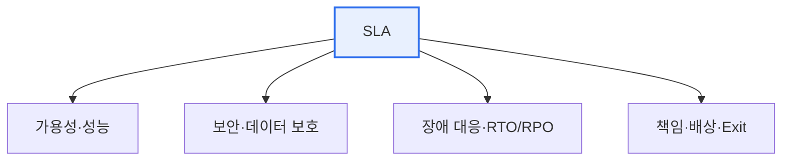

# 금융 클라우드 SLA(Service Level Agreement)

## 1. 개요

### 가. SLA의 개념 (1)
> 서비스 제공자와 이용자가 **제공할 서비스의 수준(가용성·성능 등)을 정량적으로 합의**한 계약. 목표 미달 시 배상·제재를 명시해 서비스 품질을 보증한다.

금융 클라우드에서 SLA가 특별히 중요한 이유는, 금융 데이터가 **가장 민감하고 중단이 곧 대형 사고**로 이어지기 때문이다. 계좌·거래 데이터의 유출·손실·서비스 중단은 고객 피해와 신뢰 붕괴로 직결되므로, 일반 서비스보다 훨씬 엄격한 수준의 보안·가용성·데이터 보호가 SLA로 요구된다.

## 2. SLA 주요 항목

| 항목 | 내용 |
|---|---|
| **가용성** | 서비스 가동률(%) 보장 |
| **성능** | 응답시간·처리량 |
| **장애 대응** | 복구목표(RTO/RPO), 통지 |
| **보안** | 접근통제·암호화·감사 |
| **데이터** | 위치·주권, 반환·파기(Exit) |
| **책임·배상** | 미달 시 배상, 책임 범위 |

## 3. 클라우드 SLA 가이드 (2) / 금융 클라우드 SLA 가이드 (3)

| 구분 | 클라우드 SLA 가이드 | 금융 클라우드 SLA 가이드 |
|---|---|---|
| **목적** | 일반 클라우드 서비스 수준 표준 | 금융 특성(민감정보·규제) 반영 |
| **강조** | 가용성·성능·책임 | **보안·데이터 주권·감독규정 준수** 강화 |
| **규제** | 일반 | 전자금융감독규정, 금융보안 가이드 |
| **데이터** | 반환·파기 | **국내 보관·망분리·중요정보 통제** |
| **감독** | — | 금융당국 보고·감사권, 위탁 규정 |

> 금융 클라우드는 일반 SLA에 더해 **책임공유모델 명확화, 데이터 국내 보관, 금융보안·감독규정 준수, 감사·이행점검** 이 강화된다.

## 4. 시사점
- 금융은 SLA에 **보안·규제 준수·데이터 통제** 를 반드시 포함
- 책임공유모델에서 금융회사(이용자) 책임 범위 명확화 필수
- 클라우드 종료·전환(Exit) 및 연속성(BCP) 보장 중요

---

> **한 줄 요약**: SLA는 서비스 수준을 정량 합의한 계약이며, 금융 클라우드 SLA는 일반 가이드에 더해 *보안·데이터 국내보관·망분리·감독규정 준수·감사권* 을 강화해 민감한 금융 데이터를 보호한다.
