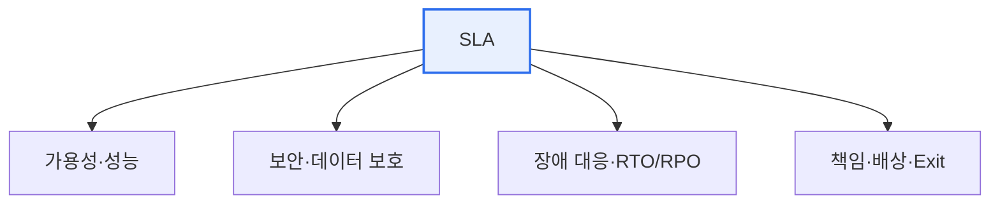

# 금융 클라우드 SLA(Service Level Agreement)

## 1. 개요

### 가. SLA의 개념
> 서비스 제공자와 이용자가 **제공할 서비스의 수준(가용성·성능 등)을 정량적으로 합의**한 계약. 목표 미달 시 배상·제재를 명시해 서비스 품질을 보증한다.

SLA가 필요한 이유는 '**서비스 품질을 말이 아니라 숫자로 약속**'하기 위함이다. "안정적으로 제공하겠다"는 모호한 약속은 분쟁을 부르지만, "월 가용률 99.9% 이상, 미달 시 요금의 10% 배상"처럼 정량화하면 책임이 명확해진다. 특히 금융 클라우드에서 SLA가 결정적으로 중요한 이유는, 금융 데이터가 **가장 민감하고 서비스 중단이 곧 대형 사고** 로 이어지기 때문이다. 계좌·거래 데이터의 유출·손실이나 서비스 중단은 곧바로 고객의 재산 피해와 금융 시스템에 대한 신뢰 붕괴로 직결된다. 그래서 금융 클라우드는 일반 서비스보다 훨씬 엄격한 수준의 보안·가용성·데이터 보호를 SLA로 요구하며, 여기에 금융 규제 준수라는 특수 요건이 더해진다.

### 나. 필요성
금융회사가 핵심 업무를 클라우드에 맡기려면, 사업자(CSP)에 대한 통제력이 줄어드는 만큼 SLA로 서비스 수준과 책임을 명확히 확보해야 한다. SLA는 클라우드 도입의 신뢰 기반이자 규제 준수의 근거가 된다.

## 2. SLA 주요 항목

SLA는 서비스 품질의 여러 측면을 정량 지표로 규정한다. 가용률(%)과 성능(응답시간·처리량), 장애 시 복구 목표(RTO·RPO)와 통지 절차, 접근통제·암호화·감사 같은 보안 요건, 데이터의 위치·주권과 반환·파기(Exit), 그리고 목표 미달 시 배상과 책임 범위가 포함된다.

| 항목 | 내용 |
|---|---|
| **가용성** | 서비스 가동률(%) 보장 |
| **성능** | 응답시간·처리량 |
| **장애 대응** | 복구목표(RTO/RPO), 통지 |
| **보안** | 접근통제·암호화·감사 |
| **데이터** | 위치·주권, 반환·파기(Exit) |
| **책임·배상** | 미달 시 배상, 책임 범위 |

## 3. 클라우드 SLA 가이드와 금융 클라우드 SLA 가이드

일반 **클라우드 SLA 가이드** 가 가용성·성능·책임 등 보편적 서비스 수준을 표준화한다면, **금융 클라우드 SLA 가이드** 는 여기에 금융의 특수성—민감정보와 강한 규제—을 반영해 훨씬 엄격한 요건을 추가한다. 데이터의 국내 보관과 망분리, 금융보안·감독규정 준수, 금융당국의 보고·감사권, 위탁 규정 등이 강화되는 것이 핵심 차이다.

| 구분 | 클라우드 SLA 가이드 | 금융 클라우드 SLA 가이드 |
|---|---|---|
| **목적** | 일반 클라우드 서비스 수준 표준 | 금융 특성(민감정보·규제) 반영 |
| **강조점** | 가용성·성능·책임 | 보안·데이터 주권·감독규정 준수 강화 |
| **규제** | 일반 | 전자금융감독규정, 금융보안 가이드 |
| **데이터** | 반환·파기 | 국내 보관·망분리·중요정보 통제 |
| **감독** | — | 금융당국 보고·감사권, 위탁 규정 |

즉 금융 클라우드 SLA는 일반 SLA에 더해 **책임공유모델의 명확화, 데이터 국내 보관, 금융보안·감독규정 준수, 감사·이행점검** 이 강화된다.

## 4. 고려사항 및 시사점

1. **보안·규제 준수·데이터 통제를 반드시 포함**해야 한다. 금융 클라우드 SLA는 성능·가용성뿐 아니라 감독규정 준수와 데이터 주권·망분리를 명시해 규제 리스크를 관리한다.
2. **책임공유모델에서 금융회사의 책임을 명확히** 한다. CSP가 인프라를, 금융회사가 데이터·계정·설정을 책임지는 경계를 SLA에 명문화해 사각지대를 없앤다.
3. **연속성(BCP)과 Exit 전략이 필수**다. 특정 CSP 장애나 계약 종료 시에도 금융 서비스가 중단되지 않도록, 재해복구와 데이터 반환·전환 계획을 SLA에 담아야 한다.

---

> **한 줄 요약**: SLA는 서비스 수준을 정량 합의한 계약이며, 금융 클라우드 SLA는 일반 가이드에 더해 *보안·데이터 국내보관·망분리·감독규정 준수·감사권* 을 강화하고 책임공유모델·연속성(BCP)을 명확히 해 민감한 금융 데이터를 보호한다.
