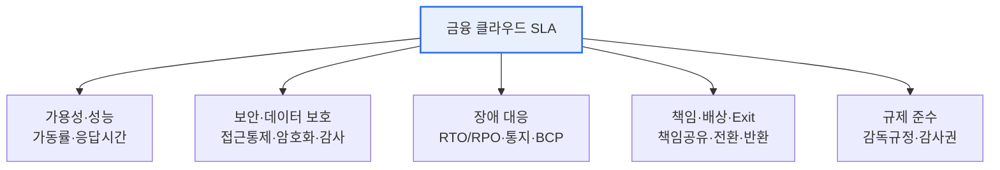

# 금융 클라우드 SLA(Service Level Agreement)

## 1. 개요

### 가. SLA의 개념
> **SLA(서비스 수준 협약)**는 서비스 제공자와 이용자가 **제공할 서비스의 수준(가용성·성능·보안 등)을 정량적 지표로 합의**하고, 목표 미달 시의 배상·제재와 상호 책임을 명문화한 계약이다. 정성적 약속을 측정 가능한 숫자로 바꿔 서비스 품질을 계약적으로 보증한다.

SLA가 필요한 본질적 이유는 '**서비스 품질을 말이 아니라 숫자로 약속**'하기 위함이다. "안정적으로 제공하겠다"는 모호한 표현은 장애가 발생했을 때 책임 소재를 두고 분쟁을 부른다. 그러나 "월 가용률 99.9% 이상을 보장하며, 미달 시 월 이용요금의 10%를 배상한다"처럼 정량화하면, 무엇이 정상이고 무엇이 위반인지가 명확해지고 배상의 기준도 다툼 없이 적용된다. SLA는 이처럼 **측정 가능성(Measurable)과 책임의 명확화**를 통해 서비스 품질을 통제하는 관리 수단이다.

특히 금융 클라우드에서 SLA가 결정적으로 중요한 이유는, 금융 데이터가 **가장 민감하고 서비스 중단이 곧 대형 사회적 사고**로 이어지기 때문이다. 계좌·거래 데이터의 유출이나 손실, 결제·이체 서비스의 중단은 단순한 불편이 아니라 곧바로 고객의 재산 피해와 금융 시스템 전체에 대한 신뢰 붕괴로 직결된다. 실제로 몇 분간의 지급결제 중단만으로도 수백만 건의 거래가 실패하고 사회적 파장이 발생한다. 그래서 금융 클라우드는 일반 서비스보다 훨씬 엄격한 수준의 가용성·보안·데이터 보호를 SLA로 요구하며, 여기에 **금융 규제 준수**라는 특수 요건이 더해진다는 점이 일반 IT 서비스와의 결정적 차이다.

### 나. 등장 배경과 필요성
과거 금융권은 규제와 보안 우려로 클라우드 이용에 매우 보수적이었다. 그러나 디지털 전환과 핀테크 경쟁이 가속되면서, 확장성·비용효율·신속한 서비스 출시를 위해 클라우드 도입이 불가피해졌다. 국내에서는 2019년 1월 시행된 **전자금융감독규정 제14조의2**를 통해 중요정보처리시스템을 포함한 금융 업무의 클라우드 이용이 제도적으로 허용되면서 본격화되었고, 이 규정은 2025년 2월 개정을 거쳐 이용 절차가 정비되었다. 금융보안원은 이에 맞춰 **「금융분야 클라우드컴퓨팅서비스 이용 가이드」**를 발간해 세부 이행 절차와 보안 권고사항을 제시하고 있다.

이러한 제도적 허용의 이면에는 **통제력 이전이라는 근본 딜레마**가 있다. 금융회사가 핵심 업무를 외부 CSP(클라우드 서비스 제공자)에 맡기면, 인프라에 대한 직접 통제력이 줄어드는 만큼 서비스 수준과 책임을 계약으로 확보해야 한다. SLA는 바로 이 통제력 공백을 메우는 장치로, **클라우드 도입의 신뢰 기반이자 규제 준수의 계약적 근거**가 된다. SLA 없이 클라우드를 도입하는 것은, 통제할 수 없는 대상에 금융의 핵심을 맡기는 것과 같다.

## 2. 금융 클라우드 SLA의 주요 구성 항목

SLA는 서비스 품질의 여러 측면을 서로 다른 정량 지표로 규정한다. 아래 구조도는 금융 클라우드 SLA가 다루는 핵심 영역을 보여 준다.

```mermaid
flowchart TB
  S["금융 클라우드 SLA"] --> A["가용성·성능<br/>가동률·응답시간"]
  S --> B["보안·데이터 보호<br/>접근통제·암호화·감사"]
  S --> C["장애 대응<br/>RTO/RPO·통지·BCP"]
  S --> D["책임·배상·Exit<br/>책임공유·전환·반환"]
  S --> R["규제 준수<br/>감독규정·감사권"]
  style S fill:#e8f0fe,stroke:#2f6fed,stroke-width:2px
```

**가용성(Availability)**은 SLA에서 가장 먼저 다루는 핵심 지표로, 서비스가 정상 동작한 시간의 비율(가동률, %)로 표현한다. 가동률 목표에 따라 허용되는 연간 다운타임은 급격히 달라진다. 99.9%는 연 약 8.76시간, 99.99%는 연 약 52.6분, 99.999%("파이브 나인")는 연 약 5.26분의 중단만 허용한다. 금융의 지급결제·계정계처럼 무중단이 요구되는 시스템일수록 높은 가동률을 SLA로 요구하며, 이는 이중화·다중 가용영역(Multi-AZ) 구성 비용으로 직결된다.

**성능(Performance)**은 응답시간(Latency)과 처리량(Throughput)으로 규정한다. 예를 들어 "조회 트랜잭션의 95%를 500ms 이내 응답"과 같이 백분위수(Percentile) 기준으로 명시하는 것이 실무적으로 정확하다. 평균값만 쓰면 소수의 지연이 감춰지기 때문에, 금융처럼 꼬리 지연(Tail Latency)이 사고로 이어지는 환경에서는 p95·p99 기준이 중요하다. 가령 평균 응답이 200ms라도 p99가 3초라면 전체 거래의 1%(대량 트래픽에서는 수만 건)가 사실상 실패에 준하는 지연을 겪는 것이므로, 평균이 아닌 분포를 SLA 지표로 삼아야 실질적 품질이 보증된다.

가용률 목표를 정할 때는 **비용과의 트레이드오프**를 함께 고려해야 한다. 가동률을 99.9%에서 99.99%로 한 단계 높이려면 이중화·다중 가용영역·자동 페일오버 등 인프라 투자가 급증한다. 따라서 모든 시스템에 최고 등급을 일괄 적용하기보다는, 지급결제·계정계 같은 핵심(Mission-critical) 시스템에는 높은 가동률을, 내부 통계·배치성 업무에는 상대적으로 낮은 가동률을 차등 적용하는 **업무 중요도 기반 등급화(Tiering)**가 합리적이다. 이는 전자금융감독규정이 요구하는 업무 중요도 평가와도 맥을 같이한다.

**장애 대응**은 복구 목표를 정량화한다. **RTO(Recovery Time Objective)**는 장애 발생 후 서비스를 복구하기까지 허용되는 최대 시간이고, **RPO(Recovery Point Objective)**는 장애 시 허용되는 최대 데이터 손실 시점(백업 시점)이다. 예컨대 RTO 30분·RPO 5분은 "30분 내 복구하며 최대 5분치 데이터만 손실을 허용한다"는 뜻이다. 여기에 장애 통지 시한(예: 발생 후 30분 내 통지)과 재해복구(DR) 절차가 함께 규정된다.

**보안·데이터 보호**는 금융 SLA의 특수성이 집중되는 영역이다. 접근통제·암호화(저장·전송)·감사로그·취약점 관리 같은 통제 항목과 함께, 데이터의 물리적 위치(국내 보관)·주권, 계약 종료 시 데이터 반환·파기(Exit)를 명시한다.

특히 **암호화와 키 관리**는 책임 경계가 첨예한 항목이다. 데이터를 CSP가 관리하는 키로 암호화하면 편리하지만, 키를 쥔 주체가 데이터를 열람할 수 있다는 우려가 남는다. 그래서 금융권에서는 이용자가 키를 직접 소유·통제하는 방식(BYOK, Bring Your Own Key)이나 하드웨어 보안모듈(HSM) 연계를 SLA·설계에 반영하는 경우가 많다. 이는 데이터 주권을 이용자가 실질적으로 확보하기 위한 장치로, "데이터가 국내에 있느냐"뿐 아니라 "데이터를 최종적으로 누가 통제하느냐"까지 규정하려는 시도다.

아래 표는 이러한 주요 항목을 정리한 것이다.

| 항목 | 내용 | 대표 지표·규정 예시 |
|---|---|---|
| **가용성** | 서비스 가동률(%) 보장 | 99.9% / 99.99% |
| **성능** | 응답시간·처리량 | p95 응답 500ms 이내 |
| **장애 대응** | 복구목표·통지 | RTO 30분, RPO 5분 |
| **보안** | 접근통제·암호화·감사 | 저장·전송 암호화, 감사로그 |
| **데이터** | 위치·주권, 반환·파기 | 국내 보관, 계약종료 시 파기 |
| **책임·배상** | 미달 시 배상, 책임 범위 | 요금 10% 크레딧 배상 |

## 3. 일반 클라우드 SLA와 금융 클라우드 SLA의 차이

일반 **클라우드 SLA 가이드**가 가용성·성능·책임 같은 보편적 서비스 수준을 표준화하는 데 초점을 둔다면, **금융 클라우드 SLA**는 여기에 금융 산업의 특수성—고도로 민감한 정보와 강력한 규제—을 반영해 훨씬 엄격한 요건을 추가한다. 차이가 생기는 근본 이유는 **규제 리스크와 데이터 민감도**에 있다. 일반 서비스의 장애는 서비스 이용자에게 국한된 손해로 끝나지만, 금융 서비스의 장애·유출은 감독당국의 제재, 금융 시스템 신뢰 훼손, 사회적 파장으로 확대되므로, 계약 수준의 통제만으로는 부족하고 규제 준수가 SLA 안에 내재화되어야 한다.

가장 큰 차이는 첫째, **데이터의 국내 보관과 망분리** 요구다. 금융 중요정보는 물리적으로 국내에 두고, 인터넷망과 업무망을 분리(망분리)해 외부 위협의 침투 경로를 차단하도록 요구한다. 둘째, **감독규정 준수와 금융당국의 감사·보고권**이다. 금융회사는 클라우드 이용을 감독당국에 보고해야 하고, 당국은 CSP에 대해서도 필요 시 자료 제출·현장 점검을 요구할 수 있어야 하므로, 이 감사권이 SLA에 반영된다. 셋째, **위탁(제3자) 관리 규정**으로, CSP를 통한 재위탁·하도급의 통제와 책임 범위가 강화된다.

| 구분 | 일반 클라우드 SLA | 금융 클라우드 SLA |
|---|---|---|
| **목적** | 일반 서비스 수준 표준화 | 금융 특성(민감정보·규제) 반영 |
| **강조점** | 가용성·성능·책임 | 보안·데이터 주권·감독규정 준수 강화 |
| **규제** | 일반 계약·약관 | 전자금융감독규정, 금융보안 가이드 |
| **데이터** | 반환·파기 | 국내 보관·망분리·중요정보 통제 |
| **감독** | — | 금융당국 보고·감사권, 위탁 규정 |
| **인증** | 선택적 | CSAP 등 보안인증 사실상 필수 |

즉 금융 클라우드 SLA는 일반 SLA에 더해 **책임공유모델의 명확화, 데이터 국내 보관·망분리, 금융보안·감독규정 준수, 감사·이행점검**이 강화된다. 국내 이행 절차 측면에서도 전자금융감독규정 제14조의2는 클라우드 이용 시 **① 업무 중요도 평가 → ② CSP(사업자) 건전성·안전성 평가 → ③ 안전성 확보조치 및 이용 보고**라는 단계를 요구하며, 최근 개정으로 금융보안원이 CSP를 대행 평가해 그 결과를 금융회사가 활용할 수 있게 되어 이용 부담이 완화되었다.

## 4. 책임공유모델과 실무 적용

금융 클라우드 SLA를 설계할 때 가장 자주 발생하는 사각지대는 "누가 무엇을 책임지는가"의 모호함이다. 이를 해소하는 개념이 **책임공유모델(Shared Responsibility Model)**이다. 아래 다이어그램은 IaaS 기준의 책임 경계를 보여 준다.

```mermaid
flowchart LR
  subgraph CSP["CSP 책임 (Security OF the Cloud)"]
    P1["물리 데이터센터"]
    P2["네트워크·하드웨어"]
    P3["가상화·기반 인프라"]
  end
  subgraph FIN["금융회사 책임 (Security IN the Cloud)"]
    F1["데이터·암호화"]
    F2["계정·접근권한(IAM)"]
    F3["OS·앱·보안 설정"]
  end
  CSP --> FIN
  style CSP fill:#e8f0fe,stroke:#2f6fed,stroke-width:2px
  style FIN fill:#e6f4ea,stroke:#137333,stroke-width:2px
```

이 모델의 요점은 **"클라우드 자체의 보안(Security of the Cloud)은 CSP가, 클라우드 안의 보안(Security in the Cloud)은 이용자가 책임진다"**는 원칙이다. CSP는 물리 시설·네트워크·가상화 계층의 가용성과 보안을 SLA로 보증하지만, 그 위에 올린 데이터·계정·설정은 금융회사의 몫이다. 실제 클라우드 보안 사고의 상당수가 CSP 인프라 결함이 아니라 이용자의 접근권한 오설정(공개된 스토리지 버킷 등)에서 비롯된다는 점은, 이 경계를 SLA와 내부 통제로 명확히 해야 하는 이유를 잘 보여 준다.

또한 책임 경계는 서비스 모델(IaaS·PaaS·SaaS)에 따라 이동한다. IaaS에서는 OS·미들웨어·앱이 모두 이용자 책임이지만, PaaS에서는 플랫폼 계층까지 CSP가 맡고, SaaS에서는 애플리케이션 자체도 CSP가 운영해 이용자 책임이 데이터·계정 관리로 좁아진다. 따라서 SLA를 검토할 때는 도입하려는 서비스 모델이 무엇인지에 따라 "무엇이 CSP의 보증 대상이고 무엇이 우리 책임인지"를 매번 다시 확인해야 하며, 이 경계의 착시가 곧 통제 공백으로 이어진다.

구체적 사례로, 2021~2022년 국내외에서 대형 CSP의 특정 리전 장애나 데이터센터 화재로 다수의 서비스가 동시에 중단된 사건들은 클라우드 집중 리스크를 여실히 보여 주었다. 단일 리전에만 의존하던 서비스는 몇 시간씩 멈춘 반면, 멀티 리전·멀티 AZ로 이중화하고 자동 페일오버를 갖춘 서비스는 영향을 최소화했다. 금융권이 SLA에 단순 가동률 수치뿐 아니라 리전 이중화·DR 훈련 주기·복구 검증 절차까지 요구하게 된 것은 이러한 실제 사고 경험의 산물이다. 이는 "SLA 숫자가 높다"는 것과 "실제로 그 숫자를 지킬 아키텍처가 갖춰졌다"는 것이 다르다는 교훈을 남긴다.

실무 적용에서 특히 중요한 것은 **연속성(BCP)과 Exit 전략**이다. 특정 CSP에 종속(Lock-in)된 상태에서 그 CSP에 광역 장애가 발생하면 금융 서비스 전체가 멈출 수 있으므로, 멀티 리전·멀티 클라우드 구성과 정기적 DR 훈련을 SLA·운영계획에 담아야 한다. 또한 계약 종료·사업자 변경 시에도 서비스가 중단되지 않도록, 데이터의 표준 포맷 반환·안전한 파기·전환 지원 의무를 Exit 조항으로 명문화해야 한다. SLA 위반 시 배상은 통상 **서비스 크레딧(요금 감면)** 형태로 이루어지는데, 이 배상액은 실제 금융 사고의 손해에 비해 작은 경우가 많으므로, 배상 자체보다 **위반을 예방하는 이중화·모니터링 체계**가 더 본질적이라는 점을 인식해야 한다.

## 5. 고려사항 및 시사점

1. **보안·규제 준수·데이터 통제를 SLA에 반드시 내재화한다.** 금융 클라우드 SLA는 성능·가용성뿐 아니라 감독규정 준수, 데이터 국내 보관·망분리, 감사권을 명시해 규제 리스크를 계약 차원에서 관리해야 한다. 규제 준수를 부속 문서가 아닌 SLA 본문의 의무로 편입하는 것이 바람직하다.

2. **책임공유모델에서 금융회사의 책임 경계를 명확히 한다.** CSP가 인프라를, 금융회사가 데이터·계정·설정을 책임지는 경계를 SLA와 내부 통제 정책에 명문화해 사각지대를 없애야 한다. 특히 접근권한(IAM) 오설정이 사고의 주요 원인이므로, 최소권한 원칙과 상시 점검을 병행한다.

3. **연속성(BCP)과 Exit 전략을 필수 조항으로 확보한다.** 특정 CSP 장애나 계약 종료 시에도 서비스가 중단되지 않도록, 멀티 리전·멀티 클라우드, 정기 DR 훈련, 데이터 반환·파기·전환 지원을 SLA에 담아 벤더 종속(Lock-in) 리스크를 완화해야 한다.

4. **배상보다 예방 중심으로 SLA를 운용한다.** 서비스 크레딧 방식의 배상은 실제 금융 손해를 온전히 보전하지 못한다. 따라서 SLA의 실효성은 위반 후 배상이 아니라, 위반을 사전에 막는 이중화·실시간 모니터링·자동 페일오버 체계에서 나온다는 관점으로 접근해야 한다.

5. **SLA의 측정·검증 체계를 상시화한다.** 합의된 지표(가동률·RTO·RPO 등)가 실제로 지켜지는지 독립적으로 측정·리포팅하고, 정기 이행점검과 감사를 통해 SLA를 살아 있는 통제 수단으로 유지해야 한다. 측정되지 않는 SLA는 선언에 그친다.

6. **업무 중요도에 따른 SLA 등급화로 비용과 안전성을 동시에 관리한다.** 전자금융감독규정의 중요도 평가와 연계해, 핵심 시스템에는 높은 가동률·짧은 RTO/RPO를, 비핵심 업무에는 완화된 수준을 차등 적용하면 과잉 투자 없이 규제 요건과 서비스 품질을 균형 있게 달성할 수 있다.

7. **AI·SaaS 확산에 대응해 SLA 범위를 확장한다.** 최근 금융권의 생성형 AI·핀테크 SaaS 도입이 늘면서, 전통적 인프라 SLA를 넘어 모델 가용성·데이터 학습 이용 제한·재위탁 통제까지 SLA에 담아야 할 필요가 커지고 있다. 기술 변화에 맞춰 SLA 항목을 주기적으로 재정비하는 거버넌스가 요구된다.

## 참고자료
- 금융보안원, 「금융분야 클라우드컴퓨팅서비스 이용 가이드」. https://www.fsec.or.kr/bbs/detail?menuNo=222&bbsNo=11152
- AWS, 「금융 클라우드 길라잡이 A to Z Part 1 – 전자금융감독규정」. https://aws.amazon.com/ko/blogs/tech/financial-cloud-guide-a-to-z-part1/

---

> **한 줄 요약**: SLA는 서비스 수준을 정량 합의한 계약이며, 금융 클라우드 SLA는 일반 SLA에 더해 *보안·데이터 국내보관·망분리·감독규정 준수·감사권*을 강화하고, 책임공유모델·연속성(BCP)·Exit 전략을 명확히 해 민감한 금융 데이터를 보호한다.
