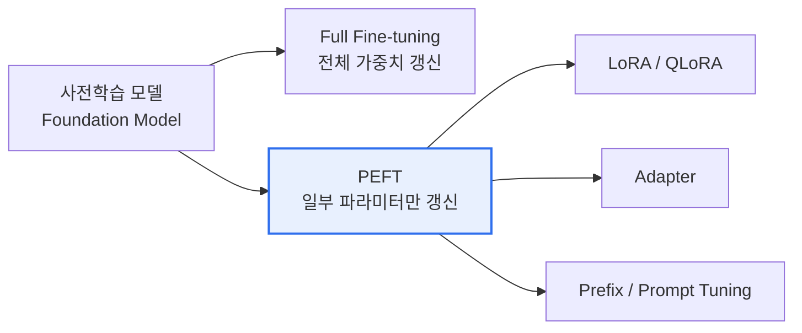

# AI 파인튜닝(Fine-tuning)

## 1. 개요

### 가. 정의
> 대규모 데이터로 사전학습(Pre-training)된 **기반모델(Foundation Model)** 을, 특정 도메인·과업(Task)·응답 형식에 맞는 **비교적 소량의 데이터로 추가 학습**시켜 모델의 가중치를 조정함으로써 성능을 최적화하는 전이학습(Transfer Learning) 기법.

파인튜닝의 전제는 "사전학습 모델이 이미 언어·세계에 대한 일반 지식을 파라미터에 담고 있다"는 점이다. 그래서 밑바닥부터 학습하는 대신, 이미 학습된 표현 위에 **원하는 방향으로 미세한 조정**만 얹는다. 이는 사람이 일반 교육을 마친 뒤 특정 직무 교육을 받는 것에 비유할 수 있으며, 적은 데이터·비용으로 전문성을 부여할 수 있는 것이 핵심 이점이다.

### 나. 등장 배경 및 필요성
범용 기반모델은 폭넓은 지식을 갖지만, 특정 도메인의 전문 용어·응답 형식·기업 고유 톤에는 최적화돼 있지 않다. 이를 처음부터 다시 학습(Pre-training)하려면 수천 장의 GPU와 방대한 데이터가 드는데, 대부분의 조직에는 비현실적이다. 한편 프롬프트 엔지니어링만으로는 일관된 스타일이나 깊은 전문 지식을 안정적으로 끌어내기 어렵다. 파인튜닝은 이 사이의 실용적 해법으로, **전체를 다시 학습하지 않고 일부만 조정**해 도메인 특화 성능과 일관된 형식을 얻는다. 다만 학습 비용을 더 줄이려는 요구가 커지면서 PEFT 계열 기법이 등장했다.

## 2. 파인튜닝 유형

유형은 "**얼마나 많은 파라미터를 건드리는가**"로 갈린다. 전체를 갱신하는 Full 방식은 표현력이 최대지만 비용과 위험도 크고, 일부만 갱신하는 PEFT는 비용·위험을 크게 낮추는 대신 표현력을 약간 양보한다. 이 절충의 위치가 곧 실무 선택을 좌우한다.

| 구분 | 내용 | 트레이드오프 |
|---|---|---|
| **Full Fine-tuning** | 모델 전체 가중치 갱신 — 최고 성능 가능 | GPU·저장 비용 큼, **파국적 망각(Catastrophic Forgetting)** 위험 |
| **PEFT(Parameter-Efficient Fine-Tuning)** | 소수 파라미터만 학습, 원본 가중치 동결 | 저비용·저메모리, 원본 지식 보존 vs 극한 성능은 Full에 못 미칠 수 있음 |

**파국적 망각**이란 새 과업을 학습하면서 기존에 알던 것을 잊는 현상으로, Full 방식에서 특히 두드러진다. 전체 가중치를 새 데이터에 맞춰 크게 움직이면, 사전학습으로 얻은 일반 능력이 덮여버리기 때문이다. PEFT가 원본 가중치를 동결하고 소수만 학습하는 이유가 바로 이 망각을 구조적으로 억제하기 위함이다.

## 3. PEFT 주요 기법

PEFT의 공통 원리는 "**거대한 원본은 그대로 두고, 작은 추가 파라미터만 학습**"하는 것이다. 이렇게 하면 학습·저장 대상이 전체의 1% 안팎으로 줄어 단일 GPU로도 튜닝이 가능해진다.

| 기법 | 핵심 원리 | 장점 |
|---|---|---|
| **LoRA** | 가중치 변화량 $\Delta W$ 를 저차원(Low-Rank) 두 행렬의 곱으로 근사, 그 소수 파라미터만 학습 | 원본 동결·저장량 극소, 여러 어댑터 교체 용이 |
| **QLoRA** | 모델을 4bit로 양자화해 메모리를 줄인 뒤 그 위에 LoRA 적용 | 소비자용 단일 GPU로 대형모델 튜닝 |
| **Adapter** | 트랜스포머 계층 사이에 작은 신경망 모듈을 삽입, 그 모듈만 학습 | 과업별 모듈 분리·재사용 |
| **Prefix/Prompt Tuning** | 입력 앞에 학습 가능한 가상 토큰(Soft Prompt)만 최적화, 본체 동결 | 파라미터 극소, 과업 전환 용이 |

**LoRA**가 성립하는 근거는 "파인튜닝으로 필요한 가중치 변화가 실제로는 낮은 랭크(내재 차원)에 놓인다"는 관찰이다. 그래서 $\Delta W$ 를 $B\cdot A$ (작은 두 행렬)로 근사해도 성능 손실이 작다. **QLoRA**는 여기에 4bit 양자화를 더해, 예컨대 수십 GB가 필요하던 대형모델 튜닝을 단일 24GB급 GPU에서 가능하게 만든 것이 실무적 파급이 컸다.

## 4. 정렬(Alignment) 파인튜닝

정렬은 "능력"을 넘어 "**사람의 의도·가치에 맞게 행동하도록**" 만드는 파인튜닝이다. 사전학습 모델은 다음 토큰 예측에는 능하지만, 지시를 따르거나 유해한 답을 거부하는 성향은 별도로 학습시켜야 한다. 이 과정은 보통 SFT로 지시 수행의 뼈대를 세우고, 이어서 선호도 기반 정렬로 답변의 질을 사람 취향에 맞춘다.

| 단계 | 내용 | 역할 |
|---|---|---|
| **SFT(지도 미세조정)** | 지시-응답(Instruction) 쌍으로 학습 | 지시 수행 능력의 기본기 부여 |
| **RLHF** | 사람 선호로 학습한 보상모델 + 강화학습(PPO)으로 정렬 | 미묘한 선호까지 반영, 복잡·불안정 |
| **DPO** | 보상모델·강화학습 없이 선호 쌍으로 직접 최적화 | RLHF보다 간단·안정, 구현 용이 |

RLHF가 강력하지만 보상모델 학습과 PPO 강화학습이라는 두 단계가 불안정하고 자원을 많이 쓴다. **DPO**는 선호 쌍(더 나은 답/못한 답)으로부터 정책을 직접 최적화해 이 복잡성을 없앤 것이 등장 배경으로, 최근 실무에서 선호되는 이유다.

## 5. RAG와의 비교

파인튜닝과 RAG는 대체재가 아니라 **역할이 다르다**. 파인튜닝은 지식·능력을 가중치에 내재화하므로 형식·톤·특정 능력을 학습시키는 데 강하지만, 지식이 바뀌면 재학습해야 한다. RAG는 사실·최신 정보를 외부에서 주입하므로 갱신이 빠르고 출처를 제시할 수 있다.

| 구분 | 파인튜닝 | RAG |
|---|---|---|
| **지식 주입** | 가중치에 내재화(학습) | 추론 시 외부 검색으로 프롬프트 결합 |
| **최신성** | 재학습 필요(느림·비용) | 지식베이스만 갱신(빠름) |
| **적합** | 형식·톤·전문 능력 내재화 | 최신·근거 기반 사실 응답, 출처 제시 |
| **비용** | 학습 비용·데이터 구축 | 검색 인프라 |

> 그래서 실무에서는 **"능력은 파인튜닝, 지식은 RAG"** 로 병행하는 경우가 많다. 예컨대 사내 상담 챗봇은 톤·응대 형식을 파인튜닝으로 고정하고, 수시로 바뀌는 상품·정책 정보는 RAG로 주입한다.

## 6. 고려사항 및 시사점
- **데이터 품질·양이 성능을 좌우**: 소량·저품질 데이터로 학습하면 과적합되거나 오히려 성능이 떨어진다. 수천 건 규모라도 정제·다양성이 중요하다.
- **파국적 망각 방지**: PEFT, 낮은 학습률, 정규화, 기존 데이터 혼합(리허설)으로 일반 능력의 손상을 억제한다.
- **컴플라이언스·보안**: 개인정보·저작권 데이터를 학습에 쓰면 그 정보가 모델에 남아 유출될 수 있으므로, 데이터 출처·라이선스·비식별화를 사전 검토해야 한다.
- **온프레미스·비용 효율 전략**: 소형 특화모델(sLLM)에 PEFT를 결합하면 자체 인프라에서 저비용으로 도메인 특화 AI를 운용할 수 있어, 데이터 주권이 중요한 조직에 적합하다.

---

> **한 줄 요약**: 파인튜닝은 *사전학습 모델을 소량의 과업 데이터로 추가 학습*해 가중치를 조정하는 전이학습 기법으로, **PEFT(LoRA·QLoRA)로 저비용·저망각을 실현**하고 **SFT·RLHF/DPO로 인간 선호에 정렬**하며, 최신 지식은 RAG와 병행("능력은 파인튜닝, 지식은 RAG")해 보완한다.
