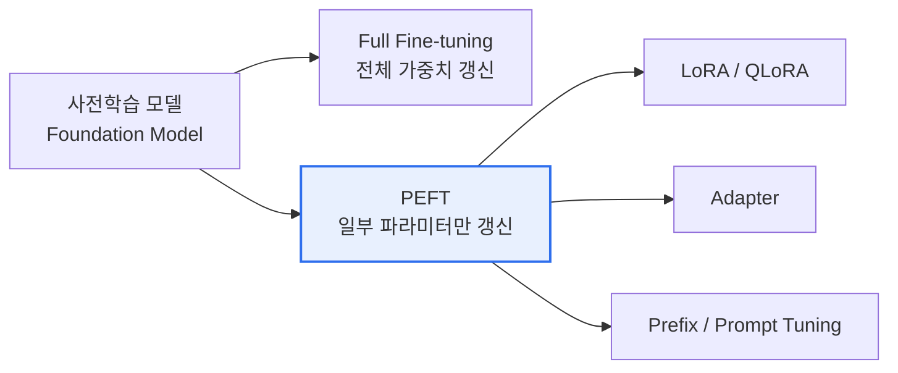

# AI 파인튜닝(Fine-tuning)

## 1. 개요

### 가. 정의
> 사전학습(Pre-training)된 기반모델(Foundation Model)을 **특정 도메인·과업(Task)·형식에 맞는 데이터로 추가 학습**시켜, 모델의 가중치를 조정해 성능을 최적화하는 전이학습(Transfer Learning) 기법.

### 나. 등장 배경
- 범용 사전학습 모델의 **도메인 특화 성능·응답 형식·톤 부족**
- 전체 재학습(Pre-training)은 **막대한 비용·데이터** 소요 → 일부만 조정하는 효율적 방식 필요
- 프롬프트만으로 해결 어려운 **일관된 스타일·전문 지식 내재화** 요구

## 2. 파인튜닝 유형

| 구분 | 내용 |
|---|---|
| **Full Fine-tuning** | 모델 전체 가중치 갱신 — 최고 성능이나 GPU·저장 비용 큼, 파국적 망각(Catastrophic Forgetting) 위험 |
| **PEFT(Parameter-Efficient Fine-Tuning)** | 소수 파라미터만 학습 — 저비용·저메모리, 원본 가중치 보존 |

## 3. PEFT 주요 기법

| 기법 | 핵심 원리 |
|---|---|
| **LoRA** | 가중치 변화량을 저차원(Low-Rank) 행렬 분해로 근사해 소수 파라미터만 학습 |
| **QLoRA** | 모델을 4bit로 양자화(Quantization)한 뒤 LoRA 적용 — 단일 GPU 학습 가능 |
| **Adapter** | 계층 사이에 작은 신경망 모듈 삽입, 해당 모듈만 학습 |
| **Prefix/Prompt Tuning** | 입력 앞에 학습 가능한 가상 토큰(Soft Prompt)만 최적화, 본체 동결 |

## 4. 정렬(Alignment) 파인튜닝

| 단계 | 내용 |
|---|---|
| **SFT(지도 미세조정)** | 지시-응답(Instruction) 쌍으로 학습해 지시 수행 능력 부여 |
| **RLHF** | 사람 선호 보상모델 + 강화학습(PPO)으로 응답을 인간 선호에 정렬 |
| **DPO** | 보상모델·강화학습 없이 선호 쌍으로 직접 최적화 — 간단·안정 |

## 5. RAG와의 비교

| 구분 | 파인튜닝 | RAG |
|---|---|---|
| **지식 주입** | 가중치에 내재화(학습) | 외부 검색으로 프롬프트에 결합 |
| **최신성** | 재학습 필요 | 지식베이스만 갱신 |
| **적합** | 형식·톤·전문 능력 내재화 | 최신·근거 기반 사실 응답 |
| **비용** | 학습 비용 발생 | 검색 인프라 필요 |

> 실무에서는 **RAG + 파인튜닝 병행**(능력은 파인튜닝, 지식은 RAG)이 일반적.

## 6. 고려사항 및 시사점
- **데이터 품질·양**이 성능 좌우 — 소량·저품질 시 과적합·성능 저하
- **파국적 망각** 방지: PEFT·낮은 학습률·정규화 활용
- 개인정보·저작권 데이터 학습 시 **컴플라이언스·보안** 검토 필수
- 소형 특화모델(sLLM) + PEFT로 **온프레미스·비용 효율** 실현

---

> **한 줄 요약**: 파인튜닝은 *사전학습 모델을 특정 과업 데이터로 추가 학습* 해 가중치를 조정하는 전이학습 기법으로, **PEFT(LoRA·QLoRA)로 저비용화**하고 **SFT·RLHF/DPO로 인간 선호에 정렬**하며, 지식 최신성은 RAG와 병행해 보완한다.
