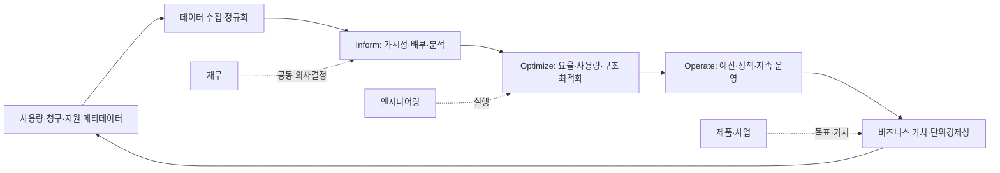
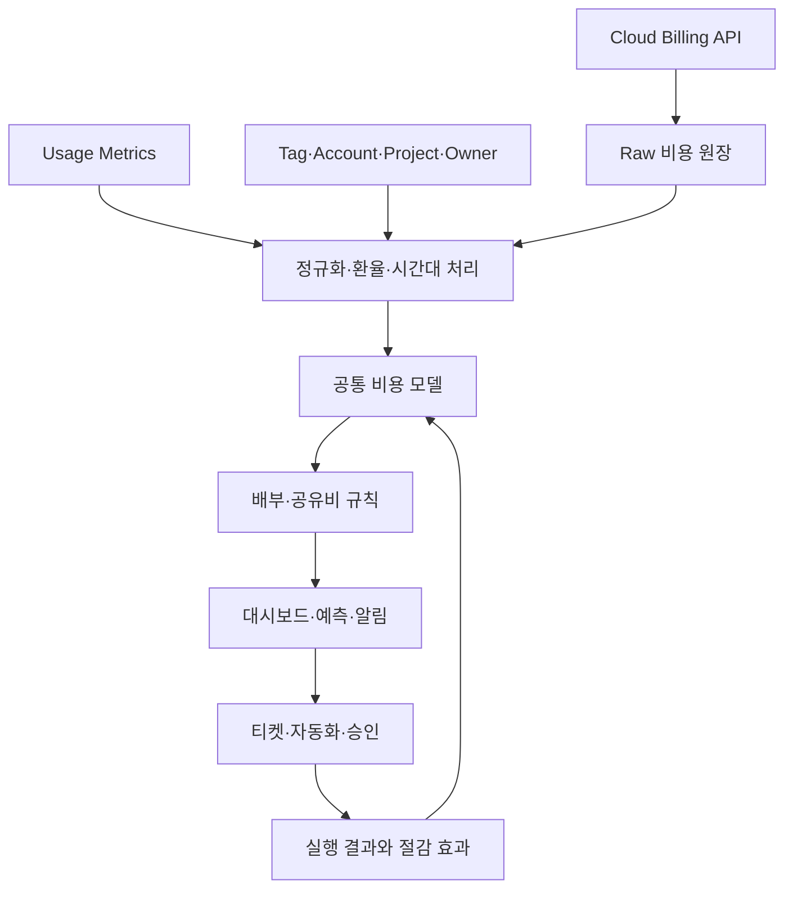

# FinOps(클라우드 비용·가치 최적화)

## 1. 개요

> **정의**: FinOps는 클라우드와 기술 지출의 비즈니스 가치를 극대화하고, 시의적절한 데이터 기반 의사결정과 엔지니어링·재무·비즈니스 팀의 협업을 통해 재무적 책임성을 만드는 운영 프레임워크이자 문화적 실천이다.

클라우드는 사용량에 따라 비용이 변하는 가변비용 모델을 제공한다.
이 모델은 초기 대규모 설비투자를 줄이고 수요에 맞춘 탄력적 확장을 가능하게 한다.
반면 자원이 API로 즉시 생성되고 여러 팀이 공유되므로, 전통적인 연간 예산만으로는 실제 사용량과 비용을 통제하기 어렵다.
개발자는 성능과 출시 속도를 우선하고, 재무 부서는 예산과 회계를 중시하며, 경영진은 제품의 매출과 고객가치를 바라본다.
FinOps는 이 관점 차이를 비용 절감이라는 단일 목표로 억지로 통합하지 않는다.
대신 동일한 비용·사용량 데이터와 비즈니스 지표를 바탕으로 각 팀이 책임 있는 선택을 하도록 연결한다.

따라서 FinOps는 단순한 청구서 분석 도구나 클라우드 구매 협상 기법이 아니다.
예산 수립, 비용 배부, 이상징후 탐지, 예약·약정 할인, 자원 최적화, 단위경제성, 지속가능성까지 이어지는 관리 체계다.
비용을 무조건 줄이면 성능 저하, 가용성 저하, 개발 지연이 생길 수 있다.
FinOps의 핵심 질문은 “얼마를 줄였는가”보다 “지출로 어떤 가치를 얻었고, 다음 의사결정의 불확실성을 얼마나 낮췄는가”에 가깝다.

2025년 FinOps Foundation Framework는 공용 클라우드뿐 아니라 SaaS, 데이터센터, 라이선스 등 기술 지출을 다루는 확장된 범위와 Scope 개념을 설명한다.
그러므로 클라우드 전환이 끝난 조직도 FinOps를 적용할 수 있다.
특히 생성형 AI는 GPU, 추론 호출, 저장·전송, 벡터 검색 비용이 품질·지연시간과 함께 움직이므로, FinOps와 모델 운영의 결합이 중요하다.

## 2. 필요성 및 핵심 원칙

### 2.1 도입 배경

첫째, 클라우드 비용은 조직의 의사결정 속도와 같은 속도로 발생한다.
개발·데이터 팀이 실험 환경을 생성하면 월말 결산 전에 비용이 누적될 수 있다.
둘째, 공유 계정과 다중 리전에 걸친 비용은 서비스·제품·환경·소유자별로 분해되지 않으면 개선 책임을 정하기 어렵다.
셋째, 태그 누락과 계정 구조 불일치가 반복되면 비용 리포트의 신뢰도가 떨어진다.
넷째, 예약 인스턴스나 약정 할인은 장기 사용량이 확실할 때 유효하지만, 잘못 구매하면 미사용 약정이라는 새로운 낭비가 된다.

FinOps는 이 문제를 사람, 프로세스, 플랫폼의 결합 문제로 본다.
조직 측면에서는 엔지니어링·재무·제품 담당자가 공통 용어를 사용해야 한다.
프로세스 측면에서는 예산·예측·최적화·예외승인의 주기를 운영해야 한다.
플랫폼 측면에서는 청구 데이터, 메타데이터, 자원 측정값, 서비스 성과지표를 연결해야 한다.
어느 하나만 도입하면 대시보드는 생기지만 행동 변화가 생기지 않는다.

### 2.2 핵심 원칙

| 원칙 | 의미 | 실무 적용 |
|---|---|---|
| 팀이 협업한다 | 재무와 기술의 공동 의사결정 | 월간 비용 리뷰, 제품·플랫폼 공동 회의 |
| 모두가 사용량을 책임진다 | 비용을 중앙 조직만 관리하지 않음 | 서비스 오너별 예산·단위지표 부여 |
| 의사결정은 비즈니스 가치를 기준으로 한다 | 비용과 성과를 함께 평가 | 주문당 비용, 활성 사용자당 비용 분석 |
| 데이터는 적시에 접근 가능하고 정확해야 한다 | 늦거나 불완전한 데이터는 행동을 막음 | 비용 원장, 태그, 배부 규칙 품질관리 |
| 중앙에서 FinOps를 활성화한다 | 표준과 도구는 중앙에서 제공 | 정책·대시보드·교육·자동화 플랫폼 제공 |
| 가변비용의 장점을 활용한다 | 수요에 맞춰 자원을 조절 | 탄력 확장, 서버리스, 스팟 사용 검토 |

이 원칙은 비용을 통제하는 중앙 승인 체계와 다르다.
중앙 조직이 모든 리소스 생성 권한을 가져가면 낭비는 줄 수 있지만 배포 속도와 실험 속도가 떨어질 수 있다.
반대로 각 팀에 완전한 자율만 주면 비용·보안·규정 준수가 파편화된다.
FinOps의 균형점은 중앙에서 가드레일과 데이터를 제공하고, 현업 팀이 빠르게 선택하되 결과를 책임지는 구조다.

## 3. FinOps 운영 구조와 수명주기

### 3.1 전체 구조도

FinOps의 Inform 단계는 무엇이 어디서 얼마나 발생했는지 설명하는 단계다.
클라우드 공급자의 청구 내역을 그대로 보여주는 데서 끝나지 않고, 계정·프로젝트·서비스·환경·팀·제품 기준으로 비용을 분류한다.
배부되지 않은 비용은 공용 플랫폼 비용이나 공유 데이터 전송처럼 직접 귀속하기 어려운 항목이다.
이를 억지로 특정 팀에 배부하면 숫자는 완결되어 보이지만 신뢰를 잃는다.
직접비, 공유비, 미배부비를 구분하고 배부 규칙과 예외를 공개하는 편이 관리에 유리하다.

Optimize 단계는 비용을 낮추는 방법을 선택하는 단계다.
요율 최적화는 예약·약정·볼륨 할인처럼 단가를 낮추는 접근이다.
사용량 최적화는 유휴 자원 종료, 적정 크기 조정, 스토리지 수명주기, 쿼리 효율화처럼 소비량을 줄이는 접근이다.
구조 최적화는 아키텍처를 바꾸어 비용과 품질의 관계를 개선하는 접근이다.
세 접근은 서로 대체되지 않으며, 요율 할인만으로 과다 프로비저닝 문제를 해결할 수 없다.

Operate 단계는 일회성 캠페인이 아닌 관리 루프를 만든다.
예산과 예측의 차이를 모니터링하고, 정책 위반이나 이상징후에 대응하며, 최적화 과제의 효과를 검증한다.
운영 주기는 일·주·월 단위로 분리할 수 있다.
일 단위는 장애·폭증 감지, 주 단위는 실행 과제 점검, 월 단위는 제품 가치와 예산을 연결하는 데 적합하다.

### 3.2 역할과 책임

FinOps Practitioner는 공통 데이터 모델, 운영 프로세스, 교육과 조정 역할을 담당한다.
재무는 예산·회계·예측·약정의 재무 기준을 제공한다.
엔지니어링은 자원 구성, 성능, 안정성, 자동화의 기술적 선택을 실행한다.
제품·사업 조직은 고객가치, 매출, 활성도 같은 성과지표를 정의한다.
구매·법무·보안 조직은 계약, 라이선스, 규제, 데이터 위치 조건을 검토한다.

| 역할 | 주요 질문 | 핵심 산출물 |
|---|---|---|
| 경영진 | 기술 지출이 전략 목표를 지원하는가 | 투자 우선순위, 허용 가능한 비용·위험 |
| 재무 | 실제·예측 비용이 예산과 어떻게 다른가 | 예산, 전망, 회계 기준 |
| 엔지니어링 | 같은 품질을 더 적은 자원으로 제공할 수 있는가 | 최적화 백로그, 아키텍처 개선 |
| 제품·사업 | 비용을 고객성과와 어떻게 연결할 것인가 | 단위경제성, 제품 KPI |
| FinOps 운영자 | 데이터와 실행 체계를 어떻게 유지할 것인가 | 비용 모델, 정책, 리포트 |
| 보안·컴플라이언스 | 절감이 통제·규제를 훼손하지 않는가 | 예외 기준, 감사 증적 |

책임을 정할 때 “클라우드 비용은 중앙 IT의 비용”이라고만 정의하면 현업 행동이 바뀌지 않는다.
서비스 오너에게 통제 가능한 범위의 비용과 성과를 함께 보여주고, 통제할 수 없는 공용 비용은 별도 표시한다.
예를 들어 데이터 플랫폼 팀은 저장·처리 비용을 통제할 수 있지만, 특정 사업부의 데이터 증가량 자체를 모두 통제하지는 못한다.
이 구분이 있어야 KPI가 공정해지고 최적화 권고에 대한 수용성이 올라간다.

## 4. 데이터·프로세스·도구 설계

### 4.1 비용 데이터 파이프라인

비용 데이터는 금액만 모으면 충분하지 않다.
청구 기간, 서비스, 리전, 계정, 자원 식별자, 사용량, 단가, 할인, 세금, 통화, 태그와 같은 차원이 필요하다.
공급자별 명칭과 측정 단위가 다르므로 정규화 계층에서 공통 용어를 만든다.
예를 들어 컴퓨트 시간, 요청 수, 저장 용량, 데이터 전송량을 각 서비스의 원 단위와 함께 보존해야 재현 가능한 분석이 가능하다.
원천 데이터는 수정하지 않고 보존하고, 변환·배부 단계에는 버전과 실행 시각을 남긴다.

태그는 편리하지만 유일한 통제 수단이 아니다.
태그는 자동 생성되는 자원에 누락될 수 있고, 사용자가 값을 임의로 바꿀 수 있으며, 공급자 서비스마다 적용 범위가 다르다.
따라서 계정·프로젝트 계층, 조직 디렉터리, IaC 변수, 서비스 카탈로그와 태그를 함께 사용한다.
필수 메타데이터가 없는 자원은 생성 단계에서 차단하거나 격리 계정으로 보내고, 예외에는 만료일을 둔다.

### 4.2 배부와 쇼백·차지백

쇼백은 비용 정보를 팀에 보여주되 실제 내부 청구는 하지 않는 방식이다.
차지백은 합의된 규칙으로 비용을 조직이나 제품의 비용센터에 귀속하는 방식이다.
도입 초기에는 데이터 신뢰를 높이기 위해 쇼백으로 시작한 뒤, 배부 규칙과 이의제기 절차가 안정되면 차지백으로 확대하는 방안이 안전하다.
직접 귀속이 가능한 전용 데이터베이스는 실제 사용 팀에 배부할 수 있다.
여러 팀이 사용하는 Kubernetes 클러스터는 CPU·메모리 요청량, 실제 사용량, 네임스페이스, 요청 수 등의 원가 드라이버를 선택해야 한다.

| 비용 유형 | 배부 예시 | 주의점 |
|---|---|---|
| 직접 비용 | 제품 전용 DB를 제품 비용에 귀속 | 리소스 소유권과 수명주기 확인 |
| 공유 플랫폼 | 사용량·예약량·팀 수로 분담 | 원가 드라이버를 공개하고 검토 |
| 공통 비용 | 조직 공통비로 유지 | 억지 배부보다 투명한 미배부 표시 |
| 미배부 비용 | 태그 누락·분류 실패 | 개선 목표로 관리하되 숫자 조작 금지 |

### 4.3 예산과 예측

예산은 목표와 한도를 정하고, 예측은 현재 정보로 미래 지출을 추정한다.
클라우드 예측에는 고정된 월 비용만이 아니라 사용자 수, 요청량, 데이터 증가율, 리전, 환율, 할인 만료, 신규 프로젝트를 반영한다.
단순히 전월 비용에 성장률 하나를 곱하면 계절성이나 대규모 약정 구매를 놓칠 수 있다.
제품별 사용량 드라이버를 정의하고, 낙관·기준·비관 시나리오를 함께 관리한다.

예산 초과 알림은 통제 장치이지 자동 차단과 동일하지 않다.
배치 학습이나 개발 환경은 자동 정지 후보가 될 수 있지만, 의료·금융 거래와 같은 핵심 업무는 가용성·규제 조건 때문에 즉시 정지할 수 없다.
알림의 심각도, 승인자, 대응 시간, 예외 만료를 정책으로 정해야 한다.

## 5. 최적화 기법과 비용·품질의 균형

### 5.1 요율 최적화

예약형 할인이나 약정은 지속적인 사용량이 있는 워크로드의 단가를 낮출 수 있다.
그러나 수요가 불확실한 신규 서비스에 장기 약정을 먼저 사면 유연성이 사라진다.
구매 전에 기준 사용량, 성장 추세, 만료 시점, 이전·교환 조건, 조직 간 공유 가능성을 검토한다.
스팟·선점형 자원은 중단을 견딜 수 있는 배치 처리에 적합하고, 세션 상태를 외부화하고 재시도할 수 있어야 한다.

### 5.2 사용량 최적화

적정 크기 조정은 CPU·메모리·IOPS·네트워크 사용률과 지연시간을 함께 보고 수행한다.
평균 사용률만 보고 축소하면 피크 시간의 오류율이 올라갈 수 있으므로 백분위수와 서비스 수준 목표를 사용한다.
유휴 디스크와 미연결 IP, 오래된 스냅샷, 중복 로그를 식별하고 보존정책과 복구요건을 확인한다.
스토리지는 접근 빈도와 복구시간목표를 기준으로 계층화하며, 비용이 낮다는 이유로 복구 시간이 긴 계층으로 일괄 이동하지 않는다.

### 5.3 아키텍처 최적화

서버리스는 유휴 시간이 긴 이벤트 처리에 효과적일 수 있지만 호출 수가 폭증하면 비용이 급격히 늘 수 있다.
캐시는 데이터베이스 부하와 지연을 줄이지만 캐시 불일치와 메모리 비용을 만든다.
멀티리전은 복원력과 지연을 개선하지만 복제·전송·운영 비용을 증가시킨다.
따라서 아키텍처 선택은 월 청구액만 비교하지 않고 장애비용, 개발생산성, 보안통제, 데이터 주권까지 포함한 총가치로 판단한다.

## 6. 지표와 단위경제성

총비용은 관리에 필요한 출발점이지만 성과를 설명하기에는 부족하다.
서비스 비용을 주문 수, API 호출, 활성 사용자, 학습 샘플, 생성 토큰과 같은 비즈니스 단위로 나누면 성장과 비용 효율을 함께 관찰할 수 있다.
단위비용이 내려가더라도 고객 만족도나 처리 품질이 악화되면 성공으로 볼 수 없다.
반대로 단위비용이 일시적으로 올라가도 매출·품질·안정성이 더 크게 개선되면 합리적인 투자일 수 있다.

| 지표 | 계산 예 | 해석 |
|---|---|---|
| 총 기술 지출 | 클라우드·SaaS·라이선스 합계 | 규모와 추세 파악 |
| 서비스 원가 | 서비스 관련 직접비 + 합의된 공유비 | 제품 손익 분석 |
| 단위비용 | 서비스 원가 / 비즈니스 단위 | 효율성과 규모 효과 |
| 예측 오차 | 실제 비용 - 예측 비용 | 계획 품질과 불확실성 |
| 약정 활용률 | 사용된 약정량 / 구매 약정량 | 구매 의사결정 품질 |
| 최적화 실현율 | 실제 반영 절감액 / 승인 과제액 | 실행력 측정 |
| 비용 이상 탐지율 | 탐지된 이상 이벤트 / 전체 이상 이벤트 | 탐지 체계 효과 |
| 탄소 집약도 | 기술 활동량당 배출량 | 지속가능성 연계 |

예를 들어 전자상거래 서비스가 월 1,000만 건의 주문을 처리하고 기술 비용이 2억 원이라면 주문당 비용은 20원이다.
비용이 2억 2천만 원으로 늘었지만 주문이 1,500만 건으로 증가했다면 주문당 비용은 약 14.7원으로 낮아진다.
그러나 주문당 비용만 보고 성공을 선언하기 전에 반품률, 장애율, 결제 성공률을 같이 확인해야 한다.
이처럼 FinOps는 회계 금액과 운영·사업 지표를 연결하는 단위경제성 분석을 요구한다.

## 7. 비교 및 사례

### 7.1 FinOps와 전통적 IT 비용관리 비교

전통적 IT 비용관리는 연간 예산, 자산 구매, 비용센터 결산을 중심으로 한다.
이는 고정자산과 장기 계약의 통제가 중요한 환경에서 강점이 있다.
FinOps는 가변 사용량, 빠른 배포, 서비스 오너의 기술 선택을 전제로 하므로 더 짧은 피드백 주기를 요구한다.
두 체계는 경쟁 관계가 아니라 회계·구매의 통제와 기술 운영의 민첩성을 연결하는 관계다.

| 구분 | 전통적 IT 비용관리 | FinOps |
|---|---|---|
| 비용 형태 | 고정·자산 중심 | 가변·사용량 중심 |
| 주기 | 연간·월말 중심 | 실시간·일·주·월 결합 |
| 책임 주체 | 중앙 IT·재무 | 기술·재무·제품 공동 |
| 최적화 기준 | 예산 준수 | 비용 대비 비즈니스 가치 |
| 통제 방식 | 사전 승인 중심 | 가드레일과 사후 책임 |

### 7.2 사례: AI 추론 서비스

고객 상담 요약 서비스가 대규모 언어모델 API를 사용한다고 가정한다.
호출당 토큰 비용만 보면 짧은 프롬프트로 바꾸는 것이 최적화처럼 보인다.
하지만 프롬프트를 지나치게 축약하면 요약 품질이 낮아져 상담 재처리와 상담원 검수가 늘 수 있다.
FinOps 관점에서는 요청당 토큰, 성공 응답률, 재시도율, 지연시간, 상담 완료율을 한 대시보드에서 연결한다.

트래픽이 일정한 업무는 배치 처리와 캐시를 검토하고, 실시간성이 높은 업무는 작은 모델과 큰 모델의 라우팅 정책을 비교한다.
모델 변경 전후에 품질 평가셋을 고정하고, 비용 절감액뿐 아니라 품질 임계치 미달률을 승인 조건으로 둔다.
GPU를 직접 운영하는 경우에는 GPU 사용률, 메모리 적재율, 모델별 추론량, 유휴 시간, 전력 사용량을 함께 측정한다.
이 사례는 AI 비용관리가 단순한 인프라 축소가 아니라 모델·데이터·제품 정책의 공동 설계임을 보여준다.

### 7.3 사례: Kubernetes 공유 클러스터

여러 제품 팀이 하나의 클러스터를 사용하면 노드 비용을 네임스페이스별로 정확히 나누기 어렵다.
CPU·메모리 요청량을 기준으로 배부하면 예약된 자원의 책임을 반영할 수 있다.
실제 사용량을 기준으로 배부하면 효율이 좋은 팀에 유리하지만, 피크를 준비한 팀의 비용 책임이 과소평가될 수 있다.
따라서 기본 배부는 요청량, 별도 지표는 실제 사용량과 유휴율로 두고, 공용 컨트롤 플레인 비용은 공통비로 유지하는 절충이 가능하다.

## 8. 심화: 2025 Framework와 Cloud+ 관점

FinOps Foundation의 2025 Framework는 FinOps를 특정 클라우드 공급자의 비용 도구가 아닌 기술 가치 관리 관행으로 확장한다.
Framework의 Scope는 FinOps를 적용하는 기술 지출의 구간을 의미하며, 공용 클라우드 이외의 지출도 같은 의사결정 체계에서 다룰 수 있게 한다.
이 변화는 SaaS·PaaS·데이터센터·라이선스·AI처럼 청구 형식은 다르지만 사용량과 가치의 관계를 관리해야 하는 영역에 적용할 수 있다는 뜻이다.
다만 모든 비용을 같은 배부 방식으로 통합한다는 뜻은 아니다.
각 Scope의 사용량 정의, 계약 조건, 비용 가시성, 최적화 레버가 다르므로 공통 원칙과 영역별 실행 모델을 분리해야 한다.

FOCUS와 같은 공통 청구 데이터 스키마를 활용하면 공급자별 청구 형식 차이를 줄이는 데 도움이 된다.
그러나 표준 스키마를 도입했다고 데이터 품질이 자동으로 보장되는 것은 아니다.
자원 소유자, 제품 계층, 환율, 할인 배부, 세금 처리 같은 조직 고유 정보는 별도 통합이 필요하다.
실무에서는 원천 청구 데이터와 표준화 데이터, 관리용 배부 데이터를 모두 추적 가능하게 보존한다.

## 9. 고려사항 및 시사점

### 9.1 절감과 서비스 수준의 균형

비용 최적화 과제에는 반드시 성능·가용성·복구시간의 영향 평가를 붙인다.
자동 종료나 축소 정책은 업무 중요도와 운영시간을 기준으로 단계화한다.
절감액을 계산할 때 장애로 인한 매출 손실과 복구 비용을 제외하면 잘못된 의사결정이 된다.

### 9.2 데이터 품질과 책임성

비용 데이터의 정확도, 완전성, 적시성, 계보를 품질지표로 관리한다.
태그 적용률뿐 아니라 비용의 소유자 식별률과 배부 이의제기율도 확인한다.
리포트 숫자가 수정되었을 때 어떤 원천 데이터와 규칙에서 산출됐는지 설명할 수 있어야 감사와 경영 의사결정에 사용할 수 있다.

### 9.3 자동화와 예외관리

정책을 코드로 표현하면 리소스 생성 시점의 태그 검사, 비업무시간 정지, 이상 비용 알림을 자동화할 수 있다.
다만 자동화는 잘못된 분류를 확대할 수 있으므로 영향이 큰 작업에는 승인·시뮬레이션·롤백을 둔다.
예외는 영구 면제가 아니라 사유·책임자·만료일·재검토 조건을 가진 티켓으로 관리한다.

### 9.4 조직문화와 평가체계

개발팀을 비용 절감액만으로 평가하면 성능을 낮추거나 비용을 다른 계정으로 옮기는 왜곡이 생긴다.
제품 KPI, 서비스 수준, 보안, 지속가능성과 비용을 함께 평가해야 한다.
실패한 최적화 실험도 학습 결과와 재발 방지책을 남기면 성숙도 향상에 기여한다.

### 9.5 AI·데이터센터로의 확장

AI 워크로드에서는 모델 품질, 토큰, GPU 시간, 데이터 전송, 전력과 냉각을 함께 보아야 한다.
데이터센터 비용은 공용 클라우드와 달리 감가상각·전력·상면·인력의 고정비가 섞이므로 Scope별 원가 모델을 따로 설계한다.
기술사는 서로 다른 비용 구조를 단일 숫자로 단순화하지 말고, 의사결정 목적에 맞는 원가 관점과 단위경제성을 제시해야 한다.

### 9.6 도입 로드맵

1단계에서는 경영 목표, 비용 소유자, 핵심 Scope, 데이터 수집 범위를 정의한다.
2단계에서는 계정·프로젝트·태그·서비스 카탈로그를 정비하고 쇼백 대시보드를 만든다.
3단계에서는 예산·예측·이상징후·최적화 백로그를 운영하며 실현 효과를 검증한다.
4단계에서는 단위경제성, 약정 포트폴리오, 지속가능성, AI 비용까지 확장한다.
각 단계의 종료 조건은 도구 설치가 아니라 데이터 신뢰, 책임 주체, 반복 가능한 의사결정의 정착으로 정의해야 한다.

## 참고자료

- FinOps Foundation, “FinOps Framework Overview”: https://www.finops.org/framework/
- FinOps Foundation, “Framework 2025 reflects the addition of Scopes”: https://www.finops.org/insights/2025-finops-framework/
- FinOps Foundation, “FinOps Framework 2025 PDF”: https://www.finops.org/wp-content/uploads/2025/05/English-FinOps-Framework-2025.pdf

---

> **한 줄 요약**: FinOps는 클라우드 비용을 단순 절감하는 활동이 아니라 기술 사용량·비용·품질·비즈니스 가치를 연결해 지속적으로 의사결정하는 운영 체계다.
