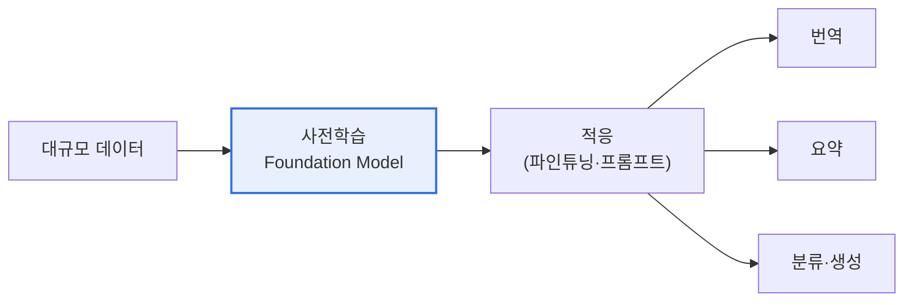

# 파운데이션 모델(Foundation Model)

## 1. 개요

### 가. 정의
> 방대한 데이터로 **사전학습(Pre-training)** 되어 다양한 하위 과제(downstream task)에 적응·활용할 수 있는 **범용 대규모 AI 모델**. GPT·BERT·CLIP 등이 대표적이며 파인튜닝·프롬프트로 여러 응용에 재사용된다.

파운데이션 모델의 패러다임 전환은 '**과제마다 모델을 새로 만들던**' 방식에서 '**하나의 범용 모델을 여러 과제에 적응**'시키는 방식으로의 이동이다. 대규모 사전학습으로 언어·이미지의 일반적 표현을 학습한 뒤, 소량의 데이터·프롬프트만으로 번역·요약·분류 등 다양한 과제를 수행한다. 이는 AI 개발의 진입장벽을 낮추고 재사용성을 극대화했다.

## 2. 특징

| 특징 | 내용 |
|---|---|
| **범용성** | 하나의 모델을 다양한 과제에 활용 |
| **대규모** | 방대한 파라미터·데이터로 사전학습 |
| **창발성(Emergence)** | 규모 확대 시 예상치 못한 능력 발현 |
| **적응성** | 파인튜닝·프롬프트·RAG로 도메인 특화 |
| **멀티모달** | 텍스트·이미지·음성 통합 처리 |

## 3. 기반 기술

| 기술 | 역할 |
|---|---|
| **Transformer·Self-Attention** | 장거리 문맥 학습의 핵심 구조 |
| **자기지도학습** | 레이블 없이 대규모 사전학습 |
| **분산학습·멀티GPU** | 초대규모 모델 훈련(HBM·InfiniBand) |
| **정렬(RLHF·DPO)** | 인간 선호에 맞춘 미세조정 |
| **RAG·파인튜닝** | 최신·도메인 지식 주입 |

## 4. 구현 시 고려사항 (법적·환경적·사회적)

| 측면 | 고려사항 |
|---|---|
| **법적** | 학습데이터 저작권·라이선스, 개인정보, 책임소재, AI 규제 준수 |
| **환경적** | 막대한 전력·탄소배출(훈련 비용), 그린 AI·효율화 필요 |
| **사회적** | 편향·차별, 허위정보·딥페이크, 일자리·오남용, 공정 접근성 |

## 5. 시사점
- 파운데이션 모델 위 **응용 생태계(파인튜닝·에이전트)** 확산
- 신뢰성(환각·편향)·안전성(정렬)·비용(경량화·sLLM)이 과제
- 환경·윤리·법적 리스크를 설계 단계부터 통합 관리 필요

---

> **한 줄 요약**: 파운데이션 모델은 *대규모 사전학습된 범용 AI* 로 파인튜닝·프롬프트로 다양한 과제에 적응하며, Transformer·자기지도학습·정렬이 기반이고 저작권·전력·편향 등 법·환경·사회적 고려가 필요하다.
