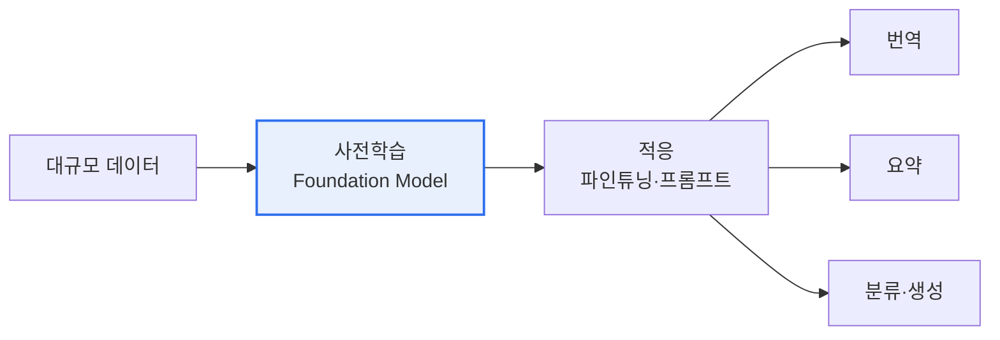

# 파운데이션 모델(Foundation Model)

## 1. 개요

### 가. 정의
> 방대한 데이터로 **사전학습(Pre-training)** 되어 다양한 하위 과제(downstream task)에 적응·활용할 수 있는 **범용 대규모 AI 모델**. GPT·BERT·CLIP 등이 대표적이며, 파인튜닝이나 프롬프트로 여러 응용에 재사용된다.

파운데이션 모델이 가져온 패러다임 전환은 '**과제마다 모델을 새로 만들던 방식에서, 하나의 범용 모델을 여러 과제에 적응시키는 방식으로**'의 이동이다. 과거에는 번역기, 감성분석기, 챗봇을 각각 별도로 처음부터 학습해야 했다. 파운데이션 모델은 대규모 사전학습을 통해 언어·이미지의 일반적 표현(세상에 대한 폭넓은 지식과 패턴)을 먼저 익힌 뒤, 소량의 데이터나 프롬프트만으로 번역·요약·분류 등 다양한 과제를 수행한다. 하나의 '기초(Foundation)' 위에 여러 응용을 올리는 것이다. 이는 AI 개발의 진입장벽을 획기적으로 낮추고 재사용성을 극대화해, AI 산업의 구조 자체를 바꿨다.

### 나. 등장 배경
데이터·연산·모델 규모를 키우면 성능이 예측 가능하게 향상된다는 '규모의 법칙(Scaling Law)'이 확인되고, Transformer 구조와 대규모 GPU 인프라가 결합되면서 초대규모 사전학습이 가능해진 것이 파운데이션 모델 부상의 기술적 배경이다.

## 2. 특징

파운데이션 모델의 특징은 서로 연결되어 있다. **범용성** 은 하나의 모델을 여러 과제에 쓰는 것이고, 이는 **대규모** 파라미터·데이터에서 나온다. 규모가 일정 임계를 넘으면 학습하지 않은 능력이 갑자기 나타나는 **창발성(Emergence)** 이 관찰되며, 파인튜닝·프롬프트·RAG로 특정 도메인에 **적응** 시킬 수 있다. 최근에는 텍스트·이미지·음성을 함께 다루는 **멀티모달** 로 확장되고 있다.

| 특징 | 내용 |
|---|---|
| **범용성** | 하나의 모델을 다양한 과제에 활용 |
| **대규모** | 방대한 파라미터·데이터로 사전학습 |
| **창발성** | 규모 확대 시 예상치 못한 능력 발현 |
| **적응성** | 파인튜닝·프롬프트·RAG로 도메인 특화 |
| **멀티모달** | 텍스트·이미지·음성 통합 처리 |

## 3. 기반 기술

파운데이션 모델은 여러 기술의 집약체다. **Transformer의 Self-Attention** 은 문맥의 장거리 의존성을 학습하는 핵심 구조이고, **자기지도학습** 은 레이블 없이 방대한 원시 데이터로 사전학습을 가능하게 한다. **분산학습·멀티GPU**(HBM·InfiniBand)는 초대규모 모델의 훈련을 뒷받침하며, **정렬(RLHF·DPO)** 은 모델의 출력을 인간 선호에 맞추고, **RAG·파인튜닝** 은 최신·도메인 지식을 주입한다.

| 기술 | 역할 |
|---|---|
| **Transformer·Self-Attention** | 장거리 문맥 학습 |
| **자기지도학습** | 레이블 없이 대규모 사전학습 |
| **분산학습·멀티GPU** | 초대규모 모델 훈련 |
| **정렬(RLHF·DPO)** | 인간 선호 반영 미세조정 |
| **RAG·파인튜닝** | 최신·도메인 지식 주입 |

## 4. 구현 시 고려사항 (법적·환경적·사회적)

파운데이션 모델은 강력한 만큼 세 층위의 책임이 따른다. **법적**으로는 학습 데이터의 저작권·라이선스, 개인정보, 결과에 대한 책임소재, AI 규제 준수가 문제가 된다. **환경적**으로는 초대규모 모델의 훈련이 막대한 전력과 탄소를 소모하므로 그린 AI·효율화가 요구된다. **사회적**으로는 편향·차별, 허위정보·딥페이크, 일자리 변화, 오남용, 소수 빅테크의 독점과 공정한 접근성 문제가 제기된다.

| 측면 | 고려사항 |
|---|---|
| **법적** | 학습데이터 저작권·라이선스, 개인정보, 책임소재, 규제 |
| **환경적** | 훈련의 전력·탄소배출, 그린 AI·경량화 |
| **사회적** | 편향·차별, 허위정보·딥페이크, 일자리·독점·접근성 |

## 5. 고려사항 및 시사점

1. **응용 생태계의 확산**이 핵심 흐름이다. 파운데이션 모델 위에 파인튜닝·프롬프트·에이전트로 무수한 응용이 만들어지며, AI 활용의 중심축이 되고 있다.
2. **신뢰성·안전성·비용이 과제**다. 환각·편향을 줄이는 신뢰성, 정렬을 통한 안전성, 그리고 경량 모델(sLLM)·양자화로 비용을 낮추는 효율화가 실용화의 관건이다.
3. **법·환경·사회적 리스크의 설계 단계 내재화**가 필요하다. 강력한 범용 기술일수록 부작용도 크므로, 개발 초기부터 책임 있는 AI 원칙을 통합해야 한다.

---

> **한 줄 요약**: 파운데이션 모델은 *대규모 사전학습된 범용 AI* 로 파인튜닝·프롬프트로 다양한 과제에 적응하며, Transformer·자기지도학습·정렬을 기반으로 하되 학습데이터 저작권·전력·편향 등 법·환경·사회적 리스크를 설계 단계부터 통합 관리해야 한다.
