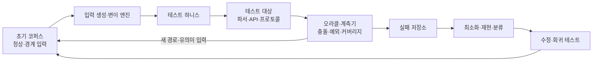
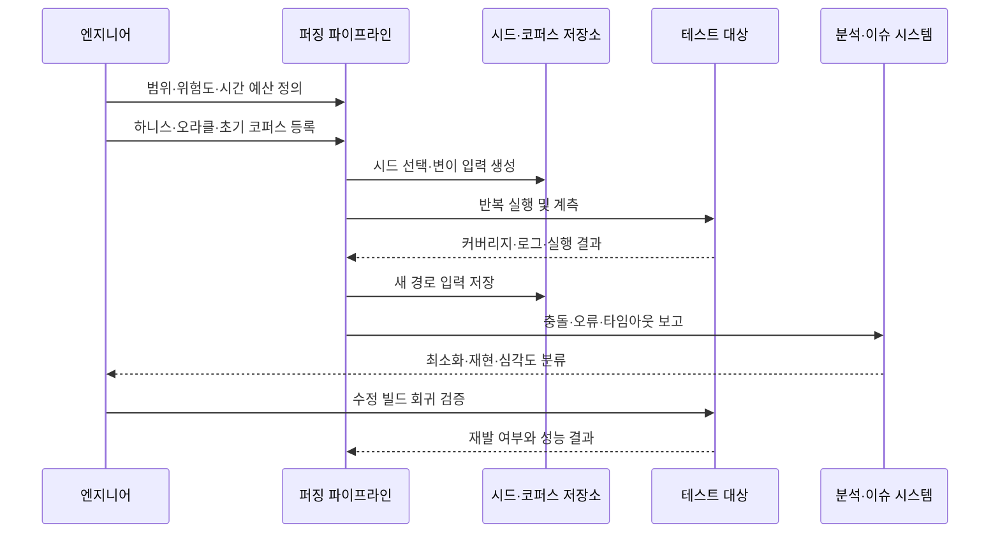

# 퍼징 테스트(Fuzz Testing)와 취약점 탐지 전략

## 1. 개요

> **퍼징 테스트(Fuzz Testing, Fuzzing)**란 프로그램에 정상 입력뿐 아니라 무작위·변형·경계·비정상 입력을 대량으로 주입하고, 충돌·예외·메모리 오류·정합성 위반·성능 저하와 같은 이상 징후를 자동으로 관찰하여 결함을 찾는 동적 테스트 기법이다.

소프트웨어는 개발자가 예상한 입력만 처리하지 않는다. 네트워크 패킷, 이미지·문서 파일, 압축 데이터, API 요청, 프로토콜 메시지처럼 외부에서 들어오는 데이터는 형식이 깨졌거나 길이가 과도하거나 서로 모순되는 값을 포함할 수 있다. 수동 테스트는 대표적인 정상 시나리오를 확인하는 데 강하지만, 입력 공간이 매우 큰 파서와 통신 모듈의 모든 조합을 사람이 직접 만들기는 어렵다.

퍼징은 이 넓은 입력 공간을 자동 탐색한다. 단순히 난수를 생성하는 것이 아니라 테스트 대상의 입력 형식과 실행 결과를 이용하여 다음에 시도할 입력을 선택한다. 좋은 퍼저는 프로그램이 아직 지나가지 않은 분기나 상태를 계속 자극하고, 이상 현상이 재현되는 최소 입력을 보존하여 개발자가 고칠 수 있는 결함으로 전환한다.

퍼징의 직접적인 대상은 파일 파서·프로토콜 스택·컴파일러·인터프리터·인증 모듈·직렬화 라이브러리·스마트 계약과 같이 외부 입력을 해석하는 코드다. 하지만 대상은 이에 한정되지 않는다. 금융 거래 API의 금액·통화·날짜 조합, IoT 장치의 명령 메시지, 데이터 변환 파이프라인의 스키마도 퍼징의 대상이 될 수 있다.

퍼징은 테스트 케이스를 많이 실행하는 것 자체가 목적이 아니다. 탐색된 코드 범위, 발견된 고유 결함, 재현 가능성, 수정 후 회귀 방지 여부가 성과를 결정한다. 따라서 테스트 대상의 경계를 분명히 하고, 입력 생성 전략과 관찰할 오라클(oracle)을 설계하며, 실패를 분류·재현·수정하는 운영 절차까지 포함해야 한다.

### 가. 등장 배경과 필요성

첫째, 입력 경계가 시스템 외부로 확장되었다. 웹 API와 모바일 앱은 다양한 클라이언트의 데이터를 받고, 마이크로서비스는 서비스 간 메시지를 네트워크로 교환한다. 한 서비스가 예상과 다른 값을 보내도 수신 서비스가 안전하게 거부해야 하므로 계약 경계의 견고함을 자동 검증할 필요가 있다.

둘째, 보안 취약점은 정상 흐름이 아니라 예외 경로에서 발생하는 경우가 많다. 길이 계산의 정수 오버플로, 잘못된 압축 해제, 중첩 구조의 무한 재귀, 인증 상태 전이의 우회는 일반적인 기능 테스트만으로 놓치기 쉽다. 퍼징은 이러한 경계 조건을 반복적으로 자극해 보안 테스트와 품질 테스트의 접점을 만든다.

셋째, 개발·배포 주기가 짧아졌다. 릴리스마다 수동으로 많은 입력을 만들면 테스트가 병목이 되지만, 퍼징 작업은 CI에서 일정 시간 또는 일정 실행 횟수로 자동화할 수 있다. 다만 무차별 실행만 파이프라인에 넣으면 실패 분류와 환경 재현이 어려워지므로 품질 게이트와 자원 한도를 함께 정의해야 한다.

## 2. 퍼징 테스트의 구성요소와 동작 원리

퍼징 시스템은 퍼저 자체만으로 이루어지지 않는다. 테스트 하니스(harness), 입력 코퍼스(corpus), 변이·생성 엔진, 계측기, 오라클, 결과 저장소가 함께 작동한다. 어느 하나라도 부실하면 실행 횟수는 늘어나도 결함 발견력은 높아지지 않는다.

### 가. 테스트 하니스

하니스는 퍼저가 생성한 바이트열 또는 구조화된 값을 테스트 대상의 호출 형식으로 연결하는 얇은 어댑터다. 예를 들어 이미지 디코더를 퍼징한다면 입력 바이트를 메모리 버퍼로 읽은 뒤 디코더의 공개 함수를 호출하고, API를 퍼징한다면 생성한 요청을 인증·라우팅·검증 단계까지 전달한다.

하니스는 작고 결정적이어야 한다. 실제 운영 서버 전체를 매번 기동하면 한 번의 실행 비용이 커지고 외부 시스템 상태에 따라 결과가 달라진다. 가능하면 파일 저장·시간·난수·네트워크를 가상화하고, 테스트 대상의 핵심 파싱·검증 로직을 프로세스 안에서 빠르게 호출한다.

하니스가 입력을 지나치게 일찍 거부하면 퍼저가 깊은 코드에 도달하지 못한다. 반대로 모든 검증을 제거하면 운영 경로와 다른 동작을 시험하게 된다. 따라서 입력의 형식 경계는 유지하되, 외부 의존성은 가짜 객체나 고정된 픽스처로 바꾸어 깊은 상태까지 도달하게 하는 균형이 필요하다.

좋은 하니스는 한 번의 입력이 하나의 명확한 테스트를 표현하도록 만든다. 여러 테스트를 한 프로세스에 묶을 때는 전역 상태와 캐시를 초기화하고, 이전 입력의 결과가 다음 입력에 영향을 주지 않는지 확인해야 한다. 상태가 남으면 동일 입력의 결과가 달라지고, 결함 재현이 어려워진다.

### 나. 입력 코퍼스와 시드

코퍼스는 퍼징이 시작할 때 사용하는 입력 집합이다. 정상적으로 파싱되는 짧은 파일, 각 필드가 채워진 API 요청, 최소·최대 길이의 패킷, 과거에 발견된 실패 입력이 모두 시드가 될 수 있다. 시드의 품질은 퍼저가 유효한 내부 상태에 얼마나 빨리 도달하는지에 영향을 준다.

코퍼스는 양보다 다양성이 중요하다. 서로 거의 같은 입력만 많으면 저장 공간과 실행 시간이 낭비된다. 커버리지나 구조적 특징을 기준으로 중복을 줄이고, 서로 다른 버전·인코딩·중첩 깊이·선택 필드를 대표하는 입력을 남긴다.

운영에서 수집한 입력을 시드로 사용할 때는 개인정보·인증 토큰·고객 식별자를 제거해야 한다. 원본 로그를 그대로 코퍼스에 넣으면 테스트 저장소가 새로운 개인정보 보관 장소가 된다. 비식별화와 접근권한, 보존기간, 유출 시 폐기 절차를 코퍼스 관리 규칙에 포함한다.

### 다. 변이와 생성

변이 기반 퍼징은 이미 유효한 입력의 일부를 바꾼다. 비트 뒤집기, 바이트 삽입·삭제, 경계값 치환, 토큰 순서 변경, 길이 필드 변조와 같은 연산은 기존 구조를 어느 정도 유지하면서 예외 경로를 자극한다. 파일 포맷과 프로토콜의 문법을 모르는 퍼저도 빠르게 적용할 수 있다는 장점이 있다.

생성 기반 퍼징은 문법(grammar)이나 스키마를 사용해 입력을 처음부터 만든다. JSON 스키마, ASN.1, SQL 문법, 프로토콜 상태 정의를 이용하면 유효한 조합을 많이 만들 수 있다. 구현 비용은 높지만 중첩 구조와 상태 전이를 정교하게 다룰 수 있고, 특정 도메인의 의미를 반영하기 쉽다.

실무에서는 두 방식을 결합한다. 문법으로 유효한 기본 메시지를 만들고, 그 결과에 경계값·비정상 토큰·순서 위반 변이를 적용한다. 예를 들어 주문 API의 스키마로 요청을 만든 뒤 수량을 0·음수·최대 정수로 바꾸고, 통화와 금액의 조합을 어긋나게 하는 방식이다.

### 라. 오라클과 이상 징후

오라클은 입력이 결함을 드러냈는지 판단하는 기준이다. 가장 단순한 오라클은 프로세스 충돌, 비정상 종료, 시간 초과, 메모리 접근 오류를 감지하는 것이다. 주소·메모리·정의되지 않은 동작을 검사하는 동적 분석 도구를 결합하면 겉으로는 성공한 실행도 오류로 포착할 수 있다.

기능적 오라클도 중요하다. 프로그램이 충돌하지 않았더라도 파싱 결과가 문법적으로 동일한 입력 사이에서 달라지거나, 금액 합계가 보존되지 않거나, 권한이 없는 상태 전이가 허용되면 결함이다. 이런 불변조건(invariant)을 코드로 표현하면 보안과 업무 규칙 위반을 발견할 수 있다.

오라클의 민감도와 특이도는 함께 관리해야 한다. 너무 민감하면 정상적인 경고가 수천 건의 실패로 쌓이고, 너무 둔감하면 실제 결함이 성공으로 처리된다. 실패 유형, 스택 트레이스, 입력 해시, 실행 환경, 대상 버전을 기록하여 동일 원인의 중복을 묶는다.

### 마. 커버리지 유도 탐색

커버리지 유도 퍼징(coverage-guided fuzzing)은 입력을 실행한 뒤 새로 방문한 경로·기본 블록·분기 정보를 활용하여 다음 입력의 우선순위를 정한다. 새로운 영역을 연 입력은 코퍼스에 보존하고, 더 깊은 코드로 이어질 가능성이 낮은 입력은 선택 확률을 낮춘다.

커버리지는 탐색 방향을 제시하는 신호이지 품질의 완전한 증명은 아니다. 분기 커버리지가 높아도 인증 우회나 금액 보존과 같은 의미적 결함을 실행하지 못할 수 있다. 따라서 구조적 커버리지, 오류 탐지, 불변조건 검사, 요구사항 기반 시나리오를 조합해야 한다.

## 3. 퍼징 수행 절차

### 가. 대상과 위험 기반 범위 설정

먼저 외부 입력을 받는 컴포넌트와 업무 영향이 큰 경로를 목록화한다. 인터넷에 노출된 프로토콜 파서는 공격 표면이 넓고, 결제·인증·개인정보 변환 모듈은 결함의 영향도가 크다. 이 둘을 우선 대상으로 삼되, 테스트 환경에서 실행 가능한 격리 경계를 명확히 한다.

대상의 소유 팀, 지원 언어, 빌드 방식, 의존 서비스, 허용 가능한 실행 비용을 조사한다. C/C++ 라이브러리처럼 메모리 오류 위험이 큰 대상은 sanitizer와 결합한 프로세스 퍼징을 우선할 수 있다. Java·Go·Rust·Python 대상은 언어별 하니스와 계측 방식, 예외 처리 특성을 확인해야 한다.

위험 기반 우선순위는 공격 가능성만으로 정하지 않는다. 자산의 민감도, 장애 시 업무 중단, 복구 시간, 패치 난이도, 외부 노출도와 함께 평가한다. 결과는 대상·입력 종류·테스트 시간·담당자·중지 조건을 포함하는 퍼징 계획서로 남긴다.

### 나. 하니스 설계와 기준선 측정

하니스를 만든 뒤 정상 입력과 알려진 경계 입력을 통과시켜 대상의 기본 동작을 확인한다. 이 단계에서 하니스 자체의 오류와 대상의 결함을 구분하지 못하면 이후 결과가 오염된다. 입력 하나당 처리 시간, 메모리 사용량, 예외 발생 여부, 초기 커버리지를 기준선으로 측정한다.

초기 커버리지가 지나치게 낮으면 입력이 파서의 입구에서 거부되고 있을 가능성이 있다. 반대로 모든 입력이 같은 경로만 통과하면 시드의 다양성을 높이거나 문법 정보를 추가해야 한다. 하니스는 퍼저의 성능보다 테스트 대상의 실제 운영 경로를 충실히 재현하는 것이 우선이다.

외부 API를 호출하는 하니스는 요청 폭주와 비용 발생을 막아야 한다. 실제 결제·문자 발송·데이터 삭제 API를 직접 연결하지 말고, 샌드박스와 가상 응답을 사용한다. 네트워크 퍼징은 별도의 격리망에서 수행하고, 생성 트래픽의 출발지와 속도를 제한한다.

### 다. 실행과 자원 예산

실행 방식은 개발자 로컬 단기 세션, 야간 장기 세션, CI의 변경 영향 세션으로 나눌 수 있다. 로컬 세션은 하니스 개발과 빠른 재현에 사용하고, 야간 세션은 오래 실행되는 경로와 희귀한 상태를 찾는다. CI 세션은 모든 커밋을 무한히 탐색하기보다 변경된 모듈과 과거 취약 입력을 빠르게 재검증한다.

시간 예산은 단순한 실행 횟수보다 유효 실행 수와 대상 처리량으로 관리한다. 한 입력의 처리 시간이 길어지면 시간 초과 입력을 별도 큐로 보내 원인 분석을 수행한다. 메모리·CPU·디스크 상한을 두고, 코퍼스와 크래시 파일의 보존 용량도 계획한다.

동시 실행 수를 늘리면 결함 발견 속도가 빨라질 수 있지만, 공유 파일·포트·데이터베이스 상태가 경합하면 결과가 불안정해진다. 독립적인 작업 디렉터리와 포트, 읽기 전용 픽스처를 사용하고, 실행 환경의 버전과 설정을 고정한다.

### 라. 실패 최소화와 재현

퍼저가 찾은 입력은 수천 바이트 또는 복잡한 메시지일 수 있다. 최소화(minimization)는 동일한 오류를 일으키는 더 작은 입력을 반복적으로 찾는 과정이다. 입력이 작아지면 개발자가 원인을 읽기 쉬워지고, 회귀 테스트에 넣는 비용과 저장 공간도 줄어든다.

최소화의 성공 기준은 파일 크기 자체가 아니라 오류 종류와 재현 조건의 보존이다. 충돌이 단순 예외로 바뀌거나, 시간 초과가 사라지면 과도하게 줄인 것이다. 오류 코드, 스택, sanitizer 보고서, 반환값과 실행 시간의 범위를 함께 비교한다.

재현에는 바이너리 버전, 라이브러리 버전, 운영체제·아키텍처, 환경변수, 난수 시드가 필요하다. 컨테이너 이미지 또는 재현 스크립트를 함께 저장하면 담당 팀이 동일 조건에서 결함을 확인할 수 있다. 재현되지 않는 보고도 폐기하지 말고, 비결정성의 원인을 별도 결함으로 추적한다.

## 4. 유형과 관련 기법 비교

퍼징은 입력을 만드는 관점, 프로그램을 관찰하는 관점, 지식의 양에 따라 여러 방식으로 분류한다. 한 분류가 다른 분류와 배타적이지 않으므로 “회색상자 커버리지 유도 퍼징”처럼 조합하여 설명할 수 있다.

| 구분 기준 | 대표 유형 | 핵심 특징 | 적합한 상황 |
|---|---|---|---|
| 입력 생성 | 변이 기반 | 유효 시드를 변형 | 파일·메시지 형식이 있고 시드가 풍부한 경우 |
| 입력 생성 | 생성 기반 | 문법·스키마로 새 입력 생성 | 복잡한 문법과 상태 전이를 탐색하는 경우 |
| 내부 지식 | 블랙박스 | 내부 구조를 거의 모름 | 폐쇄형 제품·원격 인터페이스 테스트 |
| 내부 지식 | 회색상자 | 커버리지·상태 신호 활용 | 일반적인 CI·라이브러리 퍼징 |
| 내부 지식 | 화이트박스 | 경로 제약과 코드 구조 활용 | 특정 분기·도달 불가 경로 분석 |
| 탐색 신호 | 커버리지 유도 | 새 경로 입력을 우대 | 넓은 코드 공간의 자동 탐색 |
| 목적 | 보안 퍼징 | 취약점·메모리 오류 중심 | 공격 표면과 입력 검증 검증 |
| 목적 | 기능 퍼징 | 불변조건·계약 위반 중심 | 도메인 규칙과 상태 전이 검증 |

블랙박스 퍼징은 테스트 대상에 대한 사전 지식이 거의 없어도 시작할 수 있다. 제품의 실제 외부 인터페이스를 기준으로 입력을 보내므로 현실적인 공격 표면을 확인하기 좋지만, 깊은 분기까지 도달하는 효율은 낮을 수 있다. 초기 탐색과 외부 제품 평가에 유용하나, 내부 상태를 설명할 계측이 부족하면 실패 원인 분석이 어렵다.

화이트박스 퍼징은 코드, 제어 흐름, 제약식과 같은 내부 정보를 사용한다. 특정 조건을 만족해야만 들어가는 분기를 계산해 경로를 확장할 수 있지만, 분석 비용과 구현 복잡도가 커진다. 코드가 자주 바뀌는 대규모 서비스에서는 모든 경로를 정밀 분석하기보다 고위험 함수에 제한적으로 적용하는 것이 현실적이다.

회색상자 방식은 커버리지와 실행 결과라는 제한된 내부 신호를 활용한다. 전체 소스의 의미를 해석하지 않으면서도 새 경로를 발견한 입력을 보존하므로 성능과 적용성의 균형이 좋다. 현대적인 자동 퍼징 파이프라인에서 널리 사용되지만, 의미적 불변조건과 상태 모델은 별도로 제공해야 한다.

| 비교 항목 | 퍼징 테스트 | 일반 기능 테스트 | 정적 분석 | 침투 테스트 |
|---|---|---|---|---|
| 실행 방식 | 비정상 입력을 자동 반복 실행 | 정의된 시나리오 실행 | 소스·바이너리 정적 검사 | 공격자 관점의 수동·도구 기반 검증 |
| 강점 | 예외·경계·희귀 입력 탐색 | 요구사항과 사용자 흐름 검증 | 조기 발견과 광범위한 코드 검사 | 실제 공격 경로와 영향 확인 |
| 약점 | 오라클·하니스 설계 필요 | 입력 공간이 제한될 수 있음 | 실행 상태와 환경 의존성 반영 한계 | 비용·범위·재현성 제약 |
| 주요 산출물 | 재현 입력·커버리지·오류 보고 | 통과·실패 시나리오 | 경고·잠재 결함 목록 | 취약점·공격 증적·개선 권고 |

네 기법은 대체재가 아니라 보완재다. 정적 분석으로 위험한 함수와 입력 검증 누락 후보를 좁히고, 기능 테스트로 정상 계약을 확인하며, 퍼징으로 비정상 조합을 탐색한 뒤, 침투 테스트로 여러 취약점이 결합되는 실제 공격 경로를 검증한다. 이 순서를 고정할 필요는 없지만 결과가 서로 연결되어야 한다.

## 5. 적용 사례

### 가. 이미지·문서 파서 사례

문서 업로드 서비스가 PDF와 이미지 파일을 변환한다고 가정하자. 테스트 대상은 파일 헤더, 길이 필드, 압축 스트림, 색상 테이블과 중첩 객체를 해석한다. 초기 코퍼스에는 정상 파일과 각 포맷의 최소 파일을 넣고, 변이 엔진이 길이·오프셋·압축 데이터를 바꾸도록 구성한다.

하니스는 파일을 메모리에서 읽어 변환 라이브러리를 호출하고, 출력 파일은 격리된 임시 디렉터리에만 기록한다. 메모리 오류 검출기와 시간 초과 감시를 함께 사용하여 충돌뿐 아니라 과도한 재귀와 압축 폭탄의 징후도 관찰한다. 외부 저장소나 고객 알림은 연결하지 않아 테스트 입력이 업무 데이터로 전파되지 않게 한다.

발견된 충돌 입력을 최소화했더니 특정 객체의 길이 필드가 실제 버퍼보다 큰 경우에만 재현된다고 하자. 개발자는 길이 검증과 정수 오버플로 방어를 추가하고, 최소 입력을 회귀 테스트에 넣는다. 수정 후 동일 퍼징을 수행해 충돌이 사라졌는지와 다른 파서 경로가 여전히 탐색되는지를 확인한다.

### 나. 결제 API의 의미 기반 퍼징 사례

결제 API는 JSON 문법만 맞는다고 안전한 것이 아니다. 주문 금액이 음수인지, 통화와 소수점 자릿수가 맞는지, 멱등 키가 재사용될 때 중복 승인이 생기지 않는지, 승인 취소의 상태 전이가 올바른지가 중요하다. 따라서 스키마 기반 생성과 도메인 불변조건을 함께 설계한다.

예를 들어 한 요청의 수량을 최대 정수로 바꾸고 할인율을 음수로 만들며, 승인과 취소 요청의 순서를 뒤섞는다. 오라클은 잔액 감소가 총 결제액을 초과하지 않는지, 동일 멱등 키의 최종 결과가 일관적인지, 권한 없는 사용자가 다른 고객의 주문을 변경하지 못하는지를 검사한다.

테스트는 반드시 결제 샌드박스와 가상 화폐를 사용한다. 실패 입력에는 고객 원문 대신 합성 식별자를 기록하고, 실제 카드번호·토큰·송금 API와의 연결을 차단한다. 이 사례는 퍼징이 보안 취약점뿐 아니라 업무 규칙과 분산 상태의 결함도 찾을 수 있음을 보여준다.

### 다. 네트워크 프로토콜 사례

IoT 게이트웨이가 장치 등록, 인증, 상태 보고 메시지를 처리한다고 가정한다. 프로토콜에는 메시지 유형, 길이, 순번, 인증 태그, 선택 필드가 있고 일부 메시지는 이전 상태를 요구한다. 단순한 임의 바이트 입력은 입구에서 모두 거부될 수 있으므로 상태 모델과 유효한 메시지 시퀀스를 함께 제공한다.

퍼저는 정상 등록 뒤 상태 보고를 보내고, 순번을 건너뛰거나 인증 태그를 변경하거나 메시지를 지나치게 빠르게 반복한다. 오라클은 프로세스 충돌, 인증 우회, 세션 자원 고갈, 재전송 방지 실패를 관찰한다. 장치와 연결된 실제 액추에이터는 사용하지 않고 가상 장치 시뮬레이터로 대체한다.

장시간 퍼징에서 특정 비정상 시퀀스가 세션 메모리를 회수하지 않는 문제가 발견되면, 단일 메시지의 버그가 아니라 상태 수명주기 결함일 수 있다. 이때 단순 입력 최소화와 함께 메시지 시퀀스 최소화를 수행해야 한다. 수정 후에는 장치 펌웨어 버전과 네트워크 지연을 바꾼 회귀 시나리오도 추가한다.

## 6. 자동화와 품질 관리

퍼징을 DevSecOps에 편입할 때는 개발자 로컬, 병합 전, 야간, 릴리스 전 단계의 목적을 구분한다. 병합 전에는 짧은 시간의 재현·회귀 중심 테스트를 실행하고, 야간에는 장시간 탐색과 코퍼스 확장을 수행한다. 릴리스 전에는 변경된 파서와 외부 인터페이스의 위험 기반 캠페인을 별도로 승인한다.

CI 결과는 “몇 번 실행했는가”만 보여주지 않아야 한다. 신규 커버리지, 고유 오류 수, 신규 입력 수, 평균 처리량, 시간 초과 수, 미해결 오류의 심각도와 재현 상태를 함께 표시한다. 커버리지가 감소하거나 고위험 오류가 새로 발생하면 품질 게이트를 중단하고 담당 팀에 자동 배정한다.

모든 실패를 빌드 실패로 취급하면 오탐 때문에 퍼징이 꺼질 수 있다. 반대로 모든 실패를 경고로만 남기면 취약점이 릴리스에 섞인다. 메모리 안전 위반·인증 우회·데이터 손상처럼 즉시 차단해야 하는 유형과, 재현성 부족·성능 경고처럼 조사 후 판단할 유형을 정책으로 구분한다.

퍼징 캠페인의 성과는 결함 발견 수로만 평가하지 않는다. 하니스의 대상 코드 도달률, 실패 재현 시간, 평균 수정 시간, 회귀 테스트 전환률, 미해결 고위험 오류의 추세를 함께 본다. 결함을 많이 찾았지만 담당자가 재현하지 못한다면 운영 체계가 개선되어야 한다.

## 7. 심화: 현대 퍼징과 개발 생애주기 연계

최근의 퍼징은 독립된 보안 도구라기보다 소프트웨어 공급망과 품질 파이프라인의 일부로 운영되는 방향으로 발전하고 있다. 오픈소스 라이브러리의 지속적 퍼징, 자동 코퍼스 공유, sanitizer 기반 오류 보고, 커밋 단위 회귀 검증을 결합하면 새로운 변경이 기존 안전성을 훼손했는지 빠르게 확인할 수 있다.

오픈소스 프로젝트를 대상으로 하는 대규모 퍼징 서비스는 다수의 프로젝트에 장기간 실행 자원을 제공하고, 발견된 결함을 프로젝트 유지관리자에게 전달하는 모델을 보여준다. 조직은 이러한 공개 결과를 그대로 신뢰하기보다 사용 중인 버전·빌드 옵션·플랫폼과 일치하는지 확인하고, 자체 하니스와 보안 정책을 별도로 유지해야 한다.

생성형 AI를 입력 생성에 활용할 때도 검증 절차는 필요하다. 모델은 복잡한 문법과 의미 있는 시나리오를 제안할 수 있지만, 생성 비용이 크고 중복·무효 입력이 많으며 결과가 비결정적일 수 있다. AI가 만든 입력을 문법 검증, 안전한 실행, 커버리지 평가, 개인정보 필터링을 거친 코퍼스에 편입하는 다단계 게이트가 필요하다.

퍼징과 SBOM·취약점 관리의 연계도 중요하다. 발견된 결함이 어떤 라이브러리와 빌드 산출물에 영향을 주는지 구성요소 정보를 연결해야 패치 범위를 판단할 수 있다. 반대로 서드파티 라이브러리 업데이트가 있으면 해당 라이브러리의 하니스와 과거 크래시를 재실행하여 회귀 여부를 확인한다.

기술사 답안에서는 퍼징을 “무작위 테스트”라고만 쓰지 말고, 위험 기반 대상 선정, 하니스와 오라클 설계, 커버리지 유도, 실패 최소화, CI 품질 게이트, 개인정보와 격리망까지 하나의 운영 체계로 설명해야 높은 완성도를 얻을 수 있다.

## 8. 고려사항 및 시사점

### 가. 테스트 대상의 대표성

하니스가 실제 운영 경로를 충분히 대표하는지 확인해야 한다. 내부 테스트 전용 우회 경로만 퍼징하면 높은 커버리지를 얻어도 운영 취약점을 놓친다. 반대로 전체 운영 시스템을 그대로 연결하면 비용과 부작용이 커지므로, 핵심 입력 검증과 상태 전이를 보존한 격리 테스트 경계를 설계한다.

### 나. 오라클의 업무 의미

충돌 탐지는 퍼징의 출발점일 뿐이다. 인증, 권한, 금액, 상태 전이, 데이터 보존과 같은 업무 불변조건을 오라클로 표현해야 논리적 취약점을 찾을 수 있다. 오라클을 만들기 어렵다는 이유로 “프로세스가 살아 있으면 성공”으로 정의하면 조용한 데이터 손상을 놓칠 수 있다.

### 다. 재현성과 증적 관리

발견 입력, 실행 명령, 빌드 식별자, 환경, 난수 시드, 스택 보고서를 함께 보존해야 한다. 보안 사고나 감사가 발생했을 때 어떤 버전이 어떤 테스트를 통과했는지 설명할 수 있어야 한다. 단, 증적 저장소에는 개인정보와 비밀값이 들어가지 않도록 자동 마스킹과 접근 통제를 적용한다.

### 라. 자원·안전 통제

퍼징은 대상의 취약한 동작을 의도적으로 자극하므로 운영망과 분리해야 한다. 네트워크 주소·포트·요청률을 제한하고, 파일 시스템과 데이터베이스를 일회성 환경으로 격리한다. 실행 자원과 저장 공간에 상한을 두어 퍼징 자체가 개발 인프라의 장애 원인이 되지 않도록 한다.

### 마. 결과의 우선순위화

오류가 많다고 모두 같은 위험을 갖는 것은 아니다. 원격 실행 가능성, 인증 필요 여부, 데이터 영향, 재현성, 공격 난이도, 외부 노출도를 종합하여 심각도를 정한다. 동일한 근본 원인에서 나온 여러 입력을 하나의 결함으로 묶되, 서로 다른 실행 경로가 추가 위험을 만드는지는 별도로 검토한다.

### 바. 조직과 프로세스 연계

퍼징은 보안팀만 수행하는 일회성 캠페인이 아니라 개발·테스트·운영이 공유하는 품질 활동이어야 한다. 하니스 소유자, 취약점 triage 담당자, 수정 SLA, 예외 승인자, 재검증 책임을 정하고, 발견 결과가 백로그와 릴리스 판단에 연결되게 한다. 발견된 최소 입력을 회귀 테스트로 편입하면 캠페인의 지속 효과가 생긴다.

### 사. 적용 비용과 트레이드오프

모든 모듈에 동일한 장시간 퍼징을 적용하는 것은 비효율적이다. 외부 입력을 받고 피해 영향이 큰 모듈부터 시작하고, 하니스 재사용성과 오류 발견 이력을 근거로 자원을 재배분한다. 실행 횟수·커버리지·결함 수 사이에는 단순한 선형 관계가 없으므로, 비용 대비 위험 감소를 정기적으로 평가한다.

## 참고자료

- NIST, *Technical Guide to Information Security Testing and Assessment (SP 800-115)*: https://csrc.nist.gov/pubs/sp/800/115/final
- OWASP, *Fuzzing*: https://owasp.org/www-community/Fuzzing
- LLVM, *libFuzzer documentation*: https://llvm.org/docs/LibFuzzer.html
- Google, *ClusterFuzz documentation*: https://google.github.io/clusterfuzz/
- Google, *OSS-Fuzz*: https://google.github.io/oss-fuzz/
- AFLplusplus, *AFL++ documentation*: https://aflplus.plus/

---

> **한 줄 요약**: 퍼징 테스트는 하니스·입력 생성·오라클·커버리지·재현 절차를 결합하여 사람이 만들기 어려운 비정상 입력에서 보안과 업무 결함을 지속적으로 찾아내는 위험 기반 동적 테스트 전략이다.
