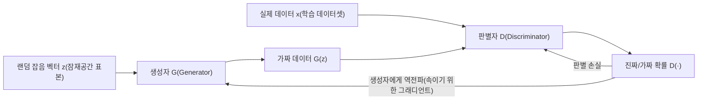
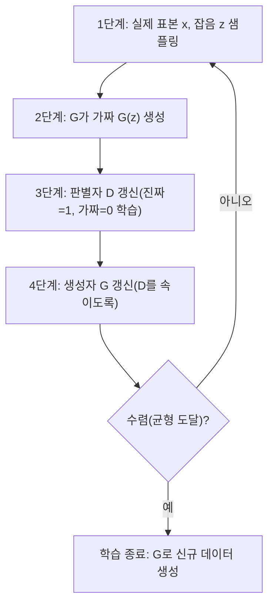

# 생성적 적대 신경망(GAN, Generative Adversarial Network)

## 1. 개요

> **생성적 적대 신경망(GAN)**이란 새로운 데이터를 만들어내는 **생성자(Generator)**와 그 데이터가 진짜인지 가짜인지 판별하는 **판별자(Discriminator)** 두 신경망을 서로 경쟁시키며 동시에 학습시켜, 실제 데이터의 분포를 근사하고 그로부터 사실적인 표본을 생성하는 딥러닝 기반의 생성 모형(Generative Model)이다.

생성형(Generative) 모델의 근본 목표는 학습 데이터가 따르는 확률분포 p_data(x)를 알아내어, 그 분포에서 지금까지 본 적 없는 새로운 표본을 뽑아내는 것이다. 전통적으로 이 문제는 데이터의 우도(likelihood)를 명시적으로 모델링하는 방식(예: 볼츠만 머신, 변분 오토인코더 VAE)으로 접근했으나, 고차원 이미지처럼 분포가 복잡한 경우 우도를 직접 계산하거나 최적화하기가 매우 어려웠다. VAE는 학습은 안정적이나 생성 결과가 흐릿(blurry)해지는 한계가 있었다.

2014년 이안 굿펠로우(Ian Goodfellow)가 제안한 GAN은 "우도를 직접 계산하지 말고, **판별하기 어려운 가짜를 만드는 게임**으로 문제를 바꾸자"는 발상의 전환으로 이 딜레마를 돌파했다. 위조지폐범(생성자)과 경찰(판별자)의 비유가 널리 쓰인다. 위조범은 더 정교한 위조지폐를 만들려 하고 경찰은 더 정확히 감별하려 하는데, 이 경쟁이 반복되면 위조지폐는 진짜와 구별할 수 없을 만큼 정교해진다. GAN은 이 적대적 경쟁을 신경망의 손실함수로 형식화한 것이다.

GAN이 폭발적으로 확산된 배경에는 몇 가지 시대적 조건이 맞물려 있다. 딥러닝의 합성곱 신경망이 이미지 인식에서 성숙해 판별자의 성능이 뒷받침되었고, GPU 병렬연산으로 대규모 신경망 학습이 현실화되었으며, 대량의 이미지 데이터셋이 축적되어 있었다. 이런 토대 위에서 GAN은 2015년 DCGAN, 2017년 CycleGAN·Pix2Pix, 2018년 StyleGAN으로 이어지며 불과 수년 만에 사실성 면에서 급격히 발전했다. 이 빠른 발전 속도 자체가 생성형 AI가 사회에 미칠 파급을 예고한 신호였다는 점에서, GAN의 등장 배경은 기술사적으로도 의미가 크다.

GAN이 정보관리기술사 관점에서 중요한 이유는, 그것이 **생성형 AI의 계보에서 하나의 전환점**이었기 때문이다. 2014년 이후 GAN은 사실적 이미지 생성의 사실상 표준으로 자리 잡았고, 오늘날의 텍스트-이미지 생성이 디퓨전 모델로 주류가 이동한 뒤에도 이미지 초해상도·화질 개선·데이터 증강·이상탐지 등 실무 영역에서 여전히 활용된다. 동시에 딥페이크(Deepfake)라는 악용 사례를 낳아 AI 신뢰성·보안·윤리 문제의 출발점이 되었으므로, 기술 원리와 사회적 함의를 함께 이해해야 하는 주제이다.

GAN의 핵심 특징을 요약하면 다음과 같다. 첫째, **우도를 명시적으로 계산하지 않는 암묵적(implicit) 생성 모델**이라는 점이다. 데이터가 따르는 확률밀도를 직접 수식화하지 않고, 그 분포에서 표본을 뽑는 능력만 학습한다. 둘째, **두 신경망의 경쟁이 곧 학습 신호**라는 점이다. 별도의 정답 없이 상대 신경망의 판정만으로 서로를 개선하는 자기지도적(self-supervised) 성격을 지닌다. 셋째, **잠재공간의 연속성**이다. 입력 잡음 벡터를 조금씩 바꾸면 생성 결과가 자연스럽게 변형되어, 데이터의 의미 축을 벡터 연산으로 다룰 수 있다. 이 세 특징이 GAN을 강력하면서도 다루기 까다로운 기술로 만든다.

## 2. GAN의 전체 구조와 적대적 학습 원리

GAN은 두 개의 신경망이 하나의 목적함수를 두고 **미니맥스(minimax) 게임**을 벌이는 구조다. 생성자 G는 정규분포 등에서 뽑은 저차원 잡음 벡터 z를 입력받아 실제 데이터와 유사한 표본 G(z)를 출력한다. z가 존재하는 공간을 **잠재공간(latent space)**이라 하며, 이 공간의 연속적 이동이 생성 결과의 의미 있는 변화(예: 얼굴의 각도·표정 변화)로 이어진다는 점이 GAN의 흥미로운 성질이다. 판별자 D는 입력이 실제 데이터인지 G가 만든 가짜인지를 0~1 확률로 판정한다.

여기서 판별자를 단순한 "감별기"가 아니라 **학습되는 손실함수(learned loss)**로 이해하면 GAN의 본질이 더 선명해진다. 전통적 생성 모델은 픽셀 단위 오차(예: 평균제곱오차) 같은 사람이 정한 고정된 손실을 최소화하는데, 이런 손실은 이미지의 지각적 사실성을 잘 포착하지 못해 결과가 흐릿해진다. 반면 GAN은 "무엇이 진짜처럼 보이는가"를 판별자가 데이터로부터 스스로 학습해 생성자에게 피드백한다. 즉 손실 기준 자체가 학습을 통해 정교해지므로, 사람이 미리 규정하기 어려운 "사실성"을 데이터 주도로 학습할 수 있다는 점이 GAN의 근본적 강점이다.

학습의 핵심은 두 신경망의 목표가 정반대라는 데 있다. 판별자 D는 진짜에 1, 가짜에 0을 부여하도록(즉 잘 구별하도록) 학습하고, 생성자 G는 D가 자신의 결과물을 1(진짜)로 판정하도록(즉 잘 속이도록) 학습한다. 수식으로는 D는 목적함수 V(D,G)를 최대화하고 G는 최소화하는 형태로, 이론적으로 두 신경망이 균형에 도달하면 생성자의 분포가 실제 데이터 분포와 일치하고 판별자는 어느 쪽도 구별하지 못해 모든 입력에 0.5를 출력하는 **내시 균형(Nash equilibrium)**에 이른다.

잠재공간의 성질은 GAN의 실용성을 한층 넓힌다. 학습이 끝난 생성자에서 잡음 벡터 z를 조금씩 이동시키면 생성 결과가 급격히 튀지 않고 부드럽게 변형되며(예: 정면 얼굴이 점차 옆얼굴로), 특정 속성(안경 착용, 나이, 표정)에 대응하는 방향 벡터를 찾아 더하거나 빼는 방식으로 생성물을 편집할 수 있다. 이는 잠재공간이 데이터의 의미 구조를 연속적·선형적으로 담고 있음을 뜻하며, 이미지 편집·속성 제어·보간(interpolation) 같은 응용의 이론적 토대가 된다. StyleGAN이 세밀한 속성 제어를 실현할 수 있었던 것도 이 잠재공간을 스타일 축으로 재구성했기 때문이다.

이 게임의 목적함수 V(D,G)는 "실제 표본에 대한 D의 로그 확률"과 "가짜 표본에 대한 로그(1−D)"의 기댓값 합으로 정의된다. D는 이 값을 키우려 하고 G는 줄이려 하므로, 학습은 단순한 최소화가 아니라 **안장점(saddle point)을 찾는 최적화**가 된다. 일반적인 손실 최소화가 계곡의 바닥을 찾는 문제라면, 미니맥스 게임은 한 방향으로는 최댓값·다른 방향으로는 최솟값인 지점을 찾아야 하므로 수렴 보장이 약하고 진동하기 쉽다. GAN 학습의 근본적 어려움은 바로 이 게임 이론적 구조에서 비롯된다.

실제 구현에서는 두 신경망을 번갈아 학습시킨다. 먼저 G를 고정한 채 실제 표본과 가짜 표본으로 D를 몇 스텝 갱신하고, 다음으로 D를 고정한 채 G를 갱신한다. 초기 논문에서는 G의 손실이 학습 초반 그래디언트가 소실되는 문제가 있어, "가짜를 진짜로 오인시킬 확률의 로그를 최대화"하는 **비포화 손실(non-saturating loss)**로 바꾸어 학습 초기 신호를 강화하는 실무적 보정을 적용한다. 이처럼 GAN은 이론은 우아하나 학습 과정이 예민해, 두 신경망의 학습 속도 균형을 맞추는 것이 성패를 좌우한다.

## 3. 학습 절차와 대표 변형 아키텍처

위 그림은 GAN의 반복 학습 절차다. 매 반복에서 판별자와 생성자를 교대로 갱신하며, 판별자를 생성자보다 약간 더 자주 혹은 강하게 학습시켜 "너무 쉽게 속지 않는" 판별자를 유지하는 것이 안정성의 요령이다. 다만 판별자가 지나치게 강해지면 생성자로 전달되는 그래디언트가 사라져 학습이 멈추므로, 두 신경망의 **능력 균형**을 세심하게 조율해야 한다.

한 가지 유의할 점은, 이 학습 절차에는 지도학습처럼 명확한 종료 시점이나 검증 정확도 곡선이 없다는 것이다. 손실값은 두 신경망의 힘겨루기 결과라 낮다고 좋은 것도, 특정 값에 수렴한다고 학습이 끝난 것도 아니다. 따라서 실무에서는 손실 곡선 대신 **생성 표본을 주기적으로 눈으로 확인하거나 FID 같은 정량 지표를 병행**하며 학습을 관리한다. 이 점이 "언제 학습을 멈출지"조차 판단이 어려운 GAN 특유의 운영 난이도를 만든다.

여기서 학습 균형의 조율이 왜 어려운지 구체적으로 짚을 필요가 있다. 판별자가 생성자보다 학습 속도가 지나치게 빠르면 가짜를 완벽히 걸러내 생성자에게 "무엇을 개선해야 하는지"에 대한 정보가 담긴 그래디언트가 사라지고, 반대로 생성자가 앞서가면 판별자가 속아 넘어가 무의미한 신호만 주게 된다. 그래서 실무에서는 판별자 갱신 횟수, 학습률, 배치 구성 등을 반복 실험으로 조정하며, 이 튜닝 부담이 GAN을 "다루기 어려운 모델"로 만드는 대표적 이유다.

GAN은 등장 이후 목적과 데이터 특성에 맞춰 다양한 파생 모델로 발전했다. 각 변형은 초기 GAN의 특정 약점(학습 불안정, 조건 제어 불가, 저해상도 등)을 해결하려는 시도로 이해하면 계보가 명확해진다.

| 변형 모델 | 핵심 아이디어 | 해결한 문제 |
|------|------|------|
| DCGAN | 생성자·판별자를 합성곱(CNN) 구조로 재설계, 배치 정규화 도입 | 이미지 품질·학습 안정성 향상 |
| cGAN(Conditional) | 레이블 등 조건 정보를 함께 입력 | "원하는 종류"의 데이터 생성 제어 |
| Pix2Pix / CycleGAN | 이미지-이미지 변환(짝지음/비짝지음) | 도메인 변환(사진↔그림, 말↔얼룩말) |
| WGAN / WGAN-GP | 손실을 바서슈타인 거리로 대체, 그래디언트 페널티 | 모드 붕괴·학습 불안정 완화 |
| StyleGAN | 스타일 벡터를 층별 주입, 점진적 해상도 확대 | 초고해상도·세밀한 속성 제어 |

**DCGAN(Deep Convolutional GAN)**은 완전연결 대신 합성곱 신경망을 도입해 이미지 생성 품질을 크게 끌어올린 사실상의 표준 골격이 되었다. 생성자에는 전치 합성곱(transposed convolution)으로 저해상도 특징을 점차 확대하고, 판별자에는 스트라이드 합성곱을 사용하며, 두 신경망 모두에 배치 정규화(batch normalization)를 적용해 학습을 안정화했다. DCGAN은 잡음 벡터 z에 대한 산술 연산(예: "웃는 얼굴" 벡터에서 "무표정" 벡터를 빼고 "남성" 벡터를 더하기)이 의미 있는 결과로 이어짐을 보여, 잠재공간이 데이터의 의미를 구조적으로 담고 있음을 입증한 점에서도 의의가 크다.

**조건부 GAN(cGAN)**은 잡음뿐 아니라 클래스 레이블·텍스트·다른 이미지 같은 조건 y를 생성자와 판별자 양쪽에 함께 넣어, 무작위 생성에서 벗어나 "고양이 이미지" 혹은 "이 스케치를 사진으로" 같은 목적 지향 생성을 가능하게 했다. 판별자 역시 "이 이미지가 진짜인가"뿐 아니라 "주어진 조건에 부합하는가"까지 함께 판정하도록 학습되므로, 단순히 그럴듯한 이미지가 아니라 조건에 맞는 이미지를 생성하도록 유도된다. 이 조건부 구조는 이후 텍스트-이미지, 이미지 편집 등 실용 응용의 출발점이 되었다.

**Pix2Pix와 CycleGAN**은 이미지-이미지 변환에 특화된 계열이다. Pix2Pix는 입력-출력이 짝지어진(paired) 데이터(예: 스케치-실사 쌍)로 학습하는 반면, 현실에서는 그런 짝을 구하기 어려운 경우가 많다. CycleGAN은 짝지어진 학습 데이터 없이도 두 도메인 사이를 오가는 변환(예: 여름 풍경↔겨울 풍경, 말↔얼룩말)을 **순환 일관성(cycle consistency)** 손실로 학습한다. A→B로 변환한 뒤 다시 B→A로 되돌렸을 때 원본과 같아야 한다는 제약을 부과함으로써, 짝이 없어도 의미를 보존하는 변환을 배우게 한 것이 핵심 아이디어다.

**StyleGAN**(2018~)은 잡음을 곧바로 이미지로 바꾸는 대신, 먼저 매핑 신경망으로 잠재벡터를 스타일 공간으로 변환하고 이를 생성자의 각 층에 주입(AdaIN)하는 구조를 도입했다. 이로써 전체 구도·얼굴형 같은 거친 속성과 머리카락·주름 같은 미세 속성을 층별로 분리 제어할 수 있게 되어, 사람 눈으로 진짜와 거의 구별할 수 없는 초고해상도 얼굴을 생성해 화제가 되었다. 동시에 이 사실성은 딥페이크 우려를 촉발한 대표 사례이기도 하여, 기술 발전과 사회적 위험이 함께 커지는 GAN의 양면성을 상징한다.

## 4. GAN의 성능 평가 지표

생성 모델은 정답 레이블과 예측을 비교하는 지도학습과 달리 "얼마나 잘 생성했는가"를 정량화하기 어렵다. 좋은 생성이란 개별 표본이 사실적이어야 할 뿐 아니라(품질·fidelity), 학습 데이터의 다양한 양상을 고르게 반영해야(다양성·diversity) 하는데, 이 두 축은 서로 상충하기도 한다. 예컨대 모드 붕괴에 빠진 모델은 품질은 높아 보여도 다양성이 극도로 낮다. 따라서 평가 지표는 이 둘을 함께 포착할 수 있어야 한다. 사람의 주관적 평가는 비용이 크고 재현성이 낮으므로, GAN 연구에서는 두 가지 자동 지표가 널리 쓰인다. 첫째는 **인셉션 점수(Inception Score, IS)**로, 사전학습된 분류기(Inception)에 생성 이미지를 넣었을 때 개별 이미지의 클래스 예측은 명확하고(품질) 전체 생성물의 클래스 분포는 고르다(다양성)는 두 조건을 하나의 값으로 결합한다. 값이 클수록 좋지만, 실제 데이터 분포와 직접 비교하지 않으며 분류기가 학습한 클래스 체계에 의존한다는 한계가 있다. 또한 학습 데이터를 그대로 외워 재현해도 높은 점수가 나올 수 있어, 다양성 상실을 항상 잡아내지는 못한다.

둘째이자 오늘날 표준으로 쓰이는 지표는 **프레셰 인셉션 거리(Fréchet Inception Distance, FID)**다. FID는 실제 이미지와 생성 이미지 각각을 특징공간으로 옮긴 뒤, 두 분포의 평균과 공분산 차이를 프레셰 거리로 측정한다. 값이 **작을수록** 생성 분포가 실제 분포에 가깝다는 의미이며, 사람의 지각적 판단과 상관이 높아 모델 비교의 사실상 기준이 되었다. 다만 FID는 사용한 특징추출기와 표본 수에 민감하므로, 서로 다른 논문·설정 간 수치를 절대 비교하기보다는 동일 조건에서의 상대 비교로 해석해야 정확하다. 이처럼 평가 지표의 한계를 아는 것이 GAN 결과를 올바르게 해석하는 전제가 된다.

실무에서 이 지표들은 **학습 조기 종료와 모델 선택의 판단 근거**로 쓰인다. GAN은 손실값 자체가 학습 진척을 잘 반영하지 못하므로(손실이 낮아도 품질이 나쁠 수 있다), 일정 주기마다 FID를 측정해 값이 더 이상 개선되지 않으면 학습을 멈추고 그 시점의 가중치를 채택하는 식으로 운용한다. 다만 FID·IS 모두 이미지 도메인에 최적화된 지표이므로, 음성·시계열·표 형식 데이터를 GAN으로 생성하는 경우에는 해당 도메인에 맞는 별도의 평가(예: 다운스트림 과제 성능, 통계적 유사도)를 설계해야 한다. 즉 "무엇을 좋은 생성으로 볼 것인가"의 정의 자체가 과제별로 달라진다는 점을 인식해야 한다.

## 5. GAN vs 디퓨전 모델 — 비교와 실무 적용

GAN과 디퓨전 모델(Diffusion Model)은 오늘날 이미지 생성의 양대 계열이지만, 생성 방식과 강·약점이 뚜렷이 다르다. 단순 항목 나열이 아니라 **차이가 발생하는 원리**를 짚어야 한다. GAN은 잡음에서 이미지를 **한 번의 순전파로** 생성하므로 추론이 매우 빠르지만, 생성자와 판별자의 적대적 균형에 의존하기 때문에 학습이 불안정하고 생성 표본이 특정 패턴에만 몰리는 **모드 붕괴(mode collapse)**에 취약하다. 반면 디퓨전 모델은 잡음을 수십~수천 단계에 걸쳐 점진적으로 걷어내므로 학습이 안정적이고 다양성·품질이 우수하지만, 반복 추론 탓에 생성 속도가 느리다.

이 차이의 뿌리는 학습 목표의 성격에 있다. GAN은 판별자를 속이는 것만이 목표라 학습 데이터의 전체 분포를 고르게 덮을 유인이 약하고, 그래서 "속이기 쉬운 몇 가지"에 집중하는 모드 붕괴가 구조적으로 발생한다. 디퓨전은 각 단계에서 실제로 더해진 잡음을 맞히는 명확한 회귀 문제를 풀기 때문에 학습 신호가 안정적이고 분포 전체를 학습하려는 압력이 자연스럽게 작동한다. 이처럼 "무엇을 학습 신호로 삼는가"의 차이가 다양성·안정성·속도의 전방위적 차이로 귀결되는 것이다.

| 구분 | GAN | 디퓨전 모델 |
|------|------|------|
| 생성 방식 | 1회 순전파(단일 스텝) | 다단계 반복 잡음 제거 |
| 추론 속도 | 매우 빠름 | 상대적으로 느림(단계 수만큼) |
| 학습 안정성 | 불안정(균형 붕괴·모드 붕괴) | 안정적 |
| 표본 다양성 | 제한적(모드 붕괴 위험) | 우수 |
| 대표 활용 | 실시간 생성, 초해상도, 데이터 증강 | 텍스트-이미지 대규모 생성 |

이 차이는 실무 선택으로 이어진다. **의료·제조 분야의 데이터 증강**에서는 정상·불량 데이터가 극히 불균형한 경우가 많은데, GAN으로 부족한 클래스의 합성 데이터를 만들어 분류 모델 학습을 보강한다. 예컨대 제조 결함 검사에서 실제 불량 샘플이 전체의 1% 미만일 때 GAN 합성 이미지를 더해 소수 클래스 재현율을 개선하는 접근이 보고된다. 다만 이때 합성 데이터가 실제 결함의 물리적 특성을 정확히 반영하지 못하면 오히려 모델을 오도할 수 있어, 도메인 전문가의 검수와 실제 데이터와의 혼합 비율 조정이 병행되어야 한다.

**이상탐지(Anomaly Detection)**에서는 정상 데이터만으로 GAN을 학습시킨 뒤, 재구성 오차가 큰 입력을 이상으로 판정하는 방식이 금융 거래 사기 탐지나 산업 설비 예지정비에 응용된다. 정상 패턴만 학습한 생성자는 처음 보는 비정상 패턴을 잘 재현하지 못하므로, 재현 실패의 크기가 곧 이상 점수가 된다. 이는 이상 사례의 레이블을 확보하기 어려운 현실에서 **정상 데이터만으로 탐지기를 구축**할 수 있다는 실무적 장점을 제공한다.

또한 저해상도 영상을 고해상도로 복원하는 **초해상도(SRGAN)**는 CCTV·의료영상 화질 개선에 활용되며, 실시간성이 중요한 이 영역에서는 단일 스텝으로 빠르게 생성하는 GAN의 강점이 두드러진다.

**개인정보 보호를 위한 합성 데이터(synthetic data) 생성**도 주목할 활용처다. 실제 고객·환자 데이터를 그대로 공유하면 개인정보 침해 위험이 크지만, GAN으로 통계적 특성은 유지하되 특정 개인과 연결되지 않는 합성 데이터를 만들면 분석·학습·공유가 상대적으로 안전해진다. 다만 이 경우에도 생성 모델이 학습 데이터를 그대로 외워 재현(memorization)해 원본을 유출할 위험이 있어, 합성 데이터의 재식별 가능성 검증과 프라이버시 보증(예: 차등 개인정보보호 결합)이 반드시 병행되어야 한다. 정리하면, 대규모·다양성 중심의 창작형 생성은 디퓨전이, 속도·특화 도메인·데이터 보강 중심의 실무 생성은 GAN이 우위를 갖는 상호보완 구도로 이해하는 것이 타당하다.

## 6. 심화 — 학습 실패 유형과 최신 동향

GAN을 실무에 적용할 때 가장 큰 난관은 학습의 불안정성이며, 대표적 실패 유형을 이해하는 것이 곧 대응 전략이 된다. **모드 붕괴**는 생성자가 판별자를 속이는 몇 가지 표본만 반복 생성해 다양성을 잃는 현상으로, 학습 데이터에 열 가지 숫자가 있어도 생성자가 "1"만 계속 만들어내는 식이다. 이를 완화하기 위해 손실함수 자체를 바꾼 **WGAN(Wasserstein GAN)**이 제안되었는데, 기존의 분포 간 거리(JS 발산)가 두 분포가 겹치지 않을 때 그래디언트를 주지 못하는 문제를 **바서슈타인 거리**로 대체하고, 여기에 그래디언트 페널티(WGAN-GP)를 더해 학습을 안정화했다.

바서슈타인 거리가 왜 유효한지는 직관적으로 이해할 수 있다. JS 발산은 두 분포가 전혀 겹치지 않으면 거리를 일정한 상수로 반환해 "얼마나 떨어져 있는지"의 정보를 잃고, 그 결과 생성자가 개선 방향을 알 수 없게 된다. 반면 바서슈타인 거리는 한 분포를 다른 분포로 옮기는 데 드는 최소 비용(earth-mover)을 재므로, 두 분포가 겹치지 않아도 거리가 연속적으로 변해 학습 신호를 안정적으로 제공한다. 이처럼 GAN의 개선사는 "더 나은 거리 척도를 찾는 여정"으로도 읽을 수 있으며, 이는 생성 모델 연구에서 목적함수 설계가 아키텍처만큼 중요함을 보여주는 사례다.

또 다른 실패는 **그래디언트 소실**과 **진동(oscillation)**이다. 판별자가 너무 완벽해지면 생성자로 흐르는 학습 신호가 0에 수렴해 진전이 멈추고, 반대로 두 신경망이 균형을 찾지 못하면 손실이 수렴하지 않고 계속 요동친다. 실무에서는 학습률 조정, 스펙트럴 정규화(spectral normalization), 판별자·생성자 갱신 비율 조정, 레이블 스무딩 같은 다양한 안정화 기법을 조합한다. GAN의 학습 성패는 이론보다 이러한 **엔지니어링 노하우**에 크게 좌우된다는 점이 특징이다.

이러한 안정화 기법들은 각각 다른 실패 원인을 겨냥한다. 스펙트럴 정규화는 판별자의 가중치 크기를 제한해 판별자가 과도하게 강해지는 것을 억제하고, 그래디언트 페널티는 판별자 출력의 기울기를 일정 범위로 유지해 학습을 매끄럽게 한다. 레이블 스무딩은 "진짜=1" 대신 "진짜=0.9"처럼 정답을 완화해 판별자가 지나치게 확신하지 않도록 만든다. 실무자는 데이터 특성과 증상(모드 붕괴인지 진동인지)에 따라 이 기법들을 선택·조합하므로, GAN 도입 시에는 충분한 실험 반복과 시각적 품질 모니터링 체계를 함께 계획해야 한다.

최신 동향으로는, 대규모 텍스트-이미지 생성의 주류가 디퓨전 모델로 이동하면서 GAN의 위상이 상대적으로 낮아졌으나, 최근 연구는 **GAN의 빠른 추론 속도와 디퓨전의 품질을 결합**하려는 방향으로 진행된다. 디퓨전 모델을 소수 스텝(심지어 1스텝)으로 증류(distillation)할 때 적대적 손실을 활용하는 접근이 대표적이다. 이는 GAN이 독립 기술로서보다 **생성 파이프라인의 구성요소**로 재조명되고 있음을 보여준다. 다만 이러한 최신 기법의 세부 성능 수치는 연구마다 편차가 있어, 단정보다는 "속도-품질 트레이드오프를 완화하려는 흐름"으로 이해하는 것이 정확하다.

응용 영역의 확장도 주목할 만하다. 초기 GAN이 얼굴·풍경 등 정지 이미지에 집중했다면, 이후에는 저해상도를 고해상도로 키우는 초해상도, 흑백 사진 컬러화, 손상 이미지 복원(inpainting), 3D 형상 생성, 음성 합성·변환 등으로 넓어졌다. 특히 의료 영상에서 촬영 모달리티를 변환하거나(예: MRI↔CT 스타일 변환) 희귀 질환 데이터를 증강하는 연구, 신약 개발에서 유효 후보 분자 구조를 생성하는 시도 등 **전문 도메인 특화 생성**이 활발하다. 이는 GAN이 범용 창작보다 특정 산업의 데이터 부족 문제를 해결하는 도구로 실용적 가치를 유지하고 있음을 보여준다.

또 하나 주목할 흐름은 **탐지·방어 기술의 공진화**다. GAN 기반 딥페이크가 정교해질수록 이를 탐지하는 모델도 함께 발전하는데, 흥미롭게도 탐지기 자체가 판별자와 유사한 역할을 하여 생성-탐지가 다시 적대적 경쟁 구도를 이룬다. 이 때문에 탐지 기술만으로는 근본적 해결이 어렵고, 생성 단계에서 콘텐츠 출처·진위를 증명하는 워터마킹과 서명 표준(C2PA 등)을 결합하는 **다층 방어**가 필요하다는 인식이 확산되고 있다. 기술사 답안에서는 GAN을 단순한 생성 알고리즘이 아니라, 생성-평가-탐지-거버넌스가 맞물린 생태계 속의 기술로 조망하는 관점이 요구된다.

정리하면, GAN은 2014년 이후 생성형 AI의 급성장을 견인한 핵심 기술이자, 오늘날에는 디퓨전 모델과 역할을 나누며 특화 도메인·실시간 생성·데이터 증강에서 실용적 입지를 유지하는 기술이다. 대규모 창작 생성의 주도권은 디퓨전으로 넘어갔지만, "적대적 경쟁으로 사실성을 학습한다"는 GAN의 아이디어는 증류·초해상도·이상탐지 등 다양한 형태로 계승되고 있다. 따라서 GAN은 과거의 기술이 아니라, 생성형 AI 설계에서 여전히 유효한 선택지이자 사고의 틀로 이해하는 것이 타당하다.

## 7. 고려사항 및 시사점

기술사 관점에서 GAN은 기술적 가능성과 사회적 위험을 함께 고려해야 하는 대표적 이중용도(dual-use) 기술이다.

생성형 AI가 산업 전반으로 확산되면서, GAN은 단순한 알고리즘 선택을 넘어 데이터 전략·보안·규제·윤리가 교차하는 지점에 놓이게 되었다. 기술사 답안에서는 기술 원리에 더해 다음과 같은 다차원적 고려가 필요하다.

- **적용 전략(문제 정합성 우선):** GAN은 만능이 아니라 강점이 뚜렷한 도구다. 실시간 생성·초해상도·데이터 증강처럼 속도가 중요하고 다양성 요구가 제한적인 문제에는 적합하나, 폭넓은 다양성과 안정적 학습이 필요한 대규모 생성에는 디퓨전 모델이 유리하다. 도입 전 **요구 품질·속도·데이터 규모**를 기준으로 모델 계열을 먼저 선택해야 한다.
- **트레이드오프(품질 vs 안정성 vs 비용):** 학습 안정성을 얻으려 WGAN 계열을 쓰면 학습 시간이 늘고, 초고해상도 StyleGAN은 막대한 연산자원을 요구한다. 데이터 증강에 활용할 때는 합성 데이터가 실제 분포를 왜곡해 오히려 모델 성능을 떨어뜨릴 위험이 있어, 합성-실제 비율과 품질 검증 절차를 반드시 병행해야 한다.
- **신뢰성·보안 위협(딥페이크 대응):** GAN·StyleGAN이 만든 초사실적 합성 미디어는 딥페이크·허위정보·신원도용·음성 위조 등 심각한 사회적 위협을 낳는다. 이에 대한 대응으로 생성물 워터마킹, 콘텐츠 출처 표준(C2PA 등), 탐지 모델, 그리고 AI 생성물 표시 의무를 담은 규제(예: EU AI Act) 논의가 진행되고 있어, 기술 도입 시 **탐지·표기·거버넌스 체계**를 함께 설계해야 한다.
- **개인정보·윤리(학습 데이터 정당성):** 얼굴·음성 생성 모델은 실제 인물의 데이터를 학습에 사용하며, 초상권·저작권·프라이버시 침해 소지가 있다. 학습 데이터의 적법한 수집 근거, 재현·유출 위험(memorization) 점검, 생성 목적의 정당성 검토가 요구된다.
- **책임·거버넌스(활용 원칙 수립):** 합성 미디어의 생성·배포에 대한 조직 차원의 이용 정책, 생성물 표기·기록 절차, 오남용 시 책임 소재를 사전에 정의해야 한다. 특히 대외 서비스에 GAN 생성물을 활용할 때는 이용약관·고지 의무와 관련 법규(개인정보보호법, AI 관련 규제) 준수 여부를 검토하는 거버넌스 체계가 필요하다.
- **평가·운영 관점:** GAN은 손실값만으로 품질을 판단할 수 없고 명확한 학습 종료 시점도 없으므로, FID 같은 정량 지표와 시각적 검수를 병행하는 모니터링 체계, 그리고 충분한 실험 반복을 전제로 도입 계획을 세워야 한다. 도메인이 이미지가 아니면 평가 지표 자체를 재설계해야 한다는 점도 함께 고려한다.
- **자원·비용 관점:** StyleGAN 등 고품질 모델의 학습에는 상당한 GPU 자원과 학습 시간이 소요되며, 하이퍼파라미터 튜닝 반복까지 감안하면 총소유비용(TCO)이 커진다. 사전학습 모델의 파인튜닝·전이학습으로 자원을 절감하거나, 클라우드 GPU의 탄력적 활용으로 비용을 최적화하는 전략을 병행 검토해야 한다.
- **연계 기술 관점:** GAN은 디퓨전 모델·VAE와 함께 생성형 AI의 계보를 이루며, 최근에는 디퓨전 증류·초해상도·데이터 증강 등에서 **보완적 구성요소**로 재활용된다. 단일 기술로 고립시켜 보기보다, 생성-탐지-거버넌스를 아우르는 전체 파이프라인 속에서 위치를 파악하는 것이 바람직하다.

## 참고자료

- Ian Goodfellow et al., "Generative Adversarial Networks", 2014 — https://arxiv.org/abs/1406.2661
- Google Developers, "Generative Adversarial Networks (GAN) Overview" — https://developers.google.com/machine-learning/gan
- NVIDIA, "StyleGAN(A Style-Based Generator Architecture for GANs)" — https://arxiv.org/abs/1812.04948
- Wikipedia, "Generative adversarial network" — https://en.wikipedia.org/wiki/Generative_adversarial_network

---

> **한 줄 요약**: GAN은 데이터를 만드는 생성자와 진위를 가리는 판별자를 적대적으로 경쟁시켜 실제 분포를 근사하는 생성 모델로, 빠른 추론과 데이터 증강·초해상도에 강점이 있으나 모드 붕괴·학습 불안정과 딥페이크 악용이라는 과제를 안고 디퓨전 모델과 상호보완적으로 발전하고 있다.
