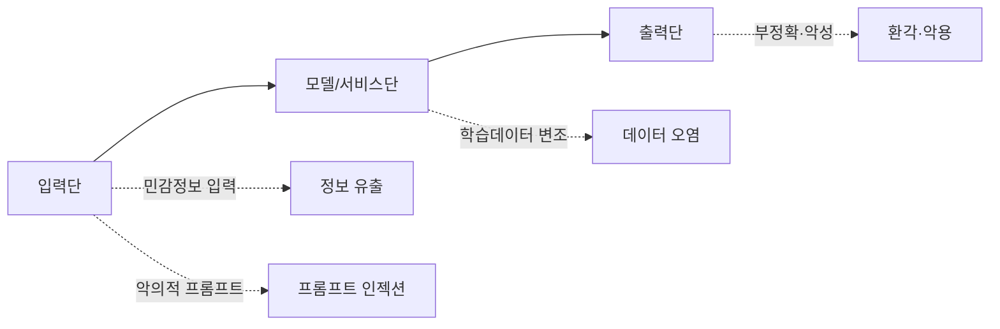

# 생성형 AI 보안 가이드라인 (국가사이버안보센터, 2023.6)

## 1. 개요

### 가. 생성형 AI 개념
> LLM·확산모델(Diffusion) 등으로 학습 데이터의 패턴을 학습해 **텍스트·이미지·음성·코드 등 새로운 콘텐츠를 생성**하는 AI. 국가사이버안보센터가 「챗GPT 등 생성형 AI 활용 보안 가이드라인」을 발간.

### 나. 활용 서비스 사례
| 분야 | 사례 |
|---|---|
| **업무 생산성** | 문서 요약·작성, 번역, 회의록 정리 |
| **개발** | 코드 생성·리뷰, 테스트 자동화 |
| **고객 접점** | 챗봇 상담, FAQ 자동응답 |
| **창작** | 이미지·디자인·마케팅 카피 생성 |

## 2. 보안 위협 종류별 주요 원인·발생 위협

| 위협 | 주요 원인 | 발생 가능 보안위협 |
|---|---|---|
| **정보 유출** | 기밀·개인정보를 프롬프트에 입력 → 학습·로그 저장 | 영업비밀·개인정보 노출, 재현 유출 |
| **프롬프트 인젝션** | 신뢰되지 않은 입력이 시스템 지침 덮어씀 | 지침 우회, 권한 탈취, 데이터 유출 |
| **데이터 오염(Poisoning)** | 학습·RAG 데이터 변조 | 편향·백도어, 오답 유도 |
| **환각(Hallucination)** | 통계적 생성의 사실성 한계 | 오정보 업무 반영, 의사결정 오류 |
| **악용(Misuse)** | 생성 능력의 오용 | 악성코드·피싱·딥페이크 생성 |
| **모델 탈취·역추론** | API 노출·질의 반복 | 모델 복제, 학습데이터 추론 |

## 3. 개발·활용 시 보안 고려사항·대응방안

| 구분 | 보안 고려사항 | 대응 방안 |
|---|---|---|
| **입력** | 민감정보 유입 차단 | 입력 필터링·마스킹, **DLP**, 민감정보 입력 금지 정책 |
| **모델/서비스** | 인젝션·오염 방지 | 프롬프트 격리(시스템/사용자 분리), 입력 검증, 접근통제·로깅, RAG 데이터 검증 |
| **출력** | 유해·부정확 결과 통제 | 출력 필터·검수, 근거 제시, **워터마킹**, 환각 검증 |
| **거버넌스** | 조직 차원 통제 | 이용정책·승인 절차, 임직원 교육, 프라이빗 모델·망분리, 감사 |

## 4. 고려사항 및 시사점
- **기술적 통제 + 이용 정책 + 인적 교육**의 3축 병행 필수
- 민감 업무는 **폐쇄형·온프레미스 LLM**·RAG로 데이터 주권 확보
- EU AI Act·AI 기본법 등 **규제·거버넌스**와 연계, AI 신뢰성 확보
- 공격(적대적 프롬프트)과 방어의 지속적 경쟁 → 레드팀·모니터링 상시화

---

> **한 줄 요약**: 생성형 AI 보안 가이드라인은 *정보유출·프롬프트 인젝션·데이터 오염·환각·악용* 위협을 입력(DLP)·모델(격리·검증)·출력(필터·워터마킹)·거버넌스(정책·교육)로 통제하도록 제시하며, 기술·정책·교육의 3축 병행을 핵심으로 한다.
