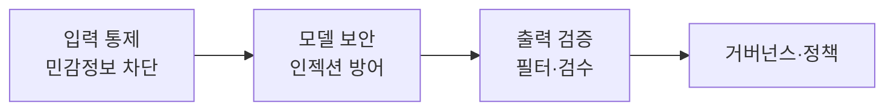

# 생성형 AI 보안 가이드라인 (챗GPT 등 생성형 AI 활용 보안 가이드라인, 2023.6)

## 1. 개요

### 가. 생성형 AI 개념
> LLM·확산모델 등으로 **텍스트·이미지·코드 등 새로운 콘텐츠를 생성**하는 AI. 국가사이버안보센터가 안전 활용 지침 발간.

### 나. 활용 서비스 사례
- **챗봇·문서요약·번역·코드생성·이미지 생성**, 업무 자동화·상담

## 2. 보안 위협 종류·원인

| 위협 | 주요 원인 |
|---|---|
| **정보 유출** | 민감·기밀정보를 프롬프트에 입력 → 학습·저장 |
| **프롬프트 인젝션** | 악의적 입력으로 지침 우회·탈취 |
| **환각·오정보** | 부정확 답변의 업무 반영 |
| **악용** | 악성코드·피싱·딥페이크 생성 |
| **데이터 오염** | 학습데이터 변조(Poisoning) |

## 3. 개발·활용 시 보안 고려사항·대응

| 구분 | 대응 방안 |
|---|---|
| **입력** | 민감정보 입력 금지·필터링, DLP |
| **모델/서비스** | 인젝션 방어, 접근통제, 로깅 |
| **출력** | 결과 검증·필터, 워터마킹 |
| **관리** | 이용정책·교육, 프라이빗 모델·망분리 |

## 4. 시사점
- **이용 정책 수립 + 기술적 통제 + 임직원 교육** 병행 필요

---

> **한 줄 요약**: 생성형 AI 보안 가이드라인은 *정보유출·프롬프트 인젝션·환각·악용* 위협에 대해 입력 차단·모델 보안·출력 검증·거버넌스로 안전한 활용을 제시한다.
