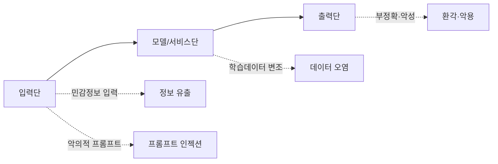

# 생성형 AI 보안 가이드라인

## 1. 개요

### 가. 생성형 AI의 개념
> **생성형 AI(Generative AI)** 는 LLM·확산모델(Diffusion) 등으로 학습 데이터의 패턴을 익혀 **텍스트·이미지·음성·코드 등 새로운 콘텐츠를 스스로 생성**하는 AI다. 국가사이버안보센터는 이러한 서비스의 안전한 활용을 위해 관련 보안 가이드라인을 발간했다.

생성형 AI는 업무 생산성을 획기적으로 높이지만, 기존 IT 시스템과 **위협의 성격이 다르다**. 사용자가 자연어로 입력한 내용이 그대로 모델 학습·로그에 흘러갈 수 있고, 모델이 만들어내는 출력의 정확성을 보장할 수 없기 때문이다. 즉 입력·모델·출력 전 구간에 걸쳐 새로운 공격면이 생기므로, 기존 보안 통제만으로는 부족하고 생성형 AI 특유의 위협에 맞춘 가이드라인이 필요하다.

### 나. 활용 서비스 사례
가이드라인이 필요한 이유는 생성형 AI가 이미 광범위하게 업무에 쓰이고 있기 때문이다. 문서 요약·번역 같은 생산성 업무, 코드 생성·리뷰 같은 개발 업무, 챗봇 상담 같은 고객 접점, 마케팅 창작까지 확산되면서 그만큼 기밀정보가 AI에 노출될 접점도 늘었다.

| 분야 | 사례 |
|---|---|
| **업무 생산성** | 문서 요약·작성, 번역, 회의록 정리 |
| **개발** | 코드 생성·리뷰, 테스트 자동화 |
| **고객 접점** | 챗봇 상담, FAQ 자동응답 |
| **창작** | 이미지·디자인·마케팅 카피 생성 |

## 2. 보안 위협의 종류별 원인과 발생 위협

생성형 AI 위협은 **입력·모델·출력의 세 지점**에서 발생한다는 관점으로 정리하면 이해가 쉽다. **입력단**에서는 사용자가 기밀·개인정보를 프롬프트에 넣으면 그 내용이 학습·로그에 저장되어 재현·유출될 수 있고(정보 유출), 신뢰되지 않은 입력이 시스템 지침을 덮어써 의도한 통제를 우회하는 **프롬프트 인젝션**이 일어난다. **모델단**에서는 학습·RAG 데이터가 변조되면 편향·백도어가 심어지는 **데이터 오염**이, **출력단**에서는 통계적 생성의 본질적 한계인 **환각**과 생성 능력을 악용한 악성코드·딥페이크 생성이 문제가 된다.

| 위협 | 주요 원인 | 발생 가능 보안위협 |
|---|---|---|
| **정보 유출** | 기밀·개인정보를 프롬프트에 입력 → 학습·로그 저장 | 영업비밀·개인정보 노출, 재현 유출 |
| **프롬프트 인젝션** | 신뢰되지 않은 입력이 시스템 지침을 덮어씀 | 지침 우회, 권한 탈취, 데이터 유출 |
| **데이터 오염(Poisoning)** | 학습·RAG 데이터 변조 | 편향·백도어, 오답 유도 |
| **환각(Hallucination)** | 통계적 생성의 사실성 한계 | 오정보의 업무 반영, 의사결정 오류 |
| **악용(Misuse)** | 생성 능력의 오용 | 악성코드·피싱·딥페이크 생성 |
| **모델 탈취·역추론** | API 노출·질의 반복 | 모델 복제, 학습데이터 추론 |

예를 들어 2023년 한 기업에서 개발자가 소스코드를 챗봇에 붙여넣어 검토를 맡겼다가 **기밀 코드가 외부 모델에 유입**된 사고가 알려지면서, 입력단 정보 유출이 가장 현실적인 위협임이 부각되었다.

## 3. 개발·활용 시 보안 고려사항과 대응방안

대응 역시 **입력·모델·출력·거버넌스의 계층별 통제**로 짜는 것이 핵심이다. 입력단에서는 민감정보가 애초에 유입되지 못하도록 필터링·마스킹과 **DLP(데이터 유출 방지)** 를 적용하고 입력 금지 정책을 둔다. 모델단에서는 시스템 프롬프트와 사용자 입력을 격리해 인젝션을 차단하고, RAG 데이터의 무결성을 검증한다. 출력단에서는 결과를 필터·검수하고 근거를 함께 제시하며, 생성물에 워터마킹을 넣어 악용을 추적한다. 이 모든 기술적 통제를 조직 차원의 이용정책·교육이 감싼다.

| 구분 | 보안 고려사항 | 대응 방안 |
|---|---|---|
| **입력** | 민감정보 유입 차단 | 입력 필터링·마스킹, DLP, 민감정보 입력 금지 정책 |
| **모델/서비스** | 인젝션·오염 방지 | 프롬프트 격리(시스템/사용자 분리), 입력 검증, 접근통제·로깅, RAG 데이터 검증 |
| **출력** | 유해·부정확 결과 통제 | 출력 필터·검수, 근거 제시, 워터마킹, 환각 검증 |
| **거버넌스** | 조직 차원 통제 | 이용정책·승인 절차, 임직원 교육, 프라이빗 모델·망분리, 감사 |

## 4. 고려사항 및 시사점
- **기술·정책·인적 통제의 3축 병행**: DLP나 프롬프트 격리 같은 기술 통제만으로는 부족하다. 이용정책과 임직원 교육이 함께 가야 실질적 방어가 된다. 대부분의 정보 유출은 악의보다 부주의에서 오기 때문이다.
- **데이터 주권 확보**: 민감 업무는 외부 상용 API 대신 **폐쇄형·온프레미스 LLM**과 RAG로 구성해 데이터가 조직 밖으로 나가지 않게 한다.
- **규제·거버넌스 연계**: EU AI Act, 국내 AI 기본법 등 규제와 연계해 위험 기반 관리 체계를 갖추고 AI 신뢰성을 확보한다.
- **공방의 상시화**: 적대적 프롬프트 공격은 계속 진화하므로, 레드팀 점검과 모니터링을 상시 운영해 방어를 지속 갱신해야 한다.

---

> **한 줄 요약**: 생성형 AI 보안은 *정보유출·프롬프트 인젝션·데이터 오염·환각·악용* 위협을 입력(DLP)·모델(격리·검증)·출력(필터·워터마킹)·거버넌스(정책·교육)의 계층별로 통제하며, 기술·정책·교육의 3축 병행과 데이터 주권 확보를 핵심으로 한다.
