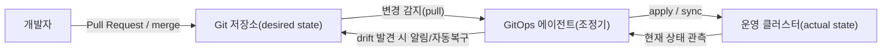
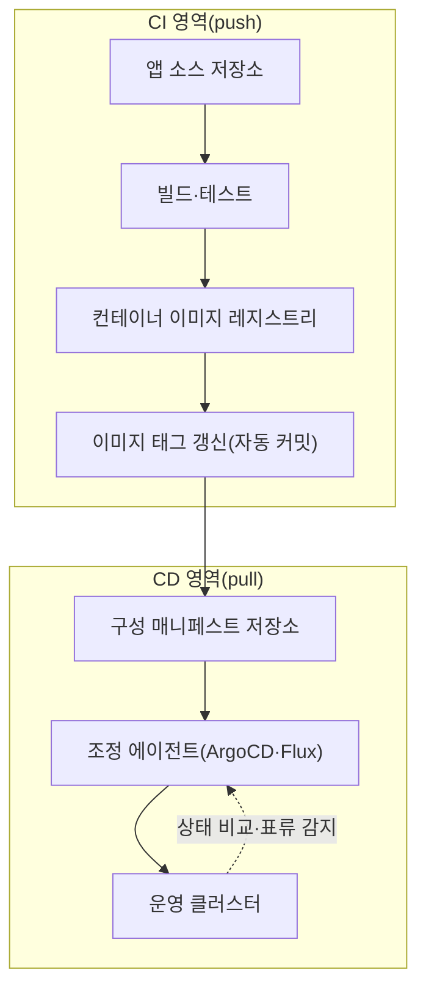

# GitOps(깃옵스) — Git 기반 선언적 운영 모델

## 1. 개요

> **정의**: GitOps는 시스템의 **원하는 상태(desired state)를 Git 저장소에 선언적으로 기술**하고, 실제 운영 환경이 그 선언과 일치하도록 **에이전트가 지속적으로 조정(reconcile)** 하는 운영 모델이다. Git이 배포·구성의 유일한 진실 공급원(Single Source of Truth)이자 변경의 관문 역할을 한다.

전통적인 배포는 운영자가 CI 파이프라인이나 셸에서 `kubectl apply`, `terraform apply` 같은 **명령을 밀어넣는(push) 절차적 방식**이었다.
이 방식은 "누가 언제 무엇을 어떤 순서로 실행했는가"가 파이프라인 로그에 흩어져 남고, 운영자가 콘솔에서 직접 손을 대는 순간 저장소의 코드와 실제 클러스터 상태가 어긋나는 **구성 표류(configuration drift)** 가 발생한다.
클러스터가 수십 개로 늘고 마이크로서비스가 수백 개가 되면, "지금 운영에 실제로 떠 있는 것이 어떤 버전·설정인가"를 아무도 정확히 답하지 못하는 상황에 이른다.

GitOps는 이 문제를 **관점의 전환**으로 해결한다.
배포를 "명령을 실행하는 행위"가 아니라 "저장소에 기술된 목표 상태와 실제 상태의 차이를 좁히는 수렴 과정"으로 재정의하는 것이다.
운영자는 클러스터를 직접 만지지 않고 **Git에 대한 변경(Pull Request와 merge)만** 수행하며, 클러스터 안에서 동작하는 에이전트가 그 변경을 감지해 스스로 실제 상태를 목표에 맞춘다.
그 결과 Git 커밋 이력이 곧 완전한 배포 이력이자 감사 증적이 되고, 되돌리기(rollback)는 이전 커밋으로의 `git revert`로 환원된다.

기술사 답안 관점에서 GitOps는 단순한 "CI/CD 도구 하나"가 아니라, **IaC(코드형 인프라)의 선언성**과 **버전관리·리뷰 문화**, **제어 이론의 폐루프 피드백(closed-loop control)** 을 결합한 운영 패러다임으로 서술해야 한다.

### 1.1 등장 배경과 필요성

첫째, **쿠버네티스의 선언적 API**가 GitOps의 전제를 마련했다.
쿠버네티스는 이미 "원하는 상태를 기술하면 컨트롤러가 현재 상태를 그에 맞춘다"는 조정 루프(reconciliation loop)를 내장하고 있다.
GitOps는 이 조정 루프의 **입력(원하는 상태)을 Git으로 외부화**한 것으로 볼 수 있어, 쿠버네티스 생태계에서 자연스럽게 자리 잡았다.

둘째, **구성 표류와 재현 불가능성** 문제다.
사람이 콘솔에서 긴급 패치를 하고 기록을 남기지 않으면, 재해복구나 클러스터 재구축 시 그 상태를 재현할 수 없다.
GitOps에서는 모든 변경이 Git을 거치므로, 저장소만 있으면 클러스터 전체를 결정론적으로 재구성할 수 있다.

셋째, **보안·거버넌스 요구**다.
운영 클러스터에 대한 광범위한 쓰기 권한을 CI 서버나 다수 개발자에게 부여하는 push 방식은 공격 표면이 넓다.
GitOps의 pull 방식은 클러스터 내부 에이전트가 저장소를 **당겨오기(pull)** 때문에, 외부에서 클러스터 자격증명을 들고 있을 필요가 없어 최소권한 원칙에 부합한다.

## 2. GitOps의 4대 원칙과 조정 루프

Weaveworks가 제시하고 OpenGitOps(CNCF) 커뮤니티가 정리한 GitOps의 4대 원칙은 이 모델의 본질을 압축한다.
단순히 원칙을 나열하는 데 그치지 말고, 각 원칙이 앞서 언급한 표류·재현·보안 문제를 어떻게 해소하는지 연결해 이해해야 한다.

위 그림에서 핵심은 **에이전트가 저장소를 당겨온다**는 화살표 방향과, 클러스터 상태를 되읽어 목표와 비교하는 **폐루프**다.
이 두 특성이 push형 CI/CD와 GitOps를 가르는 결정적 차이다.

첫째, **선언적(Declarative)** 이다.
시스템의 원하는 상태를 "어떻게 만들라"는 절차가 아니라 "무엇이어야 한다"는 결과로 기술한다.
YAML 매니페스트, Helm 차트, Kustomize 오버레이가 대표적이며, 절차적 스크립트와 달리 몇 번을 적용해도 같은 결과가 되는 **멱등성(idempotency)** 을 보장한다.

둘째, **버전관리·불변(Versioned and Immutable)** 이다.
원하는 상태는 Git에 저장되어 모든 변경이 커밋으로 남고, 각 버전은 불변으로 보존된다.
따라서 "언제 누가 왜 바꿨는가"가 커밋 메시지·PR 리뷰에 기록되어 감사성이 확보되고, 특정 시점으로의 복원이 커밋 체크아웃으로 환원된다.

셋째, **자동으로 당겨온다(Pulled Automatically)** 이다.
에이전트가 저장소를 주기적으로 폴링하거나 웹훅으로 감지해 변경을 스스로 가져온다.
외부 시스템이 클러스터에 밀어넣지 않으므로 클러스터 자격증명이 밖으로 새어나갈 필요가 없다.

넷째, **지속적으로 조정한다(Continuously Reconciled)** 이다.
에이전트는 실제 상태를 반복 관측해 목표와의 차이를 감지하고, 사람이 콘솔에서 수동으로 바꿔 표류가 생겨도 이를 탐지해 알리거나 목표 상태로 자동 복구한다.
이 자기 치유(self-healing) 특성이 표류 문제를 근본적으로 억제한다.

| 원칙 | 해결하는 문제 | 구현 수단 |
|------|--------------|-----------|
| 선언적 | 절차의 순서 의존·비멱등성 | YAML·Helm·Kustomize |
| 버전관리·불변 | 재현 불가·감사 부재 | Git 커밋·PR 리뷰·서명 |
| 자동 pull | 자격증명 노출·수동 배포 | 클러스터 내 에이전트 |
| 지속 조정 | 구성 표류·수동 변경 | 조정 루프·자동 복구 |

## 3. 아키텍처와 배포 전략

GitOps 아키텍처는 보통 **애플리케이션 소스 저장소**와 **구성(매니페스트) 저장소**를 분리한다.
소스 저장소의 CI가 컨테이너 이미지를 빌드·테스트해 레지스트리에 올리고 태그를 갱신하면, 그 이미지 태그를 구성 저장소의 매니페스트에 반영(자동 커밋)한다.
그러면 배포 담당 에이전트가 구성 저장소의 변경을 감지해 클러스터에 반영한다.
이처럼 **CI(빌드·검증)와 CD(배포·조정)를 저장소 경계로 분리**하는 것이 GitOps의 전형적 구조다.

대표 도구로 **Argo CD**와 **Flux**가 있으며 둘 다 CNCF 졸업(Graduated) 프로젝트다.
Argo CD는 애플리케이션 상태를 시각화하는 웹 UI와 다중 클러스터 관리가 강점이고, Flux는 GitOps Toolkit 기반의 경량·모듈형 컨트롤러와 헬름·이미지 자동화가 강점이다.
어느 쪽이든 핵심 동작 원리(Git을 목표로, 클러스터를 실제로 보고 조정)는 동일하다.

배포 전략 측면에서 GitOps는 **점진적 배포(progressive delivery)** 와 결합해 위험을 통제한다.
카나리(canary)·블루그린(blue-green) 배포를 매니페스트로 선언하고, Argo Rollouts나 Flagger 같은 컨트롤러가 지표(오류율·지연)를 관찰하며 트래픽을 단계적으로 옮긴다.
예컨대 신규 버전에 트래픽 5%를 먼저 흘려 5분간 오류율이 임계치를 넘지 않으면 25%→50%→100%로 확대하고, 초과하면 자동으로 이전 커밋 상태로 롤백하는 식이다.
이때 롤백이 "이전 이미지로 되돌리는 별도 절차"가 아니라 **Git 되돌리기(revert)** 라는 점이 GitOps의 운영상 이점이다.

## 4. Push형 CI/CD와의 비교

GitOps를 정확히 이해하려면 기존 push형 파이프라인과의 차이를 **차이가 생기는 이유**까지 짚어야 한다.
두 방식은 배포의 주체와 방향, 신뢰 경계가 근본적으로 다르다.

| 구분 | 전통적 Push CI/CD | GitOps(Pull) |
|------|-------------------|--------------|
| 배포 주체 | 외부 CI 서버가 클러스터에 apply | 클러스터 내 에이전트가 pull·조정 |
| 진실 공급원 | 파이프라인 스크립트·수동 조작 | Git 저장소(선언적 상태) |
| 자격증명 | CI가 클러스터 쓰기 권한 보유 | 에이전트만 내부 권한, 외부 노출 없음 |
| 표류 대응 | 감지·복구 수단 없음 | 지속 조정으로 자동 감지·복구 |
| 롤백 | 별도 파이프라인 재실행 | `git revert`로 즉시 환원 |
| 감사성 | 로그 분산·불완전 | 커밋 이력이 곧 완전한 배포 이력 |

차이의 핵심은 **신뢰 경계의 위치**다.
push 방식은 클러스터 자격증명이 CI 시스템에 상주하므로, CI가 침해되면 운영 전체가 위험해진다.
GitOps는 자격증명이 클러스터 안에만 있고 방향이 안에서 밖으로 당겨오는 형태라, 외부에서 클러스터를 직접 조작할 통로 자체가 없어진다.
또한 push 방식은 배포 후 사람이 콘솔을 만지면 표류를 막을 장치가 없지만, GitOps는 조정 루프가 상시 동작하므로 표류가 곧 원상 복구된다.
다만 GitOps가 모든 상황에 우월한 것은 아니어서, DB 스키마 마이그레이션처럼 순서와 상태 전이가 중요한 **비멱등·명령형 작업**은 별도 절차나 마이그레이션 도구로 보완해야 한다.

## 5. 심화 — 도입 시 실무 과제와 최신 동향

**첫째, 시크릿 관리 문제**다.
매니페스트를 Git에 평문으로 두면 비밀번호·토큰이 노출되므로, Sealed Secrets(암호화된 형태로 커밋 후 클러스터에서만 복호화), External Secrets Operator(Vault·클라우드 시크릿 저장소 연동), SOPS 등을 함께 설계해야 한다.
"모든 것을 Git에"라는 원칙과 "비밀은 Git에 두지 않는다"는 보안 요구를 조화시키는 것이 실무의 핵심 난제다.

**둘째, 표류의 관측 가능성**이다.
자동 복구가 항상 바람직한 것은 아니어서, 장애 대응 중 엔지니어가 의도적으로 한 임시 변경까지 에이전트가 되돌려 혼란을 줄 수 있다.
따라서 자동 동기화(auto-sync)와 수동 승인, 동기화 창(sync window)을 상황에 맞게 설계해야 한다.

**셋째, 다중 클러스터·다중 테넌트 확장**이다.
수십 개 클러스터에 공통 구성과 환경별 차이를 동시에 관리하려면 Kustomize 오버레이, Helm 값 분리, App-of-Apps 패턴, ApplicationSet 등으로 구성의 중복을 줄이는 설계가 필요하다.

최신 동향으로는 **정책 기반 거버넌스와의 결합**이 두드러진다.
OPA/Gatekeeper·Kyverno 같은 정책 엔진을 조정 파이프라인에 넣어, 승인되지 않은 이미지나 보안 정책 위반 매니페스트는 배포 전에 차단한다.
또한 **소프트웨어 공급망 보안**과 맞물려, 커밋 서명(Sigstore·cosign)과 이미지 서명 검증을 GitOps 흐름에 통합해 "배포되는 것이 검증된 산출물인가"를 보증하려는 흐름이 강화되고 있다.
나아가 애플리케이션뿐 아니라 클러스터·클라우드 인프라 자체를 GitOps로 관리하는 **Crossplane 기반 컨트롤 플레인**, 관측성(Observability)과 결합해 조정 결과와 표류를 대시보드로 추적하는 방향으로 성숙하고 있다.

## 6. 고려사항 및 시사점 (기술사 관점)

- **적용 전략**: 처음부터 전면 자동 복구를 켜기보다, 표류 탐지·알림(read-only) 단계에서 시작해 조직이 GitOps 흐름에 익숙해진 뒤 자동 동기화로 확대하는 **점진적 채택**이 안전하다. 소스와 구성 저장소 분리, 환경별 브랜치·디렉터리 전략을 초기에 확립해야 한다.
- **트레이드오프**: 모든 변경이 Git·PR을 거치므로 긴급 장애 시 **속도가 저하**될 수 있다. 이를 위해 승인 완화용 긴급 경로(break-glass)와 그 사후 감사 절차를 함께 설계해, 통제와 신속성의 균형을 맞춰야 한다.
- **보안·거버넌스**: 클러스터 자격증명 외부화 제거, 커밋·이미지 서명, 정책 엔진 결합으로 GitOps는 공급망 보안(SBOM·DevSecOps)과 자연스럽게 연결된다. Git 저장소 자체가 최상위 공격 표적이 되므로 저장소 접근통제·서명·보호 브랜치가 필수다.
- **조직·문화**: GitOps는 도구 도입이 아니라 "운영을 코드 리뷰로 한다"는 **협업 문화의 전환**이다. 개발·운영·보안이 동일한 저장소에서 협업하므로 DevOps·SRE·플랫폼 엔지니어링과 결합할 때 효과가 극대화된다.
- **전망 및 연계**: 쿠버네티스를 넘어 클라우드 인프라·엣지·AI 파이프라인까지 선언적 조정 모델이 확장되는 추세다. IaC·플랫폼 엔지니어링·정책형 거버넌스와 결합해 **자율 운영(autonomous operations)** 의 기반 인프라로 자리 잡을 것으로 전망된다.

---

> **한 줄 요약**: GitOps는 원하는 상태를 Git에 선언적으로 저장하고 클러스터 내 에이전트가 실제 상태를 지속적으로 조정(pull·self-healing)하는 운영 모델로, 표류 억제·완전한 감사성·자격증명 최소노출·`git revert` 롤백을 통해 안전하고 재현 가능한 배포를 실현한다.
