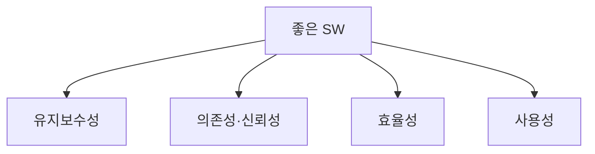

# 좋은 소프트웨어가 갖추어야 할 4가지 특성

## 1. 개요

### 가. 정의
> 좋은 소프트웨어란 사용자의 기능 요구를 충족시키는 것에 더해, **유지보수성(Maintainability)·의존성(Dependability)·효율성(Efficiency)·사용성(Usability)** 이라는 네 가지 품질 특성을 균형 있게 갖춘 소프트웨어다(I. Sommerville).

여기서 핵심은 "요구된 기능을 구현했다"는 것과 "좋은 소프트웨어다"라는 판단이 **서로 다른 차원**이라는 점이다. 기능은 인수 시점의 최소 조건일 뿐이고, 소프트웨어의 실제 가치는 인도 이후 수년에 걸친 **운영·변경·확장** 과정에서 결정된다. 그래서 Sommerville은 기능 명세로 환원되지 않는 비기능적 품질, 즉 변화를 얼마나 잘 수용하는가(유지보수성), 얼마나 믿고 맡길 수 있는가(의존성), 자원을 얼마나 아끼는가(효율성), 얼마나 쉽게 쓰는가(사용성)를 좋은 소프트웨어의 축으로 제시했다.

### 나. 등장 배경 및 필요성
소프트웨어 비용의 대부분은 개발이 아니라 **유지보수**에서 발생한다. 통상 생명주기 총비용의 60% 이상이 인도 이후 결함 수정·기능 개선·환경 이전에 쓰이며, 요구는 끊임없이 바뀐다. 초기 개발 속도만 좇아 구조를 희생하면 이후 변경 한 번의 비용이 기하급수로 커지는 **기술부채(Technical Debt)** 가 쌓인다. 또한 금융·의료처럼 장애가 곧 손실·인명 위험으로 이어지는 영역에서는 신뢰가 무너지면 제품 자체가 무의미해진다. 좋은 소프트웨어의 4대 특성은 이처럼 **장기적 가치와 위험**을 관리하기 위해, 눈에 보이지 않지만 비용을 좌우하는 품질을 명시적으로 관리 대상으로 끌어올린 개념이다.

## 2. 4대 특성

**가. 유지보수성(Maintainability)** 은 변화하는 요구와 환경에 맞춰 소프트웨어를 **수정·진화**시키기 쉬운 정도다. 소프트웨어는 물리적으로 마모되지 않지만, 세상이 바뀌면서 "낡아간다". 규제가 바뀌고 요금 정책이 바뀌면 코드도 따라 바뀌어야 하는데, 이때 특정 부분을 고쳤을 때 다른 부분이 연쇄적으로 깨지지 않아야 유지보수성이 높다고 말한다. 결합도가 낮고 응집도가 높은 모듈 구조가 그 토대다.

**나. 의존성·신뢰성(Dependability)** 은 사용자가 소프트웨어를 **믿고 맡길 수 있는가**를 포괄하는 특성으로, 신뢰성(정상 동작 지속)·가용성(필요할 때 사용 가능)·안전성(장애 시에도 위해 없음)·보안성(공격에 대한 방어)을 아우른다. 예컨대 온라인 뱅킹은 계좌 이체가 어쩌다 한 번 틀려도 안 되고(신뢰성), 점검 중이라 안 되면 안 되며(가용성), 계좌 정보가 새면 안 된다(보안성). 의존성은 이처럼 여러 하위 속성의 총합이며, 가장 약한 고리가 전체 신뢰를 결정한다.

**다. 효율성(Efficiency)** 은 CPU·메모리·저장공간·네트워크·응답시간 등 **자원을 낭비하지 않는** 정도다. 다만 효율성은 절대선이 아니라 목표 대비 상대적 개념이다. 같은 응답시간을 두 배의 서버로 달성한다면 클라우드 요금이 두 배가 되므로, 효율성은 곧 운영비와 사용자 체감 성능으로 직결된다. 예를 들어 O(n²) 정렬을 O(n log n)으로 바꾸면 데이터가 백만 건일 때 처리시간이 수백 배 줄어든다.

**라. 사용성(Usability)** 은 **대상 사용자**가 배우기 쉽고 실수 없이 편리하게 쓸 수 있는 정도다. 여기서 "대상 사용자"가 중요한데, 전문 트레이더용 단말과 고령층 대상 공공 앱은 좋은 사용성의 기준 자체가 다르다. 아무리 기능이 뛰어나도 사용자가 원하는 작업에 도달하지 못하면 그 기능은 존재하지 않는 것과 같다.

| 특성 | 설명 | 실패 시 증상 |
|---|---|---|
| 유지보수성 | 변화에 맞춰 수정·진화 용이 | 작은 변경에도 광범위 파급·회귀 결함 |
| 의존성·신뢰성 | 신뢰·가용·안전·보안 | 장애·데이터 유출·오작동 |
| 효율성 | 자원 낭비 없음 | 느린 응답·과도한 인프라 비용 |
| 사용성 | 배우기 쉽고 편리 | 학습 곤란·조작 실수·이탈 |

## 3. 품질 표준과의 연계 (ISO/IEC 25010)

Sommerville의 4대 특성은 학술적 개념이라 그대로는 측정하기 어렵다. 이를 **정량 측정·계약·감리**가 가능한 형태로 표준화한 것이 ISO/IEC 25010 제품 품질 모델이며, 8개 품질특성과 하위 특성으로 4대 특성을 구체화한다. 즉 25010은 "좋은 소프트웨어"라는 정성적 목표를 지표로 환원하는 다리 역할을 한다.

| 25010 품질특성 | 대응하는 4대 특성 |
|---|---|
| 유지보수성(모듈성·재사용성·분석성·수정성·시험성) | 유지보수성 |
| 신뢰성·보안성·안전성 | 의존성 |
| 성능효율성(시간반응·자원사용·용량) | 효율성 |
| 사용성(학습성·운용성·접근성 등) | 사용성 |
| 기능적합성·호환성·이식성 | 확장 관점 |

## 4. 확보 방안

각 특성은 개발 후반에 검사만으로 붙일 수 없고, **설계·구현·검증 전 단계에 걸쳐 내재화**해야 한다. 유지보수성은 모듈화와 낮은 결합·높은 응집, 명확한 인터페이스와 문서화·정적분석으로 확보한다. 의존성은 충분한 테스트와 결함허용(Fault Tolerance) 설계, 보안 시큐어코딩·이중화로 확보한다. 효율성은 자료구조·알고리즘 선택과 아키텍처 최적화, 프로파일링·성능 테스트로 확보한다. 사용성은 UX 설계 원칙·접근성 지침(WCAG)·실사용자 테스트로 확보한다.

| 특성 | 확보 방안 |
|---|---|
| 유지보수성 | 모듈화·낮은 결합/높은 응집, 코드 컨벤션·문서화·정적분석 |
| 의존성 | 테스트 자동화·결함허용·이중화·시큐어코딩 |
| 효율성 | 알고리즘·아키텍처 최적화, 프로파일링·성능 테스트 |
| 사용성 | UX 설계·접근성(WCAG)·사용자 테스트 |

## 5. 고려사항 및 시사점
네 특성은 독립적이지 않고 종종 **상충(트레이드오프)** 한다. 극단적 효율을 위해 저수준으로 최적화하면 코드가 난해해져 유지보수성이 떨어지고, 강력한 보안 절차는 사용성을 해칠 수 있다. 기술사 관점의 핵심은 어느 하나를 극대화하는 것이 아니라, **시스템의 성격에 따라 우선순위를 정하고 균형점을 설계**하는 것이다. 안전-필수 시스템은 의존성을, 대중 서비스는 사용성을, 대규모 트래픽 서비스는 효율성을 앞세우는 식이다. 또한 품질은 후반 보강이 아니라 **설계 단계에서 내재화(Quality by Design)** 해야 비용이 최소화되며, ISO/IEC 25010 지표로 정량 측정·추적해 지속 관리해야 한다.

---

> **한 줄 요약**: 좋은 소프트웨어는 *유지보수성·의존성(신뢰성)·효율성·사용성* 을 균형 있게 갖춰야 하며, 이 특성들은 서로 트레이드오프하므로 시스템 성격에 맞는 우선순위로 설계 단계에서 내재화하고 ISO/IEC 25010으로 정량 관리한다.
