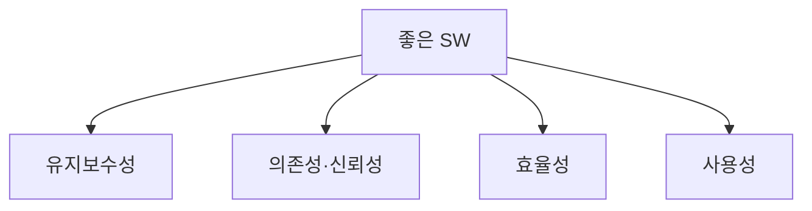

# 좋은 소프트웨어가 갖추어야 할 4가지 특성

## 1. 개요

### 가. 정의
> 좋은 소프트웨어는 사용자 요구를 만족시키면서 **유지보수성·의존성·효율성·사용성**을 갖춘 소프트웨어(Sommerville). 품질 특성으로 구체화된다.

### 나. 필요성
- 요구 만족뿐 아니라 **변화 수용·신뢰·효율·편의**가 장기 가치 결정

## 2. 4대 특성

| 특성 | 설명 |
|---|---|
| **유지보수성(Maintainability)** | 변화하는 요구에 맞춰 **수정·진화**가 용이 |
| **의존성·신뢰성(Dependability)** | 신뢰성·가용성·안전성·보안성 — 믿고 쓸 수 있음 |
| **효율성(Efficiency)** | 자원(CPU·메모리·응답시간)을 낭비하지 않음 |
| **사용성(Usability)** | 대상 사용자가 배우기 쉽고 사용이 편리 |

## 3. 품질 표준과의 연계 (ISO/IEC 25010)

| 25010 품질특성 | 대응 |
|---|---|
| 유지보수성 | 유지보수성 |
| 신뢰성·보안성·안전 | 의존성 |
| 성능효율성 | 효율성 |
| 사용성 | 사용성 |
| (기능적합성·호환성·이식성) | 확장 관점 |

## 4. 확보 방안

| 특성 | 방안 |
|---|---|
| **유지보수성** | 모듈화·낮은 결합/높은 응집, 문서화 |
| **의존성** | 테스트·결함허용·보안 설계 |
| **효율성** | 알고리즘·아키텍처 최적화, 성능 테스트 |
| **사용성** | UX 설계·접근성·사용자 테스트 |

## 5. 고려사항 및 시사점
- 특성 간 **트레이드오프**(효율 vs 유지보수) 균형
- 품질은 후반 보강이 아닌 **설계 단계 내재화**(Quality by Design)
- ISO/IEC 25010 품질 모델로 정량 측정·관리

---

> **한 줄 요약**: 좋은 소프트웨어는 *유지보수성·의존성(신뢰성)·효율성·사용성* 을 갖춰야 하며, 모듈화·테스트·최적화·UX 설계로 확보하고 ISO/IEC 25010 품질모델로 관리한다.
