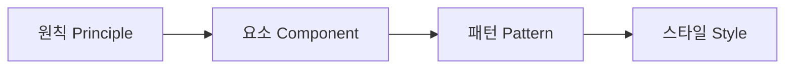
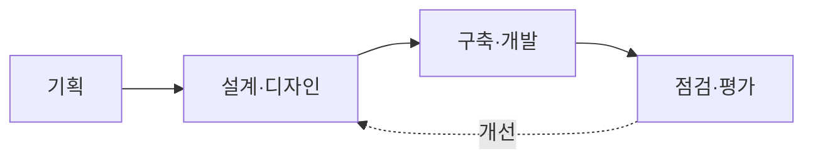

# 디지털 정부서비스 UI/UX 가이드라인 (2024.2, 행정안전부)

## 1. 개요

### 가. 정의 및 목적
> 중앙행정기관·지자체·공공기관이 제공하는 디지털 서비스(웹·앱)의 **UI/UX 품질을 일관되게 향상**시키기 위해 준수해야 할 원칙과 세부 설계사항을 정리한 행정안전부의 기준. **국민 누구나 쉽고 차별 없이 이용**할 수 있는 서비스 구현을 목표로 한다.

### 나. 등장 배경 및 필요성
그동안 공공 디지털 서비스는 부처·기관별로 따로 발주·구축되어 왔기 때문에, 같은 정부 서비스인데도 화면 구성·용어·인증 절차가 제각각이어서 국민이 매번 새로 학습해야 하는 부담이 컸다. 또 고령자·저시력자·장애인 같은 **디지털 취약계층**은 접근성이 확보되지 않은 화면 앞에서 서비스 자체를 이용하지 못하는 정보격차 문제가 심각했다. 이 가이드라인은 이런 **파편화와 접근성 결핍**을 해소하기 위해, 범정부가 공유하는 공통 설계 기준과 재사용 가능한 컴포넌트를 제시함으로써 국민에게는 일관된 경험을, 기관에는 개발 효율과 품질 상향을 동시에 제공하려는 취지에서 마련되었다.

가이드라인이 지향하는 핵심 가치는 네 가지다. **일관성**은 어느 기관 서비스든 익숙한 방식으로 쓰게 하고, **포용성·접근성**은 디지털 약자를 배려하며, **사용자 중심**은 공급자 편의가 아닌 국민 관점에서 설계하고, **신뢰성**은 공공 서비스에 걸맞은 안정감을 준다.

## 2. 가이드라인의 구조(구성 요소)

가이드라인은 추상적 방향에서 구체적 시각 규칙으로 내려가는 **4계층 구조**를 갖는다. 이렇게 층을 나눈 이유는, 상위의 원칙이 하위의 요소·패턴·스타일로 일관되게 관철되도록 하여 설계자가 자의적으로 판단하지 않고도 통일된 결과를 내도록 하기 위해서다.

가장 위의 **원칙(Principle)** 은 "사용자 중심·일관성·접근성·신뢰" 같은 판단 기준을 제시한다. 그 아래 **요소(Component)** 는 버튼·입력창·내비게이션처럼 화면을 이루는 공통 UI 부품을, **패턴(Pattern)** 은 검색·신청·인증처럼 여러 서비스에서 반복되는 화면 흐름의 표준 설계를, 맨 아래 **스타일(Style)** 은 색상·타이포그래피·아이콘 같은 시각 표현 규칙을 정의한다. 예컨대 "접근성"이라는 원칙은 요소 계층에서 "버튼은 충분한 크기와 명도 대비 확보"로, 스타일 계층에서 "본문 대비 4.5:1 이상"이라는 구체 수치로 구현된다.

| 구성 | 내용 | 역할 |
|---|---|---|
| **원칙(Principle)** | 사용자 중심·일관성·접근성·신뢰 | 설계 판단의 기준 |
| **요소(Component)** | 버튼·입력·내비게이션 등 UI 부품 | 재사용 단위 |
| **패턴(Pattern)** | 검색·신청·인증 등 반복 화면 흐름 | 표준 설계 템플릿 |
| **스타일(Style)** | 색상·타이포·아이콘 등 시각 규칙 | 일관된 외형 |

## 3. 적용 대상 및 기준

적용 대상은 중앙행정기관·지자체·공공기관이 운영하는 웹·앱 디지털 서비스 전반이다. 준수 기준의 핵심은 **웹 접근성(KWCAG, 한국형 웹 콘텐츠 접근성 지침)** 이다. 이는 단순 권고가 아니라 뒤에서 보듯 법적 의무와 연결되며, 대체 텍스트·키보드 조작·명도 대비 같은 항목을 통해 화면을 보지 못하거나 마우스를 쓰기 어려운 사용자도 서비스를 이용할 수 있게 한다.

| 구분 | 내용 |
|---|---|
| **대상** | 중앙행정기관·지자체·공공기관의 웹·앱 서비스 |
| **기준** | 웹 접근성(KWCAG)·반응형·모바일 우선, 공통 컴포넌트 준수 |
| **접근성** | 저시력·고령자 등 디지털 취약계층 배려(대체텍스트·키보드 접근·명도 대비) |

특히 **모바일 우선(Mobile-First)·반응형** 을 기준으로 삼은 것은, 다수 국민이 PC보다 스마트폰으로 공공 서비스에 접근하는 현실을 반영한 것이다. 화면 크기에 따라 레이아웃이 유연하게 재배치되어야 어떤 기기에서도 동일한 서비스 품질을 보장할 수 있다.

## 4. 활용 방법(적용 프로세스)

가이드라인은 특정 단계에서만 참고하는 문서가 아니라 **서비스 생애주기 전 단계에 걸쳐 적용**된다. 기획 단계에서는 사용자 여정과 패턴을 정의하고, 설계·디자인 단계에서는 공통 컴포넌트와 스타일을 재사용하며, 구축 단계에서는 접근성 기준을 코드에 반영하고, 점검·평가 단계에서는 체크리스트와 사용성 평가로 준수 여부를 확인한다. 평가 결과는 다시 설계로 환류되어 개선이 반복되는 순환 구조를 이룬다.

이때 **공통 컴포넌트의 재사용**은 단순한 효율을 넘어선 의미를 갖는다. 이미 접근성·사용성이 검증된 부품을 가져다 쓰면 기관마다 품질을 새로 확보할 필요가 없어, 개발 생산성과 품질 하한선을 동시에 끌어올리는 **디자인 시스템**으로 기능한다. 이는 유지보수 시에도 컴포넌트 하나만 개선하면 이를 쓰는 모든 서비스에 반영되는 이점이 있다.

## 5. 고려사항 및 시사점
- **단계적 적용 전략**: 이미 운영 중인 기존 서비스는 한 번에 바꾸기 어려우므로, 리뉴얼·개편 시점에 맞춰 점진적으로 반영하는 현실적 접근이 필요하다.
- **법적 의무와의 연계**: 웹 접근성은 장애인차별금지법에 근거한 의무 사항으로, 가이드라인 준수는 규제 리스크 관리와 직결된다. 접근성을 사후 보완이 아닌 설계 초기부터 내재화(Accessibility by Design)해야 비용을 줄일 수 있다.
- **범정부 디자인 시스템으로의 발전**: 이 가이드라인은 개별 지침을 넘어 공유 컴포넌트 라이브러리·디자인 토큰 형태의 디자인 시스템으로 확장되어, 국민 경험의 일관성과 정부의 개발 효율을 함께 높이는 인프라로 자리 잡고 있다.

---

> **한 줄 요약**: 이 가이드라인은 *원칙·요소·패턴·스타일* 4계층 구조로 공공 디지털 서비스의 UI/UX 품질과 접근성(KWCAG)을 일관되게 확보하도록, 기획부터 점검·평가까지 전 단계에 공통 컴포넌트 재사용을 적용하는 범정부 기준이며 접근성 법적 의무와 연계된다.
