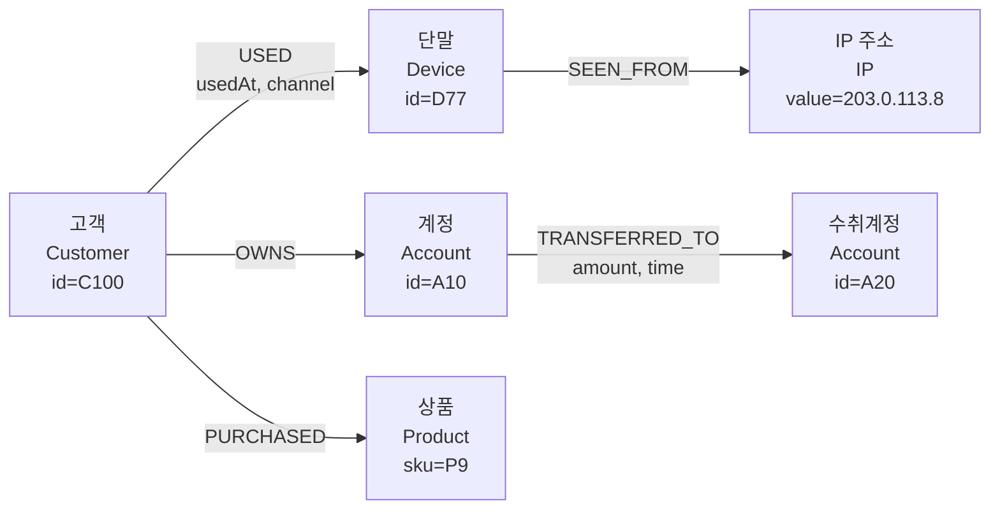
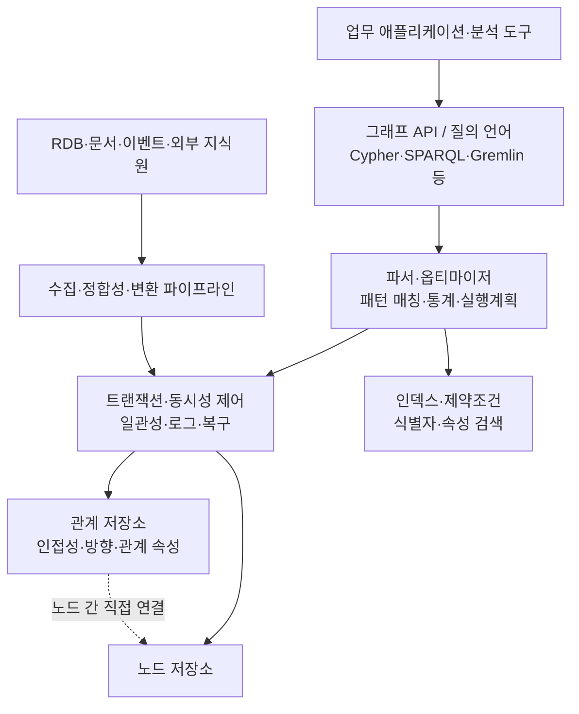

# 그래프 데이터베이스(Graph Database)와 프로퍼티 그래프·RDF 모델

## 1. 개요

> **정의**: 그래프 데이터베이스는 데이터를 독립적인 행과 열의 집합보다 **노드(Node), 관계(Edge 또는 Relationship), 속성(Property)**으로 표현하고, 관계를 저장 구조의 핵심으로 삼아 연결·경로·패턴을 효율적으로 질의하는 데이터베이스이다.

관계형 데이터베이스는 엔터티를 테이블에 저장하고 테이블 사이의 관계를 외래키와 `JOIN`으로 복원한다. 이 방식은 정형 데이터의 무결성·집계·트랜잭션에 매우 강하지만, 연결의 깊이가 깊어지거나 관계의 종류가 계속 늘어나는 문제에서는 질의가 복잡해질 수 있다. 사람과 계정, 계정과 거래, 거래와 단말, 단말과 IP 주소가 여러 단계로 연결된 사기 탐지 문제를 생각하면, 핵심 질문은 각 테이블의 값보다 “어떤 경로로 연결되어 있는가”가 된다.

그래프 데이터베이스는 이 연결을 조회 시점에 매번 조인으로 만들어 내기보다, 노드와 관계를 저장 시점부터 함께 관리한다. 따라서 “A에서 B로 갈 수 있는가”, “두 고객이 몇 단계의 공통 관계를 갖는가”, “특정 거래가 이미 알려진 공격 집단과 연결되는가”와 같은 경로 중심 질문을 자연스럽게 표현할 수 있다. 그래프의 장점은 모든 질의가 자동으로 빠르다는 뜻이 아니라, 관계의 탐색 폭과 깊이가 중요한 문제에 데이터 모델과 실행 방식이 잘 맞는다는 뜻이다.

그래프 데이터베이스가 주목받은 배경에는 데이터의 연결성 증가가 있다. 소셜 네트워크, 공급망, 통신망, 지식 그래프, 추천 시스템, 금융 거래망에서는 데이터 자체보다 데이터 사이의 관계가 업무 의미를 결정한다. 관계가 새로운 업무 규칙으로 계속 추가되는 환경에서는 테이블을 계속 분해하고 조인하는 것보다, 도메인 객체와 관계를 그래프로 직접 모델링하는 방식이 변경에 유연할 수 있다.

다만 그래프 데이터베이스가 관계형 데이터베이스를 전면 대체하는 것은 아니다. 대규모 정산 집계, 엄격한 행·열 스키마, 복잡한 숫자 분석, 범용 SQL 도구 연계가 핵심인 업무에는 관계형 모델이 더 적합할 수 있다. 기술사는 관계의 복잡도, 질의의 깊이, 일관성 요구, 분석 패턴, 운영 인력과 생태계를 종합하여 그래프를 단독·보조·폴리글랏 방식 중 하나로 선택해야 한다.

이 노트의 범위는 그래프 데이터베이스의 기본 구조, 프로퍼티 그래프와 RDF 그래프의 차이, 모델링·질의·분석 원리, 관계형 데이터베이스와의 비교, 산업 사례 및 기술사 관점의 도입 고려사항이다.

## 2. 그래프 데이터 모델과 전체 구조

그래프 \(G\)는 정점 집합 \(V\)와 간선 집합 \(E\)의 쌍 \(G=(V,E)\)로 생각할 수 있다. 노드는 사람·상품·계정·문서·장소 같은 엔터티를 나타내며, 관계는 노드 사이의 의미 있는 연결을 나타낸다. 노드와 관계에 속성을 부여하면 “고객 A가 단말 X를 사용했다”, “상품 P가 카테고리 C에 속한다”처럼 도메인 사실을 직접 표현할 수 있다.

프로퍼티 그래프에서는 노드에 하나 이상의 레이블을 붙이고, 관계에 방향과 유형을 부여한다. 예를 들어 `Customer` 노드와 `Device` 노드 사이에 `USED` 관계를 두고 `usedAt`, `channel`, `riskScore` 같은 속성을 관계에 둘 수 있다. 관계 자체가 업무 사실이므로 관계에 속성을 둘 수 있다는 점이 단순한 인접 리스트와 다르다.



위 구조에서 고객·단말·계정·상품·IP 주소는 노드이고, `USED`, `OWNS`, `TRANSFERRED_TO` 등은 관계 유형이다. `amount`와 `time`은 수취계정 노드의 속성이 아니라 송금 관계의 속성이다. 이 구분을 잘못하면 시간에 따라 변하는 관계 사실을 노드에 덮어쓰게 되어 이력과 감사성이 사라진다.

**노드**는 식별자, 레이블, 속성의 집합으로 구성된다. 식별자는 업무 키 또는 시스템 내부 키일 수 있으며, 여러 시스템의 키를 그래프 하나로 통합할 때는 전역 유일성·키 충돌·재사용 여부를 결정해야 한다. 레이블은 노드의 역할을 나타내고 인덱스·제약조건의 범위를 정하는 데 활용된다.

**관계**는 시작 노드와 종료 노드를 연결하며, 일반적으로 방향·유형·속성을 가진다. 업무적으로 방향이 없는 관계라도 저장 시에는 일관된 방향을 정하고 양방향 탐색을 허용하는 방식으로 다루는 편이 운영에 유리하다. 방향을 임의로 혼용하면 동일한 의미의 연결이 두 종류로 중복 저장되어 경로 질의 결과가 달라질 수 있다.

**속성**은 노드나 관계에 붙는 키-값 데이터다. 속성은 검색 조건·정렬 조건·점수 계산에 사용되므로 데이터 타입을 명확히 해야 한다. 날짜를 문자열로 저장하거나 금액 단위를 레코드마다 다르게 저장하면 그래프 순회 자체는 성공하더라도 분석 결과의 신뢰성이 무너진다.

그래프 데이터베이스의 내부 구현은 제품마다 다르지만, 논리적으로는 카탈로그·인덱스·노드 저장소·관계 저장소·쿼리 엔진·트랜잭션 계층으로 나누어 이해할 수 있다. 관계를 인접한 형태로 빠르게 따라갈 수 있도록 저장하는 네이티브 그래프 엔진이 있는 반면, 관계형 저장소 위에 그래프 질의 계층을 제공하는 멀티모델 데이터베이스도 있다.



질의 처리에서 인덱스는 시작 노드를 찾는 비용을 줄이고, 관계 저장소는 찾은 노드에서 다음 노드로 이동하는 비용을 줄인다. 따라서 그래프 질의는 “어디서 시작할 것인가”와 “어떤 관계를 몇 단계 탐색할 것인가”를 분리해 설계해야 한다. 시작점이 불명확한 전수 순회는 인덱스가 있어도 비용이 커질 수 있다.

관계형 조인과 네이티브 그래프 탐색의 차이는 저장 구조의 목적에서 나온다. 관계형 조인은 각 테이블의 행을 조건에 맞춰 결합하는 반면, 그래프 탐색은 현재 노드의 인접 관계를 따라 다음 노드 집합을 확장한다. 그렇기 때문에 그래프는 경로 길이가 짧고 선택도가 높은 질의에 강하며, 대규모 전체 집계에는 별도의 분석 엔진이나 컬럼형 저장소가 더 적합할 수 있다.

## 3. 프로퍼티 그래프와 RDF 그래프

그래프 데이터베이스를 설계할 때 가장 먼저 결정할 것은 그래프의 의미 모델이다. 실무 제품에서 널리 쓰이는 모델은 프로퍼티 그래프이며, 웹 표준·지식 표현·데이터 통합에서는 RDF 그래프가 중요하다. 둘 다 노드와 연결을 표현하지만, 식별·속성·의미론·질의 방식이 다르므로 동일한 것으로 취급해서는 안 된다.

### 가. 프로퍼티 그래프

프로퍼티 그래프는 노드와 관계 양쪽에 키-값 속성을 둘 수 있는 모델이다. 노드에는 레이블을, 관계에는 유형과 방향을 부여하여 애플리케이션 도메인의 객체 구조를 직관적으로 표현한다. 예를 들어 `(:Person {id:'P1'})-[:WORKS_AT {since:2020}]->(:Company {id:'C1'})`은 사람·회사·재직 시작일을 하나의 관계 패턴으로 표현한다.

프로퍼티 그래프는 도메인 탐색과 경로 분석을 빠르게 시작할 수 있다는 장점이 있다. 관계에 `since`, `weight`, `status`를 넣으면 동일한 두 노드 사이의 여러 업무 사건을 구별할 수 있다. 그러나 속성 이름과 의미론이 조직마다 달라질 수 있으므로, 레이블·관계 유형·속성 타입을 데이터 표준으로 관리하지 않으면 그래프가 유연한 대신 일관성이 낮아진다.

프로퍼티 그래프의 식별자 설계는 특히 중요하다. 주민번호·계좌번호처럼 민감한 업무 키를 그대로 노드 식별자로 사용하면 로그·백업·질의 기록으로 개인정보가 확산될 수 있다. 내부 surrogate key를 사용하고 원천 시스템 키는 별도의 보호 속성 또는 매핑 테이블로 관리하는 방식이 안전하다.

### 나. RDF 그래프

RDF(Resource Description Framework)는 사실을 주어(subject)·술어(predicate)·목적어(object)의 트리플로 표현한다. 예를 들어 `ex:customer100 ex:owns ex:account10`은 고객이 계정을 소유한다는 하나의 사실이다. W3C의 RDF 1.1 개념 문서는 RDF 그래프를 RDF 트리플의 집합으로 정의하며, IRI·리터럴·blank node를 RDF term으로 설명한다.

RDF는 서로 다른 조직이 데이터의 식별자와 의미를 합의하여 연결하는 데 강하다. IRI로 자원을 전역 식별하고, 온톨로지와 추론 규칙을 결합하면 “이 자원이 어떤 상위 개념에 속하는가”를 의미론적으로 표현할 수 있다. 데이터 통합과 링크드 데이터에서는 이 교환성과 의미론이 애플리케이션별 속성명보다 중요한 경우가 많다.

SPARQL은 RDF 데이터를 위한 질의 언어다. 기본 그래프 패턴은 트리플 패턴의 조합으로 하위 그래프와 매칭되며, `SELECT`, `CONSTRUCT`, `ASK`, `DESCRIBE` 유형으로 결과를 반환할 수 있다. `OPTIONAL`, `UNION`, `FILTER`, 집계와 property path를 이용하면 복잡한 그래프 패턴과 다단계 경로를 표현할 수 있다.

### 다. 두 모델의 선택 기준

프로퍼티 그래프는 애플리케이션 개발자가 객체·관계·속성을 빠르게 모델링하고, 관계 속성·경로·추천·사기 탐지를 구현하는 데 편리하다. RDF는 조직 간 의미 통합, 표준 어휘, 데이터 교환, 지식 그래프와 추론이 핵심인 환경에 적합하다. 둘 중 하나가 절대적으로 우월한 것이 아니라, 데이터의 소비자와 상호운용성 요구가 모델 선택을 결정한다.

| 구분 | 프로퍼티 그래프 | RDF 그래프 |
|---|---|---|
| 기본 표현 | 노드·관계·속성 | 주어·술어·목적어 트리플 |
| 식별 방식 | 제품·도메인별 ID와 레이블 | IRI 중심 전역 식별 |
| 관계 속성 | 관계에 직접 키-값 속성 부여 | 관계를 자원으로 재구성하거나 재ification·named graph 사용 |
| 주요 질의 | Cypher·Gremlin·제품별 언어 | SPARQL |
| 강점 | 직관적 모델링·경로 탐색·애플리케이션 개발 | 의미론·데이터 통합·표준 교환·추론 |
| 주의점 | 조직 간 의미·스키마 합의가 별도 필요 | 온톨로지 설계와 추론 비용 관리 필요 |

표의 차이는 단순한 문법 차이가 아니다. 프로퍼티 그래프에서는 관계 자체에 속성을 붙이는 것이 자연스럽지만, RDF의 기본 단위는 트리플이므로 관계에 대한 추가 사실을 표현하는 방식이 달라진다. 반대로 RDF의 IRI와 온톨로지는 여러 데이터 제공자가 동일한 개념을 가리키도록 만드는 데 유리하며, 프로퍼티 그래프에서는 이런 합의를 별도 거버넌스로 보완해야 한다.

## 4. 모델링·적재·질의 처리 절차

그래프 구축은 원천 데이터를 그래프로 옮기는 단순 ETL 작업이 아니다. 어떤 객체를 노드로 만들고 어떤 사건을 관계로 만들지 결정하는 도메인 모델링 과정이 핵심이다. “고객이 상품을 구매했다”를 고객과 상품의 현재 상태로만 저장하면 구매 시점·수량·가격·채널을 잃는다. 구매 사건을 관계로 둘지 별도 이벤트 노드로 둘지는 이력과 분석의 중요도에 따라 결정해야 한다.

첫 단계는 질의와 업무 질문을 수집하는 것이다. “두 계정 사이의 송금 경로를 찾는다”와 “월별 매출을 집계한다”는 서로 다른 저장·실행 특성을 요구한다. 전자는 관계의 방향과 시간 조건이 중요하고, 후자는 컬럼형 집계와 파티셔닝이 중요하므로 동일 그래프에 모두 넣더라도 보조 저장소와 조회 경로를 함께 설계해야 한다.

둘째 단계는 노드·관계·속성의 후보를 도출하고 식별자를 정한다. 하나의 업무 개체가 여러 원천에 중복되면 엔터티 해소(entity resolution) 규칙을 먼저 정해야 한다. 이름이 같은 사람을 같은 노드로 합칠 것인지, 서로 다른 사람이 같은 전화번호를 공유할 수 있는지와 같은 규칙이 그래프의 연결 결과를 좌우한다.

셋째 단계는 관계의 방향·카디널리티·유효기간·삭제 정책을 정한다. `OWNS`는 고객에서 계정으로 향하게 할 수 있고, `TRANSFERRED_TO`는 송금의 발신·수신을 보존해야 한다. 관계가 취소되었다고 물리 삭제하면 감사 추적이 끊길 수 있으므로 `status`, `validFrom`, `validTo`로 유효기간을 관리하는 방식이 자주 사용된다.

넷째 단계는 인덱스·제약조건·품질 규칙을 적용한다. 고객 ID와 계좌 ID처럼 시작점 검색에 자주 쓰는 속성에는 인덱스를 두고, 식별자가 중복되지 않도록 유일성 제약을 설정한다. 관계 유형별 필수 속성, 허용되는 시작·종료 레이블, 날짜 범위, 금액 단위도 적재 전에 검증해야 한다.

다섯째 단계는 초기 일괄 적재와 변경 데이터 반영을 분리한다. 초기 적재는 원천 스냅샷을 기준으로 재현 가능하게 만들고, 이후에는 CDC·이벤트·배치 차분으로 변경분을 반영한다. 재처리 시 중복 관계가 생기지 않도록 원천 이벤트 ID와 멱등 키를 저장하는 것이 중요하다.

여섯째 단계는 질의 성능과 그래프 품질을 함께 검증한다. 특정 고객에서 3단계 이웃을 찾는 질의가 빠르더라도, 허브 노드 하나가 수백만 개 관계를 가지면 전체 결과가 폭발할 수 있다. 최대 깊이, 결과 건수, 시간 제한, 허용 관계 유형을 명시하여 운영 질의가 그래프 전체를 무제한 탐색하지 않게 해야 한다.

## 5. 그래프 질의와 분석 알고리즘

그래프 질의는 보통 시작 노드를 식별한 뒤 관계 패턴을 매칭하고, 조건에 맞는 다음 노드를 확장하며, 경로·집계·정렬 결과를 반환한다. 프로퍼티 그래프 질의에서는 패턴을 시각적으로 읽을 수 있는 선언형 언어가 활용된다. 아래 예시는 문법의 개념을 보여 주기 위한 것이며, 실제 문법과 함수는 제품 버전에 따라 확인해야 한다.

```text
MATCH p = (c:Customer)-[:TRANSFERRED_TO*1..3]->(a:Account)
WHERE c.id = 'C100'
  AND ALL(r IN relationships(p) WHERE r.status = 'COMPLETED')
RETURN a.id, length(p) AS hops
ORDER BY hops
LIMIT 50
```

이 질의에서 중요한 것은 고객에서 계정으로 향하는 관계를 1~3단계까지 탐색한다는 점이다. 깊이를 무한대로 열어 두면 순환 그래프와 허브 노드로 인해 실행 시간이 예측되지 않는다. 실무에서는 시간 창, 관계 유형, 상태, 최대 결과 수를 함께 조건으로 넣어 업무 의미와 성능을 동시에 통제한다.

RDF 환경에서는 SPARQL의 기본 그래프 패턴과 property path를 활용한다. 예를 들어 특정 자원에서 `ex:knows` 관계를 한 번 이상 따라 도달 가능한 자원을 찾는 패턴은 관계의 반복 경로를 표현한다. W3C SPARQL 1.1 Query Language는 property path의 순차·대안·역방향·0회 이상·1회 이상 경로를 정의한다.

그래프 알고리즘은 질의와 구별해야 한다. 질의는 특정 조건의 사실과 경로를 찾는 데 초점을 두고, 알고리즘은 그래프 전체 또는 부분 그래프의 구조적 특성을 계산한다. 경로 분석에는 BFS·DFS·다익스트라 계열이, 중요도 분석에는 degree·closeness·betweenness·PageRank 계열이, 집단 분석에는 커뮤니티 탐지와 연결요소 분석이 활용된다.

**경로 탐색**은 두 엔터티를 연결하는 경로, 최단 경로, 조건을 만족하는 모든 경로를 찾는 문제다. 도로망에서는 거리·시간·통행료를 가중치로 사용할 수 있고, 공급망에서는 납기·위험도·대체 가능성을 가중치로 둘 수 있다. 최단이라는 말의 의미가 거리인지 비용인지 위험인지 먼저 정의하지 않으면 알고리즘이 정확해도 업무 결과는 잘못된다.

**중심성 분석**은 그래프에서 영향력이나 연결 구조상의 중요도를 측정한다. 연결 정도 중심성은 직접 연결 수를, 매개 중심성은 다른 노드 사이의 경로에 얼마나 자주 등장하는지를, 근접 중심성은 다른 노드까지의 평균 거리를 본다. 금융 사기 탐지에서는 매개 중심성이 높은 계정이 자금 흐름의 중계점일 수 있지만, 높은 중심성이 곧 부정행위를 뜻하는 것은 아니므로 규칙·모델·조사를 결합해야 한다.

**커뮤니티 탐지**는 내부 연결은 조밀하고 외부 연결은 상대적으로 적은 집단을 찾는다. 소셜 추천, 공급망 위험 군집, 계정 탈취 조직 분석에 활용할 수 있다. 군집 수와 해상도는 알고리즘 설정에 따라 달라지므로, 결과를 절대적 조직 경계로 해석하지 말고 업무 라벨·시간 변화·현장 검증과 함께 사용해야 한다.

**유사도와 임베딩**은 노드의 이웃 구조나 속성을 벡터로 표현하여 비슷한 상품·문서·고객을 찾는 방식이다. 그래프 임베딩은 추천과 분류에 유용하지만, 벡터가 원래 관계의 의미·시간·금지 규칙을 자동으로 보존하는 것은 아니다. 모델 입력에 개인정보가 포함되는지, 관계의 방향과 삭제 요청이 반영되는지, 재학습 시 결과가 재현되는지를 별도로 관리해야 한다.

## 6. 관계형 데이터베이스와의 비교

관계형 모델과 그래프 모델의 차이는 “테이블 대 그림”의 차이가 아니라 관계를 어디에서 어떤 비용으로 계산하는가의 차이다. 관계형 데이터베이스는 정규화된 테이블과 인덱스를 통해 중복을 줄이고 집계·트랜잭션을 강하게 처리한다. 그래프 데이터베이스는 연결을 직접 표현하고 순회하여 다단계 관계 질의를 간결하게 만든다.

| 비교 항목 | 관계형 데이터베이스 | 그래프 데이터베이스 |
|---|---|---|
| 기본 단위 | 행·열·테이블 | 노드·관계·속성 |
| 관계 표현 | 외래키와 JOIN | 저장된 관계와 순회 |
| 강점 | 정형 집계·트랜잭션·SQL 생태계 | 다단계 경로·연결 패턴·관계 탐색 |
| 스키마 변경 | 엄격한 스키마와 마이그레이션 | 유연한 모델 또는 제약 기반 진화 |
| 분석 적합성 | 대규모 수치 집계·리포팅 | 경로·중심성·커뮤니티·연결 이상 |
| 위험 | 깊은 JOIN·스키마 결합도 | 고차수 허브·경로 폭발·표준화 부족 |
| 운영 초점 | 인덱스·파티션·실행계획 | 시작점 선택·탐색 깊이·그래프 품질 |

관계형 데이터베이스에서 5개 테이블을 연속 조인하는 질의는 조인 순서·통계·중간 결과 크기에 따라 비용이 커진다. 그래프 데이터베이스도 공짜는 아니지만, 이미 연결된 인접 관계를 따라가도록 저장되어 있다면 동일한 관계 탐색을 더 직접적으로 수행할 수 있다. 반대로 수십억 건의 모든 노드를 그룹별로 집계하는 작업은 그래프 저장만으로 해결되지 않으며, 분석용 복제나 컬럼형 엔진이 필요할 수 있다.

스키마 유연성도 오해하기 쉬운 부분이다. 그래프가 속성 추가에 유연하더라도 식별자·관계 의미·필수 속성·금지된 연결을 통제하지 않으면 데이터 품질이 빠르게 나빠진다. 따라서 “스키마리스”를 “거버넌스리스”로 해석하면 안 되며, 논리 스키마와 품질 규칙을 별도 카탈로그로 관리해야 한다.

실무에서는 양쪽을 경쟁 관계보다 보완 관계로 보는 경우가 많다. 고객·계정의 원장과 결제 정산은 관계형 시스템에서 처리하고, 관계 탐색과 위험 분석을 그래프에 투영할 수 있다. 이때 그래프가 원장 시스템을 대체하는지, 읽기 전용 파생 그래프인지, 일부 관계의 시스템 오브 레코드인지 데이터 소유권을 문서화해야 한다.

## 7. 적용 사례

### 가. 금융 이상거래·사기 탐지

금융 거래망에서는 계정·고객·단말·전화번호·IP·가맹점·수취 계정을 노드로, 소유·사용·로그인·송금·공유 관계를 간선으로 만들 수 있다. 단일 거래 금액만 보면 정상처럼 보이는 거래도, 짧은 시간 안에 동일 단말을 공유하는 계정 군집이나 이미 제재된 주소와의 경로가 드러나면 조사 우선순위를 높일 수 있다.

예를 들어 고객 C100의 신규 송금이 단말 D77에서 발생했고, D77이 지난 24시간 동안 여러 신규 계정에 사용되었으며, 그 계정들이 동일 수취 계정 A20으로 모인다고 하자. 그래프 질의는 고객→단말→다른 계정→수취 계정의 경로를 찾아 위험 특징으로 만들 수 있다. 이 수치는 설명 가능한 조사 근거가 되지만, 실제 차단 여부는 거래 금액·고객 확인·오탐 비용·법적 절차를 포함해 결정해야 한다.

운영 설계에서는 실시간 경로 질의와 배치 분석을 분리한다. 실시간 승인 단계는 제한된 깊이·최근 시간 창·핵심 관계 유형만 사용하고, 야간 분석은 커뮤니티·중심성·장기 패턴을 계산한다. 그래프 결과를 원장 거래의 최종 판정으로 직접 덮어쓰지 않고, 위험 점수와 증거 경로를 심사 시스템에 전달하는 구조가 감사와 오탐 대응에 유리하다.

### 나. 추천과 지식 그래프

추천 시스템에서는 사용자·상품·카테고리·브랜드·검색어·구매 사건을 연결할 수 있다. “이 상품을 본 고객이 함께 본 상품”, “고객이 선호하는 카테고리와 유사한 상품” 같은 경로는 협업 필터링과 콘텐츠 속성을 함께 사용하도록 확장할 수 있다.

지식 그래프에서는 문서·개념·기관·인물·법령·제품을 표준 식별자로 연결하고, 출처·생성일·신뢰도·유효기간을 함께 저장한다. 생성형 AI의 검색 보강에 그래프를 사용할 때는 답변에 사용한 경로와 원문 출처를 추적해야 하며, 단순히 연결되어 있다는 이유만으로 사실의 진위를 보장해서는 안 된다.

추천 사례의 핵심은 연결의 수가 아니라 연결의 의미다. 구매와 단순 조회를 같은 `INTERACTED` 관계로 합치면 모델이 강한 구매 의도와 약한 관심을 구별하지 못한다. 관계 유형·가중치·시간 감쇠를 명시하고, 미성년자·민감 상품·개인정보 기반 추천 제한을 정책으로 반영해야 한다.

### 다. 공급망·자산 의존성 분석

공급망에서는 제품·부품·공급자·공장·운송 경로·인증서·국가·규제 요구를 연결할 수 있다. 특정 부품 공급자가 중단되었을 때 영향을 받는 제품과 대체 공급자를 몇 단계 경로로 찾을 수 있으며, 인증서 만료가 어떤 생산 라인에 영향을 주는지 추적할 수 있다.

IT 자산 관리에서는 서비스·애플리케이션·API·서버·데이터베이스·클라우드 계정·담당 조직을 연결하면 변경 영향 분석을 수행할 수 있다. 배포 전에 변경 대상 서비스에서 결제·개인정보·재해복구 구성요소로 이어지는 경로를 확인하면, 단순한 구성 파일 검색보다 업무 영향 범위를 이해하기 쉽다.

이 사례에서 그래프는 최신성이 중요하다. CMDB와 자산 목록이 오래되면 그래프는 실제 의존성이 아니라 과거의 연결을 답하게 된다. 이벤트 기반 갱신, 소유자 확인, 관측 데이터와의 대조, 만료된 관계의 비활성화가 품질 운영의 필수 절차다.

## 8. 심화: 그래프 분석·벡터 검색·지식 그래프의 결합

최근 그래프 활용은 단순 CRUD를 넘어 그래프 분석과 벡터 검색을 결합하는 방향으로 확장되고 있다. 문서나 상품을 임베딩해 유사도를 찾고, 그래프를 이용해 권한·출처·시간·업무 맥락을 필터링하면 의미적으로 비슷하면서도 업무적으로 허용된 결과를 선택할 수 있다.

그러나 벡터 유사도와 그래프 연결성은 서로 다른 신호다. 임베딩상 가까운 문서가 조직의 공식 근거 문서라는 보장은 없으며, 그래프상 연결된 문서가 질문에 의미적으로 적합하다는 보장도 없다. 따라서 검색 파이프라인은 벡터 후보 생성, 그래프 조건 필터링, 원문 근거 확인, 재순위화, 답변 인용을 분리해 관측해야 한다.

지식 그래프를 구축할 때는 온톨로지와 사실 데이터의 수명을 구분해야 한다. 개념 체계가 바뀌었다고 과거 사실을 모두 현재 개념으로 덮으면 시점별 재현성이 사라진다. 사실에는 출처·수집시각·유효기간·신뢰도·검증 상태를 저장하고, 온톨로지 버전과 매핑 규칙을 별도로 관리하는 것이 바람직하다.

그래프 분석의 확장성은 노드 수보다 연결 분포에 크게 영향을 받는다. 특정 허브 노드가 비정상적으로 많은 연결을 가지면 순회 결과가 폭발하고, 커뮤니티·중심성 계산도 메모리와 시간이 커진다. 고차수 노드의 사전 필터, 샘플링, 계층 그래프, 시간 슬라이싱, 사전 계산된 특징을 사용하여 전체 그래프 분석의 비용을 통제해야 한다.

W3C RDF 1.1과 SPARQL 1.1은 그래프 교환·표현·질의의 기준점으로 활용할 수 있다. 반면 프로퍼티 그래프의 질의 언어와 저장 기능은 제품별 차이가 크므로, 특정 제품의 문법을 조직의 데이터 표준으로 오인하지 않아야 한다. 도입 시 논리 모델, 질의 추상화, 교환 포맷, 제품별 어댑터를 분리하면 장기적인 이식성을 높일 수 있다.

## 9. 고려사항 및 시사점

### 가. 업무 질문에서 역산하는 모델링

그래프 도입의 출발점을 제품 선정이나 “노드 수”로 두지 말고, 기존 시스템이 반복적으로 해결하지 못한 관계 질문으로 두어야 한다. 깊은 경로·동적 관계·연결 기반 설명이 업무 가치의 핵심인지 확인하고, 단순 목록·집계 문제라면 그래프를 추가하지 않는 것이 전체 복잡도를 낮출 수 있다.

### 나. 그래프 품질과 엔터티 해소

서로 다른 원천의 동일 엔터티를 잘못 합치면 그래프가 허위 경로를 만든다. 이름·주소·전화번호를 단순 비교하지 말고 식별자 신뢰도, 매칭 규칙, 수동 검토, 병합·분리 이력을 관리해야 한다. 그래프 품질 지표에는 고아 노드 비율, 중복 노드율, 필수 관계 누락률, 유효기간 오류율, 출처 없는 사실 비율을 포함할 수 있다.

### 다. 성능·비용·확장성

시작점 인덱스, 관계 유형 선택도, 탐색 깊이, 허브 노드, 결과 상한을 성능 설계의 기본 축으로 삼아야 한다. 운영 질의에는 타임아웃과 최대 확장 수를 두고, 장기 분석은 별도 배치·분석 그래프에서 수행한다. 분산 그래프에서는 파티션을 넘는 관계 탐색이 네트워크 비용을 만들므로, 자주 함께 탐색되는 데이터를 같은 파티션에 둘지와 핫스폿을 어떻게 분산할지 검토해야 한다.

### 라. 일관성과 원장 시스템의 경계

결제·계정 잔액·재고처럼 강한 일관성이 필요한 데이터의 시스템 오브 레코드를 그래프로 무심코 옮기면 이중 원장이 생긴다. 그래프를 파생 읽기 모델로 둘 때는 CDC 지연, 중복 이벤트, 순서 역전, 삭제 반영, 재처리 기준을 정의해야 한다. 그래프의 결과가 원장과 다를 수 있는 허용 범위와 최신성 SLA를 업무별로 합의해야 한다.

### 마. 보안·개인정보·감사

그래프는 여러 데이터셋의 연결을 통해 원천에는 없던 민감한 추론을 가능하게 한다. 관계 경로가 개인의 행동·관계·위험도를 드러낼 수 있으므로 노드와 관계 수준의 접근제어, 행·열 또는 서브그래프 필터, 목적별 조회 로그, 마스킹·가명화를 적용해야 한다. 삭제 요청에서는 직접 노드만 지우는 것이 아니라 파생 관계·캐시·임베딩·백업·검색 인덱스까지 추적하여 처리해야 한다.

### 바. 표준화와 벤더 종속

RDF·SPARQL 기반 상호운용이 필요한지, 프로퍼티 그래프의 개발 편의와 제품 기능이 우선인지 먼저 결정한다. 제품별 질의 언어·인덱스·트랜잭션·분산 기능의 차이를 평가하고, 논리 모델과 물리 모델을 분리해 이전 가능성을 확보해야 한다. PoC에서는 기능 시연보다 실제 질의 세트, 데이터 재적재 시간, 장애 복구, 백업 복원, 운영 인력의 학습 비용을 측정해야 한다.

### 사. 운영 관측성과 설명 가능성

그래프 서비스는 질의 지연시간만 모니터링해서는 부족하다. 탐색 깊이, 확장된 관계 수, 결과 건수, 허브 노드 접근 빈도, CDC 지연, 고아 노드, 품질 규칙 위반, 출처 누락을 함께 관측해야 한다. 사기 탐지·추천·AI 검색과 같이 의사결정에 영향을 주는 결과는 사용된 노드·관계·필터·모델 버전을 증거 경로로 남겨 재현과 이의 제기를 가능하게 해야 한다.

## 참고자료

- W3C, RDF 1.1 Concepts and Abstract Syntax: https://www.w3.org/TR/rdf11-concepts/
- W3C, SPARQL 1.1 Query Language: https://www.w3.org/TR/sparql11-query/
- Neo4j, What is a graph database: https://neo4j.com/docs/getting-started/graph-database/
- Neo4j, Cypher Manual Introduction: https://neo4j.com/docs/cypher-manual/current/introduction/
- Oracle, What Is a Graph Database?: https://www.oracle.com/apac/autonomous-database/what-is-graph-database/

---
> **한 줄 요약**: 그래프 데이터베이스는 노드보다 관계를 1급 데이터로 다루어 경로·패턴·연결 분석을 효율화하는 기술이며, 프로퍼티 그래프와 RDF의 목적 차이·데이터 품질·보안·원장 경계를 함께 설계해야 실무 가치가 발생한다.
