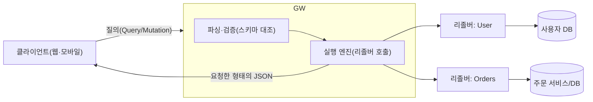
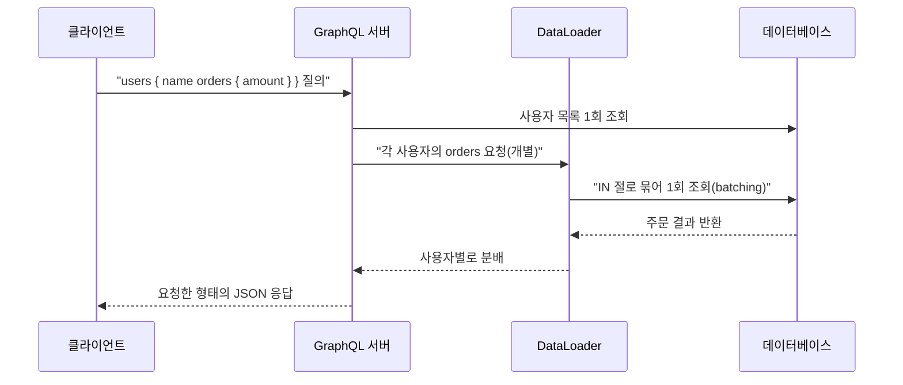

# GraphQL(그래프QL, API 질의 언어)

## 1. 개요

### 가. 정의

> **GraphQL**은 클라이언트가 필요한 데이터의 구조를 스스로 명시하여 요청하면, 서버가 정확히 그 형태(shape)로 응답을 돌려주는 **API용 질의 언어(query language)이자 런타임 실행 규격**이다. 2015년 Meta(구 Facebook)가 공개했으며, 현재는 중립 재단(GraphQL Foundation)이 사양을 관리한다.

GraphQL의 핵심 발상은 "서버가 미리 정해 둔 응답을 클라이언트가 받아쓰는" 전통적 API 구조를 뒤집는 데 있다. REST가 자원(resource)마다 엔드포인트를 두고 그 응답 형태를 서버가 결정하는 반면, GraphQL은 **단일 엔드포인트(보통 `/graphql`)** 에 강타입 스키마(schema)를 두고, 클라이언트가 그 스키마 안에서 원하는 필드만 조합해 질의한다. 그 결과 응답은 요청한 필드와 정확히 일치하는 JSON으로 돌아온다. 즉 "무엇을 어떻게 가져올지"에 대한 통제권이 서버에서 클라이언트로 이동한다.

이 때문에 GraphQL은 단순한 프로토콜이 아니라 **타입 시스템·질의 언어·실행 엔진**을 함께 규정하는 계약(contract) 중심 기술로 이해해야 한다. 스키마가 곧 API의 명세이자 문서이며, 프런트엔드와 백엔드가 이 스키마를 공유 계약으로 삼아 독립적으로 개발할 수 있게 된다.

### 나. 등장 배경과 필요성

GraphQL은 모바일 환경의 확산이라는 구체적 문제의식에서 태어났다. 다양한 화면(iOS·안드로이드·웹)이 같은 백엔드를 쓰면서 화면마다 필요한 데이터가 조금씩 다른데, REST로 이를 지원하면 두 가지 고질적 비효율이 발생한다. 첫째는 **과다 인출(over-fetching)** 로, 사용자 이름 하나만 필요해도 서버가 정해 둔 사용자 객체 전체(주소·가입일·설정 등)를 통째로 받는다. 둘째는 **과소 인출(under-fetching)** 로, 하나의 화면을 그리기 위해 사용자·주문·상품 엔드포인트를 각각 여러 번 호출해야 한다. 특히 이동통신망처럼 지연이 크고 대역폭이 제한된 환경에서 이 왕복(round-trip) 비용은 사용자 체감 성능을 크게 떨어뜨린다.

REST가 겪는 또 다른 어려움은 **엔드포인트 폭증과 버전 관리**이다. 화면 요구가 늘 때마다 `/user/{id}/summary`, `/user/{id}/detail` 같은 맞춤 엔드포인트가 늘어나고, 응답 구조를 바꾸려면 `/v1`, `/v2` 식으로 API 전체를 버전 분기해야 한다. GraphQL은 클라이언트가 필드를 선택하므로 화면이 바뀌어도 서버 엔드포인트를 추가할 필요가 없고, 새 필드를 더하는 진화적 변경이 기존 클라이언트를 깨뜨리지 않아 **버전리스(versionless) 진화**가 가능해진다.

정리하면 GraphQL은 ① 네트워크 왕복·페이로드 최소화, ② 다양한 클라이언트의 상이한 요구 수용, ③ 강타입 계약을 통한 프런트·백엔드 분리 개발, ④ 스키마 기반 자기문서화라는 네 가지 필요를 동시에 겨냥한 기술이다. 다만 이 유연성은 서버 측 복잡도와 캐싱·보안 부담이라는 대가를 수반하므로, 도입은 트레이드오프에 대한 판단을 전제로 한다.

## 2. GraphQL 아키텍처와 실행 구조

GraphQL 시스템은 클라이언트가 보낸 질의 문서를 서버가 **파싱→검증→실행→응답**하는 흐름으로 처리한다. 실행의 중심에는 스키마와, 각 필드의 값을 실제로 계산하는 함수인 **리졸버(resolver)** 가 있다. 클라이언트 질의는 트리 형태이며, 서버는 이 트리를 위에서 아래로 따라가며 각 필드의 리졸버를 호출해 값을 채운다.



위 구조에서 서버는 여러 원천(DB·마이크로서비스·외부 API)을 **하나의 스키마 뒤로 통합(aggregation)** 한다. 클라이언트는 데이터가 어디에서 오는지 알 필요 없이 스키마가 약속한 필드만 요청하고, 각 필드의 리졸버가 그 뒤에서 적절한 원천을 호출한다. 이 점에서 GraphQL 서버는 종종 여러 백엔드를 묶는 **API 게이트웨이 겸 조합 계층(BFF, Backend For Frontend)** 역할을 겸한다.

GraphQL이 규정하는 연산(operation)은 세 종류다. **Query**는 데이터 조회(읽기)로 부수효과가 없어야 하고, **Mutation**은 데이터 변경(쓰기)으로 서버 상태를 바꾸며, **Subscription**은 서버 이벤트를 클라이언트가 지속 수신(실시간 푸시, 보통 WebSocket 기반)하는 연산이다. 아래 표는 세 연산과 REST 대응을 개념적으로 비교한 것이나, GraphQL에서는 모두 동일한 단일 엔드포인트로 처리된다는 점이 본질적 차이다.

| 연산 | 목적 | 부수효과 | REST 유사 개념 |
|------|------|----------|----------------|
| Query | 조회(읽기) | 없음(멱등) | GET |
| Mutation | 생성·수정·삭제 | 있음(상태 변경) | POST/PUT/PATCH/DELETE |
| Subscription | 실시간 이벤트 구독 | 스트림 수신 | WebSocket/SSE |

## 3. 핵심 구성요소 — 스키마·타입·리졸버

GraphQL의 뼈대는 **스키마 정의 언어(SDL, Schema Definition Language)** 로 기술하는 강타입 스키마다. 스키마는 API가 제공하는 타입과 필드를 선언하는 계약서이며, 클라이언트가 무엇을 물을 수 있고 어떤 형태로 답을 받을지를 못 박는다. 예컨대 다음과 같이 정의한다.

```graphql
type User {
  id: ID!
  name: String!
  orders: [Order!]!
}
type Order { id: ID! amount: Int! }
type Query { user(id: ID!): User }
```

여기서 `!`는 널 불가(non-null)를, `[ ]`는 목록을 의미한다. 이렇게 타입이 명시되므로 서버는 요청을 실행하기 전에 스키마와 대조해 **정적 검증**을 수행할 수 있고, 클라이언트 도구는 스키마를 내려받아 자동완성·타입 생성·문서화를 제공한다. 스키마 자체를 질의할 수 있는 **인트로스펙션(introspection)** 기능 덕분에 GraphQL API는 별도 문서 없이도 자기 자신을 설명한다.

리졸버는 스키마의 각 필드가 실제로 어떤 값을 반환하는지 정의하는 함수다. 실행 엔진은 질의 트리를 순회하며 부모 필드의 결과를 자식 리졸버에 전달하는 방식으로 값을 채워 나간다. 이 계층적 실행이 GraphQL의 강력함이자 위험의 원천인데, 예를 들어 사용자 목록을 조회하고 각 사용자의 주문을 다시 조회하면, 사용자가 N명일 때 주문 조회 쿼리가 N번 추가로 발생하는 **N+1 문제**가 생긴다. 이를 방치하면 화면 하나가 수백 개의 DB 질의를 유발할 수 있다.

이 문제의 표준 해법이 **DataLoader** 패턴이다. 같은 실행 사이클 안에서 발생하는 개별 조회 요청을 잠시 모았다가(batching) 한 번의 질의로 묶어 처리하고, 동일 키에 대한 결과를 캐싱(caching)한다. 예를 들어 사용자 100명의 주문을 각각 조회하는 대신 `WHERE user_id IN (...)` 한 번으로 처리하여 질의 수를 101회에서 2회로 줄인다. 이처럼 GraphQL의 유연성을 실무에서 감당하려면 배치·캐시 전략이 사실상 필수 구성요소가 된다.



## 4. REST와의 비교 — 차이가 생기는 이유와 실무적 함의

GraphQL과 REST의 우열을 단순 비교하는 것은 부적절하며, **차이가 어디서 비롯되는지**를 이해하는 것이 기술사 관점의 핵심이다. 두 방식의 근본 분기점은 "응답 형태의 결정권을 누가 갖는가"이다. REST는 서버가 자원 표현을 고정하므로 캐싱·보안·러닝커브에서 유리하지만, 클라이언트 다양성이 커질수록 과다/과소 인출과 엔드포인트 폭증을 피하기 어렵다. GraphQL은 클라이언트가 형태를 정하므로 네트워크 효율과 프런트엔드 생산성이 높지만, 그 대가로 서버 복잡도·캐싱 난이도·질의 남용 위험이 커진다.

| 구분 | REST | GraphQL |
|------|------|---------|
| 엔드포인트 | 자원별 다수 | 단일 엔드포인트 |
| 데이터 인출 | 서버가 형태 결정(과다/과소 인출) | 클라이언트가 필드 선택 |
| 타입 계약 | 별도 명세(OpenAPI 등) | 스키마 내장·강타입 |
| 캐싱 | HTTP 캐시 자연 활용(GET+URL) | 응용 계층 캐시 별도 설계 필요 |
| 버전 관리 | `/v1`·`/v2` 분기 경향 | 필드 추가·폐기(deprecate)로 진화 |
| 러닝커브·생태계 | 낮음·성숙 | 상대적으로 높음 |

특히 **캐싱**의 차이는 실무 설계에 큰 영향을 준다. REST는 URL이 자원을 유일하게 식별하고 GET이 멱등하므로 CDN·브라우저·프록시가 표준 HTTP 캐시를 그대로 쓸 수 있다. 반면 GraphQL은 보통 POST 단일 엔드포인트로 다양한 질의가 오가므로 URL 기반 캐시가 무력화되어, 클라이언트 라이브러리의 정규화 캐시(예: 객체 `id` 기준)나 지속 질의(persisted query)로 캐시 키를 만드는 등 별도 전략이 필요하다. 이는 "GraphQL이 항상 빠르다"는 통념이 성립하지 않는 대표적 이유다.

실무에서는 이분법 대신 **혼용**이 흔하다. 예를 들어 외부 공개 API·파일 업로드·단순 CRUD는 REST로 두고, 여러 원천을 조합해야 하는 복합 화면이나 모바일 BFF 계층만 GraphQL로 구성한다. 국내외 사례로는 GitHub가 REST와 함께 GraphQL API(v4)를 병행 제공하는 것, Shopify·Netflix 등이 내부 서비스 조합 계층에 GraphQL을 채택한 것이 대표적이다.

## 5. 심화 — 보안·성능 위협과 페더레이션

GraphQL의 유연성은 곧 **공격 표면**이 된다. 클라이언트가 질의 구조를 자유롭게 짤 수 있으므로, 깊게 중첩된 질의(예: `friends { friends { friends ... } }`)로 서버 자원을 고갈시키는 **질의 깊이·복잡도 공격**이 가능하다. 이를 막기 위해 실무에서는 ① 최대 질의 깊이(depth) 제한, ② 필드별 비용을 합산해 임계치를 넘으면 거부하는 **질의 비용 분석(query cost analysis)**, ③ 미리 등록된 질의만 허용하는 **지속 질의(persisted query) 허용목록(allowlist)**, ④ 속도 제한(rate limiting)을 조합한다. 또한 인트로스펙션은 개발 편의를 주지만 운영 환경에서는 내부 스키마 노출을 줄이기 위해 비활성화하는 것이 권장된다.

인가(authorization) 역시 REST와 다른 접근이 필요하다. REST는 엔드포인트 단위로 권한을 걸 수 있지만, GraphQL은 하나의 질의가 여러 타입·필드를 넘나들므로 **필드 수준(field-level) 인가**가 요구된다. 즉 리졸버 또는 스키마 지시어(directive)에서 각 필드에 대해 호출자의 권한을 검사해야 하며, 이를 누락하면 권한 없는 사용자가 중첩 필드를 통해 민감 데이터에 접근하는 결함이 생긴다.

대규모 조직에서는 스키마가 비대해지는 문제를 **GraphQL 페더레이션(Federation)** 으로 해결한다. 여러 팀이 각자 소유한 하위 그래프(subgraph)를 독립적으로 운영하고, 게이트웨이가 이를 하나의 통합 그래프(supergraph)로 합성한다. 이는 마이크로서비스 조직 구조와 스키마 소유권을 정렬시켜, 단일 거대 스키마를 한 팀이 병목으로 관리하는 상황을 피하게 해 준다. 다만 페더레이션은 게이트웨이 조합 비용과 분산 추적(observability) 부담을 새로 도입하므로, 조직 규모와 팀 경계가 충분히 클 때 정당화된다.

## 6. 고려사항 및 시사점

첫째, **도입 판단은 트레이드오프 분석에서 출발해야 한다.** GraphQL은 다양한 클라이언트가 상이한 데이터를 요구하고 네트워크 왕복이 병목인 상황(모바일·복합 대시보드·다중 백엔드 조합)에서 이득이 크다. 반대로 단순 CRUD, 강한 HTTP 캐싱이 필요한 공개 API, 파일 스트리밍 중심 서비스에서는 REST가 더 단순하고 안전하다. "유행"이 아니라 클라이언트 다양성과 데이터 조합 복잡도를 기준으로 선택해야 한다.

둘째, **성능은 공짜가 아니라 설계의 결과다.** N+1 문제에 대한 DataLoader 배치, 질의 결과 캐싱, 지속 질의를 통한 캐시 키 확보가 함께 설계되지 않으면 GraphQL은 오히려 REST보다 느리고 무거워질 수 있다. 관측성(요청별 리졸버 실행 시간·질의 복잡도 모니터링)을 초기부터 확보해야 한다.

셋째, **보안은 필드 단위로 재설계해야 한다.** 질의 깊이·복잡도 제한, 지속 질의 허용목록, 운영 환경 인트로스펙션 통제, 필드 수준 인가를 기본값으로 삼아야 하며, 이를 애플리케이션 코드에만 맡기지 말고 게이트웨이·스키마 지시어 등 공통 계층에서 강제하는 것이 바람직하다.

넷째, **거버넌스와 스키마 진화 전략이 성패를 가른다.** GraphQL은 버전 분기 대신 필드 추가와 `@deprecated` 표시를 통한 점진적 진화를 지향한다. 따라서 스키마 변경의 하위 호환성 검사(schema check)를 CI에 포함하고, 조직이 커지면 페더레이션으로 스키마 소유권을 분산하는 등 **API를 하나의 제품처럼 관리하는 운영 체계**가 필요하다. 정보관리기술사 관점에서 GraphQL은 단일 기술이 아니라 API 계약·조직 구조·성능·보안이 얽힌 아키텍처 의사결정 문제로 다루는 것이 타당하다.

## 참고자료

- GraphQL 공식 사양 및 학습 자료: https://graphql.org/learn/
- GraphQL Specification (GraphQL Foundation): https://spec.graphql.org/
- Apollo GraphQL — Federation 개요: https://www.apollographql.com/docs/federation/

---

> **한 줄 요약**: GraphQL은 클라이언트가 강타입 스키마 안에서 필요한 필드만 골라 단일 엔드포인트로 질의하는 API 규격으로, 과다/과소 인출과 엔드포인트 폭증을 해소하지만 캐싱·보안·N+1 성능 부담을 설계로 감당해야 하는 트레이드오프 기술이다.
