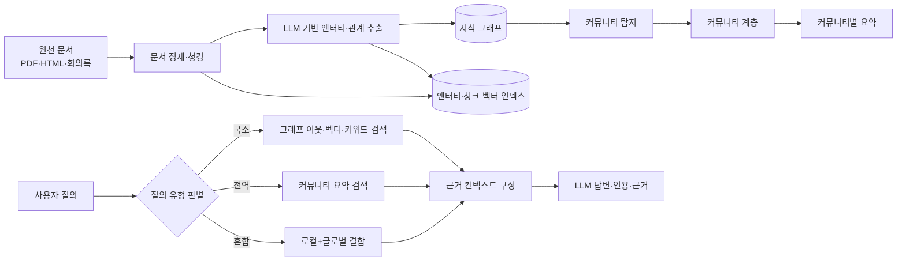
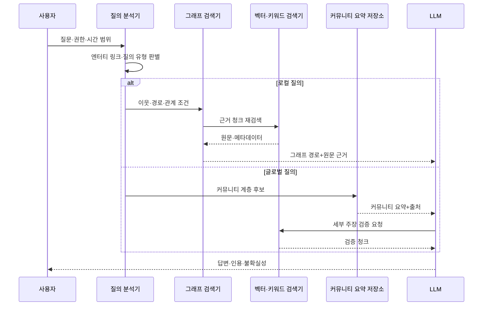

# GraphRAG(그래프 검색증강생성)

## 1. 개요

### 가. 정의

> **GraphRAG(Graph-based Retrieval-Augmented Generation)**는 비정형 문서에서 엔터티와 관계를 추출하여 지식 그래프와 커뮤니티 요약을 만들고, 질의 목적에 따라 그래프 구조·원문·요약을 검색해 대규모 언어모델(LLM)의 답변 근거로 제공하는 검색증강생성 아키텍처이다.

일반적인 RAG는 문서를 일정한 청크로 나눈 뒤 임베딩 벡터를 생성하고, 질의와 가까운 청크를 검색하여 LLM의 컨텍스트로 넣는다.
이 방식은 특정 사실이나 한 문단의 의미를 찾는 데는 효과적이지만, 여러 문서에 흩어진 인물·조직·사건의 관계를 연결하거나 전체 말뭉치의 공통 주제를 요약하는 질문에는 한계가 있다.
검색된 청크가 서로 연결되어 있다는 보장이 없기 때문에 LLM이 연결고리를 추론해야 하고, 검색 범위를 넓히면 토큰 비용과 잡음이 동시에 증가한다.

GraphRAG는 문서의 의미를 벡터 하나로만 보존하지 않는다.
문서에서 추출한 엔터티와 관계를 그래프의 노드와 엣지로 표현하고, 연결된 엔터티 집합을 커뮤니티로 묶은 뒤 커뮤니티별 요약을 생성한다.
질의 처리 시에는 개별 엔터티 주변을 따라가는 로컬 검색과 여러 커뮤니티 요약을 결합하는 글로벌 검색을 구분하여 사용한다.
따라서 GraphRAG는 “가장 비슷한 문단”뿐 아니라 “무엇이 무엇과 연결되어 있고 그 연결이 전체 맥락에서 어떤 의미를 가지는가”를 검색 대상으로 삼는다.

### 나. 등장 배경과 필요성

첫째, 기업의 지식은 문서 한 편에 완결되어 있지 않다.
장애 보고서에는 증상이 기록되고, 변경관리 문서에는 원인이 기록되며, 회의록에는 의사결정과 담당 조직이 기록되는 식으로 동일한 사건의 단서가 여러 문서에 나뉜다.
벡터 검색만 사용하면 질의와 표현이 비슷한 문서를 찾을 수는 있어도 문서 간 관계를 안정적으로 결합하기 어렵다.

둘째, “전체 자료에서 반복되는 위험은 무엇인가”와 같은 글로벌 질의는 상위 청크 몇 개를 반환하는 방식과 맞지 않는다.
모든 문서를 LLM에 투입하면 비용과 컨텍스트 길이 문제가 생기고, 단순한 검색 결과를 이어 붙이면 대표성이나 중복 제거를 보장하기 어렵다.
커뮤니티 계층과 요약을 미리 만들어 두면 질의 시 전체 자료를 다시 읽지 않고도 집단 수준의 패턴을 탐색할 수 있다.

셋째, 그래프는 데이터의 연결 근거와 출처를 함께 관리하기에 적합하다.
엔터티와 관계에 원문 문서, 페이지, 추출 시점, 신뢰도 같은 provenance를 연결하면 답변의 근거를 추적하고 사람이 검토할 지점을 표시할 수 있다.
다만 그래프가 자동 생성되었다는 사실만으로 정확성이 보장되는 것은 아니므로 추출 오류와 요약 오류를 품질관리 대상으로 다루어야 한다.

### 다. 특징과 적용 범위

GraphRAG의 핵심은 그래프 데이터베이스를 도입하는 것 자체가 아니라, 검색 단위를 문서 청크에서 구조화된 지식과 요약 계층으로 확장하는 데 있다.
그래프는 엔터티 간 경로, 소속, 의존성, 시간 순서를 표현하고 벡터 인덱스는 의미적 유사도를 보완한다.
실제 구현에서는 그래프 검색, 벡터 검색, 키워드 검색, 원문 검색을 단일 파이프라인 안에서 혼합하는 하이브리드 구조가 일반적이다.

적용 대상은 사내 규정·정책 질의, 연구자료 탐색, 장애와 변경의 연관 분석, 공급망 위험 분석, 특허·논문 조사처럼 문서 간 연결과 집단적 요약이 중요한 영역이다.
반대로 자료가 적고 단순 사실을 정확히 찾는 서비스에는 일반 RAG가 더 저렴하고 운영하기 쉽다.
GraphRAG 도입은 “그래프를 만들 수 있는가”보다 “그래프가 추가하는 추론 가치가 구축·검증 비용보다 큰가”를 기준으로 판단해야 한다.

## 2. 전체 구조와 처리 흐름

### 가. 참조 아키텍처

위 구조는 인덱싱 단계와 질의 단계를 분리한다.
인덱싱 단계에서는 원천 문서를 정제하고, 청크를 만들며, LLM 또는 규칙 기반 추출기로 엔터티·관계·주장을 생성한다.
이 결과는 그래프 저장소, 원문 저장소, 벡터 인덱스에 서로 다른 형태로 저장되지만 문서 ID와 청크 ID를 공통 키로 사용하여 출처를 연결한다.

그래프의 노드는 사람·조직·시스템·제품·사건·개념 같은 엔터티를 나타내고, 엣지는 “소속된다”, “호출한다”, “영향을 준다”, “발생했다”와 같은 관계를 나타낸다.
관계에는 문서 근거와 시간 범위를 함께 둔다.
예를 들어 “서비스 A가 데이터베이스 B를 호출한다”는 관계에는 해당 사실이 추출된 운영 문서, 관찰 날짜, 추출 모델, 검토 상태를 부가 속성으로 기록할 수 있다.

### 나. 인덱싱 단계

첫 번째 단계는 수집과 정제다.
PDF의 머리말·각주·표·스캔 이미지가 뒤섞이면 이후의 엔터티 추출이 잘못되므로 OCR, 레이아웃 보존, 중복 제거, 언어 감지, 접근권한 상속을 먼저 처리한다.
문서 자체의 ACL을 잃어버린 그래프는 검색 정확도보다 더 큰 보안 문제를 일으킬 수 있으므로 원문 청크와 그래프 사실 모두에 접근 범위를 연결해야 한다.

두 번째 단계는 의미 단위 청킹이다.
고정 길이로 자르는 것만으로는 조항, 사건, 표의 행과 열 관계가 끊길 수 있다.
제목 계층, 문단 경계, 표의 헤더, 시간 표현을 활용하여 “누가 무엇을 언제 수행했는가”가 한 청크 안에서 유지되도록 설계한다.
청크가 지나치게 크면 추출 비용과 잡음이 증가하고, 지나치게 작으면 관계의 주어와 목적어가 분리되므로 도메인별 실험이 필요하다.

세 번째 단계는 엔터티와 관계 추출이다.
LLM에게 허용된 엔터티 유형과 관계 유형의 스키마를 제시하고 JSON 구조로 출력하게 하되, 형식 검증과 원문 span 검증을 별도로 둔다.
동일 대상을 “한국전력”, “한전”, “KEPCO”로 각각 만들지 않도록 정규화·동의어·식별자 매핑을 적용한다.
추출 결과가 원문에 실제로 근거가 있는지 확인하지 않으면 그래프의 연결이 그럴듯한 허위 사실을 확산시키는 경로가 된다.

네 번째 단계는 커뮤니티 탐지와 계층화다.
그래프의 모든 노드를 개별적으로 요약하는 것이 아니라 연결 밀도가 높은 노드 집합을 커뮤니티로 묶고, 하위 커뮤니티를 상위 커뮤니티로 계층화한다.
이때 커뮤니티의 크기와 해상도(resolution)는 질의 비용과 요약의 응집도 사이의 절충점이다.
너무 큰 커뮤니티는 요약이 일반론으로 흐르고, 너무 작은 커뮤니티는 전역 질문에 필요한 맥락을 잃는다.

다섯 번째 단계는 커뮤니티 요약 생성이다.
요약에는 주요 엔터티, 관계, 사건의 흐름, 반복되는 주장, 예외와 출처 목록을 포함시키는 편이 좋다.
요약문만 저장하면 원문과의 연결이 약해지므로 요약을 구성한 그래프 요소와 원문 청크의 ID를 함께 보존한다.
요약 모델의 표현이 원문보다 강한 단정으로 바뀌지 않도록 “근거 있음”, “추정”, “상충” 같은 상태를 분리한다.

### 다. 질의 단계

질의가 들어오면 먼저 질문의 범위와 의도를 분석한다.
특정 시스템의 장애 원인을 묻는 질문은 해당 엔터티의 이웃과 시간 경로를 따라가는 로컬 질의에 가깝다.
반면 “전체 프로젝트에서 공통으로 나타난 지연 원인은 무엇인가”는 여러 커뮤니티를 비교하는 글로벌 질의에 가깝다.
질의 유형을 잘못 판별하면 글로벌 질문에 특정 문서만 답하거나, 로컬 질문에 불필요하게 많은 요약을 투입하게 된다.

로컬 검색은 질의에서 엔터티를 식별하고, 해당 노드의 k-hop 이웃, 관련 청크, 벡터 유사 문서를 결합한다.
관계의 방향과 시간 범위를 반영하면 “A가 B에 영향을 주었다”와 “B가 A에 영향을 주었다”를 구분할 수 있다.
검색 결과는 그래프 경로와 원문 인용이 함께 보이도록 구성해야 LLM이 연결을 임의로 보간할 가능성을 낮출 수 있다.

글로벌 검색은 커뮤니티 요약을 후보로 만들고, 여러 요약을 부분적으로 비교·집계하여 답변 컨텍스트를 만든다.
질문을 세부 질문으로 분해한 뒤 커뮤니티별 답변을 생성하고, 마지막에 중복과 모순을 조정하는 방식이 활용된다.
다만 요약의 계층을 올라갈수록 세부 근거가 압축되므로 최종 답변에는 필요할 때 원문 청크를 재검색하는 검증 단계를 둔다.

## 3. 핵심 구성요소와 설계 원리

### 가. 그래프 스키마와 온톨로지

스키마는 어떤 대상을 노드로 만들고 어떤 연결을 유효한 관계로 인정할지 정의한다.
예를 들어 IT 장애 도메인에서는 서비스, 인프라 자원, 배포, 장애, 원인, 담당 팀을 엔터티 유형으로 두고, “배포됨”, “호출함”, “원인으로 추정됨”, “담당함”을 관계 유형으로 둘 수 있다.
이 분류가 지나치게 세밀하면 추출과 정규화 비용이 증가하고, 지나치게 단순하면 질의에서 중요한 의미 차이가 사라진다.

초기에는 도메인 전문가와 함께 최소 스키마를 만들고, 실제 질의 실패 사례를 분석하면서 확장하는 점진적 접근이 안전하다.
스키마 변경은 기존 그래프의 재추출과 요약 재생성을 유발할 수 있으므로 버전, 마이그레이션 규칙, 호환성을 관리한다.
관계의 시간성, 신뢰도, 출처, 유효기간을 속성으로 표현하면 현재 상태와 과거 상태를 구분할 수 있다.

### 나. 엔터티 해소와 출처 관리

엔터티 해소(entity resolution)는 서로 다른 표현이 같은 대상을 가리키는지 판정하는 과정이다.
이름 유사도만 사용하면 동명이인이나 조직 개편을 잘못 합칠 수 있으므로 조직 ID, 시스템 ID, 주소, 시점과 같은 식별자 속성을 함께 사용한다.
자동 병합은 후보를 만들고, 높은 위험의 병합은 사람의 승인을 받는 방식으로 운영한다.

출처(provenance)는 그래프가 무엇을 알고 있는지보다 왜 그렇게 알고 있는지를 설명한다.
각 노드·엣지·요약은 원문 문서, 페이지 또는 문자 구간, 추출 시각, 모델 버전, 검토자, 신뢰도와 연결되어야 한다.
답변에서 출처를 표시할 때는 그래프 경로만 제시하지 말고 사용자가 원문을 열어 확인할 수 있는 문서 단위의 인용을 함께 제공한다.

### 다. 검색 조합과 컨텍스트 구성

그래프 검색은 구조적 연결에 강하고 벡터 검색은 표현이 다른 의미적 유사성에 강하다.
키워드 검색은 제품명·코드·법령 조항과 같은 정확한 토큰에 강하므로 세 방식을 경쟁시키기보다 후보 생성과 재순위화 단계에서 조합한다.
예를 들어 먼저 엔터티를 링크한 뒤 그래프 이웃을 확장하고, 각 이웃에 연결된 청크를 벡터 유사도와 출처 신뢰도로 재순위화할 수 있다.

컨텍스트는 많이 넣는다고 좋아지지 않는다.
중복 청크와 서로 다른 시점의 모순된 사실이 함께 들어가면 LLM이 가장 그럴듯한 문장을 선택할 수 있다.
컨텍스트 구성 단계에서 중복 제거, 시간 필터, ACL 필터, 관계 경로의 최소화, 상충 주장 표시를 수행하고, 답변 프롬프트에는 근거 밖의 추론을 금지하는 규칙을 둔다.

## 4. 일반 RAG와의 비교 및 도입 절차

### 가. 비교

일반 RAG와 GraphRAG의 차이는 벡터 데이터베이스의 유무가 아니라 지식의 표현 단위와 질문 범위에 있다.
일반 RAG는 청크의 의미적 근접성을 중심으로 하므로 구현이 단순하고 인덱싱 비용이 낮다.
GraphRAG는 그래프 추출·정규화·커뮤니티 요약이라는 추가 단계를 통해 문서 간 구조와 집단 수준의 의미를 계산해 둔다.

그래프 기반 접근이 모든 질의에서 우월한 것은 아니다.
정확한 매뉴얼 문장을 찾는 질문은 원문 청크 검색이 더 빠르고, 데이터가 자주 바뀌는 환경에서는 그래프와 요약의 갱신 지연이 문제가 된다.
반대로 다중 홉 추론, 전역 비교, 조직·사건·의존성의 연결을 요구하는 질문은 GraphRAG의 구조 정보가 검색 후보와 답변의 설명력을 높일 수 있다.

| 비교 항목 | 일반 RAG | GraphRAG | 실무적 함의 |
|---|---|---|---|
| 기본 단위 | 임베딩된 문서 청크 | 엔터티·관계·커뮤니티·청크 | 질문 유형에 따라 단위를 선택 |
| 강점 | 단순 사실 검색, 빠른 구축 | 다중 홉·전역 질의, 연결 설명 | 그래프 구축 가치가 있는 도메인 선별 |
| 인덱싱 비용 | 청킹·임베딩 중심 | 추출·해소·탐지·요약 추가 | 초기 비용과 갱신 비용을 예산화 |
| 최신성 | 원문·벡터 갱신 중심 | 그래프·요약 동기화 필요 | 증분 갱신과 유효기간 설계 |
| 근거 표현 | 검색 청크 인용 | 경로·요약·원문 인용 결합 | provenance를 답변 계약에 포함 |
| 주요 위험 | 관련 청크 누락, 단편화 | 추출 오류의 연결·증폭 | 원문 검증과 품질 게이트 필수 |

### 나. 단계적 도입 절차

1단계는 질의와 성공 기준을 정하는 것이다.
대표 질문을 로컬·글로벌·혼합 유형으로 나누고, 정답성·근거성·완전성·지연시간·비용의 목표를 정한다.
예를 들어 “특정 장애의 영향 서비스와 근거 문서는 무엇인가”와 “최근 1년의 공통 장애 원인은 무엇인가”를 별도 평가셋으로 구성한다.

2단계는 자료와 권한을 정비하는 것이다.
문서의 소유자, 보존기간, 분류등급, ACL, 버전을 확인하고, 그래프 노드가 원문보다 넓은 권한을 갖지 않도록 접근정책을 상속시킨다.
개인정보나 영업비밀이 포함된 문서는 마스킹·토큰화·비식별화 정책을 적용하고, 모델 제공자에게 전송되는 범위를 명확히 한다.

3단계는 소규모 도메인으로 인덱싱 파이프라인을 검증하는 것이다.
문서 수가 적은 장애관리나 제품설계 영역에서 엔터티 유형, 관계 유형, 동의어, 시간 표현을 정하고, 추출 결과를 샘플링하여 사람이 검토한다.
그래프 품질이 기준을 넘지 못하면 검색 프롬프트를 고치는 것보다 스키마·청킹·원문 정제를 먼저 개선한다.

4단계는 하이브리드 검색과 답변 평가를 운영에 연결하는 것이다.
일반 RAG를 기본 경로로 두고 그래프 검색이 유리한 질문만 라우팅하는 방식으로 시작하면 비용과 위험을 제한할 수 있다.
답변에는 근거 문서와 불확실성을 표시하고, 사용자 피드백을 실패 질의·누락 엔터티·잘못된 관계·오래된 요약으로 분류하여 파이프라인 개선에 반영한다.

## 5. 사례와 평가

### 가. 장애 지식 분석 사례

가상의 대규모 쇼핑 플랫폼이 장애 보고서, 배포 기록, 모니터링 알림, 회의록을 통합한다고 가정한다.
일반 RAG는 “결제 지연”과 유사한 청크를 반환할 수 있지만, 해당 지연이 특정 배포 이후 시작되었고 메시지 큐의 재시도 폭증과 데이터베이스 연결 풀 고갈을 거쳐 주문 서비스로 전파되었다는 전체 경로를 안정적으로 보여 주기 어렵다.

GraphRAG는 결제 서비스, 배포 버전, 메시지 큐, 데이터베이스, 담당 팀을 노드로 만들고 시간순 관계를 기록한다.
질의가 “이번 장애의 최초 변화와 영향 범위는 무엇인가”라면 배포 노드에서 장애 노드로 이어지는 경로와 관련 청크를 로컬 검색한다.
질의가 “지난 분기 장애에서 반복된 공통 원인은 무엇인가”라면 장애 커뮤니티별 요약을 비교하여 재시도 설정, 용량 부족, 외부 결제 API 지연이 반복되었는지 글로벌 검색한다.

이 사례의 핵심은 그래프가 원인을 자동으로 확정하는 것이 아니라 조사 가능한 후보와 근거를 연결해 준다는 점이다.
인과관계로 표현된 엣지는 “관찰상 선후관계”, “담당자 확인”, “실험으로 검증”과 같은 상태를 구분해야 한다.
그렇지 않으면 단순한 시간적 선후가 확정적 원인으로 요약되어 운영 의사결정을 오도할 수 있다.

### 나. 평가 지표와 테스트

검색 평가는 관련 엔터티·관계·청크가 검색 결과에 포함되는지 측정한다.
답변 평가는 사실성, 근거 인용의 정확성, 질문의 모든 조건을 다루는 완전성, 상충 정보의 처리, 권한 위반 여부를 함께 본다.
단일 점수만 최적화하면 인용은 많지만 질문에 답하지 못하거나, 답변은 매끄럽지만 근거가 없는 문제가 가려질 수 있다.

오프라인 평가셋에는 정답 경로가 알려진 로컬 질문, 여러 커뮤니티를 종합해야 하는 글로벌 질문, 의도적으로 모호한 질문, 오래된 정보와 최신 정보가 충돌하는 질문을 포함한다.
온라인에서는 답변 수용률 외에 근거 열람률, 재질의율, 잘못된 권한 차단 건수, 지연시간과 토큰 비용을 관찰한다.
새 스키마나 추출 모델을 적용할 때는 기존 평가셋을 재실행하여 그래프 품질의 회귀를 확인한다.

## 6. 심화: 비용·최신성·운영 동향

GraphRAG의 비용은 질의 시 비용과 인덱싱 시 비용으로 나누어 보아야 한다.
엔터티·관계 추출과 커뮤니티 요약은 대규모 문서에서 초기 비용을 만들지만, 반복되는 글로벌 질문에 대한 질의 비용을 낮출 수 있다.
반대로 문서가 자주 바뀌면 매번 전체 그래프를 재생성하는 방식은 비효율적이므로 변경 문서와 영향받는 커뮤니티만 갱신하는 증분 처리와 재요약 정책이 필요하다.

로컬 검색과 글로벌 검색을 하나의 거대한 프롬프트로 처리하기보다 질의 라우터, 그래프 탐색, 벡터 검색, 요약 재검색을 조합하는 모듈형 설계가 운영에 유리하다.
저비용 모델은 후보 추출과 형식 검증에 사용하고, 고성능 모델은 모순 조정과 최종 답변에 제한적으로 사용하는 계층화도 비용 절감에 도움이 된다.
단, 모델을 분리하면 모델별 추출 편향과 표현 차이가 생기므로 모델 버전과 결과의 호환성을 기록해야 한다.

Microsoft의 공식 GraphRAG 문서는 이 접근을 구조화된 계층형 RAG로 설명하며, 2026년 8월 공개 저장소 README는 해당 저장소가 유지보수 중심 상태이고 보안 취약점 대응과 의존성 업데이트를 우선한다고 안내한다.
따라서 특정 구현체를 그대로 표준 플랫폼으로 채택하기보다, 그래프 스키마·출처·평가셋·접근권한 같은 원리를 조직의 데이터·LLM 플랫폼에 독립적으로 설계하는 것이 바람직하다.
향후에는 그래프와 벡터의 하이브리드 검색, 동적 커뮤니티 선택, 지연 요약, 에이전트 도구 호출이 결합될 가능성이 크지만, 기능 확장보다 근거 추적성과 갱신 일관성을 우선해야 한다.

## 7. 고려사항 및 시사점

### 가. 정확성·환각 통제

그래프의 구조성이 답변의 진실성을 자동으로 보장하지 않는다.
LLM이 잘못 추출한 엔터티나 관계가 많은 문서와 연결되면 오류가 증폭될 수 있으므로 원문 span 검증, 관계 신뢰도, 사람 승인, 상충 주장 표시를 품질 게이트로 둔다.
최종 답변은 근거가 없는 추론을 분리하고, 확인되지 않은 경우 “추정”이나 “추가 확인 필요”로 표현해야 한다.

### 나. 최신성·동기화

원문이 바뀌었는데 그래프와 커뮤니티 요약이 남아 있으면 오래된 지식이 최신 사실처럼 검색된다.
문서 버전, 변경 이벤트, 그래프 영향 범위, 요약 만료시간을 관리하고, 고위험 업무에는 질의 시 원문 재검증을 의무화한다.
배치 갱신만으로 충분하지 않은 영역은 변경 데이터 캡처와 증분 재색인을 도입하되, 부분 갱신 중인 그래프를 사용자에게 노출하지 않는 일관성 정책을 정한다.

### 다. 보안·개인정보·권한

그래프는 문서에 흩어져 있던 관계를 한눈에 드러내므로 원문보다 민감한 지식이 될 수 있다.
노드와 엣지에도 문서 ACL, 테넌트, 보존기간, 개인정보 분류를 상속하고, 그래프 탐색 경로를 통해 권한 없는 정보가 추론되지 않는지 별도로 시험한다.
프롬프트 주입 문서가 그래프의 관계나 요약을 오염시키지 않도록 신뢰 경계, 입력 정제, 도구 호출 권한, 감사 로그를 적용한다.

### 라. 비용·성능·확장성

엔터티 추출·관계 추출·요약에 필요한 LLM 호출 수와 그래프 저장·검색 비용을 문서량, 변경률, 질의량에 따라 산정한다.
커뮤니티 요약을 모두 최고 해상도로 만들기보다 질문 빈도와 중요도에 따라 계층과 갱신 주기를 차등화할 수 있다.
대규모 그래프에서는 k-hop 확장 폭, 관계 필터, 캐시, 사전 계산된 요약이 지연시간을 좌우하므로 정확도와 응답시간을 함께 측정한다.

### 마. 조직·거버넌스

그래프 스키마의 소유자, 도메인별 검토자, 데이터 관리자, AI 서비스 운영자의 책임을 명확히 한다.
새 관계 유형을 추가할 때는 정의·예시·금지 사례·품질 기준을 문서화하고, 모델이나 프롬프트 변경을 형상관리와 평가 승인 절차에 포함한다.
기술사 관점에서는 GraphRAG를 단순 챗봇 기능으로 보지 말고 데이터 거버넌스, 지식관리, 보안, MLOps를 연결하는 정보화 아키텍처로 평가해야 한다.

## 참고자료

- Microsoft Research, “Project GraphRAG” — https://www.microsoft.com/en-us/research/project/graphrag/
- Microsoft Research, “GraphRAG: New tool for complex data discovery now on GitHub” — https://www.microsoft.com/en-us/research/blog/graphrag-new-tool-for-complex-data-discovery-now-on-github/
- Microsoft, “GraphRAG documentation” — https://microsoft.github.io/graphrag/
- Microsoft GraphRAG GitHub repository — https://github.com/microsoft/graphrag
- Edge et al., “From Local to Global: A Graph RAG Approach to Query-Focused Summarization” — https://arxiv.org/abs/2404.16130

---

> **한 줄 요약**: GraphRAG는 엔터티·관계·커뮤니티 요약과 하이브리드 검색을 결합하여 문서 간 다중 홉 추론과 전체 자료의 글로벌 질의를 지원하는 RAG 확장 아키텍처이며, 성공적인 도입의 핵심은 그래프 자체보다 출처·권한·최신성·평가를 함께 운영하는 데 있다.
