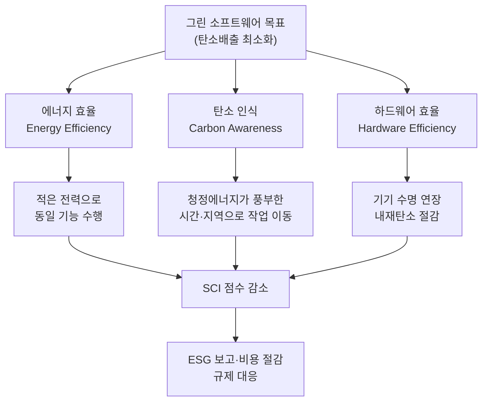
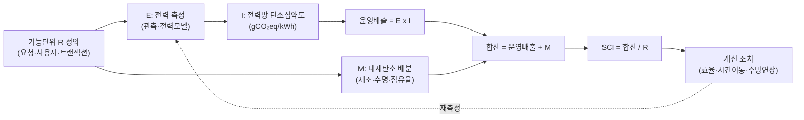

# 그린 소프트웨어(Green Software)와 지속가능한 소프트웨어 공학

## 1. 개요

> **정의**: 그린 소프트웨어는 설계·개발·배포·운영·폐기에 이르는 소프트웨어 수명주기 전반에서 전력 소비와 탄소배출을 최소화하도록 만들어진 소프트웨어이며, 지속가능한 소프트웨어 공학은 성능·비용·안정성과 함께 탄소효율(carbon efficiency)을 일급 품질속성으로 다루는 공학 실천이다.

정보시스템은 전력을 소비하는 물리적 하드웨어 위에서 동작하고, 그 하드웨어는 제조·운송·폐기 과정에서 다시 온실가스를 배출한다.
따라서 소프트웨어는 스스로 굴뚝을 갖지 않지만, 서버·네트워크·단말의 전력 수요를 결정하는 방식으로 탄소배출을 간접적으로 유발한다.
과거에는 이 배출이 데이터센터 운영자나 하드웨어 제조사의 몫으로만 여겨졌으나, 클라우드와 생성형 AI가 확산되면서 코드 한 줄, 쿼리 한 번, 모델 추론 한 회가 곧 전력과 탄소로 환산되는 시대가 되었다.
소프트웨어 엔지니어의 설계 선택이 배출량을 좌우한다는 인식이 그린 소프트웨어의 출발점이다.

그린 소프트웨어가 부상한 배경에는 세 가지 압력이 겹쳐 있다.
첫째, ESG 경영과 각국의 탄소중립(2050 Net-Zero) 규제로 기업은 Scope 1·2뿐 아니라 협력사·클라우드까지 포함하는 Scope 3 배출을 보고해야 한다.
둘째, 생성형 AI 학습·추론이 급증하며 데이터센터 전력 수요가 국가 전력망을 압박하는 수준으로 커졌고, 전력비용이 곧 운영비용(FinOps)과 직결되었다.
셋째, ISO/IEC 21031:2024(SCI) 같은 국제표준이 제정되면서 "친환경"이라는 모호한 구호가 측정 가능한 지표로 전환되었다.
이 세 압력은 그린 소프트웨어를 도덕적 선택이 아니라 규제 대응·비용 절감·기술 경쟁력이 결합된 경영 과제로 바꾸었다.

그러므로 지속가능한 소프트웨어 공학은 단순히 "코드를 가볍게 짜자"는 절약 캠페인이 아니다.
그것은 아키텍처 결정, 배포 전략, 운영 스케줄링, 하드웨어 수명 관리, 그리고 조직의 측정·보고 체계까지 아우르는 종합적 관리 체계다.

## 2. 그린 소프트웨어의 핵심 원칙과 전체 구조

그린 소프트웨어 재단(Green Software Foundation, 2021년 리눅스 재단 산하로 출범)은 배출 저감을 세 가지 원칙으로 정리한다.
이 원칙들은 서로 보완적이며, 하나만 적용하면 다른 곳에서 배출이 늘어나는 풍선효과가 생길 수 있으므로 통합적으로 고려해야 한다.

### 가. 에너지 효율(Energy Efficiency)

에너지 효율은 동일한 기능을 더 적은 전력으로 수행하도록 만드는 원칙이다.
알고리즘 복잡도를 낮추고, 불필요한 연산·네트워크 왕복·중복 렌더링을 제거하며, 유휴 자원의 소비를 줄이는 것이 핵심이다.
예를 들어 O(n²) 정렬을 O(n log n)으로 바꾸거나, N+1 쿼리를 배치 조회로 통합하면 CPU 점유시간이 줄고 곧바로 전력이 절감된다.
서버리스·오토스케일링으로 유휴 인스턴스를 없애는 것도 에너지 효율의 대표 사례다.

주의할 점은 에너지 효율이 항상 성능과 일치하지는 않는다는 것이다.
빠른 응답을 위해 자원을 과다 프로비저닝하면 성능은 좋아지지만 유휴 전력이 늘어난다.
반대로 지나친 압축·연기 처리는 CPU 사용량을 오히려 늘릴 수 있다.
따라서 에너지 효율은 "처리량당 전력(watt per request)" 같은 단위지표로 측정하며 성능과의 균형점을 찾아야 한다.

실무에서는 프로파일링으로 전력 핫스팟(hotspot)을 찾고, 캐싱·인덱싱·배치화로 반복 연산을 제거하며, 코드 수준에서는 컴파일 언어·경량 런타임 선택까지 검토한다.
국내 한 대형 커머스는 상품 추천 배치를 야간 단일 실행에서 증분 처리로 바꿔 연산량을 크게 줄인 사례를 보고한 바 있다.

### 나. 탄소 인식(Carbon Awareness)

탄소 인식은 "언제·어디서" 연산을 수행하느냐에 따라 같은 전력이라도 배출량이 달라진다는 점을 이용한다.
전력망의 탄소집약도(gCO₂eq/kWh)는 시간대와 지역에 따라 크게 변한다.
태양광이 강한 한낮이나 풍력이 많은 시간대에는 청정전력 비중이 높아 배출계수가 낮고, 화력 발전이 주력인 심야 첨두시간대에는 높아진다.

이 원리를 이용한 두 가지 실천이 시간 이동(demand shifting)과 위치 이동(demand shaping)이다.
시간 이동은 급하지 않은 배치 작업(백업, 리포트 생성, 모델 재학습)을 탄소집약도가 낮은 시간대로 스케줄링하는 것이다.
위치 이동은 지연시간 제약이 허용하는 범위에서 청정전력 비중이 높은 리전으로 워크로드를 배치하는 것이다.
예컨대 마이크로소프트·구글은 실시간 전력망 탄소 신호를 받아 학습 작업의 실행 시점을 조절하는 carbon-aware 스케줄링을 운영한다고 밝힌 바 있다.

탄소 인식은 총 전력 사용량을 줄이지는 않으므로 에너지 효율과 반드시 병행해야 한다.
또한 지연시간에 민감한 온라인 트랜잭션에는 적용하기 어렵고, 이동 가능한 지연허용(deferrable) 워크로드에 한정된다는 한계가 있다.

### 다. 하드웨어 효율(Hardware Efficiency)과 내재탄소

하드웨어 효율은 기기를 제조·폐기할 때 발생하는 내재탄소(embodied carbon)를 줄이는 원칙이다.
서버·스마트폰의 탄소배출 상당 부분은 사용 중 전력이 아니라 제조 단계에서 이미 확정된다.
따라서 기기 수명을 늘리고, 낡은 하드웨어에서도 소프트웨어가 원활히 동작하도록 유지하며, 서버 활용률(utilization)을 높여 필요한 물리 장비 수를 줄이는 것이 핵심이다.

소프트웨어 관점에서 하드웨어 효율은 두 방향으로 실현된다.
첫째, 잦은 강제 업그레이드로 구형 단말을 조기 폐기시키지 않도록 하위호환성과 경량 클라이언트를 지원하는 것이다.
둘째, 컨테이너 밀도(bin-packing)와 멀티테넌시로 물리 서버 활용률을 높여 유휴 장비를 없애는 것이다.
가상화·컨테이너 오케스트레이션이 그린 IT의 기반기술로 꼽히는 이유가 여기에 있다.

## 3. 측정 표준: SCI(Software Carbon Intensity)와 SCI 산정 프로세스

"측정할 수 없으면 개선할 수 없다"는 원칙에 따라, 그린 소프트웨어의 중심에는 표준화된 측정 지표가 있다.
그린 소프트웨어 재단이 개발하고 2024년 3월 국제표준 **ISO/IEC 21031:2024**로 제정된 SCI(Software Carbon Intensity)가 대표적이다.
SCI는 총량이나 상쇄(offset)를 다루지 않고, 기능단위당 탄소배출 **비율(rate)** 을 산출한다는 점이 특징이다.

SCI의 기본 산식은 다음과 같다.

> **SCI = ((E × I) + M) / R**
> - E: 소프트웨어가 소비한 에너지(kWh)
> - I: 해당 전력망의 위치기반 한계 탄소집약도(gCO₂eq/kWh)
> - M: 하드웨어 제조·폐기에서 배분된 내재탄소(gCO₂eq)
> - R: 기능단위(functional unit) — 사용자 1명, API 호출 1회, 트랜잭션 1건 등

여기서 (E × I)는 사용 단계의 운영배출을, M은 하드웨어의 내재배출을 나타내며, 이를 기능단위 R로 나누어 "요청 1건당 몇 그램의 CO₂를 배출하는가"를 정량화한다.
비율로 정의하기 때문에 서비스가 성장해 총 배출이 늘더라도 SCI가 하락하면 단위 효율이 개선된 것으로 해석할 수 있다.
이는 성장과 탈탄소를 함께 추적하려는 조직에 특히 유용하다.

SCI 산정은 기능단위 정의 → 경계 설정 → E·I·M 산출 → 기능단위로 정규화 → 개선·재측정의 순환 프로세스로 진행한다.
가장 어려운 단계는 M(내재탄소)의 배분과 E(전력)의 정확한 계측이다.
전력은 직접 계측이 어려운 클라우드 환경에서 CPU 사용률 기반 전력모델이나 클라우드 사업자의 배출 대시보드로 추정하며, 추정 방법과 경계를 투명하게 공개하는 것이 표준의 요구사항이다.

## 4. 그린 IT와의 관계 및 비교

그린 소프트웨어는 더 넓은 그린 IT(Green IT)의 한 축이다.
그린 IT가 데이터센터 냉각, 신재생 전력조달, 하드웨어 재활용 등 물리 인프라 중심이라면, 그린 소프트웨어는 그 인프라 위에서 도는 코드와 운영방식을 다룬다.
둘의 차이는 개선의 지렛대가 다르다는 데 있다.
인프라 효율은 PUE(전력사용효율) 같은 시설지표로 관리되지만, 아무리 PUE가 낮아도 비효율적 코드가 불필요한 연산을 유발하면 총 배출은 줄지 않는다.

| 구분 | 그린 IT(하드웨어·인프라) | 그린 소프트웨어 | 탄소 인식 컴퓨팅 |
|------|--------------------------|------------------|-------------------|
| 초점 | 데이터센터·기기 효율 | 코드·아키텍처·운영 | 실행 시점·위치 |
| 대표지표 | PUE, WUE | SCI, watt/request | 전력망 탄소집약도 |
| 주체 | 시설·인프라 팀 | 개발·아키텍트 | 운영·스케줄러 |
| 한계 | 코드 낭비 통제 불가 | 시설 배출 통제 불가 | 총량은 미감소 |

이 표가 보여주듯 세 영역은 대체재가 아니라 보완재다.
예컨대 신재생 100% 데이터센터라도 세계적으로 전력이 부족하면, 절약된 청정전력을 다른 곳이 쓸 수 있으므로 소프트웨어의 효율화는 여전히 사회적 가치를 갖는다.
결국 지속가능성은 시설·소프트웨어·운영이 SCI라는 공통 언어로 협업할 때 실현된다.

## 5. 심화: 생성형 AI 시대의 지속가능성과 최신 동향

생성형 AI의 확산은 그린 소프트웨어를 선택이 아닌 필수 의제로 끌어올렸다.
대규모 언어모델의 학습은 수천 개 GPU를 수 주간 가동하며, 추론 역시 서비스 규모가 커지면 누적 전력이 학습을 능가한다.
따라서 최근 논의는 학습보다 **추론 단계의 탄소효율**과 이를 기업 온실가스 인벤토리(특히 Scope 3)에 반영하는 방법론으로 옮겨가고 있다.

AI 지속가능성의 실천은 앞의 세 원칙과 연결된다.
에너지 효율 측면에서는 모델 경량화(양자화·프루닝·지식증류), 소형 특화모델(sLLM) 채택, 배치 추론과 KV 캐시 재사용이 전력을 크게 줄인다.
탄소 인식 측면에서는 지연허용 학습·재학습을 청정전력 시간대·리전으로 스케줄링한다.
하드웨어 효율 측면에서는 GPU 활용률을 높이는 멀티테넌시와 추론 전용 가속기 채택이 내재탄소당 처리량을 개선한다.

표준·정책 동향도 빠르게 움직인다.
ISO/IEC 21031(SCI)의 국제표준화(2024)에 이어, 클라우드 사업자들은 고객별 탄소 대시보드(예: AWS Customer Carbon Footprint Tool, Microsoft Emissions Impact Dashboard, Google Cloud Carbon Footprint)를 제공하며 SCI·GHG 프로토콜과의 정합을 강화하고 있다.
CNCF 등 오픈소스 진영에서도 워크로드의 탄소·전력을 관측하는 도구(Kepler 등)와 green-reviews 같은 벤치마킹이 확산되고 있어, 관측성(Observability)의 범위가 성능·비용을 넘어 탄소로 확장되는 추세다.

정보관리기술사 관점의 예상 출제 방향은 다음과 같다.
개념형으로는 "그린 소프트웨어 3대 원칙과 SCI 산식 설명", 논술형으로는 "생성형 AI 서비스의 탄소효율 개선 전략" 또는 "SCI 기반 지속가능 아키텍처 설계 방안"이 유력하다.
답안 구성 시에는 원칙→측정(SCI)→아키텍처/운영 적용→트레이드오프→거버넌스의 흐름으로 전개하고, ESG·FinOps·Observability와의 연계를 반드시 언급하는 것이 고득점 전략이다.

## 6. 고려사항 및 시사점

첫째(측정 신뢰성과 그린워싱 방지), 탄소 지표는 추정에 의존하는 경우가 많아 경계·가정·데이터 출처를 투명하게 공개하지 않으면 그린워싱(green-washing) 논란에 노출된다.
기술사는 SCI의 기능단위와 산정 경계를 명확히 정의하고, 상쇄(offset)에 기대기보다 실제 감축(abatement)을 우선하도록 조직을 설계해야 한다.

둘째(트레이드오프 관리), 탄소효율은 성능·가용성·비용·개발생산성과 충돌할 수 있다.
과도한 시간이동은 SLA를 위협하고, 지나친 경량화는 품질 저하를 부른다.
따라서 탄소를 단일 목표로 밀어붙이기보다 다목적 최적화 문제로 다루고, 지연허용 워크로드와 실시간 워크로드를 구분해 차등 적용하는 판단이 필요하다.

셋째(거버넌스와 조직 내재화), 지속가능성은 일회성 캠페인이 아니라 아키텍처 리뷰·CI 파이프라인·SRE 운영에 탄소 예산(carbon budget)과 SCI 게이트를 심어야 지속된다.
FinOps의 비용 거버넌스 체계를 확장해 비용과 탄소를 함께 관리하는 그린옵스(GreenOps)로 발전시키는 접근이 효과적이다.

넷째(연계 기술과 전망), 그린 소프트웨어는 클라우드 네이티브(오토스케일링·서버리스), Observability(Kepler·OpenTelemetry), FinOps, ESG 공시(ISSB·CSRD)와 긴밀히 맞물린다.
향후에는 SCI가 SBOM처럼 소프트웨어 공급망의 표준 산출물로 자리잡고, 조달·계약 요건에 탄소지표가 포함되는 방향으로 발전할 것으로 전망된다.
기술사는 이러한 규제·표준 변화를 선제적으로 아키텍처와 조직 프로세스에 반영하는 역할을 수행해야 한다.

## 참고자료

- Green Software Foundation, "SCI — Software Carbon Intensity" — https://greensoftware.foundation/standards/sci/
- Software Carbon Intensity (SCI) Specification — https://sci.greensoftware.foundation/
- ISO/IEC 21031:2024, Information technology — Software Carbon Intensity (SCI) specification — https://www.iso.org/standard/86612.html
- Green-Software-Foundation/sci (GitHub) — https://github.com/Green-Software-Foundation/sci
- CNCF green-reviews-tooling, SCI 측정 문서 — https://github.com/cncf-tags/green-reviews-tooling/blob/main/docs/measurement/sci.md

---

> **한 줄 요약**: 그린 소프트웨어는 에너지 효율·탄소 인식·하드웨어 효율의 3대 원칙으로 소프트웨어 수명주기의 탄소배출을 줄이는 공학이며, ISO/IEC 21031(SCI)로 기능단위당 배출을 측정하고 ESG·FinOps·Observability와 연계해 지속가능성을 거버넌스로 내재화한다.
