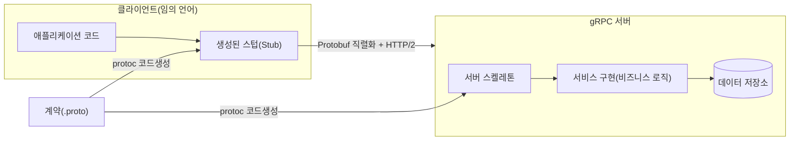
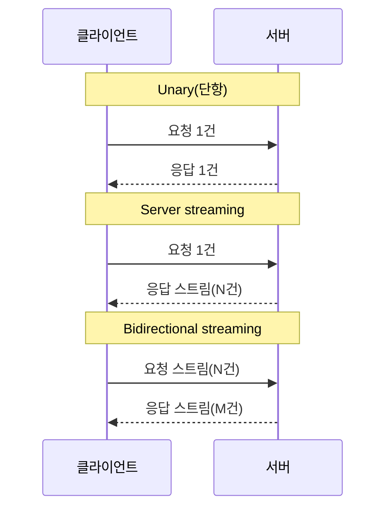

# gRPC(구글 RPC 프레임워크)

## 1. 개요

### 가. 정의

> **gRPC**는 서로 다른 프로세스·서버가 마치 로컬 함수를 호출하듯 원격의 함수를 호출하게 해 주는 **고성능 원격 프로시저 호출(RPC, Remote Procedure Call) 프레임워크**이다. 인터페이스를 **Protocol Buffers(프로토버프)** 라는 언어 중립 IDL로 정의하고, 그 정의로부터 클라이언트·서버 코드를 자동 생성하며, 전송은 **HTTP/2** 위에서 이진(binary) 직렬화로 수행한다. 2015년 구글이 사내 RPC 체계(Stubby)를 재설계해 공개했고, 현재는 CNCF(Cloud Native Computing Foundation)가 관리한다.

gRPC의 핵심 발상은 "네트워크 호출을 지역 함수 호출처럼 다루자"는 RPC 전통을 현대적 인프라 위에서 되살린 데 있다. REST가 "자원(resource)을 URL로 표현하고 HTTP 동사로 조작"하는 자원 지향인 반면, gRPC는 "무엇을 할 것인가"라는 **행위(메서드) 지향**이다. 개발자는 `GetUser(UserRequest) returns (UserReply)` 같은 서비스 계약을 먼저 선언하고, 도구가 그 계약으로부터 양쪽 언어(Go·Java·Python·C++ 등)의 스텁(stub)을 생성해 준다. 그 결과 클라이언트는 네트워크·직렬화 세부를 몰라도 생성된 메서드를 호출하기만 하면 된다.

이 때문에 gRPC는 단순한 통신 프로토콜이 아니라 **IDL(계약)·코드 생성·직렬화·전송·인증**을 하나로 묶은 통합 규격으로 이해해야 한다. `.proto` 파일이 곧 API의 단일 진실 원천(single source of truth)이 되어, 다국어 마이크로서비스가 이 계약을 공유하며 독립적으로 개발·배포될 수 있다.

### 나. 등장 배경과 필요성

gRPC는 대규모 마이크로서비스 아키텍처(MSA)의 확산이라는 구체적 문제의식에서 태어났다. 수백~수천 개 서비스가 초당 막대한 횟수로 서로를 호출하는 환경에서, 텍스트 기반 JSON/REST는 세 가지 고질적 비용을 유발한다. 첫째는 **직렬화·페이로드 비용**으로, JSON은 사람이 읽기 좋은 대신 필드명이 매 메시지마다 반복되고 파싱이 느리다. 둘째는 **연결 비용**으로, HTTP/1.1은 요청-응답이 한 연결에서 순차적이라 대량 내부 통신에서 왕복(round-trip) 지연이 누적된다. 셋째는 **계약의 취약성**으로, REST의 JSON은 스키마 강제가 약해 필드 오탈자·타입 불일치가 런타임에야 드러난다.

gRPC는 이를 ① Protobuf 이진 직렬화로 페이로드를 대폭 줄이고, ② HTTP/2의 단일 연결 멀티플렉싱(multiplexing)으로 다수 호출을 동시 처리하며, ③ 강타입 IDL로 컴파일 시점에 계약 불일치를 잡아내는 방식으로 정면 대응한다. 특히 스트리밍(streaming)을 프로토콜 차원에서 1급 기능으로 지원해, 실시간 데이터 피드·양방향 통신처럼 REST가 다루기 어려운 패턴을 자연스럽게 표현한다.

정리하면 gRPC는 ① 저지연·고처리량 내부 통신, ② 다국어(polyglot) 서비스의 계약 기반 통합, ③ 스트리밍을 포함한 다양한 호출 모델, ④ 코드 생성을 통한 개발 생산성이라는 네 가지 필요를 동시에 겨냥한다. 다만 이진 포맷이라 사람이 바로 읽기 어렵고, 브라우저에서 직접 호출하기 어렵다는 대가를 수반하므로, 도입은 사용 맥락(내부 vs 외부 공개)에 대한 판단을 전제로 한다.

## 2. gRPC 아키텍처와 호출 흐름

gRPC 시스템은 `.proto` 계약을 컴파일러(`protoc`)로 처리해 **클라이언트 스텁**과 **서버 스켈레톤**을 생성하고, 실행 시 이 둘이 HTTP/2 채널로 연결되어 메시지를 주고받는 구조다. 클라이언트는 스텁의 메서드를 호출하고, gRPC 런타임이 인자를 Protobuf로 직렬화해 HTTP/2 프레임으로 전송하며, 서버는 이를 역직렬화해 실제 구현을 실행한 뒤 응답을 같은 경로로 되돌린다.



위 구조의 요체는 **계약(.proto)이 양쪽 코드를 동시에 규정**한다는 점이다. 클라이언트와 서버가 서로 다른 언어·팀이어도 같은 `.proto`를 공유하므로, 필드 추가·타입 변경 같은 계약 변화가 코드 생성 단계에서 양쪽에 일관되게 반영된다. 이는 "문서와 구현의 불일치"라는 API 운영의 고질병을 구조적으로 줄여 준다.

gRPC 호출은 전송 계층에서 **HTTP/2**에 강하게 의존한다. HTTP/2가 제공하는 ① 하나의 TCP 연결에서 여러 요청을 동시에 실어 나르는 스트림 멀티플렉싱, ② 헤더 압축(HPACK), ③ 서버 푸시·흐름 제어가 gRPC의 저지연·스트리밍을 가능하게 하는 토대다. 아래 표는 REST(HTTP/1.1·JSON) 대비 전송·직렬화 특성을 개념적으로 비교한 것이나, 실제 성능 차는 메시지 크기·언어·네트워크에 따라 달라지므로 절대적 수치가 아니라 경향으로 이해해야 한다.

| 구분 | gRPC | 전통적 REST(HTTP/1.1) |
|------|------|------------------------|
| 계약(IDL) | `.proto`(강타입, 필수) | OpenAPI(선택, 느슨) |
| 직렬화 | Protobuf(이진) | JSON(텍스트) |
| 전송 | HTTP/2(멀티플렉싱) | 주로 HTTP/1.1 |
| 스트리밍 | 4종 기본 지원 | 별도(SSE/WebSocket) |
| 가독성 | 낮음(이진) | 높음(사람이 읽음) |
| 브라우저 직접 호출 | 제한적(gRPC-Web 필요) | 용이 |

## 3. 핵심 구성요소 — Protobuf·서비스 계약·4가지 호출 모델

gRPC의 뼈대는 **Protocol Buffers**로 기술하는 강타입 메시지·서비스 정의다. `.proto` 파일에서 메시지(데이터 구조)와 서비스(호출 가능한 메서드 집합)를 선언하며, 각 필드에는 **필드 번호(tag)** 를 부여한다. 이 번호는 이진 인코딩의 키가 되므로, 한 번 배포된 번호는 재사용하지 않는 것이 하위 호환의 핵심 규칙이다. 예컨대 다음과 같이 정의한다.

```protobuf
syntax = "proto3";
message UserRequest { int32 id = 1; }
message UserReply { int32 id = 1; string name = 2; }
service UserService {
  rpc GetUser(UserRequest) returns (UserReply);
}
```

여기서 필드 번호(1, 2)는 순서·이름이 바뀌어도 유지되므로, **새 필드를 큰 번호로 추가**하는 진화적 변경이 기존 클라이언트를 깨뜨리지 않는다. 이 "번호 기반 하위 호환"이 REST의 JSON보다 계약 진화를 안전하게 만드는 핵심 장치다. 반대로 필드 번호를 재사용하거나 타입을 바꾸면 이진 해석이 어긋나 조용한(silent) 데이터 손상이 생길 수 있어, 조직 차원의 `.proto` 변경 규율이 반드시 필요하다.

gRPC가 규정하는 호출 모델은 네 가지이며, 이는 스트리밍을 프로토콜 1급 기능으로 끌어올린 gRPC의 차별점이다. **Unary(단항)** 는 1요청-1응답으로 REST와 유사하다. **Server streaming(서버 스트리밍)** 은 1요청에 서버가 다수 응답을 순차 전송해 대용량 조회·구독에 쓴다. **Client streaming(클라이언트 스트리밍)** 은 클라이언트가 다수 메시지를 보내고 서버가 하나로 응답해 업로드·집계에 적합하다. **Bidirectional streaming(양방향 스트리밍)** 은 양측이 독립적으로 스트림을 주고받아 채팅·실시간 협업 같은 대화형에 쓴다.



## 4. 비교와 적용 — REST·GraphQL과 어떻게 나뉘는가

gRPC를 REST·GraphQL과 나누는 기준은 "누가·어디서 호출하는가"라는 사용 맥락이다. gRPC의 강점(이진 효율·강타입·스트리밍)은 **서비스 간 내부 통신**에서 극대화되지만, 이진 포맷이라 사람이 브라우저 개발자도구로 바로 읽기 어렵고, 브라우저는 HTTP/2 프레임을 직접 다루지 못해 **gRPC-Web**이라는 프록시 계층을 거쳐야 한다. 이 때문에 실무의 지배적 패턴은 "외부 공개 API는 REST/GraphQL, 내부 마이크로서비스 간에는 gRPC"라는 역할 분담이다.

차이가 생기는 근본 이유는 최적화 목표가 다르기 때문이다. REST는 **범용성과 가독성**(웹 생태계·캐싱·사람의 이해)을, GraphQL은 **클라이언트 주도 데이터 조합**(과다/과소 인출 해소)을, gRPC는 **기계 대 기계의 저지연·고처리량**을 각각 우선한다. 따라서 어느 하나가 절대적으로 우월한 것이 아니라, 트래픽의 성격(내부/외부), 소비자(사람/기계·브라우저/서버), 데이터 패턴(단건/스트림)에 따라 선택해야 한다. 아래 표는 이 판단을 요약한다.

| 관점 | gRPC | GraphQL | REST |
|------|------|---------|------|
| 최적 사용처 | 내부 서비스 간 통신 | 다양한 클라이언트의 조합 조회 | 공개·범용 웹 API |
| 소비자 | 서버·마이크로서비스 | 웹·모바일 프런트엔드 | 광범위한 외부 |
| 성능(내부) | 매우 높음 | 중간 | 중간 |
| 스트리밍 | 강함(양방향) | Subscription | 별도 필요 |
| 학습·운영 부담 | 높음(도구·이진) | 중간 | 낮음 |

구체 적용 사례로, 넷플릭스·구글 등 대규모 사업자는 수천 개 내부 서비스 간 호출을 gRPC로 처리해 지연과 대역폭을 줄이고, 서비스 메시(Istio·Linkerd)와 결합해 관측·보안·트래픽 제어를 얹는다. 또한 **쿠버네티스** 자체가 컨트롤 플레인 컴포넌트 간 통신과 상태 저장소(etcd) 접근에 gRPC 계열 통신을 광범위하게 사용한다는 점은, gRPC가 클라우드 네이티브 인프라의 사실상 표준 내부 통신 수단으로 자리 잡았음을 보여 준다.

## 5. 심화 — 오류 처리·인증·gRPC-Web과 최신 동향

gRPC는 성공/실패를 HTTP 상태코드가 아니라 **자체 상태 코드(status code)** 로 표현한다. `OK`, `NOT_FOUND`, `INVALID_ARGUMENT`, `DEADLINE_EXCEEDED`, `UNAVAILABLE` 등 표준 코드에 메시지·상세(detail)를 실어 반환하므로, 다국어 클라이언트가 오류를 일관되게 처리할 수 있다. 또한 **데드라인/타임아웃(deadline)** 을 호출 단위로 전파(propagation)해, 상류 호출이 정한 마감 시각을 하류 서비스까지 이어받게 함으로써 대규모 호출 사슬에서의 무한 대기와 자원 고갈을 구조적으로 막는다. 보안 측면에서는 **TLS를 기본 전제**로 채널을 암호화하고, 토큰·상호 TLS(mTLS)·인터셉터(interceptor)를 통한 인증·인가·로깅을 표준적으로 결합한다.

브라우저 제약을 우회하기 위한 **gRPC-Web**은 브라우저가 보내는 HTTP/1.1 호환 요청을 프록시(Envoy 등)가 gRPC로 변환해 주는 방식이다. 다만 브라우저의 제약으로 클라이언트 스트리밍·양방향 스트리밍은 완전히 지원되지 않을 수 있어, 프런트엔드용으로는 REST/GraphQL을, 프런트-백엔드 게이트웨이 이후 내부에서는 gRPC를 쓰는 계층적 구성이 흔하다. 관련하여 **gateway** 도구로 하나의 `.proto`에서 REST(JSON)와 gRPC를 동시에 노출하는 이중 인터페이스 전략도 널리 쓰인다.

최신 동향으로는, 서비스 메시와의 결합으로 **관측성(트레이싱·메트릭)** 을 애플리케이션 코드 밖에서 확보하는 흐름, 부하 분산을 클라이언트 측에서 수행하는 **클라이언트 사이드 로드밸런싱**, 그리고 상태 없는 이벤트 처리와의 조합이 두드러진다. 다만 이러한 기능·버전·구현 세부는 계속 진화하므로, 실제 채택 시에는 해당 시점의 공식 문서로 지원 범위를 확인하는 것이 바람직하다.

## 6. 고려사항 및 시사점

기술사 관점에서 gRPC의 도입은 다음의 전략·트레이드오프를 함께 판단해야 한다.

- **적용 경계의 명확화**: gRPC는 만능 대체재가 아니라 "내부 서비스 간 저지연 통신"이라는 강점 구간이 분명하다. 외부 공개·브라우저 소비 API까지 무리하게 gRPC로 통일하면 gRPC-Web 프록시·가독성 저하로 오히려 총소유비용이 늘 수 있다. **외부는 REST/GraphQL, 내부는 gRPC**라는 계층적 표준을 아키텍처 원칙으로 못 박는 것이 현실적이다.

- **계약(.proto) 거버넌스**: 필드 번호 재사용 금지, 하위 호환 규칙, 스키마 저장소(schema registry)·CI 검증 등 `.proto` 변경을 조직 차원에서 규율해야 한다. 계약이 곧 다수 팀의 공유 자산이므로, 변경 리뷰·버전 정책·호환성 테스트를 파이프라인에 내재화하는 것이 안정 운영의 관건이다.

- **관측성·운영 성숙도**: 이진 프로토콜은 사람이 눈으로 디버깅하기 어렵다. 분산 추적(OpenTelemetry)·구조화 로깅·메트릭을 인터셉터/서비스 메시로 확보하고, 데드라인·재시도(retry)·회로차단(circuit breaker) 정책을 표준화해야 대규모 호출 사슬의 장애 전파를 통제할 수 있다.

- **조직 역량과 학습 곡선**: 코드 생성·툴체인·HTTP/2 이해 등 진입 장벽이 REST보다 높다. 파일럿 서비스로 검증하고, 사내 표준 스캐폴딩·템플릿·교육을 병행해 점진 도입하는 것이 리스크를 낮춘다.

- **전망과 연계 기술**: gRPC는 클라우드 네이티브(쿠버네티스·서비스 메시)의 사실상 내부 표준으로 정착했으며, 관측성·제로 트러스트(mTLS)·이벤트 기반 아키텍처와의 결합이 확대되는 추세다. API 게이트웨이·BFF 계층에서 프로토콜 변환(gRPC↔REST)을 흡수하는 설계가 사람·기계 양쪽 소비자를 동시에 만족시키는 실무 해법으로 자리 잡고 있다.

---

> **한 줄 요약**: gRPC는 `.proto` 강타입 계약과 코드 생성, Protobuf 이진 직렬화, HTTP/2 멀티플렉싱·스트리밍을 결합해 **마이크로서비스 간 저지연·고처리량 통신**을 실현하는 RPC 프레임워크로, 외부 공개용 REST/GraphQL과 역할을 나눠 "내부는 gRPC"라는 계층적 API 전략의 축을 이룬다.
