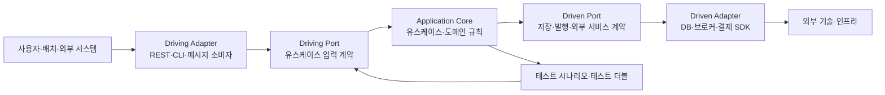
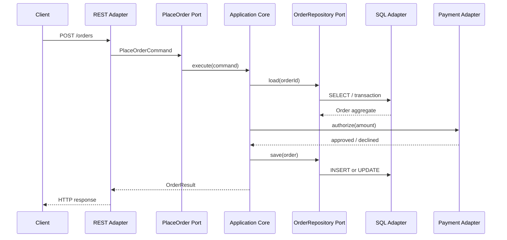

# 헥사고날 아키텍처(Hexagonal Architecture, Ports and Adapters)

## 1. 개요

> 헥사고날 아키텍처는 애플리케이션의 업무 핵심을 외부 기술과 분리하고, 목적을 표현하는 포트와 기술을 변환하는 어댑터를 통해 사용자·데이터베이스·메시지·외부 시스템과 연결하는 아키텍처 스타일이다.

기업용 소프트웨어는 업무 규칙보다 웹 프레임워크, ORM, 메시지 브로커, 클라우드 SDK의 호출 방식에 의해 구조가 결정되는 경우가 많다.
처음에는 빠르게 화면과 테이블을 만들 수 있지만, 시간이 지나면 컨트롤러에 업무 규칙이 들어가고 도메인 객체가 특정 ORM에 묶이며 테스트를 위해 실제 데이터베이스를 띄워야 하는 문제가 발생한다.
이 현상을 기술 종속과 업무 로직 오염이라고 볼 수 있다.

헥사고날 아키텍처는 애플리케이션을 가운데 두고 외부 세계를 여러 방향의 연결점으로 표현한다.
육각형이라는 모양 자체는 여섯 개의 고정 계층을 뜻하지 않으며, 다양한 대화(conversation)를 표현하기 위해 직사각형 대신 사용한 시각적 은유다.
중요한 것은 외부가 어느 방향에 있느냐가 아니라, 핵심이 포트라는 추상 계약을 통해서만 외부와 대화한다는 점이다.

포트는 애플리케이션이 제공하거나 필요로 하는 의미 있는 대화의 계약이다.
예를 들어 `주문을 생성한다`, `재고를 예약한다`, `결제 승인 결과를 저장한다`는 업무 목적을 포트로 표현할 수 있다.
어댑터는 HTTP, SQL, Kafka, 파일, 테스트 더블과 같은 기술적 입출력을 포트의 호출과 데이터로 변환한다.
따라서 같은 포트에 REST 어댑터와 CLI 어댑터를 동시에 연결할 수 있고, 저장 포트에 PostgreSQL 어댑터와 메모리 어댑터를 교체해 연결할 수 있다.

이 스타일의 목표는 단순히 폴더를 `domain`, `application`, `infrastructure`로 나누는 데 있지 않다.
핵심 목표는 의존성의 방향을 안쪽으로 향하게 하여 업무 규칙이 UI, 데이터베이스, 프레임워크의 존재를 몰라도 실행·검증될 수 있게 하는 것이다.
외부 기술이 변경되는 이유와 업무 정책이 변경되는 이유를 분리하면, 요구사항 변화가 전체 코드로 전파되는 범위를 줄일 수 있다.

적용 여부는 유행이 아니라 변화의 방향으로 판단한다.
결제수단·저장소·메시지 플랫폼·채널이 바뀌거나 여러 진입점에서 동일한 업무 규칙을 재사용해야 한다면 효과가 크다.
반대로 단순 CRUD 화면처럼 업무 규칙이 거의 없고 수명이 짧은 시스템에 과도한 포트와 어댑터를 만들면 추상화 비용만 커질 수 있다.
기술사는 기대하는 변경 격리 효과와 추가 구조의 운영·교육 비용을 함께 비교해야 한다.

## 2. 전체 개념도와 설계 원리

헥사고날 아키텍처는 하나의 고정된 계층 모델보다 핵심과 외부의 경계를 설명하는 방식이다.
안쪽에는 도메인 규칙과 유스케이스가 있고, 바깥에는 이를 호출하거나 호출받는 기술 요소가 있다.
안쪽이 바깥쪽을 직접 import하지 않는다는 규칙이 구조의 핵심이다.

위 그림에서 driving adapter는 바깥에서 안쪽으로 흐름을 시작한다.
HTTP 컨트롤러, GraphQL resolver, 스케줄러, CLI, 메시지 소비자는 요청을 입력 포트가 이해하는 명령으로 바꾼 뒤 애플리케이션 코어를 호출한다.
이 어댑터는 JSON 파싱, 인증 컨텍스트 추출, 프로토콜별 오류 응답처럼 기술적인 변환을 담당하며 할인 규칙이나 재고 불변식을 결정하지 않는다.

Driven port는 코어가 외부에 요구하는 능력을 추상화한다.
코어는 `OrderRepository`가 PostgreSQL인지 문서형 데이터베이스인지 알 필요가 없고, `PaymentGateway`가 특정 카드사 SDK인지 모의 객체인지 알 필요가 없다.
코어가 포트의 인터페이스를 소유하면 외부 구현체가 그 계약에 맞춰 연결되므로, 의존성 역전 원칙이 실제 코드의 import 방향으로 나타난다.

Driven adapter는 코어의 호출을 기술 프로토콜로 변환한다.
SQL 어댑터는 도메인 객체와 행(row)을 매핑하고, 메시지 어댑터는 도메인 이벤트를 브로커 메시지로 직렬화하며, 외부 API 어댑터는 타임아웃·재시도·오류 코드를 업무 코어가 사용할 결과로 번역한다.
이 변환 책임을 코어에 섞지 않아야 인프라의 실패 양상을 업무 정책과 분리할 수 있다.

### 2.1 내부와 외부의 경계

애플리케이션 코어는 도메인 모델과 애플리케이션 서비스로 나누어 생각할 수 있다.
도메인 모델은 금액·상태·권한·재고와 같은 업무 규칙과 불변식을 보호하고, 애플리케이션 서비스는 하나의 유스케이스를 실행하는 순서를 조정한다.
두 요소 모두 웹 프레임워크의 request 객체나 ORM의 lazy loading 같은 외부 개념을 직접 받아서는 안 된다.

업무 핵심과 기술 외부의 경계를 정할 때는 변경 이유를 질문한다.
`주문 취소 가능 시간`은 정책 변경으로 바뀌지만 `HTTP 상태 코드`는 API 계약 변경으로 바뀐다.
두 규칙이 같은 클래스에 있으면 한쪽 변경이 다른 쪽 테스트와 배포를 흔들므로, 변경 원인이 다른 요소를 포트와 어댑터 경계로 나눈다.

| 구분 | 핵심 질문 | 대표 구성 | 외부 의존성 허용 |
|---|---|---|---|
| 도메인 핵심 | 업무에서 무엇이 항상 참이어야 하는가? | 엔터티·값 객체·도메인 서비스 | 프레임워크·DB 직접 의존 금지 |
| 애플리케이션 핵심 | 유스케이스를 어떤 순서로 조정하는가? | 명령·핸들러·트랜잭션 경계 | 포트 인터페이스만 의존 |
| Driving port | 외부가 어떤 업무 기능을 요청하는가? | `PlaceOrderUseCase` | 기술 용어보다 업무 용어 사용 |
| Driven port | 코어가 어떤 외부 능력을 필요로 하는가? | `OrderRepository`, `PaymentPort` | 구현체가 아닌 계약에 의존 |
| Driving adapter | 외부 입력을 어떻게 코어 호출로 바꾸는가? | REST·CLI·소비자 | 프로토콜·인증·역직렬화 |
| Driven adapter | 코어 호출을 어떻게 외부 기술로 바꾸는가? | SQL·Kafka·SDK | 매핑·재시도·타임아웃 |

표의 구분은 배포 단위를 뜻하지 않는다.
작은 모놀리스 안에도 모든 포트와 어댑터가 존재할 수 있고, 반대로 마이크로서비스라도 코어가 외부 기술에 오염되면 헥사고날 원칙을 지키지 못한다.
아키텍처 판단은 프로세스 분리보다 의존성·책임·변경 경계의 분리에 우선순위를 둔다.

### 2.2 포트의 의미와 방향

포트는 단순한 모든 CRUD 메서드의 모음이 아니라 목적이 있는 대화의 경계다.
`save()`, `find()`, `update()`를 무차별적으로 노출하면 어댑터가 코어의 내부 자료구조를 조작하게 되므로, 유스케이스의 의도와 도메인의 불변식을 보존하는 이름과 입력을 사용한다.
예를 들어 `reserveStock(productId, quantity)`는 재고 예약이라는 정책을 드러내지만, `updateInventoryRow()`는 저장소 구조를 드러낸다.

Driving port는 코어가 외부에 제공하는 입력 계약이다.
REST와 메시지 소비자는 서로 다른 방식으로 같은 유스케이스를 호출할 수 있지만, 코어의 관점에서는 `PlaceOrderCommand`를 전달하는 동일한 대화로 통일할 수 있다.
포트가 HTTP 헤더나 브로커 offset을 알게 되면 기술 경계가 안쪽으로 침투하므로, 인증 주체·추적 ID처럼 업무 처리에 필요한 의미만 별도의 컨텍스트로 전달한다.

Driven port는 코어가 외부로부터 얻고자 하는 결과를 선언한다.
저장 포트는 영속화의 의미와 동시성 조건을 표현하고, 알림 포트는 “주문 접수 사실을 통지한다”는 목적을 표현한다.
포트의 반환값과 오류도 업무 관점으로 설계해야 하며, `SQLException`이나 특정 SDK 예외를 코어까지 그대로 전파하지 않고 재시도 가능·불가능, 중복·거절 등의 의미로 변환한다.

하나의 포트에 여러 어댑터가 연결되는 것이 이 스타일의 중요한 특성이다.
`PaymentPort`에 실제 결제 어댑터, 샌드박스 어댑터, 장애 시뮬레이터를 연결하면 운영·검증·개발 환경의 기술을 교체할 수 있다.
그러나 모든 외부 시스템마다 포트를 만들 필요는 없으며, 교체 가능성·테스트 격리·업무 의미가 있는 경계부터 추상화해야 한다.

### 2.3 의존성 역전과 조립

의존성 역전은 “추상화하자”라는 구호가 아니라 의존성의 소유권을 바꾸는 설계다.
전통적인 구조에서는 서비스가 DB 구현체를 호출하고 DB가 제공하는 API에 맞춰 업무 코드가 작성될 수 있다.
헥사고날 구조에서는 코어가 필요한 계약인 포트를 선언하고, 바깥의 어댑터가 그 포트를 구현한다.

조립(composition)은 포트와 구현 어댑터를 실행 환경에서 연결하는 단계다.
의존성 주입 컨테이너를 사용할 수 있지만, 컨테이너 자체가 헥사고날 구조를 보장하는 것은 아니다.
프로덕션 시작점에서는 `PostgresOrderRepository`, `RealPaymentAdapter`, `RestController`를 연결하고, 테스트에서는 `InMemoryOrderRepository`, `StubPaymentAdapter`를 연결한다.

조립 코드가 환경별 차이를 한 곳에서 관리하면 코어가 설정 파일이나 전역 싱글턴을 직접 읽는 일을 줄일 수 있다.
개발 환경에서만 동작하는 인메모리 어댑터를 운영에 실수로 연결하지 않도록 시작 시 설정 검증과 의존성 목록을 함께 관리한다.
어댑터의 연결이 실패했을 때 애플리케이션을 부분적으로 시작할지, 즉시 실패할지도 서비스의 가용성 요구에 맞춰 결정해야 한다.

## 3. 구성요소별 설계와 구현 절차

### 3.1 유스케이스 중심의 애플리케이션 코어

유스케이스는 사용자 화면이 아니라 업무 목적을 기준으로 정의한다.
주문 화면의 “저장 버튼”보다 `주문을 접수한다`, `결제를 취소한다`, `배송지를 변경한다`가 코어의 유스케이스 이름으로 적합하다.
이렇게 하면 REST, 모바일 앱, 배치가 같은 업무 기능을 호출할 때 표현만 달라지고 규칙은 중복되지 않는다.

애플리케이션 서비스는 입력을 검증하고, 필요한 애그리거트를 조회하며, 도메인 행동을 호출하고, 저장과 이벤트 발행의 경계를 조정한다.
다만 할인율 계산이나 주문 상태 전이처럼 업무 의미가 있는 규칙을 서비스에 모두 넣으면 도메인 모델이 빈약해진다.
서비스는 오케스트레이션을 담당하고 불변식은 도메인 객체가 보호하도록 책임을 배치한다.

유스케이스 입력은 외부 DTO와 분리한다.
외부 API가 `customer_id`를 사용하더라도 코어가 JSON 명명 규칙을 알아야 할 이유는 없으며, 어댑터가 `CustomerId`와 `Money` 같은 의미 타입으로 변환한다.
반대로 응답도 도메인 엔터티를 그대로 반환하지 않고 유스케이스 결과 DTO로 변환하여 내부 속성 누출과 직렬화 의존성을 막는다.

### 3.2 도메인 모델과 불변식

도메인 엔터티는 식별성과 생명주기를 가지며, 값 객체는 값과 검증 규칙으로 의미가 완성된다.
`Order`가 `CANCELLED` 상태에서 결제를 다시 승인하지 못하게 하는 규칙은 도메인 내부에 있어야 한다.
컨트롤러의 if 문에만 이 규칙이 있으면 배치 어댑터나 메시지 어댑터가 우회할 때 잘못된 상태가 만들어진다.

도메인 모델은 데이터베이스 테이블의 복사본이 아니다.
한 테이블의 모든 컬럼을 공개 속성으로 만들면 누구나 상태를 직접 바꿀 수 있어 불변식이 약해진다.
상태 변경을 `cancel(reason)`, `confirmPayment(reference)`처럼 의미 있는 행동으로 제한하고, 유효하지 않은 전이는 명시적인 도메인 오류로 거부한다.

도메인 이벤트는 코어 안에서 의미 있는 사실을 표현한다.
`OrderPlaced`는 “이제 재고·알림·정산이 반응할 수 있는 사건이 발생했다”는 뜻이며, 소비자에게 특정 구현 명령을 강제하지 않는다.
이벤트를 외부 브로커로 발행할 때는 직렬화 어댑터가 스키마 버전·추적 ID·중복 처리 키를 추가하되, 도메인 모델이 Kafka 헤더를 알게 해서는 안 된다.

### 3.3 저장소 포트와 영속성 어댑터

저장소 포트는 도메인이 필요로 하는 조회와 저장의 의미를 표현한다.
애그리거트를 복원하는 포트와 분석 화면의 대량 조회 포트는 요구하는 성능·형태·일관성이 다르므로, 하나의 만능 리포지터리에 모두 넣지 않는 편이 좋다.
읽기 모델이 단순한 투영이라면 별도 query port로 두어 쓰기 도메인 모델의 복잡성과 분리할 수 있다.

SQL 어댑터는 행과 도메인 객체 사이의 매핑을 담당한다.
ORM의 엔터티 어노테이션을 도메인 객체에 직접 넣는 방식은 초기 생산성을 높일 수 있으나, 지연 로딩·프록시·영속성 생명주기가 업무 규칙에 침투할 수 있다.
조직의 기술 역량과 성능 요구에 따라 ORM을 사용하더라도 도메인 모델과 매핑 전략의 결합 정도를 의식적으로 결정한다.

트랜잭션 경계는 유스케이스의 일관성 요구와 연결한다.
`주문 저장`과 `결제 승인`을 하나의 로컬 트랜잭션으로 묶을 수 없다면, 승인 실패 보상·재시도·멱등성·상태 조회를 유스케이스와 포트에 명시한다.
어댑터가 데이터베이스 트랜잭션을 제공하더라도 외부 결제 시스템의 원자성까지 자동으로 보장하지는 않는다.

### 3.4 외부 시스템 어댑터의 변환 책임

어댑터는 단순 전달 코드처럼 보이지만, 경계에서 의미를 보존하는 번역기다.
외부 결제사가 `AUTHORIZED`, `PENDING`, `DECLINED`를 반환할 때 코어가 이 문자열을 그대로 사용하지 않고 승인됨·처리중·거절됨과 같은 내부 상태로 변환한다.
외부 시스템의 명칭과 오류 체계가 내부 모델을 오염시키지 않도록 매핑 표와 계약 테스트를 관리한다.

네트워크 어댑터는 타임아웃과 재시도 정책을 가진다.
재시도가 안전한 조회와 중복 결제를 일으킬 수 있는 승인 요청은 같은 정책을 적용할 수 없다.
멱등성 키, 재시도 가능 오류, 지수 백오프, 회로 차단, 보상 조회를 포트 계약과 운영 지표에 연결해야 한다.

메시지 어댑터는 기술 메시지와 업무 이벤트를 분리한다.
브로커의 offset이 커밋되었다고 업무 처리가 완료된 것은 아니며, 처리 실패 시 재처리와 격리 큐를 고려해야 한다.
소비자는 같은 이벤트를 두 번 받을 수 있다고 가정하고 이벤트 ID나 업무 키를 기준으로 멱등성을 확보한다.

### 3.5 단계별 도입 절차

첫째, 변경이 잦고 업무 위험이 큰 유스케이스를 선정한다.
전체 시스템을 한 번에 재작성하기보다 결제, 권한, 주문 취소처럼 테스트와 교체 효과가 명확한 흐름을 대상으로 현재 의존성과 장애 지점을 그린다.
도입 대상의 성공 기준에는 테스트 실행시간, 변경 파일 범위, 외부 기술 교체 가능성, 장애 격리 정도를 포함한다.

둘째, 도메인 언어와 유스케이스를 정리한다.
업무 담당자와 상태·행동·오류·예외를 합의하고, 기술 테이블명이나 화면명만으로 포트를 설계하지 않는다.
정의된 용어가 코드·API·테스트·운영 대시보드에서 일관되게 사용되는지 확인한다.

셋째, 입력 포트와 출력 포트를 분리해 선언한다.
각 포트의 호출자·소유자·입출력·오류·시간 제한·일관성 요구를 문서화한다.
포트가 너무 크면 모든 변경이 같은 인터페이스에 집중되고, 너무 작으면 의미 없는 추상화가 늘어나므로 유스케이스와 교체 가능성을 기준으로 적정 세분화를 찾는다.

넷째, 코어를 외부 기술 없이 실행하는 단위 테스트를 만든다.
인메모리 저장소와 테스트 결제 어댑터를 사용해 정상·실패·경계 조건을 검증하고, 테스트가 빠르게 반복되는지 확인한다.
그 후 실제 DB·메시지·외부 API를 사용하는 어댑터 통합 테스트와 계약 테스트를 추가한다.

다섯째, 조립과 관측성을 운영 수준으로 만든다.
환경별 어댑터 연결, 설정 검증, 추적 ID, 포트별 지연시간, 외부 오류율, 재시도 횟수, 격리 큐를 운영 대시보드에서 확인할 수 있어야 한다.
구조를 분리했어도 측정할 수 없으면 장애 때 경계가 실제로 도움이 되었는지 판단하기 어렵다.

## 4. 테스트·품질·운영 설계

### 4.1 테스트 피라미드와 포트 테스트

헥사고날 구조의 가장 직접적인 이점은 핵심 업무 규칙을 기술 환경과 분리해 테스트할 수 있다는 점이다.
도메인 단위 테스트는 DB나 HTTP 서버 없이 상태 전이와 불변식을 확인하고, 유스케이스 테스트는 포트의 테스트 더블을 통해 호출 순서·실패 처리·트랜잭션 의미를 확인한다.
테스트가 빠르다고 해서 실제 어댑터의 매핑 오류가 사라지는 것은 아니므로 계층별 목적을 분리한다.

| 테스트 수준 | 대상 | 주요 더블·환경 | 확인할 질문 |
|---|---|---|---|
| 도메인 단위 테스트 | 값 객체·엔터티·정책 | 외부 의존성 없음 | 잘못된 상태를 거부하는가? |
| 유스케이스 테스트 | 애플리케이션 서비스 | 인메모리 포트·스텁 | 입력과 출력, 오류 흐름이 맞는가? |
| 어댑터 통합 테스트 | SQL·HTTP·메시지 어댑터 | 실제 또는 호환 인프라 | 매핑·타임아웃·직렬화가 맞는가? |
| 계약 테스트 | 포트와 외부 계약 | 소비자·공급자 계약 | 변경 시 양쪽이 호환되는가? |
| 종단 간 테스트 | 주요 업무 시나리오 | 운영 유사 환경 | 조립된 시스템이 목표 흐름을 완수하는가? |

테스트 더블은 편리하지만 실제 인프라의 동시성·제약조건·지연을 재현하지 못할 수 있다.
예를 들어 인메모리 저장소는 SQL의 unique 제약이나 격리 수준을 자동으로 흉내 내지 않는다.
따라서 코어의 규칙은 빠른 테스트로 보호하되, 어댑터의 현실적 실패는 컨테이너 기반 통합 테스트와 장애 시험으로 보완한다.

### 4.2 계약과 오류의 설계

포트 계약은 성공 결과만 정의하면 부족하다.
외부 결제 지연, 저장 충돌, 인증 만료, 메시지 중복, 스키마 버전 불일치가 발생했을 때 코어가 어떤 업무 상태를 만들고 어댑터가 어떤 복구 경로를 택하는지 정의해야 한다.
오류는 사용자에게 보여 줄 메시지, 재시도 가능성, 감사 대상, 운영 알람 수준으로 나누어 관리할 수 있다.

API 어댑터는 HTTP 400·409·429·500 같은 응답을 업무 오류와 기술 오류로 구분한다.
동일한 500 응답이라도 일시적인 외부 장애인지 영구적인 계약 위반인지에 따라 재시도 전략이 달라진다.
코어가 HTTP 숫자를 직접 판단하지 않고 의미 있는 오류 타입을 반환하면 REST 어댑터·메시지 어댑터·배치 어댑터가 각자 적합한 표현으로 변환할 수 있다.

### 4.3 보안과 관측성

경계가 많아지면 보안 책임도 늘어난다.
입력 어댑터는 인증·인가 정보를 검증하고, 코어는 호출 주체가 유스케이스를 실행할 권한이 있는지 업무 맥락에서 확인한다.
외부 어댑터는 비밀을 로그에 남기지 않고, 민감한 요청·응답을 마스킹하며, 포트 호출마다 필요한 최소 권한의 자격 증명을 사용한다.

관측성은 코어와 어댑터의 경계를 따라 설계한다.
유스케이스 이름, 포트 이름, 외부 호출 대상, 재시도 횟수, 상관관계 ID를 추적하면 “주문 접수” 자체가 느린지 “결제 어댑터”가 느린지 구분할 수 있다.
단, 업무 개인정보를 추적 ID에 넣지 말고 데이터 보존 기간과 접근 권한을 함께 정한다.

## 5. 유사 아키텍처와의 비교

### 5.1 계층형 아키텍처와 비교

전통적 계층형 아키텍처는 프레젠테이션·서비스·데이터 접근 계층을 수직으로 배치한다.
구조가 이해하기 쉽고 CRUD 시스템에 빠르게 적용할 수 있지만, 상위 서비스가 하위 ORM이나 DB 모델에 직접 의존하면 업무 규칙이 저장 방식에 끌려갈 수 있다.
또한 하나의 진입점만을 전제로 설계하면 배치와 메시지 처리에서 규칙이 복제될 수 있다.

헥사고날 아키텍처도 계층을 사용할 수 있지만, 계층 이름보다 코어의 독립성과 포트의 소유권을 강조한다.
계층형 구조에서 서비스가 리포지터리 구현체를 호출한다면 의존성은 바깥으로 향할 수 있지만, 헥사고날 구조에서는 코어가 포트를 정의하고 어댑터가 구현한다.
따라서 둘은 상호 배타적이라기보다 계층형을 의존성 역전과 입출력 경계로 보강한 관계로 이해할 수 있다.

### 5.2 클린 아키텍처·양파 아키텍처와 비교

클린 아키텍처와 양파 아키텍처도 도메인과 외부 기술을 분리하고 의존성이 안쪽으로 향해야 한다는 원칙을 공유한다.
용어와 그림의 층수는 다를 수 있지만, 세 접근법 모두 프레임워크·UI·DB를 정책보다 바깥에 둔다.
헥사고날은 입력과 출력의 대칭성, 포트의 목적, 여러 어댑터의 교체 가능성을 직관적으로 강조한다.

실무에서는 세 접근법을 혼합해 사용할 수 있다.
예를 들어 도메인 중심의 양파 구조 안에서 헥사고날 포트를 정의하고, 클린 아키텍처의 유스케이스 인터랙터와 엔터프라이즈 규칙을 사용한다.
중요한 것은 명칭을 맞추는 것이 아니라 테스트 가능한 코어, 명확한 경계, 제어 가능한 의존성, 운영 가능한 조립을 확보하는 것이다.

| 비교 항목 | 계층형 | 헥사고날 | 클린·양파 계열 |
|---|---|---|---|
| 중심 관심 | 책임별 계층 | 포트와 어댑터의 경계 | 안쪽 정책과 의존성 규칙 |
| 입출력 관점 | 주로 UI→서비스→DB | driving·driven을 대칭으로 취급 | 경계·유스케이스로 표현 |
| 핵심 장점 | 단순성·학습 용이 | 기술 교체·테스트 격리 | 정책 독립성과 확장성 |
| 주요 위험 | DB·프레임워크 침투 | 과도한 인터페이스·보일러플레이트 | 구조 복잡성과 계층 오해 |
| 적합 상황 | 단순 CRUD·짧은 수명 | 복잡한 규칙·다중 연계 | 장기 제품·변화 많은 시스템 |

### 5.3 마이크로서비스와의 관계

헥사고날 아키텍처와 마이크로서비스는 서로 다른 차원의 결정이다.
전자는 한 애플리케이션 내부의 의존성과 경계를 다루고, 후자는 배포·운영·소유권을 분리하는 시스템 구성 방식이다.
하나의 모놀리스도 헥사고날일 수 있고, 여러 마이크로서비스 각각도 헥사고날일 수 있다.

마이크로서비스 안에서 헥사고날 원칙을 적용하면 외부 API·메시지·DB가 서비스의 업무 코어를 직접 공유하지 않게 된다.
그러나 서비스 경계를 잘못 나누면 포트와 어댑터를 아무리 정리해도 서비스 간 호출이 많아져 분산 모놀리스가 된다.
도메인 경계, 데이터 소유권, 독립 배포 가능성, 장애 격리를 먼저 판단하고 내부 구조는 그 목적을 지원하도록 설계한다.

## 6. 적용 사례

### 6.1 온라인 주문·결제 시스템 사례

온라인 주문 시스템에서 `PlaceOrder`를 driving port로 정의하고, REST·모바일·배치 어댑터가 주문 명령을 전달하도록 설계할 수 있다.
코어는 재고 확인, 할인 적용, 주문 상태 전이, 결제 승인 요청의 순서를 조정하지만 HTTP 헤더나 카드사 SDK를 직접 다루지 않는다.
`PaymentPort`에 실제 카드사 어댑터와 테스트 결제 어댑터를 연결하면 결제 승인 성공·거절·지연을 독립적으로 검증할 수 있다.

예를 들어 피크 시간에 주문 API가 초당 2,000건의 요청을 받는다는 가정에서, 코어 테스트는 서버 수나 데이터베이스 연결 수와 무관하게 빠르게 실행되어야 한다.
실제 부하 시험은 SQL·캐시·결제 어댑터를 포함한 조립 환경에서 수행하며, 포트 경계는 테스트 속도와 장애 위치를 구분하는 데 도움을 준다.
결제 승인이 외부에서 비동기로 끝난다면 `PAYMENT_PENDING` 상태를 명시하고, 동일한 결제 키가 재전송되어도 중복 승인되지 않도록 멱등성 정책을 둔다.

이 사례에서 가장 중요한 트레이드오프는 추상화의 수와 결제 실패의 정확성이다.
모든 SDK 메서드를 포트로 감싸면 코어는 복잡해지고 외부 구현의 장점이 사라질 수 있다.
반면 승인·취소·조회처럼 업무 위험이 큰 기능은 포트로 감싸고, 단순한 로깅 라이브러리처럼 교체 효과가 낮은 기술은 외부 계층에 제한적으로 직접 사용한다.

### 6.2 제조 설비 모니터링 사례

공장 설비 모니터링 애플리케이션은 MQTT 소비자, 파일 수집기, 시뮬레이터가 동일한 `ReceiveTelemetry` 입력 포트를 호출하도록 만들 수 있다.
코어는 센서 값의 단위 변환, 이상 징후 판정, 경보 조건, 설비 상태 전이를 관리하고 특정 장비 제조사의 메시지 형식을 알지 않는다.
시계열 데이터베이스 어댑터와 현장 임시 저장 어댑터를 `TelemetryStore` 포트에 연결하면 네트워크 단절 시 버퍼링 정책을 교체할 수 있다.

예를 들어 온도 섭씨 값이 80도를 넘고 3회 연속 관측되면 경보 이벤트를 만든다는 규칙은 도메인 테스트로 검증한다.
MQTT 재연결 간격, QoS, 메시지 중복, 시계열 저장 지연은 어댑터 통합·장애 시험으로 검증한다.
이렇게 규칙과 통신 장애를 나누면 센서 교체가 경보 정책의 회귀 테스트를 불필요하게 흔들지 않는다.

단, 현장 시스템에서는 실시간성·안전성이 핵심이므로 단순한 포트 분리만으로 충분하지 않다.
오프라인 동작, 시간 순서 역전, 장치 인증, 명령 재전송, 안전 정지와 같은 운영 조건을 포트 계약과 상태 모델에 포함해야 한다.
어댑터 추상화가 실제 장치의 실패 특성을 숨겨 안전 판단을 방해하지 않도록, 실패 모드와 보수적 기본값을 명시한다.

### 6.3 공공 민원 서비스 사례

공공 민원 서비스는 웹 포털, 모바일, 상담원 화면, 야간 배치가 같은 `SubmitApplication` 유스케이스를 호출할 수 있다.
입력 어댑터는 채널별 인증과 파일 업로드를 처리하고, 코어는 신청 자격·서류 상태·처리 기한·담당 기관 배정 규칙을 관리한다.
전자문서 보관, 알림톡, 행정정보 연계는 각각 driven port의 어댑터로 두어 특정 채널이나 기관 시스템의 변경을 격리한다.

예를 들어 신청 접수 후 24시간 이내에 담당 기관이 배정되어야 한다는 정책은 코어의 시간 규칙과 배치 어댑터의 스케줄링을 분리해 다룬다.
실제 행정 연계가 일시 중단되면 신청을 유실하지 않고 `연계 대기` 상태로 보존하며, 재처리와 담당자 알림을 통해 업무 연속성을 유지한다.
민원인의 개인정보는 포트 DTO와 로그에서 최소화하고, 어댑터별 보존·마스킹 정책을 적용한다.

## 7. 심화: DDD·이벤트 기반·클라우드 네이티브와의 연계

### 7.1 DDD와의 결합

헥사고날 아키텍처는 외부 연결의 방향과 기술 격리를 설명하고, DDD는 코어 안의 모델과 경계를 설명한다.
따라서 복잡한 업무 시스템에서는 바운디드 컨텍스트를 애플리케이션 경계로 삼고, 각 컨텍스트의 유스케이스를 driving port로, 외부 통합을 driven port로 표현할 수 있다.

그러나 포트와 어댑터를 도입했다고 도메인 모델이 자동으로 좋아지는 것은 아니다.
테이블과 API를 그대로 인터페이스로 복사하면 내부 모델은 여전히 기술 중심으로 남는다.
유비쿼터스 언어, 애그리거트 불변식, 컨텍스트 간 이벤트와 번역 규칙을 함께 설계해야 외부 기술 격리가 업무 의미의 보호로 이어진다.

### 7.2 이벤트 기반 통합과 최종 일관성

이벤트 어댑터를 사용하면 코어와 소비자의 시간적 결합을 낮출 수 있지만, 즉시 일관성은 약해질 수 있다.
주문 코어가 `OrderPlaced`를 발행해 재고·알림·정산이 각각 처리한다면 소비자 실패, 중복, 순서 역전, 스키마 진화에 대응해야 한다.
아웃박스와 재처리 큐는 저장과 발행 사이의 유실을 줄이는 방법이며, 소비자 멱등성은 중복의 영향을 줄이는 방법이다.

이벤트를 선택할 때는 모든 메서드 호출을 이벤트로 바꾸지 않는다.
다른 컨텍스트가 알아야 하는 업무 사실과 단순 내부 상태 변경을 구분하고, 사실의 소유자와 스키마 버전 정책을 정한다.
동기 포트가 적합한 즉시 승인 업무를 무리하게 비동기로 만들면 사용자 경험과 보상 로직이 복잡해질 수 있다.

### 7.3 클라우드 네이티브 운영

컨테이너와 서버리스 환경에서는 외부 인프라가 더 자주 교체되고, 장애가 부분적으로 발생한다.
헥사고날 구조는 DB·메시지·외부 API 어댑터를 운영 구성과 분리하여, 개발·테스트·스테이징·프로덕션의 연결 차이를 명확히 하는 데 도움을 준다.
다만 네트워크 호출이 늘면서 타임아웃, 회로 차단, 속도 제한, 추적 전파, 비용 계측을 포트의 비기능 계약으로 다뤄야 한다.

어댑터 교체 가능성은 곧바로 멀티클라우드 이식성을 의미하지 않는다.
데이터 이전, 관리형 서비스의 기능 차이, 규제와 지역성, 운영팀의 역량이 실제 이동 비용을 결정한다.
기술사는 “교체 가능”이라는 구조적 가능성과 “경제적으로 이동할 수 있음”이라는 사업적 가능성을 구분해 평가한다.

### 7.4 예상 출제 방향과 답안 구성 전략

시험 답안에서는 정의만 쓰지 말고 문제 상황과 해결 원리를 연결한다.
먼저 웹·DB·외부 시스템에 업무 로직이 종속되는 문제를 제시하고, 핵심·포트·어댑터·의존성 역전의 구조를 전체 개념도로 보여준다.
그 다음 driving과 driven의 구분, 포트 설계, 어댑터 변환, 테스트와 운영의 효과를 사례와 함께 전개하면 논술형 흐름이 자연스럽다.

비교 문제에서는 계층형·클린·양파 아키텍처와의 공통 원칙과 차이를 설명하고, 단순 CRUD에 대한 과잉 설계 위험을 반드시 언급한다.
사례에서는 결제·IoT·공공 서비스 중 하나를 택해 입력 어댑터와 출력 어댑터, 핵심 불변식, 장애 대응, 테스트 전략을 구체화한다.
마지막으로 기술사 관점의 고려사항에서 조직 역량, 관측성, 보안, 비용, 점진적 도입을 제시하면 기술 선택의 균형을 드러낼 수 있다.

## 8. 고려사항 및 시사점

### 8.1 추상화 비용과 적정 경계

모든 외부 클래스에 인터페이스를 하나씩 추가하는 것이 목표는 아니다.
교체 가능성, 테스트 필요성, 업무 의미, 장애 격리 효과가 낮은 요소까지 포트로 만들면 코드 탐색과 유지보수 비용이 늘어난다.
핵심 유스케이스·고위험 외부 연계·변화가 예상되는 경계를 우선 추상화하고, 반복되는 실제 문제를 근거로 경계를 확장한다.

### 8.2 포트의 안정성과 계약 진화

포트는 내부 구현을 숨기지만, 잘못 설계하면 외부 DTO와 기술 용어를 그대로 고정하는 또 다른 결합점이 된다.
포트의 이름·입력·출력·오류·시간 제한·멱등성 조건을 업무 언어로 문서화하고, 버전 변화와 하위 호환 정책을 계약 테스트로 관리한다.
계약을 자주 바꿔야 한다면 포트가 너무 낮은 수준의 기술 호출을 노출하고 있는지 재검토한다.

### 8.3 데이터 일관성과 트랜잭션

저장 포트와 외부 서비스 포트를 분리했다고 분산 트랜잭션 문제가 해결되는 것은 아니다.
로컬 트랜잭션, 보상 트랜잭션, 최종 일관성, 중복 처리, 읽기 시점의 상태를 유스케이스별로 명시해야 한다.
사용자에게 표시하는 상태와 내부 재처리 상태를 구분하고, 정합성 위반을 탐지할 대사·보정 작업을 운영 프로세스에 포함한다.

### 8.4 보안·개인정보 보호

어댑터는 외부 입력과 자격 증명이 들어오는 경계이므로 입력 검증, 인증서 검증, 비밀 관리, 최소 권한, 출력 마스킹을 적용한다.
도메인 객체를 로그에 그대로 출력하면 개인정보가 경계를 넘어 유출될 수 있으므로 안전한 로그 DTO와 필드 분류 체계를 사용한다.
외부 연계가 국외 리전에 저장하거나 제3자 처리자에게 전달하는 경우에는 기술 구조뿐 아니라 법적 근거와 보존 정책을 검토한다.

### 8.5 장애·성능·운영성

어댑터마다 타임아웃과 재시도 기본값을 복사하면 장애 폭주가 발생할 수 있다.
호출별 예산, 동시성 제한, 회로 차단, 격리 풀, 대체 경로, 알람 기준을 시스템의 서비스 수준 목표와 연결한다.
포트별 지연·오류·재시도·큐 적체를 측정해 어느 경계가 병목인지 확인하고, 추상화가 성능 문제를 숨기지 않도록 실제 부하를 시험한다.

### 8.6 점진적 전환과 조직 역량

레거시 시스템을 전면 재작성하는 방식은 업무 지식과 운영 안정성을 동시에 잃을 위험이 있다.
변경이 잦은 유스케이스부터 포트로 감싸고, 기존 기능을 어댑터로 둘러싼 뒤 테스트를 확보하면서 점진적으로 코어를 정리하는 방식이 안전하다.
개발자만이 아니라 운영·보안·데이터 담당자가 포트의 실패 계약과 관측 지표를 이해해야 구조가 실제 운영에서 유지된다.

## 참고자료

- Alistair Cockburn, [Hexagonal Architecture](https://alistair.cockburn.us/hexagonal-architecture)
- AWS Prescriptive Guidance, [Hexagonal architecture pattern](https://docs.aws.amazon.com/prescriptive-guidance/latest/cloud-design-patterns/hexagonal-architecture.html)
- Martin Fowler, [Microservices](https://martinfowler.com/articles/microservices.html)

---

> **한 줄 요약**: 헥사고날 아키텍처는 업무 핵심이 포트라는 목적 중심 계약만 바라보게 하고 어댑터로 기술을 교체·격리하여 테스트 가능성, 변경 용이성, 장애 대응력을 높이는 설계 방식이다.
