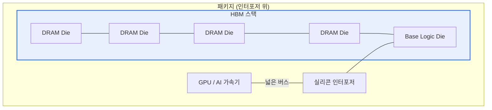

# 고대역 초고속 메모리(HBM, High Bandwidth Memory)

## 1. 개요

### 가. 정의
> DRAM 다이를 **수직으로 적층(3D Stacking)** 하고 **TSV(Through-Silicon Via, 실리콘 관통 전극)** 로 연결하여, 매우 넓은 I/O 폭(1024bit 이상)으로 **초고대역폭·저전력**을 실현한 메모리. AI·HPC·GPU의 메모리 병목 해소를 위해 프로세서와 함께 패키징된다.

HBM의 발상은 "**메모리를 더 빠르게 돌리는(주파수↑)** 대신 **한 번에 더 넓게 실어 나른다(버스 폭↑)**"는 것이다. 신호 주파수를 계속 높이면 전력·발열이 급증하지만, 버스 폭을 넓히면 낮은 클럭으로도 총 대역폭을 크게 늘릴 수 있다. 적층과 TSV는 바로 이 넓은 버스를 물리적으로 가능하게 하는 수단이다.

### 나. 등장 배경 및 필요성
AI 모델과 HPC 연산이 커지면서, 연산 유닛(GPU)의 처리 속도는 빠르게 향상됐지만 **데이터를 메모리에서 연산기로 실어 나르는 속도**가 이를 따라가지 못하는 이른바 **메모리 월(Memory Wall)** 이 병목으로 부상했다. GPU가 아무리 빨라도 필요한 데이터가 제때 도착하지 못하면 연산기가 놀게 된다. 기존 GDDR은 버스 폭과 전력 측면에서 한계가 있어, 넓은 I/O를 짧은 배선으로 확보할 수 있는 3D 적층 메모리가 요구됐고, 그 결과가 HBM이다.

## 2. 구조



구조의 핵심은 세 가지다. 첫째, **TSV** 는 적층된 DRAM 다이를 수직으로 관통해 연결하므로, 옆으로 길게 도는 배선 대신 짧은 수직 경로로 신호를 전달한다. 배선이 짧아지면 저항·기생 성분이 줄어 **더 낮은 전압으로도 신호가 안정**되고, 이것이 저전력의 근거가 된다. 둘째, 이렇게 수직 연결된 스택은 수천 개의 I/O 핀을 확보해 **1024bit 이상의 초광폭 버스**를 만든다. 셋째, HBM 스택과 GPU는 **실리콘 인터포저** 위에 나란히 얹혀(2.5D 패키징) 초광폭 버스로 이어진다. 일반 PCB로는 이 많은 배선을 감당할 수 없어, 미세 배선이 가능한 인터포저가 필수다.

- **TSV**로 적층 다이를 수직 관통 연결 → 짧은 배선·넓은 I/O
- **인터포저(2.5D)** 로 GPU와 근접 배치 → 광폭 버스 물리적 구현

## 3. 특징

| 항목 | 내용 | 원리(왜) |
|---|---|---|
| **초고대역폭** | GDDR 대비 수 배 대역폭 | 넓은 버스 폭(1024bit+)으로 낮은 클럭에도 총량↑ |
| **저전력** | 비트당 에너지↓ | 짧은 TSV 배선·낮은 전압 구동 |
| **소형 폼팩터** | 면적 절감, 프로세서 근접 배치 | 수직 적층으로 평면 면적 최소화 |
| **고비용·발열** | 단가·수율·방열 부담 | 복잡한 2.5D 패키징·적층 다이 열밀도↑ |

특히 **발열**이 왜 HBM의 최대 난제인가 하면, 여러 다이를 수직으로 쌓으면 아래층 다이의 열이 위층을 통과해 빠져나가야 하는데 적층 구조는 열이 갇히기 쉽다. 열밀도가 높아지면 성능·수명이 떨어지므로, 어드밴스드 패키징과 방열 설계가 양산의 핵심 관건이 된다.

## 4. 세대별 대역폭 추이 (스택당, 근사치)

```chart
{
  "type": "bar",
  "data": {
    "labels": ["HBM2", "HBM2E", "HBM3", "HBM3E"],
    "datasets": [{
      "label": "대역폭 (GB/s, 스택당)",
      "data": [307, 460, 819, 1230],
      "backgroundColor": ["#a9c5f5", "#7aa5f3", "#4d86ef", "#2f6fed"]
    }]
  },
  "options": {
    "plugins": { "legend": { "display": false }, "title": { "display": true, "text": "HBM 세대별 대역폭 (근사치)" } },
    "scales": { "y": { "title": { "display": true, "text": "GB/s" }, "beginAtZero": true } }
  }
}
```

세대가 올라갈수록 대역폭이 계단식으로 뛰는 것은 적층 단수 증가(예: 8단→12단)와 핀당 속도 향상이 함께 작용하기 때문이다. HBM2에서 HBM3E로 오며 스택당 대역폭이 약 4배로 늘었는데, 이는 AI 학습·추론에서 초대형 파라미터를 메모리와 주고받는 처리량을 그만큼 끌어올려 준다. 다만 단수를 높일수록 앞서 언급한 발열·수율 부담이 함께 커진다는 점이 세대 전환의 제약이다.

## 5. 고려사항 및 시사점
- **AI 반도체의 핵심 병목 부품**: HBM은 GPU·NPU의 성능을 실질적으로 좌우하며, 공급 능력이 곧 AI 인프라 경쟁력으로 직결된다. 실제로 HBM 공급이 AI 가속기 출하의 병목으로 지목될 만큼 전략 부품이 되었다.
- **메모리 중심 컴퓨팅으로의 진화**: 데이터 이동 자체가 전력·지연의 주범이므로, 메모리에서 직접 연산하는 **PIM(Processing-in-Memory)** 이나 메모리 풀링을 지원하는 **CXL** 과 결합해, 데이터를 덜 옮기는 방향으로 아키텍처가 진화하고 있다.
- **양산 관건은 패키징·수율**: 다이 적층·TSV·인터포저 결합의 난도가 높아 수율 확보가 어렵고, 어드밴스드 패키징 역량이 경쟁 우위의 원천이 된다.
- **트레이드오프**: 초고대역폭·저전력을 얻는 대가로 단가와 발열·설계 복잡도가 크게 오르므로, 대역폭이 성능을 좌우하는 AI·HPC 영역에 집중 채택되고 일반 소비자용에는 여전히 GDDR이 쓰인다.

---

> **한 줄 요약**: HBM은 *DRAM을 TSV로 3D 적층하고 인터포저로 프로세서에 근접 배치*해 초광폭 버스로 초고대역폭·저전력을 실현한 메모리로, **AI·HPC의 메모리 월(Memory Wall)** 을 해소하는 핵심 부품이며 발열·수율·패키징이 양산의 관건이자 PIM·CXL로 확장되고 있다.
