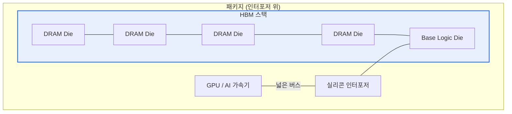

# 고대역 초고속 메모리(HBM, High Bandwidth Memory)

## 1. 개요

### 가. 정의
> DRAM 다이를 **수직으로 적층(3D Stacking)** 하고 **TSV(Through-Silicon Via)** 로 연결하여, 넓은 I/O 폭으로 초고대역폭·저전력을 실현한 메모리. AI·HPC·GPU의 메모리 병목 해소용으로 사용된다.

### 나. 등장 배경
- AI 연산량 급증 → GPU 대비 **메모리 대역폭 병목(Memory Wall)**
- 기존 GDDR의 대역폭·전력 한계 극복 필요

## 2. 구조



- **TSV**로 적층 다이를 수직 관통 연결 → 짧은 배선·넓은 I/O(1024bit 이상)

## 3. 특징

| 항목 | 내용 |
|---|---|
| **초고대역폭** | 넓은 버스 폭으로 GDDR 대비 수 배 대역폭 |
| **저전력** | 짧은 배선·낮은 전압으로 비트당 에너지↓ |
| **소형 폼팩터** | 수직 적층으로 면적 절감, 프로세서 근접 배치 |
| **고비용·발열** | 복잡한 패키징(2.5D), 방열 설계 필요 |

## 4. 세대별 대역폭 추이 (스택당, 예시)

```chart
{
  "type": "bar",
  "data": {
    "labels": ["HBM2", "HBM2E", "HBM3", "HBM3E"],
    "datasets": [{
      "label": "대역폭 (GB/s, 스택당)",
      "data": [307, 460, 819, 1230],
      "backgroundColor": ["#a9c5f5", "#7aa5f3", "#4d86ef", "#2f6fed"]
    }]
  },
  "options": {
    "plugins": { "legend": { "display": false }, "title": { "display": true, "text": "HBM 세대별 대역폭 (근사치)" } },
    "scales": { "y": { "title": { "display": true, "text": "GB/s" }, "beginAtZero": true } }
  }
}
```

## 5. 고려사항 및 시사점
- **AI 반도체(GPU·NPU)** 의 핵심 부품 — HBM 공급이 AI 인프라 경쟁력 좌우
- CXL·PIM(Processing-in-Memory)과 결합해 **메모리 중심 컴퓨팅** 으로 진화
- 발열·수율·패키징(어드밴스드 패키징) 이 양산 관건

---

> **한 줄 요약**: HBM은 *DRAM을 TSV로 3D 적층* 하여 초고대역폭·저전력을 실현한 메모리로, **AI·HPC의 메모리 병목(Memory Wall)** 을 해소하는 핵심 기술이다.
