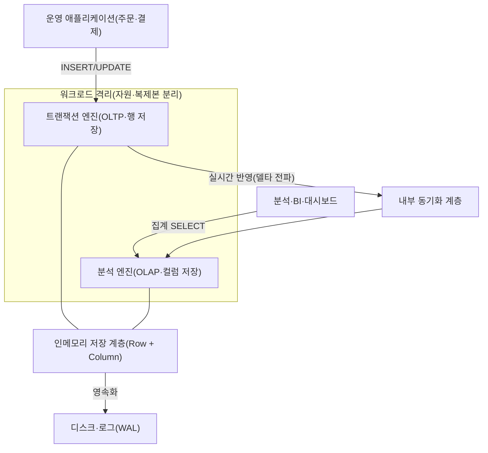
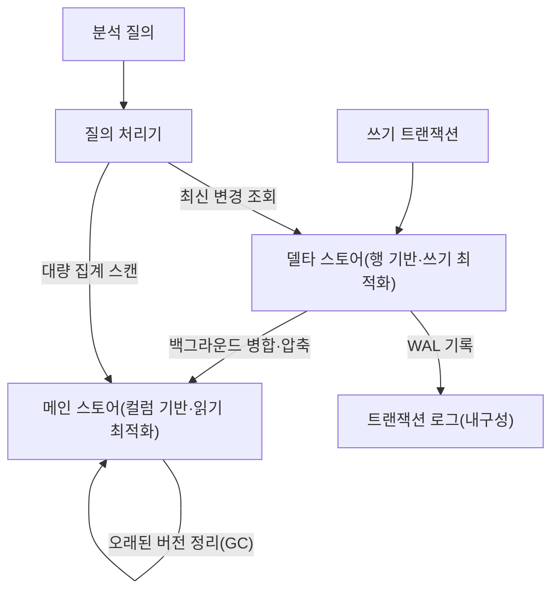

# HTAP(Hybrid Transactional/Analytical Processing)

## 1. 개요

> **HTAP(Hybrid Transactional/Analytical Processing)**는 하나의 데이터베이스 시스템에서 트랜잭션 처리(OLTP)와 분석 처리(OLAP)를 별도의 ETL 이관 없이 동시에 수행하여, 방금 발생한 운영 데이터에 대해 지연 없는(near-real-time) 분석을 제공하는 데이터 아키텍처이다. 2014년 가트너(Gartner)가 명명한 개념으로, "운영과 분석의 경계를 허무는 인메모리 기반 통합 처리"를 지향한다.

전통적으로 기업의 데이터 처리는 목적이 상반된 두 세계로 나뉘어 있었다.
한쪽은 주문·결제·재고 갱신처럼 짧고 빈번한 쓰기 트랜잭션을 정확하게 처리하는 **OLTP(Online Transaction Processing)** 세계로, 정규화된 행(row) 기반 저장과 강한 일관성(ACID)을 특징으로 한다.
다른 한쪽은 수억 건을 스캔·집계하여 추세를 읽는 **OLAP(Online Analytical Processing)** 세계로, 컬럼(column) 기반 저장과 대규모 병렬 읽기를 특징으로 한다.
이 둘은 데이터 구조·인덱싱·자원 사용 패턴이 근본적으로 달라, 하나의 엔진에서 함께 돌리면 서로의 성능을 갉아먹는다.

그래서 지난 수십 년간 표준 해법은 **분리와 이관**이었다.
운영 DB의 데이터를 야간 배치로 추출·변환·적재(ETL)하여 데이터 웨어하우스(DW)로 옮기고, 분석은 DW에서 수행했다.
그러나 이 구조는 두 가지 본질적 한계를 안는다.
첫째, **데이터 신선도(freshness) 지연**이다 — 배치 주기가 하루라면 분석 결과는 항상 하루 늦은 과거를 본다.
둘째, **파이프라인 복잡성과 비용**이다 — 별도 저장소, ETL 도구, 이중 스키마, 정합성 검증이 모두 운영 부담으로 남는다.
실시간 개인화 추천, 이상거래 탐지(FDS), 동적 가격 책정처럼 "지금 이 순간의 데이터로 즉시 판단"해야 하는 요구가 커지면서, 이 지연과 복잡성이 비즈니스 병목이 되었다.

HTAP은 바로 이 간극을 메운다.
논술 답안에서 HTAP은 단순히 "OLTP와 OLAP를 합친 것"으로 축소해서는 안 되며, (1) 인메모리 컴퓨팅과 컬럼/행 하이브리드 저장이라는 **기술적 토대**, (2) 워크로드 격리(isolation)와 데이터 신선도라는 **핵심 설계 과제**, (3) ETL 제거를 통한 아키텍처 단순화라는 **가치 명제**의 세 축으로 서술해야 한다.

### 가. 등장 배경과 필요성

첫째, **실시간 의사결정(Real-time Decision) 수요**가 결정적이다.
전자상거래에서 고객이 장바구니에 담은 직후의 행동을 반영해 추천을 바꾸거나, 카드사가 승인 요청이 들어온 순간 과거 패턴과 대조해 이상거래를 차단하려면, 데이터 발생과 분석 사이의 지연이 초 단위여야 한다.
하루 늦은 DW 분석으로는 이런 요구를 충족할 수 없다.

둘째, **하드웨어의 진화**가 HTAP을 현실화했다.
과거에는 메모리가 비싸고 작아 대용량 데이터를 인메모리로 다룰 수 없었지만, 대용량 DRAM·다수 코어·SIMD 벡터 연산·NVMe가 보편화되면서 수 TB급 데이터를 메모리에 올려 트랜잭션과 분석을 함께 처리할 하드웨어 기반이 마련되었다.
SAP HANA(2011)가 인메모리 컬럼 스토어로 이 흐름을 열었다.

셋째, **데이터 파이프라인의 총소유비용(TCO) 절감** 요구다.
ETL 파이프라인은 개발·운영·장애 대응에 지속적인 인력과 비용을 소모한다.
운영계와 분석계를 하나로 통합하면 이관 계층 자체가 사라져, 아키텍처가 단순해지고 정합성 검증 부담이 줄며 저장 중복도 감소한다.

## 2. HTAP 전체 아키텍처

HTAP 시스템은 동일한 데이터에 대해 트랜잭션 엔진과 분석 엔진이 공존하되, 서로의 자원을 침범하지 않도록 격리하는 구조를 갖는다.
핵심은 **쓰기는 행 기반으로 빠르게 받아들이고, 읽기·집계는 컬럼 기반으로 빠르게 처리**하되, 두 표현 사이를 시스템이 자동으로 동기화하는 것이다.

위 구조에서 운영 애플리케이션의 쓰기는 트랜잭션 엔진이 행 형식으로 빠르게 수용하고, 분석 질의는 분석 엔진이 컬럼 형식으로 대량 스캔한다.
두 엔진은 논리적으로는 같은 데이터를 보지만, 물리적으로는 각자에 최적화된 표현을 유지하며, 내부 동기화 계층이 트랜잭션 결과를 분석 측에 지연 없이 전파한다.
관건은 이 전파가 **분석 부하가 트랜잭션 지연시간(latency)을 흔들지 않도록** 격리되어야 한다는 점이며, 이를 위해 자원 스케줄링을 분리하거나 분석 전용 복제본을 두는 방식이 쓰인다.

### 가. 데이터 흐름과 델타 병합 세부 구조

HTAP의 저장 내부는 대개 **쓰기에 최적화된 델타 스토어(Delta Store, 행 기반)**와 **읽기에 최적화된 메인 스토어(Main Store, 컬럼 기반)**로 나뉜다.
새 트랜잭션은 먼저 작은 델타 영역에 행 단위로 빠르게 기록되고, 이후 백그라운드에서 컬럼 형식으로 압축·정렬되어 메인 스토어에 병합(merge)된다.
분석 질의는 메인 스토어와 델타 스토어를 함께 조회해 항상 최신 상태를 반영한다.

이 구조가 중요한 이유는, 컬럼 저장은 대량 집계에는 탁월하지만 개별 행의 잦은 갱신에는 비효율적이기 때문이다.
델타-메인 분리는 "쓰기는 행으로 값싸게, 읽기는 컬럼으로 빠르게"라는 상충 요구를 시간축으로 분리해 동시에 만족시키는 전형적 트레이드오프 해소 기법이다.
병합 주기와 델타 크기는 성능 튜닝의 핵심 파라미터로, 병합이 늦으면 델타가 비대해져 분석 질의가 느려지고, 너무 잦으면 병합 비용이 트랜잭션에 부담을 준다.

### 나. HTAP 구현 아키텍처 유형

HTAP을 구현하는 방식은 데이터를 하나의 저장 엔진에 두느냐, 분리하느냐에 따라 크게 두 갈래로 나뉜다.
이 구분은 아키텍처 선택 시 신선도와 격리성 사이의 트레이드오프를 결정하므로 답안에서 반드시 짚어야 한다.

**단일 저장 방식(Single-store / Unified)**은 하나의 저장 엔진 안에 행·컬럼 표현을 함께 유지한다(SAP HANA, Oracle In-Memory, MemSQL/SingleStore).
데이터가 한 곳에 있어 신선도가 가장 높고 지연이 없지만, 트랜잭션과 분석이 같은 자원을 다투므로 정교한 격리가 필수다.

**분리 저장 방식(Dual-store / Disaggregated)**은 행 기반 트랜잭션 노드와 컬럼 기반 분석 노드를 물리적으로 분리하고, 내부 복제(Raft 등)로 동기화한다(TiDB의 TiKV+TiFlash, Google AlloyDB).
분석 노드가 별도이므로 격리성이 뛰어나 트랜잭션 지연이 안정적이지만, 복제 전파에 미세한 지연이 생겨 신선도는 단일 방식보다 약간 떨어진다.

| 구분 | 단일 저장(Single-store) | 분리 저장(Dual-store) |
|------|------------------------|----------------------|
| 저장 구조 | 한 엔진에 행+컬럼 공존 | 행 노드·컬럼 노드 물리 분리 |
| 데이터 신선도 | 매우 높음(지연 거의 0) | 높음(복제 지연 존재) |
| 워크로드 격리 | 자원 스케줄링으로 논리 격리 | 노드 분리로 물리 격리 |
| 확장성 | 수직 확장 중심 | 수평 확장 용이 |
| 대표 제품 | SAP HANA, SingleStore, Oracle In-Memory | TiDB, Google AlloyDB, ClickHouse+OLTP |

## 3. 핵심 기술 요소

HTAP을 지탱하는 기술은 하드웨어 활용과 저장 구조, 그리고 동시성 제어에 걸쳐 있다.
각 요소는 "트랜잭션과 분석이라는 상반된 워크로드를 어떻게 한 시스템에서 공존시키는가"라는 하나의 문제를 서로 다른 각도에서 푼다.

첫째, **인메모리 컴퓨팅(In-Memory Computing)**이다.
데이터를 주 메모리에 상주시켜 디스크 I/O 병목을 제거하고, 컬럼 데이터를 CPU 캐시에 친화적으로 배치해 SIMD 벡터 연산으로 한 번에 여러 값을 처리한다.
디스크 대비 수백~수천 배 빠른 접근 속도가 트랜잭션과 분석을 동시에 감당할 성능 여유를 만든다.

둘째, **하이브리드 저장(Hybrid Row/Column Store)**이다.
행 저장은 "한 주문의 모든 컬럼을 함께 읽고 쓰는" 트랜잭션에, 컬럼 저장은 "수억 행의 특정 컬럼만 집계하는" 분석에 최적이다.
HTAP은 두 표현을 함께 유지하고 질의 특성에 따라 자동 선택하며, 컬럼 저장에는 사전 압축(dictionary encoding)·실행지연(run-length) 압축을 적용해 메모리를 절약하고 스캔을 가속한다.

셋째, **MVCC(다중버전 동시성 제어)와 스냅샷 격리**다.
분석 질의는 대개 오래 실행되므로, 그 사이 진행되는 쓰기 트랜잭션과 락으로 충돌하면 서로를 막는다.
MVCC는 각 트랜잭션에 일관된 스냅샷을 제공해, 분석이 읽는 동안에도 쓰기가 막힘 없이 진행되도록 하여 두 워크로드의 공존을 가능케 한다.

넷째, **자원 격리와 워크로드 관리(Workload Management)**다.
분석 질의가 CPU·메모리를 독점하면 결제 트랜잭션의 응답이 흔들린다.
자원 그룹(resource group)으로 CPU·메모리 한도를 분리하거나, 분석 전용 읽기 복제본으로 물리적 격리를 두어 트랜잭션 SLA를 보장한다.

## 4. 비교 — Lambda 아키텍처·전통 DW와의 차이

HTAP의 위상을 이해하려면 기존의 실시간 분석 접근과 대비해야 한다.
과거에는 실시간성과 정확성을 동시에 얻기 위해 **람다 아키텍처(Lambda Architecture)**를 썼다 — 배치 계층으로 정확한 과거를, 스피드 계층으로 근사적 실시간을 처리하고 둘을 서빙 계층에서 합쳤다.
그러나 람다는 배치·스트림 두 코드베이스를 이중으로 유지해야 하는 복잡성이 큰 것이 근본 약점이었다.

HTAP은 이 이중 구조 자체를 제거한다.
같은 데이터·같은 엔진에서 트랜잭션과 분석을 처리하므로, 별도 스트림 파이프라인이나 결과 병합 로직이 필요 없다.
이 차이가 생기는 이유는 HTAP이 "데이터를 옮겨 분석"하는 대신 "데이터가 있는 자리에서 분석"하기 때문이며, 실무적으로는 파이프라인 장애 지점이 줄고 지표 정합성 문제가 사라진다는 함의를 갖는다.

| 항목 | 전통 OLTP+DW(ETL) | 람다 아키텍처 | HTAP |
|------|-------------------|----------------|------|
| 데이터 신선도 | 시간~일 단위 지연 | 근사 실시간 | 실시간(초 이내) |
| 아키텍처 복잡성 | 중(ETL 파이프라인) | 높음(이중 코드베이스) | 낮음(단일 엔진) |
| 저장 중복 | 높음(운영+DW) | 높음 | 낮음 |
| 분석 정확성 | 높음 | 배치 보정 필요 | 높음 |
| 주 용도 | 정형 정기 리포트 | 스트림+배치 통합 | 실시간 운영 분석 |

다만 HTAP이 만능은 아니다.
페타바이트급 장기 이력에 대한 복잡한 다차원 분석이나 다양한 소스를 아우르는 전사 데이터 통합은 여전히 데이터 웨어하우스·레이크하우스가 유리하다.
HTAP의 스위트 스폿은 "운영 데이터에 대한 실시간~준실시간 분석"이며, 대규모 히스토리 분석과는 상호 보완 관계로 보는 것이 옳다.

## 5. 산업 적용 사례

**금융권 이상거래탐지(FDS)**가 대표적이다.
국내외 카드사는 승인 요청이 들어온 수십 ms 안에 해당 카드의 최근 거래 패턴·지역·금액을 집계·대조해 이상 여부를 판단해야 한다.
전통 구조에서는 운영 DB와 분석 DB가 분리되어 "방금 발생한 거래"를 즉시 분석에 반영하기 어려웠으나, HTAP은 승인 트랜잭션과 패턴 분석을 같은 엔진에서 처리해 실시간 차단을 가능케 한다.

**전자상거래 실시간 개인화**도 있다.
알리바바는 세일 성수기에 초당 수십만 건의 주문을 처리하면서 동시에 재고·수요·추천을 실시간 집계해야 했고, 이를 위해 자체 HTAP 데이터베이스를 도입해 주문 트랜잭션과 분석을 통합했다.
주문이 발생하는 즉시 그 데이터가 추천·재고 대시보드에 반영되어, 배치 지연 없이 판매 흐름에 대응한다.

**제조·물류 운영 분석**에서는 SAP HANA 기반 S/4HANA가 널리 쓰인다.
과거에는 ERP 운영계와 별도 BW(Business Warehouse)로 리포트를 뽑았으나, 인메모리 HTAP으로 통합하면서 월말 마감 리포트를 몇 시간에서 수 분으로 단축한 사례가 보고된다.
운영 트랜잭션과 경영 분석이 하나의 최신 데이터를 공유하므로, 재고·원가·매출을 실시간으로 함께 본다.

## 6. 심화 — 최신 동향과 표준 변화

HTAP 개념은 최근 **"제로-ETL(Zero-ETL)"**과 **레이크하우스 실시간화**라는 흐름으로 확장되고 있다.
AWS는 Aurora(OLTP)와 Redshift(OLAP)를 자동 복제로 연결하는 Zero-ETL 통합을 발표해, 사용자가 파이프라인을 직접 만들지 않고도 운영 데이터를 준실시간으로 분석하도록 했다.
이는 단일 엔진 HTAP과 달리 "서로 다른 특화 엔진을 무이관으로 연결"하는 접근으로, HTAP의 가치(신선도·단순화)를 클라우드 관리형 서비스로 재해석한 것이다.

또한 **분산 HTAP(Distributed HTAP)**이 오픈소스를 중심으로 성숙하고 있다.
TiDB는 행 저장 TiKV와 컬럼 저장 TiFlash를 Raft 합의로 동기화하여, 수평 확장 가능한 분산 환경에서 HTAP을 구현한다.
Google AlloyDB(PostgreSQL 호환)는 컬럼 엔진을 내장해 분석 질의를 최대 수십 배 가속한다고 밝혔으며, SingleStore·ClickHouse 계열도 실시간 분석 시장에서 경쟁한다.

한편 최근에는 **LLM·벡터 검색과의 결합**도 주목된다.
운영 데이터에 대한 실시간 임베딩·유사도 검색을 같은 엔진에서 처리하려는 시도(HTAP+벡터)가 늘고 있으며, 이는 실시간 추천·RAG 파이프라인에서 데이터 신선도를 높이는 방향으로 이어진다.
다만 이 영역은 표준화가 진행 중이므로, 답안에서는 "특정 제품의 성능 수치"를 단정하기보다 방향성으로 서술하는 것이 안전하다.

## 7. 고려사항 및 시사점

첫째, **워크로드 격리와 SLA 보장이 최우선 설계 과제**다.
HTAP의 최대 위험은 무거운 분석 질의가 결제·주문 같은 핵심 트랜잭션의 응답시간을 침해하는 것이다.
자원 그룹·우선순위 스케줄링·분석 전용 복제본 등 격리 수단을 반드시 갖추고, 트랜잭션 지연 SLA를 상시 모니터링해야 한다.

둘째, **신선도와 격리성의 트레이드오프**를 워크로드 특성에 맞춰 선택해야 한다.
지연이 0에 가까워야 하는 FDS는 단일 저장 방식이, 트랜잭션 안정성이 절대적인 대규모 결제계는 복제 기반 분리 저장 방식이 유리하다.
"모든 것을 실시간으로"가 아니라, 어느 수준의 신선도가 비즈니스에 실제로 필요한지 정의하는 것이 선행되어야 한다.

셋째, **비용·자원 대비 효과(TCO)를 냉정히 평가**해야 한다.
인메모리 HTAP은 대용량 메모리를 요구해 인프라 비용이 높고, 모든 분석이 실시간을 요구하지도 않는다.
정기 리포트·장기 이력 분석은 저비용 DW·레이크하우스에 맡기고, 실시간성이 핵심인 워크로드에만 HTAP을 선별 적용하는 하이브리드 전략이 현실적이다.

넷째, **기존 아키텍처와의 연계·전환 전략**이 필요하다.
이미 DW·ETL·BI가 구축된 조직이 HTAP으로 전면 전환하는 것은 비현실적이며, 실시간 분석이 필요한 업무부터 점진 도입(Strangler 방식)하고, DW는 전사 통합·거버넌스 허브로 유지하는 공존 설계가 바람직하다.

다섯째, **데이터 거버넌스와 일관성 검증**을 놓치지 말아야 한다.
운영과 분석이 같은 데이터를 공유하는 만큼, 분석 목적의 접근 권한·마스킹·감사가 운영계 보안과 충돌하지 않도록 통제해야 하며, 델타-메인 병합 지연으로 인한 미세한 불일치가 지표에 영향을 주지 않는지 주기적으로 검증해야 한다.

## 참고자료

- Gartner, "Hybrid Transaction/Analytical Processing Will Foster Opportunities for Dramatic Business Innovation" (2014): https://www.gartner.com/en/documents/2657815
- SAP HANA In-Memory Platform 개요: https://www.sap.com/products/technology-platform/hana.html
- TiDB HTAP 아키텍처(TiKV·TiFlash) 문서: https://docs.pingcap.com/tidb/stable/tidb-storage
- Google Cloud AlloyDB for PostgreSQL: https://cloud.google.com/alloydb
- AWS Zero-ETL integration 개요: https://aws.amazon.com/what-is/zero-etl/

---

> **한 줄 요약**: HTAP은 인메모리·행/컬럼 하이브리드 저장과 워크로드 격리를 바탕으로 OLTP와 OLAP를 하나의 엔진에서 ETL 없이 처리하여, 운영 데이터에 대한 실시간 분석을 가능케 하는 아키텍처로서, 신선도·격리성·비용의 트레이드오프를 워크로드에 맞춰 선별 적용하는 것이 핵심이다.
