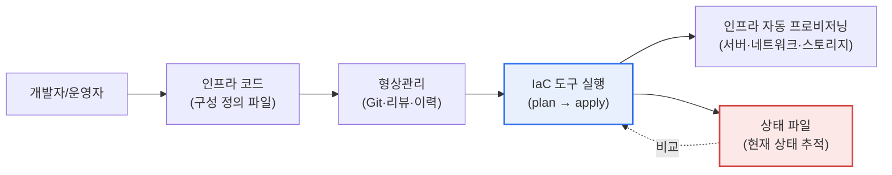
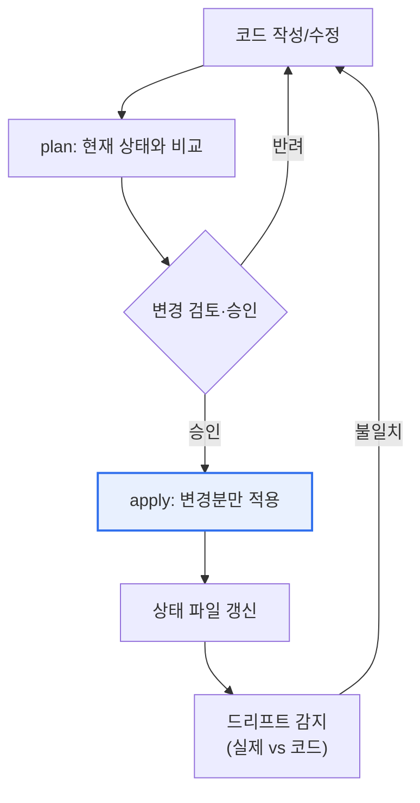

# 코드형 인프라(IaC, Infrastructure as Code)

## 1. 개요

### 가. 정의
> **IaC(Infrastructure as Code)** 는 서버·네트워크·스토리지·보안 정책 등 IT 인프라의 **원하는 상태를 코드(구성 파일)로 선언하고, 그 코드를 실행해 인프라를 자동으로 프로비저닝·변경·관리**하는 방식이다. 콘솔에서의 수작업 설정을 버전관리 가능한 코드로 대체한다.

IaC의 본질은 '**인프라를 소프트웨어처럼 다루는 것**'이다. 과거에는 서버를 늘리거나 방화벽 규칙을 바꿀 때 담당자가 관리 콘솔에서 일일이 클릭하고 명령을 쳤다. 이 방식은 느리고 실수가 잦으며, 무엇보다 "왜 이 서버가 저 서버와 설정이 다른지" 아무도 정확히 모르는 상태를 낳는다. 시간이 흐르며 손으로 조금씩 고친 흔적이 쌓여 실제 인프라가 문서·의도와 어긋나는 현상을 **구성 드리프트(configuration drift)** 라 하는데, 이는 장애 원인 추적과 복구를 어렵게 만드는 대표적 운영 리스크다.

IaC는 인프라의 원하는 상태를 코드로 선언하고, 그 코드를 실행해 인프라를 만든다. 그러면 인프라가 **코드로 문서화**되고, Git 같은 형상관리로 버전 추적·코드 리뷰·재사용이 가능해지며, 같은 코드로 개발·테스트·운영 환경을 **똑같이 재현**할 수 있다. "내 환경에서는 되는데"라는 고전적 문제의 상당 부분이 환경 구성 차이에서 오는데, IaC는 그 구성 자체를 코드로 고정해 차이를 없앤다. 클라우드 API와 결합하면 수백 대의 서버를 몇 분 만에 동일하게 구성하고, 필요 없을 때 코드 한 줄로 회수하는 것도 가능해진다. 즉 IaC는 단순한 자동화 도구가 아니라, 인프라 운영을 '수작업 기예'에서 '**검증 가능한 공학**'으로 바꾸는 패러다임 전환이다.

### 나. 등장 배경과 필요성
IaC가 필수가 된 배경에는 세 가지 압력이 있다. 첫째, **클라우드의 탄력성**이다. 클라우드는 자원을 API로 즉시 늘리고 줄일 수 있게 했지만, 이 유연성을 사람이 손으로 따라가기란 불가능하다. 자동화된 정의가 없으면 탄력성은 오히려 혼란이 된다. 둘째, **마이크로서비스·컨테이너로 인한 규모·변경 빈도의 폭증**이다. 수백 개 서비스가 각기 다른 인프라를 요구하고 하루에도 여러 번 배포되는 환경에서, 수작업 관리는 속도·일관성·재현성을 감당할 수 없다. 셋째, **DevOps 문화**다. 개발과 운영의 경계를 허물고 배포를 자동화하려면, 인프라 역시 애플리케이션 코드처럼 파이프라인에 태울 수 있어야 한다. 이 세 압력이 맞물려 IaC를 클라우드 네이티브 운영의 기본기로 만들었다.

## 2. 동작 방식: 선언형 vs 명령형

IaC 접근에는 두 방식이 있는데, 둘의 차이는 '**무엇을 기술하느냐**'에 있다. **선언형(Declarative)** 은 "원하는 최종 상태(what)"를 기술하면 도구가 현재 상태와 비교해 그 상태에 도달하는 데 필요한 변경만 알아서 적용한다(Terraform·CloudFormation·Pulumi). 사용자는 '서버 3대가 이런 설정으로 존재해야 한다'만 선언하고, '지금 2대가 있으니 1대를 더 만들라'는 절차는 도구가 계산한다. **명령형(Imperative)** 은 "무엇을 어떤 순서로 하라(how)"는 절차를 기술한다(전통적 셸 스크립트, 일부 관점의 Ansible 플레이북).

대체로 선언형이 선호되는 데는 분명한 이유가 있다. 선언형은 현재 상태를 추적하므로 **멱등성(idempotency)** — 같은 코드를 여러 번 실행해도 결과가 같음 — 을 자연스럽게 보장한다. 명령형 스크립트는 두 번 실행하면 서버가 두 대 더 생기는 식의 부작용이 생기기 쉽다. 또 선언형은 '지금 상태 → 원하는 상태'의 차이(diff)를 사전에 보여 줄 수 있어(Terraform의 `plan`), 적용 전에 무엇이 바뀔지 검토하고 승인하는 안전장치를 만든다. 다만 도구별 경계는 절대적이지 않다. Ansible은 절차를 기술하지만 각 태스크를 멱등하게 설계해 선언형에 가깝게 쓰이는 등, 실무에서는 두 성격이 섞인다.

| 방식 | 기술 대상 | 특징 | 대표 도구 |
|---|---|---|---|
| **선언형** | 원하는 최종 상태 | 멱등성·상태추적·diff 검토 | Terraform, CloudFormation, Pulumi |
| **명령형** | 수행 절차 | 세밀한 제어, 부작용 관리 필요 | 셸 스크립트, Ansible(관점에 따라) |

한편 프로비저닝(인프라 생성)과 구성 관리(설치·설정)는 층위가 다르다. Terraform은 서버·네트워크 등 자원을 '만드는' 프로비저닝에, Ansible·Chef·Puppet은 만들어진 서버 위에 소프트웨어를 '설정하는' 구성 관리에 강점이 있어, 실무에서는 둘을 조합하는 경우가 많다.

### 도구 생태계와 선택 기준
도구 선택은 '어느 것이 우월한가'가 아니라 '조직의 클라우드 전략·인력 역량과 맞는가'로 판단해야 한다. **Terraform**은 특정 클라우드에 종속되지 않는(멀티 클라우드) 선언형 표준으로 폭넓은 프로바이더 생태계를 갖지만, 별도 상태 관리가 필요하다. **CloudFormation**은 AWS에 특화돼 상태를 서비스가 관리해 주는 편의가 있으나 이식성이 낮다. **Pulumi**는 파이썬·타입스크립트 등 범용 프로그래밍 언어로 인프라를 기술해 개발자 친화적이지만 언어·런타임 복잡성이 따른다. **Ansible**은 에이전트 없이(agentless) SSH로 구성 관리를 수행해 진입 장벽이 낮다. 이처럼 각 도구는 이식성·학습 곡선·상태 관리 방식에서 서로 다른 절충을 가지므로, 이미 쓰는 클라우드와 팀의 언어 역량을 기준으로 선택하는 것이 현실적이다.

## 3. 상태 관리와 실행 흐름

선언형 IaC의 심장은 **상태(state)** 다. 도구는 '코드가 원하는 상태'와 '실제 인프라의 현재 상태'를 비교해 그 차이만큼만 조작해야 하는데, 이를 위해 현재 상태를 기록한 상태 파일을 유지한다. 상태 파일이 곧 실제 인프라의 지도이므로, 이 파일이 손상되거나 실제와 어긋나면 도구는 잘못된 판단(있는 자원을 또 만들거나, 필요한 자원을 지움)을 내릴 수 있다. 따라서 상태 파일을 팀이 공유·잠금(locking)할 수 있는 원격 저장소(예: 오브젝트 스토리지+락)에 두고, 동시에 두 사람이 apply해 상태가 깨지는 것을 막는 것이 운영의 기본이다.

실행은 보통 **plan → 검토·승인 → apply**의 흐름을 따른다. `plan` 단계에서 도구는 "이 서버를 새로 만들고, 저 규칙은 바꾸고, 이 볼륨은 지운다"는 변경 계획을 사람이 읽을 수 있게 제시한다. 인프라 변경은 삭제·재생성이 서비스 중단으로 직결될 수 있으므로, 이 사전 검토가 사고를 막는 결정적 관문이다. 승인 후 `apply`에서 변경분만 반영하고 상태를 갱신한다. 운영 중에는 누군가 콘솔에서 수동으로 자원을 바꿔 코드와 실제가 어긋나는 드리프트가 생길 수 있는데, 주기적으로 이를 감지해 코드로 되돌리는 관리가 필요하다.

## 4. 기대효과와 실무 적용

IaC의 효과는 단순히 '편해진다'가 아니라, 조직의 운영 성숙도를 끌어올리는 여러 축으로 나타난다. 아래 표의 각 효과는 앞서 설명한 '상태·멱등성·형상관리'라는 원리에서 파생된 결과라는 점을 함께 이해해야 한다.

| 효과 | 내용 | 원리적 근거 |
|---|---|---|
| **일관성·재현성** | 동일 코드로 여러 환경 동일 구성, 드리프트 제거 | 상태 추적·멱등성 |
| **속도·자동화** | 대규모 인프라 신속 프로비저닝·회수 | 클라우드 API + 선언형 |
| **버전관리·협업** | 코드 리뷰, 이력 추적, 롤백 가능 | 형상관리(Git) |
| **문서화** | 코드 자체가 최신 인프라 명세 | 선언형 정의 |
| **비용 최적화** | 미사용 자원 코드로 회수, 재사용 모듈화 | 자동화 + 재사용 |

구체적 사례를 보면, 첫째, 대규모 서비스 기업은 신규 리전(region)에 서비스를 확장할 때 기존 인프라 코드를 재사용해 **수백 개 자원으로 구성된 환경을 수 시간 내에 복제**한다. 손으로 했다면 수 주가 걸리고 리전 간 미묘한 설정 차이로 장애가 났을 작업이다. 둘째, 재해복구(DR) 시나리오에서 IaC 코드가 곧 '복구 절차서'가 되어, 재해 발생 시 다른 리전에 동일 인프라를 코드로 재구축함으로써 복구 시간(RTO)을 단축한다. 셋째, 개발팀이 기능별로 격리된 테스트 환경을 필요할 때 코드로 생성했다가 테스트 후 자동 삭제해, 상시 유지하던 유휴 자원 비용을 크게 줄인 사례가 흔하다. 이처럼 IaC의 가치는 최초 자동화보다 **반복·재현·회수**의 국면에서 두드러진다.

이 효과들을 조직 차원에서 보면, IaC는 개인의 숙련도에 의존하던 인프라 운영을 팀의 자산으로 전환한다. 특정 담당자만 알던 '설정의 암묵지'가 코드로 명시화되면서, 인력 교체나 온콜(on-call) 대응 시에도 인프라의 구조와 의도를 코드에서 즉시 읽어낼 수 있다. 또한 감사(audit) 관점에서, 누가 언제 무엇을 왜 바꿨는지가 형상관리 이력에 남아 규제·컴플라이언스 대응이 수월해진다. 이는 금융·공공처럼 변경 통제가 엄격한 산업에서 특히 중요한 이점이다.

## 5. 심화 — GitOps로의 발전과 보안(정책 as Code)

IaC의 최신 흐름은 **GitOps**로의 확장이다. GitOps는 'Git 저장소를 인프라·애플리케이션 상태의 유일한 진실 공급원(Single Source of Truth)으로 삼는다'는 원칙이다. 운영자가 도구를 직접 실행하는 대신, **Git에 변경을 병합(merge)하면 자동화 에이전트가 그 선언을 실제 클러스터에 지속적으로 동기화**한다(예: 쿠버네티스 환경의 Argo CD·Flux). 이 방식의 강점은 세 가지다. 모든 변경이 Pull Request로 이뤄져 리뷰·승인·감사 추적이 표준 개발 워크플로에 녹아들고, 실제 상태가 Git 선언에서 벗어나면 에이전트가 자동으로 되돌려(self-healing) 드리프트를 원천 차단하며, 롤백이 'Git 되돌리기'만큼 단순해진다.

또 하나의 축은 **보안·거버넌스의 코드화**다. 인프라가 코드가 되면서, 그 코드가 조직 정책을 지키는지 자동 검증하는 것도 코드로 가능해졌다. **정책 as 코드(Policy as Code, 예: OPA/Rego, Sentinel)** 로 "퍼블릭에 열린 스토리지 금지", "암호화되지 않은 볼륨 배포 금지" 같은 규칙을 파이프라인에서 강제하고, tfsec·Checkov 같은 **IaC 정적 스캔**으로 배포 전에 잘못된 보안 설정을 잡아낸다. 다만 인프라 코드에 접근 키·비밀번호가 하드코딩되면 형상관리 이력에 영구히 남아 심각한 유출이 되므로, 시크릿을 코드 밖(Vault 등 비밀 관리 시스템)에 두는 원칙이 반드시 병행돼야 한다. 이처럼 IaC는 '자동화'에서 시작해 'GitOps(운영 모델)'와 'Policy as Code(거버넌스)'로 외연을 넓히며 클라우드 네이티브 운영의 근간으로 자리 잡고 있다.

전통적 IaC(도구 직접 실행)와 GitOps의 차이를 정리하면 다음과 같다.

| 구분 | 전통적 IaC | GitOps |
|---|---|---|
| 변경 트리거 | 운영자가 도구 직접 실행(push) | Git 병합 → 에이전트가 동기화(pull) |
| 진실 공급원 | 코드 + 상태 파일 | Git 저장소 |
| 드리프트 처리 | 주기적 감지·수동 조정 | 자동 감지·self-healing |
| 감사 추적 | 실행 로그 | Pull Request 이력 |

### 예상 출제 방향과 답안 구성 전략
기술사 시험에서 IaC는 단독 주제보다 클라우드·DevOps·컨테이너와 엮여 출제되는 경향이 있다. 답안을 구성할 때는 다음 축을 염두에 두면 좋다.

- **개념·필요성**: 구성 드리프트·수작업의 한계 → IaC의 정의와 등장 배경으로 연결한다.
- **방식 비교**: 선언형 vs 명령형을 멱등성·상태 관리의 '이유'까지 서술한다.
- **동작 원리**: plan → 검토 → apply와 상태 파일의 역할을 다이어그램으로 제시한다.
- **연계 기술**: DevOps·CI/CD·GitOps·컨테이너(쿠버네티스)·플랫폼 엔지니어링과의 관계를 확장한다.
- **보안·거버넌스**: 시크릿 관리, Policy as Code, IaC 스캔을 위험 관리 관점에서 다룬다.
- **결론**: 도입 전략(점진적·모듈화)과 조직 성숙도, 전망(Everything as Code)으로 마무리한다.

## 6. 고려사항 및 시사점 (기술사 관점)

1. **상태 관리가 IaC 운영의 급소다.** 선언형 도구의 모든 판단은 상태 파일에 기반하므로, 상태의 원격 저장·잠금·백업·암호화는 선택이 아니라 필수다. 상태 파일 자체에 민감정보가 담길 수 있어 접근 통제와 암호화를 함께 설계해야 하며, 상태가 깨지면 인프라 전체가 위험해진다는 점을 전제로 운영 체계를 갖춰야 한다.

2. **'코드가 곧 권한'이라는 보안 관점이 필요하다.** IaC는 인프라를 자동으로 바꿀 수 있는 강력한 권한을 코드에 부여한다. 따라서 코드 리뷰·최소 권한 원칙·시크릿 분리·Policy as Code·IaC 스캔을 파이프라인에 내재화해, 잘못된 코드나 탈취된 파이프라인이 대규모 사고로 번지지 않도록 방어해야 한다.

3. **점진적 도입과 모듈화 전략이 성패를 가른다.** 기존 수작업 인프라를 한 번에 코드로 옮기기는 어렵다. 신규 자원부터 IaC로 관리하고, 반복되는 구성을 재사용 가능한 모듈로 표준화하며, 팀 전반의 코드 리뷰·테스트 문화를 함께 키우는 단계적 접근이 현실적이다. 도구 도입 자체보다 조직의 운영 성숙도가 관건이다.

4. **드리프트 관리와 변경 규율이 지속 운영의 핵심이다.** 콘솔에서의 긴급 수동 변경을 완전히 막기는 어렵지만, 이를 방치하면 IaC의 재현성이 무너진다. 드리프트를 주기적으로 감지·조정하고, 변경은 원칙적으로 코드(GitOps라면 PR)를 거치도록 규율을 세워야 IaC의 이점이 지속된다.

5. **전망: 클라우드 네이티브 운영의 표준 기반.** IaC는 이미 DevOps·GitOps·플랫폼 엔지니어링(내부 개발자 플랫폼, IDP)의 공통 토대가 되었다. 나아가 정책·보안·비용까지 코드로 관리하는 'Everything as Code'로 확장되며, 인프라 운영의 신뢰성·감사성·비용 효율을 함께 끌어올리는 방향으로 발전할 전망이다.

## 참고자료
- HashiCorp — What is Infrastructure as Code?: https://developer.hashicorp.com/terraform/intro
- AWS — Infrastructure as Code: https://aws.amazon.com/what-is/iac/
- OpenGitOps Principles: https://opengitops.dev/
- Open Policy Agent (OPA): https://www.openpolicyagent.org/

---

> **한 줄 요약**: IaC는 *인프라의 원하는 상태를 코드로 선언해 자동 프로비저닝·관리* 하는 방식으로, 선언형(멱등성·상태추적)과 명령형이 있고 일관성·재현성·속도·버전관리·비용 최적화를 제공하며, 상태 관리와 보안(시크릿 분리·Policy as Code)을 갖춰 GitOps·플랫폼 엔지니어링으로 확장되는 클라우드 네이티브 운영의 표준 기반이다.
