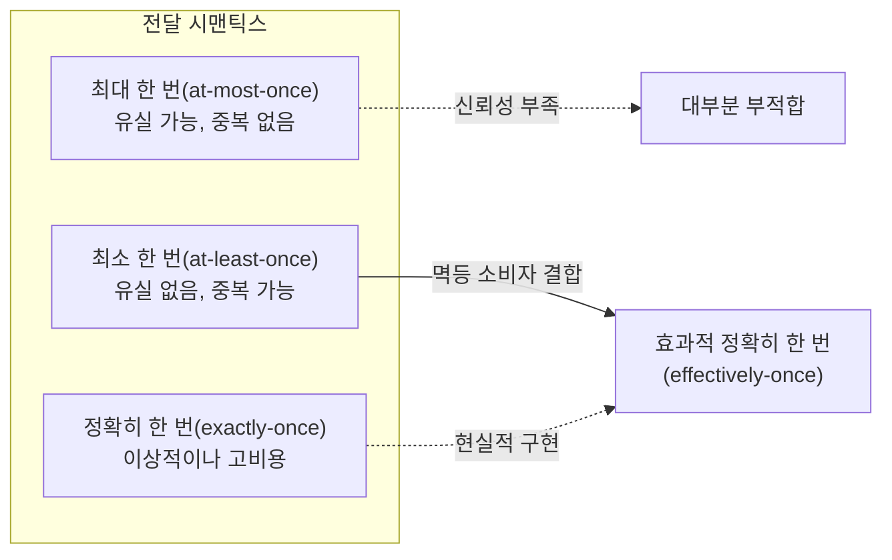
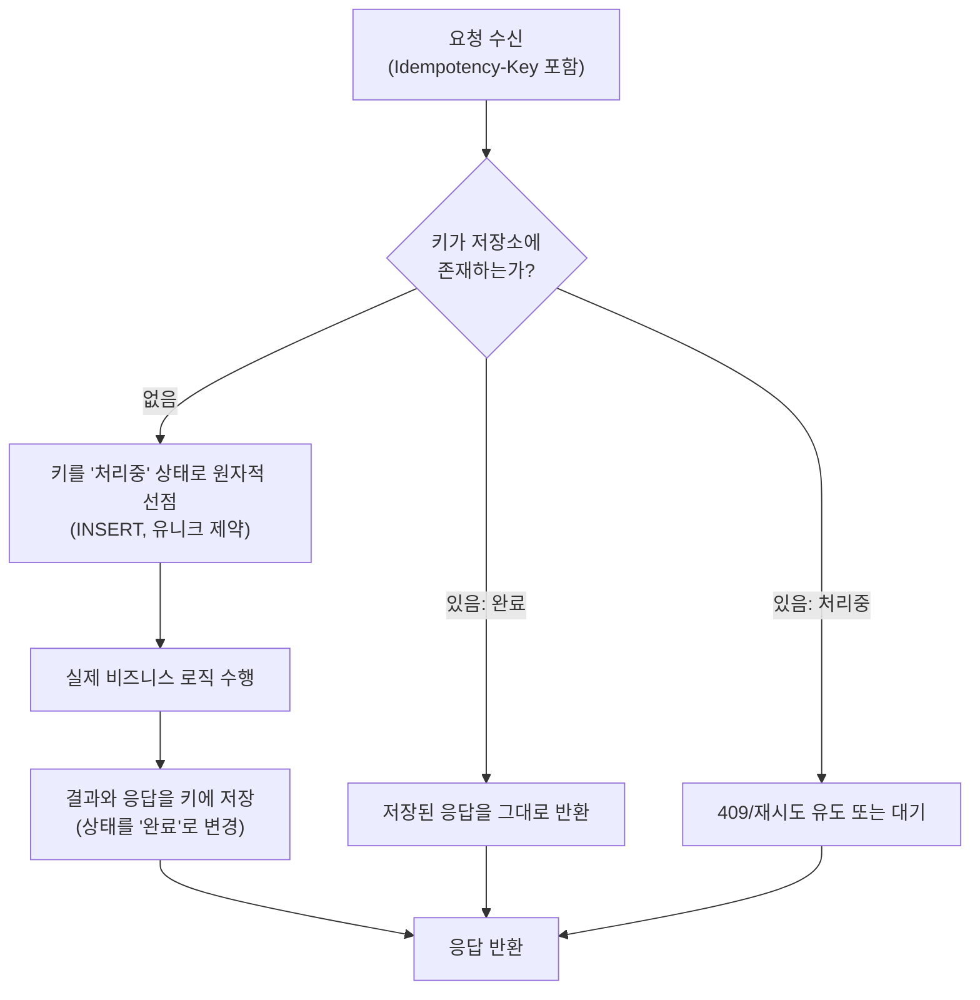

# 멱등성(Idempotency) 설계와 분산 시스템 신뢰성

## 1. 개요

### 가. 정의

> **멱등성(Idempotency)**이란 동일한 연산을 한 번 수행하든 여러 번 반복 수행하든 시스템의 최종 상태와 관측 가능한 결과가 달라지지 않는 성질을 말한다. 수학적으로는 함수 f에 대해 f(f(x)) = f(x)가 성립하는 것과 같다.

멱등성은 원래 대수학에서 어떤 원소에 연산을 반복 적용해도 값이 변하지 않는 성질을 가리키는 개념이었다.
소프트웨어에서는 이 개념이 "요청을 여러 번 보내도 부작용(side effect)이 한 번만 반영된다"는 안정성 속성으로 확장되었다.
예를 들어 "계좌 잔액을 100,000원으로 설정한다"는 연산은 몇 번을 실행해도 결과가 같으므로 멱등하지만, "계좌에서 10,000원을 출금한다"는 연산은 실행 횟수만큼 잔액이 줄어들므로 멱등하지 않다.

멱등성은 흔히 "안전성(Safety)"과 혼동되지만 구분해야 한다.
안전한 연산(예: 조회)은 상태를 전혀 바꾸지 않으므로 자동으로 멱등하지만, 멱등한 연산이 반드시 안전한 것은 아니다.
예컨대 "리소스를 삭제한다"는 연산은 상태를 바꾸지만(안전하지 않음) 두 번 실행해도 리소스가 없다는 최종 상태는 같으므로 멱등하다.
이처럼 멱등성은 "부작용의 유무"가 아니라 "반복이 최종 상태에 미치는 영향"을 기준으로 정의된다.

### 나. 등장 배경과 필요성

멱등성이 분산 시스템 설계의 핵심 원칙으로 부상한 배경에는 네트워크의 불확실성이 있다.
분산 환경에서 클라이언트가 서버에 요청을 보내고 응답을 받지 못했을 때, 클라이언트는 "요청이 서버에 도달하지 못한 것"인지 "서버는 처리했지만 응답이 유실된 것"인지 구별할 수 없다.
이것이 바로 **두 장군 문제(Two Generals' Problem)**로 형식화되는 근본적 불확실성이며, 어떤 통신 프로토콜로도 완전히 해소할 수 없다.
따라서 클라이언트는 실패로 간주하고 재시도(retry)할 수밖에 없는데, 만약 원래 요청이 이미 처리되었다면 재시도는 중복 처리를 유발한다.

이 문제는 특히 금전이 오가는 시스템에서 치명적이다.
예를 들어 온라인 결제에서 사용자가 "결제" 버튼을 누른 뒤 응답이 3초 이상 지연되면, 사용자는 새로고침하거나 다시 버튼을 누른다.
멱등성이 보장되지 않으면 동일한 주문이 두 번 결제되는 이중 청구(double charge)가 발생하고, 이는 환불 처리 비용과 고객 신뢰 하락으로 직결된다.
실제로 Stripe, PayPal 등 주요 결제 게이트웨이는 클라이언트가 발급한 멱등성 키(Idempotency-Key)를 필수 또는 권장 헤더로 채택하여 이 문제를 구조적으로 방지한다.

또한 메시지 브로커 기반 비동기 아키텍처의 확산도 멱등성의 중요성을 키웠다.
Kafka, RabbitMQ, AWS SQS 같은 메시지 시스템은 성능과 가용성을 위해 대부분 **최소 한 번 전달(at-least-once delivery)**을 기본 보장으로 채택한다.
이는 메시지가 유실되지 않는 대신 중복 전달될 수 있음을 의미하므로, 소비자(consumer)가 멱등하게 설계되지 않으면 동일 이벤트가 여러 번 처리되어 데이터 정합성이 깨진다.
즉 멱등성은 "정확히 한 번(exactly-once)"이라는 이상을 현실의 "최소 한 번 + 멱등 소비자" 조합으로 실현하는 실용적 열쇠다.

### 다. 적용 목표와 범위

멱등성 설계의 목표는 첫째 재시도 안전성 확보(네트워크 실패 시 안심하고 재시도), 둘째 중복 요청·중복 메시지의 무해화, 셋째 장애 복구 시 재처리의 안정화, 넷째 사용자 경험 보호(이중 청구·중복 주문 방지)다.
적용 범위는 REST/gRPC API의 쓰기 연산, 메시지 소비자, 배치 재처리 잡, 분산 트랜잭션의 보상 처리, 결제·정산·재고 차감 같은 상태 변경 도메인 전반이다.
반대로 순수 조회나 스트리밍 집계처럼 부작용이 없거나 이미 멱등한 연산에는 별도 설계 부담이 크지 않다.

## 2. 멱등성의 유형과 판단 기준

### 가. 연산 자체의 멱등성

가장 바람직한 형태는 연산의 정의 자체가 멱등한 경우다.
"필드 값을 X로 설정(SET)"하거나 "집합에 원소를 추가(멱등 집합 연산)"하는 것은 반복해도 결과가 같다.
데이터베이스에서는 `INSERT ... ON CONFLICT DO UPDATE`(UPSERT)나 조건부 갱신을 활용하면 자연스럽게 멱등한 쓰기를 구성할 수 있다.
반면 "카운터 증가(INCREMENT)", "잔액 차감", "리스트에 append" 같은 상대적(relative) 연산은 본질적으로 멱등하지 않으므로 별도의 중복 방지 장치가 필요하다.

이 구분은 API 설계 단계에서 매우 중요하다.
가능하다면 상대적 연산을 절대적(absolute) 연산으로 재설계하는 것이 근본 해법이다.
예를 들어 "재고를 3개 감소"라는 요청 대신 "재고를 47개로 설정하되 현재 값이 50일 때만"이라는 조건부 절대 연산(Compare-And-Set)으로 바꾸면, 재시도해도 조건이 어긋나 두 번 반영되지 않는다.
이처럼 도메인 모델링 수준에서 멱등성을 확보하면 인프라 계층의 복잡성을 줄일 수 있다.

### 나. HTTP 메서드의 멱등성 규약

웹 표준(RFC 9110)은 HTTP 메서드별 멱등성과 안전성을 명확히 규정한다.
이 규약은 프록시·캐시·브라우저·클라이언트 라이브러리가 실패한 요청을 자동 재시도할지 판단하는 근거가 되므로, API 설계자는 이를 정확히 준수해야 한다.
아래 표는 주요 메서드의 성질을 정리한 것이며, 각 성질이 "왜" 그렇게 규정되는지는 부작용의 반복 영향으로 설명된다.

| 메서드 | 안전(Safe) | 멱등(Idempotent) | 설명 |
|--------|:---:|:---:|------|
| GET | O | O | 조회만 하므로 상태 변경 없음 |
| HEAD | O | O | 헤더만 조회 |
| PUT | X | O | 전체 교체(SET 의미)이므로 반복해도 동일 상태 |
| DELETE | X | O | 반복 삭제해도 "없음" 상태로 수렴 |
| POST | X | X | 자원 생성(append 의미) — 반복 시 중복 생성 |
| PATCH | X | △ | 구현에 따라 다름(절대 갱신은 멱등, 상대 갱신은 비멱등) |

여기서 특히 POST가 비멱등으로 규정되는 점이 실무의 핵심 난제다.
주문 생성, 결제 요청, 댓글 등록 같은 대부분의 "생성" 연산이 POST로 구현되기 때문이다.
따라서 POST를 멱등하게 만들려면 프로토콜 규약만으로는 부족하고, 후술할 멱등성 키 같은 애플리케이션 계층의 장치를 도입해야 한다.
PATCH가 조건부(△)인 이유도 마찬가지로, `{"balance": 100}`처럼 절대값을 지정하면 멱등하지만 `{"balance": "+10"}`처럼 증분을 지정하면 멱등하지 않기 때문이다.

### 다. 전달 시맨틱스와 멱등성의 관계

메시지 전달 보장은 크게 세 가지로 나뉘며, 멱등성은 그중 "최소 한 번" 보장을 실질적 "정확히 한 번"으로 끌어올리는 다리 역할을 한다.

위 그림이 보여주듯, 순수한 "정확히 한 번" 전달은 분산 환경에서 극도로 비싸거나(2단계 커밋 등) 불가능에 가깝다.
그래서 대부분의 성숙한 시스템은 "최소 한 번 전달 + 멱등 소비자"라는 조합으로 사실상 정확히 한 번의 효과(effectively-once)를 달성한다.
예를 들어 Kafka는 프로듀서 측 멱등성(enable.idempotence)과 트랜잭션 기능을 제공하지만, 컨슈머 애플리케이션이 외부 시스템(DB, 결제 API)에 부작용을 낼 때는 결국 소비자 수준의 멱등 처리가 필요하다.
이 지점이 "인프라가 멱등성을 대신 보장해 준다"는 오해가 깨지는 곳으로, 부작용의 경계를 넘는 순간 애플리케이션이 책임을 진다.

## 3. 구현 아키텍처와 절차

### 가. 멱등성 키(Idempotency-Key) 기반 처리

POST처럼 본질적으로 비멱등한 연산을 멱등하게 만드는 표준적 방법은 클라이언트가 요청마다 고유한 멱등성 키를 부여하고, 서버가 이 키를 기준으로 중복을 판별하는 것이다.
클라이언트는 논리적으로 "같은 시도"에 대해서는 재시도 시에도 동일한 키를 유지하고, "새로운 시도"에는 새 키(예: UUID v4)를 발급한다.
서버는 키와 처리 결과를 저장소에 기록해 두었다가, 같은 키가 다시 오면 실제 처리를 생략하고 저장된 결과를 그대로 반환한다.

아래는 멱등성 키 처리의 전형적인 흐름이다.

이 흐름에서 결정적으로 중요한 것은 "키 선점"이 원자적이어야 한다는 점이다.
두 개의 동일 키 요청이 거의 동시에 도착하는 경쟁 조건(race condition)에서, 데이터베이스의 유니크 제약(unique constraint)이나 `INSERT ... ON CONFLICT`를 이용해 오직 하나만 선점에 성공하도록 만들어야 한다.
선점에 실패한 요청은 진행 중인 처리를 기다리거나 409 Conflict로 응답해 클라이언트가 잠시 후 재조회하게 유도한다.
만약 이 원자성이 없으면 동시 중복 요청이 모두 실제 로직을 수행해 멱등성이 무너진다.

또한 저장된 키와 결과는 무한히 보관할 수 없으므로 보존 기간(TTL)을 둔다.
결제 게이트웨이는 통상 24시간~수일의 TTL을 두어, 그 기간 내 재시도만 멱등하게 처리하고 이후에는 새 요청으로 간주한다.
TTL이 너무 짧으면 지연된 재시도가 중복 처리될 위험이 있고, 너무 길면 저장소 비용과 키 충돌 가능성이 커지므로 도메인의 재시도 특성에 맞춰 균형을 잡아야 한다.

### 나. 자연 키·비즈니스 키를 이용한 중복 제거

별도 멱등성 키 없이도, 비즈니스적으로 유일해야 하는 속성을 제약 조건으로 삼아 중복을 막을 수 있다.
예를 들어 "동일 주문번호로는 결제가 하나만 존재해야 한다"는 규칙을 결제 테이블의 유니크 인덱스(order_id UNIQUE)로 강제하면, 중복 결제 요청은 데이터베이스 수준에서 거부된다.
메시지 소비자에서도 메시지의 고유 ID(event_id)를 "처리 완료 로그" 테이블에 유니크하게 기록하고, 이미 존재하면 건너뛰는 방식으로 멱등성을 확보한다.

이 방식은 별도 인프라 없이 기존 데이터 모델의 제약만으로 구현할 수 있어 단순하다는 장점이 있다.
다만 부작용이 여러 저장소나 외부 시스템에 걸쳐 있을 때는 하나의 유니크 제약만으로 전체를 보호하기 어렵다.
이런 경우에는 처리 상태를 기록하는 별도의 멱등성 저장소와, 부작용을 하나의 로컬 트랜잭션으로 묶는 트랜잭션 아웃박스 패턴 등을 병행해야 한다.

### 다. 멱등 소비자와 재처리 안정화

비동기 파이프라인에서 소비자는 "이 메시지를 이미 처리했는가"를 먼저 확인한 뒤 부작용을 수행해야 한다.
가장 견고한 형태는 부작용을 내는 저장과 "처리 완료 표시"를 같은 트랜잭션으로 커밋하는 것이다.
예를 들어 재고 차감과 event_id 기록을 하나의 DB 트랜잭션에 묶으면, 처리 후 응답(ack) 전에 장애가 나 메시지가 재전달되더라도 두 번째 처리에서 event_id 중복으로 건너뛰게 된다.
이때 부작용 저장과 완료 표시가 서로 다른 트랜잭션에 있으면, 그 사이에 장애가 발생할 경우 부작용은 반영됐는데 완료 표시가 안 되어 재처리 시 중복이 생기므로 원자성 경계 설정이 핵심이다.

## 4. 유사 개념과의 비교

멱등성은 정합성 관련 여러 개념과 함께 쓰이므로 차이를 명확히 해야 한다.
아래 표는 비교이며, 차이가 생기는 이유와 실무적 함의를 문장으로 덧붙인다.

| 구분 | 초점 | 반복 시 효과 | 대표 기법 |
|------|------|------|-----------|
| 멱등성(Idempotency) | 반복 실행의 최종 상태 동일 | 한 번만 반영 | 멱등성 키, UPSERT |
| 원자성(Atomicity) | 연산의 전부 또는 전무 | 부분 반영 방지 | 트랜잭션, 2PC |
| 일관성(Consistency) | 규칙·불변식 유지 | — | 제약조건, 검증 |
| 정확히 한 번(Exactly-once) | 전달·처리 횟수 통제 | 정확히 1회 처리 | 최소 한 번 + 멱등 |

멱등성과 원자성은 자주 함께 언급되지만 다른 문제를 푼다.
원자성은 "하나의 연산이 중간 상태 없이 완결되는가"를 다루고, 멱등성은 "완결된 연산을 여러 번 반복해도 되는가"를 다룬다.
실무에서는 둘을 결합해야 안전한데, 예컨대 멱등성 키 선점과 비즈니스 처리를 하나의 트랜잭션으로 묶어(원자성) 재시도에도 중복이 없도록(멱등성) 만든다.

"정확히 한 번"은 이상적 목표이지만, 앞서 설명했듯 순수하게 달성하려면 비용이 크다.
따라서 현업에서 "exactly-once를 지원한다"는 문구는 대개 "최소 한 번 전달을 멱등 처리로 감싸 사실상 한 번의 효과를 낸다"는 의미로 해석하는 것이 정확하다.
이 해석 차이를 이해하지 못하면 인프라 설정만으로 중복이 사라질 것이라 오판하기 쉽다.

## 5. 심화: 실무 적용 사례와 최신 동향

### 가. 결제 게이트웨이의 멱등성 키 표준화

Stripe는 2017년경부터 모든 쓰기 API에 `Idempotency-Key` 헤더를 도입해, 클라이언트가 UUID를 생성해 전달하면 네트워크 오류로 인한 재시도가 중복 청구로 이어지지 않도록 했다.
Stripe의 공개 문서에 따르면 이 키는 기본적으로 24시간 동안 보관되며, 같은 키로 재요청하면 최초 응답(HTTP 상태 코드 포함)을 그대로 재현한다.
이 설계 덕분에 클라이언트 SDK는 5xx 오류나 타임아웃 발생 시 지수 백오프로 안전하게 재시도할 수 있고, 서버는 결제의 정확히 한 번 반영을 보장한다.
국내 PG사와 오픈뱅킹, 토스·카카오페이 등의 결제 연동에서도 거래 고유번호(트랜잭션 ID) 기반 중복 방지가 사실상 동일한 원리로 작동한다.

### 나. 클라우드·메시징 플랫폼의 멱등성 지원 강화

Apache Kafka는 0.11 버전부터 프로듀서 멱등성(`enable.idempotence=true`)과 트랜잭션 API를 제공해, 브로커 재시도로 인한 메시지 중복을 프로듀서 시퀀스 번호로 제거한다.
AWS는 SQS의 표준 큐가 최소 한 번 전달을 보장하는 반면, FIFO 큐에 5분 단위의 중복 제거(deduplication) 윈도우를 두어 메시지 ID 기반 중복 제거를 지원한다.
2023~2024년 들어 서버리스·이벤트 기반 아키텍처가 확산되면서 AWS Lambda의 멱등성 유틸리티(Powertools Idempotency)처럼 함수 실행 결과를 키 기반으로 캐시해 재실행을 방지하는 프레임워크 지원도 표준화되고 있다.
다만 이러한 인프라 기능은 대개 자기 플랫폼 내부 경계에서만 유효하므로, 외부 결제·정산 시스템으로 부작용이 넘어가는 순간의 멱등성은 여전히 애플리케이션 책임으로 남는다.

### 다. 예상 출제 방향과 답안 구성 전략

정보관리기술사 관점에서 멱등성은 단독 용어 설명보다 "분산 트랜잭션·마이크로서비스 신뢰성 확보 방안"의 하위 요소로 출제될 가능성이 높다.
답안에서는 ① 멱등성의 정의와 안전성·원자성과의 구분을 먼저 세우고, ② HTTP 메서드 규약과 전달 시맨틱스를 근거로 문제 상황(중복 요청·중복 메시지)을 제시한 뒤, ③ 멱등성 키·자연 키·멱등 소비자라는 구현 계층을 그림과 함께 전개하고, ④ 결제·메시징 사례로 실효성을 뒷받침하는 구성이 설득력 있다.
특히 "재시도·타임아웃·서킷 브레이커·아웃박스 패턴"과의 연계를 언급하면 회복탄력성 설계 전반을 아우르는 심화 답안이 된다.

## 6. 고려사항 및 시사점

첫째, **멱등성은 인프라가 아니라 도메인·애플리케이션 계층의 책임으로 설계해야 한다.** 메시지 브로커나 클라우드가 제공하는 중복 제거는 자기 경계 내에서만 유효하며, 부작용이 외부 시스템(결제·정산·이메일 발송)으로 확장되는 순간 애플리케이션이 멱등성 키와 처리 상태를 직접 관리해야 한다. 아키텍처 검토 시 "부작용의 경계"를 식별하고 그 지점마다 멱등 장치를 배치하는 전략이 필요하다.

둘째, **멱등성과 성능·저장 비용 간의 트레이드오프를 관리해야 한다.** 모든 요청의 키와 결과를 저장하고 조회하면 추가 지연과 저장소 부하가 발생한다. 트래픽이 큰 API에서는 인메모리 캐시(Redis)와 영속 저장소를 계층화하고, TTL과 파티셔닝으로 저장 비용을 통제하되, 재시도 유효 기간을 넘긴 지연 요청이 중복 처리되지 않도록 보존 기간을 도메인 특성에 맞춰 정해야 한다.

셋째, **동시성과 원자성 확보가 멱등성의 성패를 가른다.** 동일 키의 병렬 요청 경쟁 조건에서 키 선점이 원자적이지 않으면 멱등성이 무너진다. 유니크 제약, 조건부 INSERT, 분산 락 중 도메인에 맞는 원자적 선점 메커니즘을 선택하고, 부작용과 완료 표시를 하나의 트랜잭션 경계로 묶는 설계가 필수적이다. 이 지점에서 트랜잭션 아웃박스 패턴, 사가 패턴과의 결합이 자연스럽게 요구된다.

넷째, **회복탄력성 패턴과의 통합 관점에서 접근해야 한다.** 멱등성은 재시도(retry)를 안전하게 만드는 전제이며, 타임아웃·지수 백오프·서킷 브레이커와 함께 설계될 때 비로소 완전한 장애 대응 체계를 이룬다. 재시도를 도입하면서 멱등성을 확보하지 않으면 오히려 중복 부작용을 증폭시키므로, 두 기법은 반드시 짝으로 검토해야 한다.

다섯째, **관측성(Observability)과 테스트로 멱등성을 검증해야 한다.** 멱등성 실패는 정상 흐름에서는 드러나지 않고 재시도·장애 상황에서만 나타나므로, 중복 요청 주입 테스트(카오스 테스트)와 키 처리 지표(중복 감지 횟수, 캐시 적중률) 모니터링을 통해 실제 동작을 지속 검증해야 한다. 코드 리뷰만으로는 경쟁 조건을 놓치기 쉬우므로 부하 상황의 동시성 테스트가 특히 중요하다.

## 참고자료

- Stripe API Docs, "Idempotent requests": https://docs.stripe.com/api/idempotent_requests
- RFC 9110, "HTTP Semantics" (Method properties: Safe/Idempotent): https://www.rfc-editor.org/rfc/rfc9110
- Apache Kafka Documentation, "Idempotent Producer / Transactions": https://kafka.apache.org/documentation/#semantics
- AWS, "Amazon SQS FIFO queues — message deduplication": https://docs.aws.amazon.com/AWSSimpleQueueService/latest/SQSDeveloperGuide/FIFO-queues.html

---

> **한 줄 요약**: 멱등성은 동일 연산을 여러 번 수행해도 최종 상태가 변하지 않는 성질로, 네트워크 불확실성과 최소 한 번 전달 환경에서 재시도·중복 메시지를 무해화하는 분산 시스템 신뢰성의 핵심 원칙이며, 멱등성 키·자연 키·멱등 소비자와 원자적 선점 설계로 "사실상 정확히 한 번"을 실현한다.
