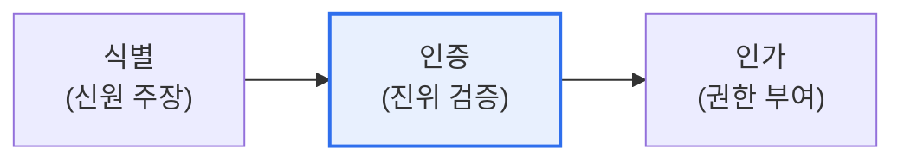

# 식별(Identification)과 인증(Authentication)

## 1. 개요

### 가. 정의
> **식별**은 시스템에게 "나는 누구다"라고 **주체를 주장·구별**하는 것이고, **인증**은 그 주장이 **진짜임을 검증**하는 것이다. 식별이 신원을 밝히는 것이라면, 인증은 그 신원이 맞는지 확인하는 것이다.

두 개념의 차이를 이해하는 핵심은 '**주장과 증명은 다르다**'는 데 있다. 식별은 사용자가 자신이 누구인지 밝히는 단계로, 아이디를 입력하는 것이 대표적이다. 그러나 아이디만으로는 그 사람이 진짜 그 사람인지 알 수 없다. 남의 아이디도 얼마든지 입력할 수 있기 때문이다. 그래서 인증이 필요하다. 인증은 "당신이 정말 그 사람인가"를 비밀번호·생체정보 등으로 검증한다. 은행에 비유하면, 창구에서 이름을 말하는 것이 식별이고, 신분증을 제시해 본인임을 증명하는 것이 인증이다. 이 둘에 더해, 인증된 사용자가 무엇을 할 수 있는지 정하는 **인가(Authorization)** 가 이어진다. 식별→인증→인가는 접근 통제의 3단계로, 보안의 기본 뼈대를 이룬다.

### 나. 개인 식별과 사용자 인증의 차이

| 구분 | 식별(Identification) | 인증(Authentication) |
|---|---|---|
| **의미** | 신원을 주장·구별 | 주장의 진위 검증 |
| **질문** | "당신은 누구인가?" | "정말 그 사람이 맞는가?" |
| **예** | 아이디·사번 입력 | 비밀번호·지문·OTP |
| **결과** | 주체 특정(고유 식별) | 신원 확인(참/거짓) |

## 2. 사용자 인증 시 보안 요구사항

인증 시스템이 안전하려면 여러 요구사항을 충족해야 한다.

| 요구사항 | 내용 |
|---|---|
| **기밀성** | 인증정보(비밀번호) 노출 방지(암호화·해시) |
| **무결성** | 인증정보 위변조 방지 |
| **재사용 방지** | 재전송(Replay) 공격 방어(OTP·논스) |
| **상호 인증** | 서버·사용자 양방향 검증(피싱 방지) |
| **강력함** | 추측·무차별 대입 저항(복잡도·MFA) |

## 3. 인증 방식에 따른 4가지 유형

인증은 '무엇으로 증명하는가'에 따라 네 가지 요소로 나뉜다.

| 유형 | 근거 | 예 | 특징 |
|---|---|---|---|
| **지식 기반** | 아는 것(Something you know) | 비밀번호·PIN | 간편하나 유출·추측 취약 |
| **소유 기반** | 가진 것(Something you have) | OTP·스마트카드·토큰 | 분실 위험 |
| **생체 기반** | 존재(Something you are) | 지문·홍채·얼굴 | 편리·고유하나 변경 불가 |
| **행위/위치 기반** | 하는 것/위치(Somewhere/behavior) | 서명·타이핑 패턴·위치 | 보조 인증 |

각 유형은 장단점이 다르므로, 서로 다른 유형을 조합한 **다중요소인증(MFA)** 이 보안을 크게 높인다. 예를 들어 비밀번호(지식)와 OTP(소유)를 함께 쓰면, 하나가 유출돼도 다른 하나가 방어한다.

## 4. 고려사항 및 시사점

1. **다중요소인증(MFA)이 필수**다. 단일 요소(비밀번호)는 유출·탈취에 취약하므로, 서로 다른 유형을 조합해 하나가 뚫려도 계정이 보호되도록 해야 한다.
2. **비밀번호에서 패스키(FIDO2)로 전환**되고 있다. 지식 기반 인증의 근본적 취약성(유출·재사용)을 극복하기 위해, 생체+소유 기반의 비밀번호 없는 인증(패스키)이 확산된다.
3. **상황·위험 기반 인증**으로 진화한다. 접속 위치·기기·행동을 분석해 위험할 때만 추가 인증을 요구하는 적응형 인증(제로트러스트)으로, 보안과 편의를 함께 높인다.

---

> **한 줄 요약**: 식별은 *신원을 주장(누구인가)*, 인증은 *그 진위를 검증(맞는가)* 하는 것으로, 지식·소유·생체·행위의 4가지 인증 유형이 있으며 서로 다른 유형을 조합한 MFA와 패스키·적응형 인증으로 보안을 강화한다.
