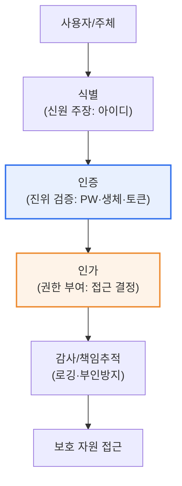
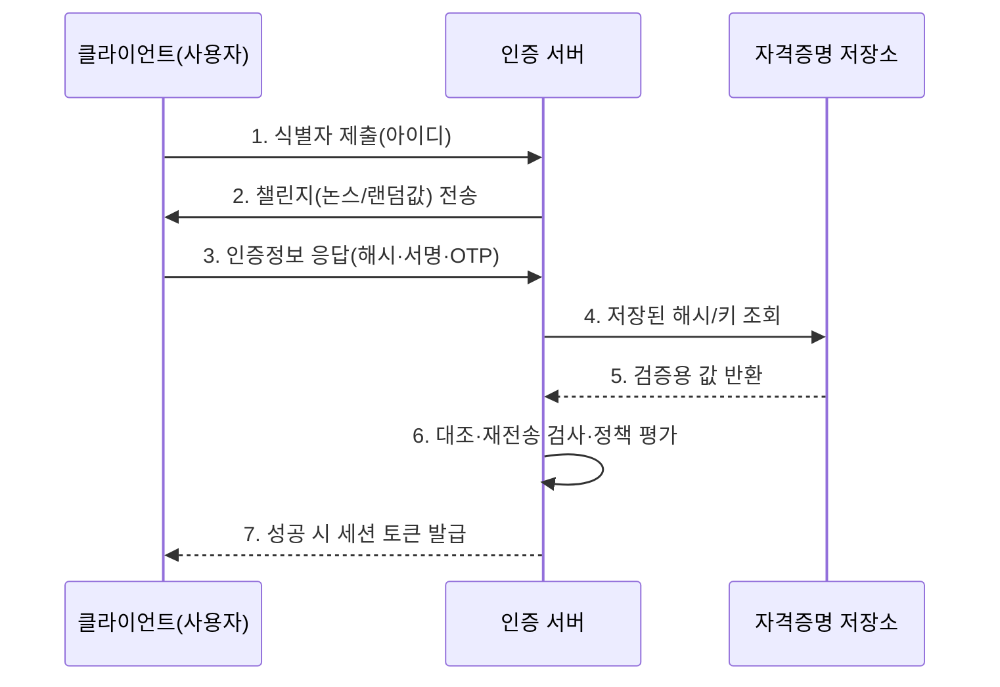

# 식별(Identification)과 인증(Authentication)

## 1. 개요

### 가. 정의

> **식별(Identification)** 은 시스템에게 "나는 누구다"라고 **주체를 주장·구별**하는 행위이고, **인증(Authentication)** 은 그 주장이 **진짜임을 검증**하는 행위이다. 식별이 신원을 밝히는 것이라면, 인증은 그 신원이 실제로 맞는지 확인하는 것이다.

두 개념을 구분하는 핵심은 '**주장(claim)과 증명(proof)은 다르다**'는 데 있다. 식별은 사용자가 자신이 누구인지 밝히는 단계로, 로그인 창에 아이디를 입력하거나 사원증의 사번을 제시하는 것이 대표적이다. 그러나 아이디는 시스템 안에서 주체를 유일하게 특정(unique identifier)하기 위한 이름표일 뿐, 그 사람이 진짜 그 사람인지는 전혀 보장하지 못한다. 타인의 아이디도 얼마든지 입력할 수 있기 때문이다.

그래서 인증이 필요하다. 인증은 "당신이 정말 그 사람인가"를 비밀번호·생체정보·소유 토큰 등의 **인증 요소(authentication factor)** 로 검증한다. 은행 창구에 비유하면, 이름을 말하는 것이 식별이고, 신분증을 제시해 본인임을 증명하는 것이 인증이다. 식별의 결과는 '주체 특정(누구인가)'이고, 인증의 결과는 '참/거짓 판정(맞는가)'이라는 점에서 두 단계는 산출물 자체가 다르다.

이 둘에 더해, 인증된 사용자가 무엇을 할 수 있는지 정하는 **인가(Authorization)** 와, 행위의 부인을 막는 **책임추적성(Accountability)·부인방지(Non-repudiation)** 가 이어진다. 흔히 **AAA(Authentication·Authorization·Accounting)** 라 부르는 이 체계에서, 식별→인증→인가→감사(로깅)는 접근 통제(Access Control)의 기본 뼈대를 이룬다. 식별이 부실하면 인증의 대상 자체가 흐려지고, 인증이 부실하면 인가 이후의 모든 권한 판단이 무너지므로, 네 단계는 하나의 사슬로 이해해야 한다.

### 나. 등장 배경과 필요성

식별·인증이 정보보안의 출발점으로 자리 잡은 배경에는, 자원(데이터·시스템)에 대한 접근을 '누가' 하는지 특정하지 못하면 기밀성·무결성·가용성(CIA) 어느 것도 지킬 수 없다는 근본적 이유가 있다. 접근 주체를 특정할 수 없으면 권한 부여도, 사고 발생 시 책임 추적도 불가능하다. 초기에는 아이디/비밀번호(ID/PW)만으로 충분하다고 여겨졌으나, 피싱·크리덴셜 스터핑·데이터 유출로 비밀번호가 대량 노출되면서 단일 요소 인증의 한계가 명확해졌다.

특히 클라우드·모바일·재택근무의 확산으로 접근 경로가 '내부망 안'이라는 경계를 벗어나면서, "네트워크 안에 있으니 믿는다"는 전제가 무너졌다. 이에 따라 매 접근마다 신원을 다시 검증하는 **제로 트러스트(Zero Trust)** 패러다임이 등장했고, 식별·인증은 보안의 부수적 절차가 아니라 아키텍처의 중심축으로 재평가되었다. 오늘날 식별·인증은 '한 번 통과하면 끝'이 아니라 '지속적으로 검증하는 과정'으로 이해된다.

### 다. 개인 식별과 사용자 인증의 차이

| 구분 | 식별(Identification) | 인증(Authentication) |
|---|---|---|
| **의미** | 신원을 주장·구별 | 주장의 진위 검증 |
| **핵심 질문** | "당신은 누구인가?" | "정말 그 사람이 맞는가?" |
| **입력 예** | 아이디·사번·이메일 | 비밀번호·지문·OTP |
| **산출 결과** | 주체 특정(고유 식별자) | 신원 확인(참/거짓) |
| **보안 강도** | 공개 가능(비밀 아님) | 반드시 비밀·검증 가능해야 함 |

표에서 보듯 식별자는 원칙적으로 '비밀이 아니다'. 아이디나 이메일은 노출되어도 그 자체로 계정이 탈취되지 않는다. 반면 인증 요소는 노출되는 순간 계정이 뚫린다. 이 차이 때문에 식별자와 인증정보의 관리 수준(암호화·저장 방식·전송 보호)은 근본적으로 달라야 한다. 식별자를 인증 수단처럼 취급하는 설계(예: 주민번호나 전화번호를 곧 인증으로 삼는 관행)가 위험한 이유가 여기에 있다.

## 2. 식별·인증·인가의 처리 흐름과 전체 구조

먼저 접근 통제의 전체 구조를 개념도로 살펴보고, 이어서 인증 요청이 처리되는 과정을 세부 흐름도로 나눠 설명한다.

```mermaid
flowchart TB
  U[사용자/주체] --> ID["식별<br/>(신원 주장: 아이디)"]
  ID --> AU["인증<br/>(진위 검증: PW·생체·토큰)"]
  AU --> AZ["인가<br/>(권한 부여: 접근 결정)"]
  AZ --> AC["감사/책임추적<br/>(로깅·부인방지)"]
  AC --> R[보호 자원 접근]
  style AU fill:#e8f0fe,stroke:#2f6fed,stroke-width:2px
  style AZ fill:#fef3e8,stroke:#ed8a2f,stroke-width:2px
```

위 구조도는 하나의 접근 요청이 자원에 도달하기까지 거치는 네 관문을 나타낸다. 각 관문은 앞 단계의 결과를 신뢰의 전제로 삼는다. 인증이 통과되지 않으면 인가 판단은 무의미하고, 감사 로그에 남는 주체 정보 역시 식별·인증이 정확해야 신뢰할 수 있다. 즉 뒤 단계의 보안 가치는 앞 단계의 정확성에 종속된다.

다음은 실제 인증 요청이 서버에서 검증되는 과정을 세부화한 흐름이다. 상호 인증과 재전송 방지가 어떻게 개입하는지를 함께 표현했다.

```mermaid
sequenceDiagram
  participant C as 클라이언트(사용자)
  participant S as 인증 서버
  participant D as 자격증명 저장소
  C->>S: 1. 식별자 제출(아이디)
  S->>C: 2. 챌린지(논스/랜덤값) 전송
  C->>S: 3. 인증정보 응답(해시·서명·OTP)
  S->>D: 4. 저장된 해시/키 조회
  D-->>S: 5. 검증용 값 반환
  S->>S: 6. 대조·재전송 검사·정책 평가
  S-->>C: 7. 성공 시 세션 토큰 발급
```

이 세부 흐름의 핵심은 **비밀번호 원문이 네트워크에 흐르지 않도록** 챌린지-리스폰스(challenge-response) 방식으로 검증한다는 점이다. 서버가 매번 다른 논스(nonce)를 던지고 클라이언트가 이를 포함해 응답하면, 공격자가 응답을 가로채 재전송(Replay)해도 논스가 달라 실패한다. 6단계의 '정책 평가'에서는 단순 일치 여부를 넘어 접속 위치·기기·시간 등 맥락을 함께 본다. 이것이 뒤에서 설명할 적응형 인증의 접점이다.

## 3. 사용자 인증 시 보안 요구사항

인증 시스템이 안전하려면 개별 요소의 강도뿐 아니라 시스템 전체가 여러 요구사항을 동시에 충족해야 한다. 요구사항은 서로 독립적이지 않고 상호 보완적으로 작동한다.

| 요구사항 | 내용 | 대표 통제 |
|---|---|---|
| **기밀성** | 인증정보(비밀번호) 노출 방지 | 솔트 해시(bcrypt·Argon2)·TLS |
| **무결성** | 인증정보·메시지 위·변조 방지 | MAC·전자서명 |
| **재사용 방지** | 재전송(Replay) 공격 방어 | OTP·논스·타임스탬프 |
| **상호 인증** | 서버·사용자 양방향 검증 | 서버 인증서·채널 바인딩 |
| **강력함** | 추측·무차별 대입 저항 | 복잡도 정책·MFA·계정 잠금 |

**기밀성**은 저장과 전송 두 국면 모두에서 지켜야 한다. 비밀번호는 원문이 아니라 계정마다 다른 솔트(salt)를 더한 뒤 bcrypt·scrypt·Argon2 같은 느린 해시로 저장해야, 유출되더라도 레인보우 테이블·대량 크래킹에 견딜 수 있다. 전송 구간은 TLS로 암호화해 중간자(MITM)가 평문을 보지 못하게 한다. 과거 MD5·단순 SHA로 저장하던 서비스들이 대규모 유출 사고 후 크래킹당한 사례는, 저장 방식이 인증 보안의 마지막 방어선임을 보여준다.

**상호 인증**은 흔히 간과되지만 피싱 방어의 핵심이다. 사용자만 자신을 증명하고 서버는 증명하지 않으면, 가짜 사이트가 정상 서버인 척 사용자의 인증정보를 가로챌 수 있다. HTTPS의 서버 인증서 검증, FIDO2의 도메인 바인딩(오리진 확인)이 상호 인증을 강제해 피싱 사이트에서는 자격증명이 작동하지 않도록 만든다. **재사용 방지**는 한 번 쓴 인증 응답이 재활용되지 못하게 하는 것으로, OTP의 30초 유효시간이나 논스가 이 역할을 한다.

이 요구사항들은 어느 하나만 충족해서는 안 된다. 예컨대 강력한 비밀번호(강력함)를 쓰더라도 평문 전송(기밀성 위반)이면 무의미하고, 기밀성을 지켜도 서버를 검증하지 않으면(상호 인증 위반) 피싱에 뚫린다. 보안은 가장 약한 고리에서 무너지기 때문이다.

## 4. 인증 방식에 따른 4가지 유형과 다중요소인증

인증은 '무엇으로 증명하는가'에 따라 네 가지 요소로 나뉜다. 각 유형은 원리가 다르므로 강점과 약점도 상반되며, 이 상반성이 곧 조합(MFA)의 근거가 된다.

| 유형 | 근거 | 예 | 강점 | 약점 |
|---|---|---|---|---|
| **지식 기반** | 아는 것(know) | 비밀번호·PIN | 구현 간편·비용 저렴 | 유출·추측·재사용 취약 |
| **소유 기반** | 가진 것(have) | OTP·스마트카드·보안키 | 물리적 소유 필요 | 분실·도난·복제 위험 |
| **생체 기반** | 존재(are) | 지문·홍채·얼굴 | 편리·고유·분실 없음 | 변경 불가·오인식(FAR/FRR) |
| **행위·위치 기반** | 하는 것/위치 | 서명·타이핑·GPS | 무자각 인증 가능 | 정확도 낮아 보조용 |

**지식 기반**은 가장 오래되고 널리 쓰이지만 근본적 약점이 많다. 사람이 기억할 수 있는 비밀번호는 복잡도에 한계가 있고, 여러 사이트에 재사용되며, 한 곳이 유출되면 크리덴셜 스터핑으로 다른 계정까지 뚫린다. 통계적으로 대규모 계정 탈취 사고의 상당수가 비밀번호 재사용에서 비롯된다는 점은 이 유형의 태생적 한계를 보여준다.

**소유 기반**은 공격자가 물리 매체를 확보해야 하므로 원격 대량 공격에 강하다. OTP는 시간(TOTP)이나 이벤트(HOTP)에 동기화된 일회용 값을 만들어 재전송을 무력화한다. 다만 SMS OTP는 심 스와핑(SIM swapping)·중계 피싱에 취약해, 근래에는 하드웨어 보안키(FIDO2)나 인증 앱이 권장된다. **생체 기반**은 편리하고 분실 위험이 없지만, 유출 시 비밀번호처럼 '재발급'이 불가능하다는 치명적 특성이 있다. 그래서 생체정보는 서버로 보내지 않고 기기 내 보안 영역(예: TEE·Secure Enclave)에 저장·대조하는 방식이 표준이 되었다.

각 유형의 약점이 서로 다르므로, 서로 다른 유형을 조합한 **다중요소인증(MFA, Multi-Factor Authentication)** 이 보안을 비약적으로 높인다. 핵심은 '서로 다른 유형'이라는 점이다. 비밀번호 두 개를 요구하는 것은 여전히 지식 기반 하나이므로 MFA가 아니다. 비밀번호(지식)와 OTP(소유)를 함께 쓰면, 비밀번호가 유출돼도 공격자가 OTP 기기를 갖고 있지 않아 막힌다. 실제로 MFA는 자동화된 대량 계정 탈취 시도를 크게 차단하는 것으로 보고되며, 이것이 금융·공공·기업 시스템에서 MFA를 의무화하는 이유다.

한편 생체 인증을 평가할 때는 두 가지 오류율을 함께 보아야 한다. **오수락률(FAR, False Acceptance Rate)** 은 타인을 본인으로 잘못 받아들이는 비율로 보안 위험과 직결되고, **오거부율(FRR, False Rejection Rate)** 은 본인을 거부하는 비율로 사용성과 직결된다. 두 값은 임계값을 조이면 한쪽이 낮아지고 다른 쪽이 높아지는 상충 관계에 있으며, 둘이 같아지는 지점을 **동일오류율(EER, Equal Error Rate)** 이라 하여 생체 시스템의 성능 비교 지표로 쓴다. 고보안 환경은 FAR를 낮추도록(엄격하게), 대중 서비스는 FRR을 낮추도록(관대하게) 임계값을 조정하는 것이 일반적이며, 이 조정 자체가 보안과 편의의 트레이드오프를 보여주는 대표적 예다.

## 5. 심화 — 비밀번호 없는 인증(패스키)과 적응형 인증으로의 전환

최근 인증 기술의 가장 큰 흐름은 두 가지다. 하나는 지식 기반 인증(비밀번호)을 아예 없애는 **패스키(Passkey)** 이고, 다른 하나는 맥락을 반영해 인증 강도를 동적으로 조절하는 **적응형·위험기반 인증(Adaptive/Risk-based Authentication)** 이다.

**패스키**는 FIDO2/WebAuthn 표준에 기반한 비밀번호 없는 인증이다. 사용자의 기기가 공개키/개인키 쌍을 만들어, 개인키는 기기의 보안 영역에 두고 공개키만 서버에 등록한다. 로그인 시 서버가 보낸 챌린지를 개인키로 서명하고 서버는 공개키로 검증하므로, 서버에는 탈취해 재사용할 '비밀'이 저장되지 않는다. 게다가 서명은 등록된 도메인(오리진)에서만 유효해 피싱 사이트에서는 작동하지 않는다. 즉 패스키는 '유출될 비밀이 없고, 피싱이 원천 차단되는' 구조로, 비밀번호의 두 가지 근본 문제(유출·피싱)를 동시에 해결한다. 주요 플랫폼(운영체제·브라우저)이 패스키를 기본 지원하기 시작하면서 확산이 빨라지고 있다.

**적응형 인증**은 '모든 접근을 똑같이 대하지 않는다'는 발상이다. 평소 쓰던 기기·위치·시간대에서의 접속은 낮은 마찰로 통과시키고, 새로운 국가에서의 로그인이나 비정상적 행동 패턴이 감지되면 추가 인증(스텝업)을 요구한다. 이는 앞서 흐름도의 '정책 평가' 단계에서 접속 맥락(디바이스 핑거프린트·IP 평판·행동 분석)을 점수화해 실시간으로 판단한다. 제로 트러스트의 "명시적으로 검증하라(verify explicitly)" 원칙과 결합해, 보안 강도와 사용자 편의를 동시에 끌어올리는 방향으로 발전하고 있다.

두 흐름은 서로 배타적이지 않다. 패스키로 인증 요소 자체를 강하게 만들고, 적응형 정책으로 언제 재검증할지를 지능적으로 결정하면, "강하면서도 번거롭지 않은" 인증이 가능해진다. 실제 예상 출제 방향으로는 '패스키와 기존 MFA의 보안·사용성 비교', '제로 트러스트에서 식별·인증의 역할', '생체정보 보호를 위한 저장·처리 방식' 등이 논술 주제로 다뤄질 수 있다.

## 6. 고려사항 및 시사점

기술사 관점에서 식별·인증 체계를 설계·평가할 때는 다음을 종합적으로 고려해야 한다.

1. **다중요소인증(MFA)의 의무화와 요소 조합 전략.** 단일 요소(특히 비밀번호)는 유출·탈취에 태생적으로 취약하므로, 서로 다른 유형을 조합해 하나가 뚫려도 계정이 보호되도록 해야 한다. 다만 SMS OTP처럼 약화된 요소는 피하고, 하드웨어 보안키·인증 앱·패스키 중심으로 요소를 선택하는 것이 트레이드오프상 유리하다.

2. **비밀번호에서 패스키(FIDO2)로의 전환 로드맵.** 지식 기반 인증의 근본적 취약성(유출·재사용·피싱)을 극복하려면 패스키로의 이행이 필요하지만, 기기 분실·계정 복구·레거시 시스템 호환이라는 현실적 제약이 있다. 따라서 전면 전환보다 '패스키 우선, 비밀번호 폴백 축소'의 단계적 접근과, 안전한 계정 복구 절차 설계가 관건이다.

3. **상황·위험 기반 적응형 인증으로의 진화.** 접속 위치·기기·행동을 분석해 위험할 때만 추가 인증을 요구하는 적응형 인증은 제로 트러스트의 핵심 구현이다. 보안과 편의의 균형을 잡되, 오탐(정상 사용자 차단)과 미탐(공격 통과)의 임계값을 지속적으로 튜닝하는 운영 역량이 함께 요구된다.

4. **생체정보의 보호와 프라이버시 준수.** 생체정보는 변경 불가능하므로 유출 시 피해가 영구적이다. 원본을 서버로 전송·저장하지 않고 기기 내 보안 영역에서 처리하는 설계, 그리고 개인정보보호법상 민감정보 처리 요건 준수가 필수다. 편의성만 좇아 생체정보를 중앙 집중 저장하는 설계는 규제·보안 양면에서 위험하다.

5. **식별자와 인증정보의 분리 원칙.** 주민등록번호·전화번호처럼 공개·재사용되는 식별자를 인증 수단으로 겸용하는 관행은 위험하다. 식별자는 공개 가능한 이름표로, 인증정보는 비밀로 명확히 분리 관리해야 하며, 사고 시 재발급이 가능한 형태로 설계해야 한다.

## 참고자료

- NIST SP 800-63 Digital Identity Guidelines — https://pages.nist.gov/800-63-3/
- FIDO Alliance, Passkeys / FIDO2 & WebAuthn — https://fidoalliance.org/passkeys/
- W3C, Web Authentication (WebAuthn) — https://www.w3.org/TR/webauthn-2/
- NIST, Zero Trust Architecture(SP 800-207) — https://csrc.nist.gov/pubs/sp/800/207/final

---

> **한 줄 요약**: 식별은 *신원을 주장(누구인가)*, 인증은 *그 진위를 검증(맞는가)* 하는 것으로, 식별→인증→인가→감사의 접근 통제 사슬을 이루며, 지식·소유·생체·행위의 4가지 인증 요소를 조합한 MFA를 거쳐 유출·피싱을 원천 차단하는 패스키(FIDO2)와 맥락을 반영하는 적응형 인증으로 진화하고 있다.
