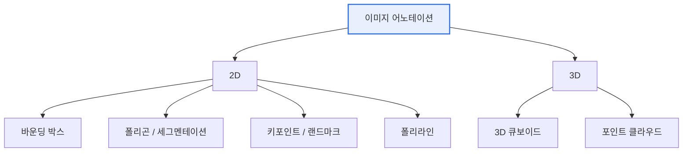

# 이미지 데이터 어노테이션(Image Data Annotation)

## 1. 개요

### 가. 정의
> 컴퓨터 비전 모델의 지도학습을 위해 이미지에 **객체·영역·속성 등의 정답 레이블(Ground Truth)을 부착**하는 작업.

어노테이션은 모델이 "무엇이 정답인지"를 배우는 **교과서를 만드는 과정**이다. 지도학습 모델은 사람이 부여한 정답을 기준으로 예측 오차를 줄여 나가므로, 레이블이 곧 학습의 기준점이 된다. 따라서 어노테이션의 정확성·일관성은 알고리즘 자체 못지않게 모델 성능을 좌우한다.

### 나. 등장 배경 및 필요성
"쓰레기를 넣으면 쓰레기가 나온다(Garbage In, Garbage Out)"는 말처럼, 모델 성능은 **레이블 품질**에 직접적으로 좌우된다. 같은 알고리즘이라도 정답이 부정확하거나 작업자마다 기준이 달라 들쭉날쭉하면 모델은 잘못된 패턴을 학습한다. 특히 자율주행(보행자 오인식이 사고로 직결)·의료영상(병변 누락이 오진으로 직결)·불량 검사처럼 **정밀 인식**이 요구되는 분야가 확대되면서, 대량의 고품질 레이블을 체계적으로 확보하는 일이 AI 개발의 핵심 병목이 되었다.

## 2. 어노테이션 유형 분류

어노테이션 유형은 **표현의 정밀도와 비용의 트레이드오프**로 이해하는 것이 핵심이다. 위로 갈수록(바운딩 박스) 작업이 빠르고 싸지만 형태 표현이 거칠고, 아래로 갈수록(세그멘테이션·3D) 픽셀·공간 단위로 정밀하지만 작업 시간과 비용이 급증한다. 따라서 목표 태스크가 요구하는 정밀도에 맞춰 유형을 고르는 것이 원칙이다.

## 3. 유형별 특징

각 유형은 대응하는 컴퓨터 비전 태스크가 다르다. **바운딩 박스**는 "무엇이 어디에 대략 있는가"만 알면 되는 객체 탐지에 쓰이고, **폴리곤·시맨틱 세그멘테이션**은 객체의 정확한 외곽·픽셀 경계가 필요한 형태 인식·의료영상에 쓰인다. **키포인트**는 관절·랜드마크의 위치 관계가 중요한 자세 추정·얼굴 인식에, **폴리라인**은 차선처럼 얇고 긴 선형 객체에, **3D 큐보이드/포인트 클라우드**는 거리·깊이가 필요한 자율주행 라이다에 쓰인다.

| 유형 | 설명 | 대표 활용 |
|---|---|---|
| 바운딩 박스(Bounding Box) | 객체를 사각형으로 표시 | 객체 탐지 |
| 폴리곤(Polygon) | 외곽을 다각형으로 정밀 표시 | 형태 인식·인스턴스 분할 |
| 시맨틱 세그멘테이션 | 픽셀 단위 클래스 분류 | 도로·배경 분할, 의료영상 |
| 키포인트(Keypoint) | 관절·랜드마크 점 표시 | 자세 추정·얼굴 인식 |
| 폴리라인(Polyline) | 선형 객체 표시 | 차선·도로 경계 |
| 3D 큐보이드 | 3차원 직육면체로 표시 | 자율주행 라이다·깊이 인식 |

예컨대 자율주행에서 앞차와의 충돌을 피하려면 대상이 화면 어디에 있는지(박스)뿐 아니라 **몇 미터 앞에 있는지**가 필요하므로 라이다 3D 큐보이드가 요구된다. 이처럼 유형 선택은 태스크의 물리적 요구에서 결정된다.

## 4. 어노테이션 기법

수작업 라벨링은 정확하지만 느리고 비싸다는 근본 한계가 있어, 기법은 **사람의 개입을 줄이는 방향**으로 진화해 왔다. 다만 완전 자동화는 오류 위험이 있어, 현재는 AI가 초안을 만들고 사람이 검수하는 **인간 참여형(Human-in-the-loop)** 이 주류다.

| 기법 | 설명 |
|---|---|
| 수동(Manual) | 사람이 직접 라벨링 — 정확하나 고비용·저속 |
| 반자동(Semi-auto) | AI가 사전 예측 후 사람이 검수·보정(HITL) |
| 자동(Auto-labeling) | 사전학습 모델로 자동 생성 후 샘플 검증 |
| 능동학습(Active Learning) | 모델이 불확실해하는 샘플을 우선 라벨링 |

특히 **능동학습**은 효율의 핵심 전략이다. 모든 데이터를 똑같이 라벨링하는 대신, 모델이 **가장 헷갈려 하는(예측 확신도가 낮은) 샘플**을 골라 우선적으로 사람에게 라벨링을 맡긴다. 정보량이 큰 데이터에 노동을 집중하므로, 같은 예산으로 더 큰 성능 향상을 얻을 수 있다.

## 5. 고려사항 및 시사점
기술사 관점의 핵심은 **품질과 효율의 균형**을 어떻게 설계하느냐다. 품질 측면에서는 명확한 라벨링 가이드라인, 교차검증, 작업자 간 일치도(IAA, Inter-Annotator Agreement) 측정으로 일관성을 담보해야 하고, 효율 측면에서는 반자동화·능동학습으로 비용을 낮춰야 한다. 또한 데이터에 특정 집단이 과소·과대 표현되면 모델이 편향을 학습하므로 **데이터 편향**을 관리해야 하고, 얼굴·차량 번호판 등 개인정보가 포함될 때는 **프라이버시(비식별화)** 를 반드시 고려해야 한다. 최근에는 SAM 같은 파운데이션 모델을 활용한 자동 세그멘테이션이 발전하면서, 사람의 역할이 라벨링에서 **검수·품질 관리**로 옮겨가는 추세다.

---

> **한 줄 요약**: 이미지 어노테이션은 *바운딩박스·폴리곤·세그멘테이션·키포인트·3D* 등 태스크 정밀도에 맞춰 정답을 부여하는 작업으로, 레이블 품질이 모델 성능을 좌우하며 수동→반자동→능동학습으로 품질과 효율을 함께 추구하고 편향·프라이버시를 관리해야 한다.
