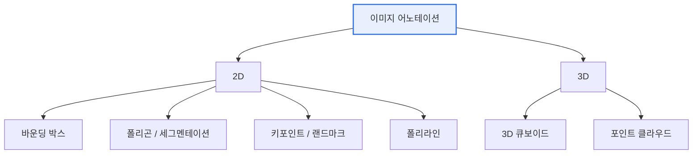

# 이미지 데이터 어노테이션(Image Data Annotation)

## 1. 개요

### 가. 정의
> 컴퓨터 비전 모델 학습을 위해 이미지에 **객체·영역·속성 등의 정답 레이블(Ground Truth)을 부착**하는 작업. 지도학습(Supervised Learning)의 품질을 좌우한다.

### 나. 필요성
- AI 모델 성능은 **레이블 품질**에 직접 좌우 (Garbage In, Garbage Out)
- 자율주행·의료영상·검사 등 **정밀 인식** 요구 증가

## 2. 어노테이션 유형 분류

## 3. 유형별 특징

| 유형 | 설명 | 활용 |
|---|---|---|
| **바운딩 박스** Bounding Box | 객체를 사각형으로 표시 | 객체 탐지(Object Detection) |
| **폴리곤** Polygon | 객체 외곽을 다각형으로 정밀 표시 | 형태 인식, 인스턴스 분할 |
| **시맨틱 세그멘테이션** | 픽셀 단위로 클래스 분류 | 도로·배경 분할, 의료영상 |
| **키포인트** Keypoint | 관절·랜드마크 등 점 표시 | 자세 추정, 얼굴 인식 |
| **폴리라인** Polyline | 선형 객체 표시 | 차선, 도로 경계 |
| **3D 큐보이드** | 3차원 직육면체로 표시 | 자율주행 라이다, 깊이 인식 |

## 4. 어노테이션 기법

| 기법 | 설명 |
|---|---|
| **수동(Manual)** | 사람이 직접 라벨링 — 정확하나 고비용·저속 |
| **반자동(Semi-auto)** | AI 사전 예측 후 사람이 검수·보정 (Human-in-the-loop) |
| **자동(Auto-labeling)** | 사전학습 모델로 자동 생성 후 샘플 검증 |
| **능동학습(Active Learning)** | 불확실 샘플 우선 라벨링으로 효율 극대화 |

## 5. 시사점
- 품질관리(가이드라인·교차검증·IAA*)와 **작업 효율(반자동화)** 의 균형
- 데이터 편향·프라이버시(얼굴·번호판) 고려 필수
- *IAA: Inter-Annotator Agreement(작업자 간 일치도)

---

> **한 줄 요약**: 이미지 어노테이션은 *바운딩박스·폴리곤·세그멘테이션·키포인트·3D* 등 유형별로 정답을 부여하는 작업으로, **수동→반자동→능동학습** 으로 품질과 효율을 동시에 추구한다.
