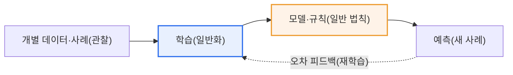
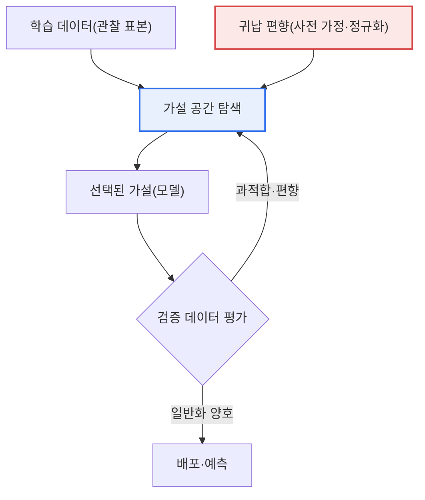

# 귀납적 사고(Inductive Reasoning)와 기계학습(Machine Learning)

## 1. 개요

### 가. 정의
> **귀납적 사고**는 개별 사례·관찰로부터 일반적 규칙·패턴을 도출하는 추론 방식이고, **기계학습**은 데이터(사례)로부터 규칙·모델을 학습하는 기술로, **본질적으로 귀납적 추론을 자동화·계산화한 것**이다.

두 개념을 함께 이해하는 핵심은 '**기계학습이 곧 컴퓨터가 하는 귀납적 사고**'라는 통찰이다. 귀납은 "까마귀 100마리를 봤더니 모두 검다 → 까마귀는 검다"처럼 구체적 관찰에서 일반 법칙을 이끌어내는 사고다. 이는 절대적 참을 보장하지 못하고(다음 까마귀가 흰색일 수 있다) 확률적·경험적이라는 특징이 있다. 기계학습도 똑같이 작동한다. 수많은 데이터(사례)를 보고 그 안의 패턴·규칙을 일반화한 모델을 만들어, 새로운 데이터를 예측한다. 즉 사람이 경험으로 규칙을 배우듯, 기계가 데이터로 규칙을 배우는 것이다.

이 대응은 단순한 비유가 아니라 학습이론(Learning Theory)에서 수학적으로 뒷받침된다. 통계적 학습이론에서 학습기(learner)는 입력·출력 쌍의 유한 표본으로부터 미지의 목표 함수를 근사하는 가설(hypothesis)을 고르는데, 이는 정확히 "유한한 관찰로 무한한 사례를 지배하는 일반 규칙을 추정한다"는 귀납의 정의와 일치한다. 예컨대 스팸 필터는 과거에 사람이 '스팸/정상'으로 표시한 수십만 통의 메일에서 단어·발신자·링크 패턴을 학습해, 한 번도 본 적 없는 새 메일을 분류한다. 관찰(라벨링된 메일)에서 규칙(분류 경계)을 세우고 새 사례에 적용하는 전형적 귀납 과정이다.

이 귀납적 본질 때문에 기계학습 모델은 학습 데이터에 없던 상황에서 틀릴 수 있고(일반화 오류), 학습 데이터의 편향을 그대로 이어받는 한계를 가진다. "검은 까마귀만 봤기에 흰 까마귀를 상상하지 못하는" 귀납의 원천적 취약성이, 데이터에 없던 소수 사례·엣지 케이스에서 모델이 무너지는 현상으로 재현되는 것이다. 따라서 기계학습을 이해할 때는 '얼마나 학습을 잘했는가'가 아니라 '**본 적 없는 데이터에 얼마나 잘 일반화하는가**'가 본질적 평가 기준이 된다.

### 나. 등장 배경과 필요성
규칙기반(rule-based) 접근의 한계가 기계학습(귀납적 접근)의 필요성을 낳았다. 1980년대 전문가 시스템은 사람이 IF-THEN 규칙을 일일이 코딩하는 연역적 방식이었으나, 현실의 예외·모호함이 많은 문제(필기체 인식, 자연어 이해, 이미지 분류)에서 규칙을 손으로 다 적는 것이 사실상 불가능했다. 반대로 데이터는 인터넷·센서·모바일로 폭증했다. "규칙을 사람이 쓰지 말고, 데이터에서 기계가 귀납하게 하자"는 전환이 곧 기계학습의 부상이며, 딥러닝의 성공(2012년 ImageNet)은 이 귀납적 패러다임이 규칙기반을 압도함을 실증했다.

### 다. 연역과의 대비
귀납과 대비되는 것이 연역(Deductive)이다. 연역은 일반 법칙에서 개별 결론을 이끌어내며(대전제→소전제→결론) 참을 보장하지만, 전제에 없던 새 지식을 만들지는 못한다. "모든 사람은 죽는다, 소크라테스는 사람이다, 따라서 소크라테스는 죽는다"는 논리적으로 완결되지만 새 법칙을 발견하지는 않는다. 전통적 규칙기반 AI(전문가 시스템)가 연역적이라면, 기계학습은 데이터에서 새 규칙을 발견하는 귀납적이다. 다만 실제 지능은 두 방식을 오가며, 최근 AI는 이 둘을 결합하는 방향(뉴로-심볼릭)으로 나아가고 있다.

## 2. 귀납적 사고와 기계학습의 대응 구조

먼저 관찰→일반화→예측으로 이어지는 귀납의 뼈대가 기계학습 파이프라인과 어떻게 1:1로 겹치는지를 전체 구조도로 본다.

이 흐름의 각 단계는 귀납적 사고의 인지 과정과 정확히 대응한다. **관찰(데이터 수집)** 단계에서 사람은 여러 사례를 눈으로 모으고, 기계는 라벨링된 학습 데이터를 수집한다. 여기서 관찰의 수와 다양성이 이후 일반화의 신뢰도를 결정한다는 점이 동일하다. 까마귀를 3마리만 본 사람의 일반화가 위험하듯, 소량·편중된 데이터로 학습한 모델도 위험하다.

**일반화(학습)** 단계에서 사람은 관찰들 사이의 공통 패턴을 추상화하고, 기계는 손실함수(loss)를 최소화하도록 파라미터를 조정한다. 예컨대 선형회귀는 관측점들을 가장 잘 지나는 직선의 기울기·절편을 찾는데, 이는 "여러 사례에서 하나의 경향 법칙을 뽑아내는" 귀납의 계산적 구현이다. 신경망의 경사하강법(gradient descent)은 오차를 줄이는 방향으로 가중치를 반복 조정하며, 사람이 여러 번 시행착오로 규칙을 다듬는 과정과 닮았다.

**일반 법칙(모델)** 단계에서 도출된 모델은 사람의 '경험칙'에 해당한다. 다만 사람의 경험칙이 언어로 표현되는 반면, 기계의 법칙은 수백만 개의 파라미터라는 수치 형태여서 사람이 직접 읽기 어렵다(설명가능성 문제의 뿌리). **예측(적용)** 단계에서 이 법칙을 새 사례에 적용하며, 예측 오차를 다시 학습에 피드백해 법칙을 갱신하는 순환(재학습)이 귀납적 지식의 자기수정 과정을 이룬다.

| 귀납적 사고 | 기계학습 | 공통 본질 |
|---|---|---|
| 개별 관찰 수집 | 학습 데이터 수집 | 표본이 결론의 신뢰도를 좌우 |
| 패턴·규칙 일반화 | 모델 학습(파라미터 추정) | 유한 사례→일반 규칙 추상화 |
| 일반 법칙 도출 | 학습된 모델 | 명시적 법칙 vs 수치 파라미터 |
| 새 사례에 적용 | 새 데이터 예측 | 미관측 사례로의 외삽 |
| 확률적·경험적(오류 가능) | 일반화 오류·편향 가능 | 절대 참 보장 불가 |

## 3. 귀납적 학습의 내부 메커니즘과 귀납 편향

기계가 유한한 데이터에서 어떻게 하나의 규칙을 '골라내는지'를 이해하려면 가설 공간(hypothesis space)과 귀납 편향(inductive bias) 개념이 필요하다. 아래는 학습기가 데이터와 편향을 결합해 모델을 선택하는 세부 프로세스도이다.

가설 공간이란 학습기가 고를 수 있는 모든 후보 규칙의 집합이다. 문제는 같은 데이터를 설명하는 규칙이 무수히 많다는 점이다. 예를 들어 점 3개를 지나는 곡선은 직선일 수도, 2차·10차 다항식일 수도 있다. 관찰만으로는 어느 것이 옳은지 결정할 수 없으며, 이것이 흄(Hume)이 지적한 '**귀납의 문제**'다. 따라서 학습기는 반드시 데이터 외의 추가 가정, 즉 **귀납 편향**을 도입해 후보를 좁혀야 한다.

귀납 편향은 "다른 조건이 같다면 어떤 규칙을 선호할 것인가"에 대한 사전 지식이다. 대표적으로 '단순한 규칙을 선호하라'는 오컴의 면도날(Occam's Razor)이 있으며, 이는 정규화(regularization)로 구현된다. 예컨대 L2 정규화는 가중치를 작게 유지해 복잡한 곡선보다 완만한 곡선을 선호하게 만든다. 합성곱신경망(CNN)의 '지역 연결·가중치 공유'는 "이미지는 국소 패턴의 조합"이라는 공간적 편향을, 순환신경망(RNN)의 구조는 "데이터에 시간 순서가 있다"는 순차적 편향을 내장한 예다. 편향이 문제 구조와 잘 맞을수록 적은 데이터로도 잘 일반화한다.

귀납 편향은 양날의 검이다. 편향이 없으면(가정이 전혀 없으면) 학습기는 학습 데이터를 통째로 외울 뿐 새 데이터에 아무 일반화도 못 한다("공짜 점심은 없다" 정리, No Free Lunch). 반대로 편향이 문제와 어긋나면 아무리 데이터가 많아도 틀린 방향으로 일반화한다. 실무에서 모델·아키텍처·정규화 강도를 고르는 것은 결국 '이 문제에 어떤 귀납 편향이 적절한가'를 고르는 것이며, 이것이 데이터 사이언티스트의 핵심 판단이다.

이 귀납적 본질에서 나오는 특성을 정리하면 다음과 같다.

| 특성 | 내용 | 실무적 함의 |
|---|---|---|
| **확률적** | 절대 참이 아닌 경험적 추정 | 예측에 신뢰구간·확률을 함께 제시 |
| **일반화 오류** | 학습에 없던 데이터에 틀릴 수 있음(과적합) | 교차검증·홀드아웃으로 상시 측정 |
| **데이터 의존** | 데이터의 양·질·편향이 결과 좌우 | 데이터 품질관리가 모델 성능의 상한 |
| **귀납 편향** | 모델이 가정하는 사전 지식이 일반화 방향 결정 | 문제에 맞는 모델·정규화 선택 |

## 4. 사례로 보는 귀납의 성공과 실패

귀납적 기계학습이 잘 작동한 사례와 무너진 사례를 비교하면 그 본질이 선명해진다. 성공 사례로 **AlphaGo**는 인간 기보 16만 판과 자가대국 데이터에서 '좋은 수'의 패턴을 귀납해, 명시적 바둑 규칙 없이도 세계 챔피언을 이겼다. 사람이 언어로 정의하기 어려운 '수의 좋음'을 데이터에서 일반화한 대표적 성공이다.

실패 사례로 아마존이 2014~2017년 개발하다 폐기한 **AI 채용 시스템**은 과거 10년치 합격 이력서를 학습했는데, 그 데이터에 남성 지원자가 압도적으로 많았던 탓에 '여성(women's)'이라는 단어가 든 이력서를 감점하는 규칙을 귀납해버렸다. 데이터의 편향을 그대로 법칙으로 굳힌 것으로, "관찰한 것에서만 규칙을 뽑는" 귀납의 한계가 차별로 현실화한 사례다. 또한 자율주행에서 학습 데이터에 드물었던 야간·역광·이상 물체 상황(엣지 케이스)에서 인식이 실패하는 것도, 관찰하지 못한 사례로의 외삽이 위험하다는 귀납의 원리를 그대로 보여준다.

이 대비의 실무적 함의는 분명하다. 귀납적 기계학습의 성능 상한은 결국 데이터가 결정하며, "**데이터에 없는 지혜는 모델에도 없다**". 따라서 대표성 있는 데이터 확보와 편향 점검이 모델 정확도 튜닝보다 우선하는 과제가 된다.

## 5. 학습 유형별로 본 귀납의 양상

기계학습의 세 갈래(지도·비지도·강화)는 모두 귀납이지만, '무엇으로부터 무엇을 일반화하는가'가 서로 다르다. 이를 구분해 보면 귀납적 사고와의 대응이 더 선명해진다.

**지도학습(Supervised)** 은 입력과 정답(라벨) 쌍에서 입력→출력의 사상 규칙을 귀납한다. "이 사진들은 고양이, 저 사진들은 개"라는 라벨링된 관찰에서 분류 경계를 일반화하는 것으로, 사람이 예시와 정답을 함께 보며 규칙을 배우는 지도학습적 귀납과 정확히 대응한다. 라벨이 곧 관찰의 '정답 표지'이므로 라벨 품질이 일반화의 상한을 결정한다.

**비지도학습(Unsupervised)** 은 정답 없이 데이터의 구조·군집·분포만으로 잠재 패턴을 귀납한다. 라벨 없는 고객 구매 이력에서 유사 고객군을 군집화(clustering)하는 것이 예로, 사람이 명시적 정답 없이 사물들의 공통점을 스스로 범주화하는 개념 형성 과정과 닮았다. 무엇이 '옳은 패턴'인지 외부 기준이 없어, 발견한 규칙의 타당성 해석이 더 까다롭다.

**강화학습(Reinforcement)** 은 시행착오로 얻은 보상 신호에서 '좋은 행동 정책'을 귀납한다. 정답을 직접 주지 않고 결과의 좋고 나쁨(보상)만 피드백하므로, 사람이 경험의 성공·실패를 통해 행동 규칙을 체득하는 경험적 귀납에 가깝다. 관찰이 정적 데이터가 아니라 '행동→결과'의 상호작용에서 생성된다는 점이 특징이며, 그만큼 탐험(exploration)과 활용(exploitation)의 균형이 일반화에 관건이 된다.

| 학습 유형 | 관찰(입력) | 일반화 대상 | 인지적 대응 |
|---|---|---|---|
| 지도학습 | 입력+정답 라벨 | 입력→출력 사상 | 예시·정답으로 배우기 |
| 비지도학습 | 라벨 없는 데이터 | 잠재 구조·군집 | 스스로 개념 범주화 |
| 강화학습 | 행동·보상 신호 | 최적 행동 정책 | 시행착오로 체득 |

## 6. 심화 — 귀납의 한계를 넘어서려는 최신 흐름

순수 귀납적 기계학습의 한계(설명력 부족, 데이터 편향, 엣지 케이스 취약)를 보완하려는 연구가 최근 AI의 큰 흐름을 이룬다. 첫째, **뉴로-심볼릭 AI(Neuro-Symbolic AI)** 는 데이터에서 배우는 귀납적 신경망과 논리·규칙을 다루는 연역적 심볼릭 추론을 결합해, 데이터로 배우되 사람이 검증 가능한 규칙으로 추론하도록 한다. 이는 "귀납으로 가설을 세우고 연역으로 검증한다"는 과학적 방법을 AI에 이식하려는 시도다.

둘째, **RAG(검색증강생성)** 는 대규모 언어모델의 귀납적 지식(학습 파라미터)에 외부 지식베이스 검색을 결합해, 모델이 확률적으로 지어내는 환각(hallucination)을 근거 문서로 보정한다. 귀납만으로는 최신·정확한 사실을 담보하기 어렵다는 한계를, 연역적 근거 제시로 보완하는 구조다. 셋째, **파운데이션 모델·전이학습**은 방대한 데이터로 일반적 표현을 먼저 귀납한 뒤 소량 데이터로 특정 과업에 적응(fine-tuning)시켜, 적은 관찰로도 잘 일반화하도록 귀납의 데이터 의존성을 완화한다. 넷째, **설명가능 AI(XAI)** 는 수치 파라미터로 굳어진 귀납적 법칙을 사람이 이해할 수 있는 근거로 역해석해, 귀납의 '블랙박스' 성격을 보완한다.

기술사 관점에서 이 흐름의 공통점은 '**순수 귀납의 확률적·불투명한 성격을, 연역적 규칙·근거·설명으로 통제 가능하게 만드는 것**'이다. 즉 AI의 발전 방향은 귀납을 버리는 것이 아니라, 귀납과 연역을 결합해 신뢰성을 높이는 데 있다.

## 7. 고려사항 및 시사점 (기술사 관점)

1. **일반화가 최종 목표이며 평가의 본질이다.** 기계학습의 성패는 학습 데이터를 외우는 것이 아니라 새 데이터에 잘 적용되는 일반화에 있으므로, 학습 정확도가 아니라 검증·테스트 성능으로 판단하고 교차검증·홀드아웃으로 일반화 오류를 상시 측정해야 한다. 학습 성능만 높고 검증 성능이 낮은 과적합은 귀납이 실패한 신호다.
2. **데이터 편향이 곧 모델 편향이며, 이는 거버넌스 과제다.** 귀납은 관찰한 데이터에서만 규칙을 이끌므로 학습 데이터가 편향되면 모델도 편향된다. 대표성 있는 데이터 확보, 편향 탐지·완화, 데이터 출처·라벨 품질관리가 신뢰의 전제이며, 이는 AI 윤리·공정성 규제(EU AI Act 등)와 직결된다.
3. **귀납 편향(모델 선택)은 아키텍트의 핵심 판단이다.** 어떤 모델·정규화·아키텍처를 쓸지는 곧 어떤 사전 가정을 도입할지의 문제다. 문제 구조에 맞는 편향(이미지→CNN, 순차→트랜스포머)을 선택해야 적은 데이터로도 잘 일반화하며, 이는 무조건 큰 모델이 답이 아님을 뜻한다.
4. **귀납과 연역의 결합으로 신뢰성을 확보한다.** 데이터로 배우는 귀납적 기계학습에 지식·규칙을 결합한 뉴로-심볼릭 AI, RAG, XAI가 등장해 귀납의 한계(설명력·정확성·환각)를 보완하고 있다. 미션 크리티컬 영역일수록 순수 귀납보다 검증 가능한 하이브리드 구조를 지향해야 한다.
5. **불확실성을 명시하는 운영이 필요하다.** 귀납적 예측은 본질적으로 확률적이므로, 점 예측만 제시하지 말고 신뢰구간·확신도(confidence)를 함께 제공하고, 확신이 낮은 경우 사람에게 판단을 넘기는 휴먼-인-더-루프(Human-in-the-loop)를 설계해 오류의 파급을 통제해야 한다.

---

> **한 줄 요약**: 기계학습은 *데이터(사례)에서 규칙을 일반화하는 귀납적 사고를 자동화·계산화* 한 기술로, 가설 공간을 귀납 편향으로 좁혀 모델을 선택하는 확률적 과정이며, 그 본질상 일반화 오류·데이터 편향·불투명성의 한계를 가지므로 교차검증·데이터 품질관리·귀납과 연역의 결합(뉴로-심볼릭·RAG·XAI)으로 신뢰성을 보완해야 한다.
