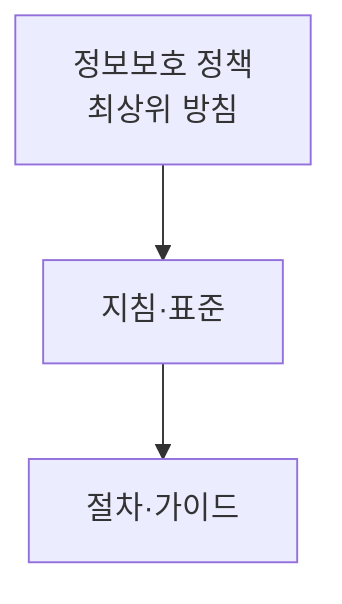

# 정보보호 정책과 보안 활동·전문가

## 1. 개요

### 가. 배경
> 조직 규모 확대로 정보보안 필요성이 커지면서 **정보보안 조직 신설·보안 체계 수립**이 요구된다. 그 최상위 기준이 **정보보호 정책**이다.

### 나. 필요성
- 일관된 보안 기준·책임 체계, 법규(ISMS-P) 준수, 리스크 관리

## 2. 정보보호 정책의 개념

| 항목 | 내용 |
|---|---|
| **정의** | 조직의 정보보호 **의지·방향을 명문화한 최상위 문서** |
| **위계** | 정책 → 지침·표준 → 절차·가이드(계층 구조) |
| **요건** | 경영진 승인·지지, 전사 적용, 주기적 검토·갱신 |
| **내용** | 목적·범위, 역할·책임, 준수·처벌, 보안 원칙 |

## 3. 보안 시점별 활동(Security Action Cycle)

| 시점 | 활동 |
|---|---|
| **억제(Deterrence)** | 정책·처벌 고지로 위협 억제 |
| **예방(Prevention)** | 접근통제·암호화·교육(사전 차단) |
| **탐지(Detection)** | 모니터링·IDS/SIEM으로 침해 탐지 |
| **대응(Response)** | 사고 대응·격리·조사 |
| **복구(Recovery)** | 백업 복구·재발 방지(BCP) |

## 4. 정보보안 전문가의 역할·역량

| 구분 | 내용 |
|---|---|
| **역할** | 정책 수립, 위험관리, 사고 대응, 보안 운영·감사, 인식제고 교육 |
| **기술 역량** | 시스템·네트워크·암호·클라우드 보안, 포렌식 |
| **관리 역량** | 거버넌스·컴플라이언스(ISMS-P), 리스크 관리 |
| **소프트 역량** | 커뮤니케이션, 윤리, 최신 위협 학습 |

## 5. 고려사항 및 시사점
- 정책은 **경영진 의지 + 전사 실행**이 성공 요건
- 기술·관리·물리 보안의 균형, 제로트러스트로 진화
- 보안은 일회성이 아닌 **지속 순환(Action Cycle)** 관리

---

> **한 줄 요약**: 정보보호 정책은 *조직 보안 의지를 명문화한 최상위 문서(정책→지침→절차)* 이며, 보안 활동은 *억제·예방·탐지·대응·복구* 의 순환으로 수행되고, 보안 전문가는 정책·위험관리·사고대응의 기술·관리·윤리 역량을 갖춰야 한다.
