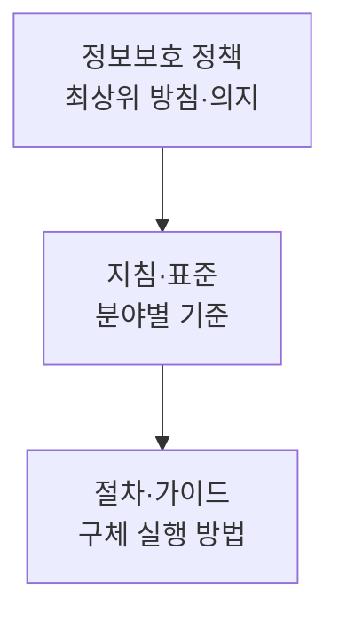

# 정보보호 정책과 보안 활동 · 전문가

## 1. 개요

### 가. 정의
> 조직의 **정보보호에 대한 최고경영진의 의지와 방향을 명문화한 최상위 문서**로, 이를 정점으로 지침·표준·절차가 계층적으로 파생되어 조직 전체의 보안 활동을 규율하는 기준.

### 나. 등장 배경 및 필요성
조직이 커지고 정보자산이 늘어나면 보안 통제가 개인의 재량이나 담당자의 관행에 맡겨질 수 없다. 부서마다 다른 기준으로 접근권한을 주고, 사고 대응이 즉흥적으로 이뤄지면 통제에 구멍이 생긴다. 그래서 **일관된 보안 기준과 책임 체계**를 문서로 못박아 전 구성원이 따르게 하는 것이 정보보호 정책이다. 또한 ISMS-P·개인정보보호법 같은 법·인증은 정책 수립을 의무화하므로, 정책은 **법규 준수(컴플라이언스)** 와 **리스크 관리**의 출발점이기도 하다. 정책이 없으면 사고 시 책임 소재가 불분명하고 대외 신뢰도 확보가 어렵다.

## 2. 정보보호 정책의 개념과 위계

정책 문서는 **추상적 방향(정책)→구체적 실행(절차)** 으로 내려갈수록 상세해지는 피라미드 구조를 갖는다. 최상위 **정책**은 "우리는 정보를 이렇게 보호한다"는 원칙과 경영진 의지를 담아 좀처럼 바뀌지 않는다. 그 아래 **지침·표준**은 접근통제·암호화·비밀번호 같은 분야별 기준을 정하고, 최하위 **절차·가이드**는 "이 시스템에서 계정을 어떻게 발급하는가" 같은 실무 단계를 규정해 상황 변화에 따라 자주 갱신된다. 이렇게 계층을 나누는 이유는, 자주 바뀌는 세부 절차 때문에 최상위 원칙까지 흔들리지 않도록 **변경의 영향 범위를 분리**하기 위함이다.

| 항목 | 내용 |
|---|---|
| 정의 | 정보보호 의지·방향을 명문화한 최상위 문서 |
| 위계 | 정책 → 지침·표준 → 절차·가이드 |
| 요건 | 경영진 승인·지지, 전사 적용, 주기적 검토·갱신 |
| 내용 | 목적·범위, 역할·책임, 준수·처벌, 보안 원칙 |

정책이 실효를 가지려면 **경영진의 공식 승인·지지**가 필수다. 정책은 예산·인력·조직권한을 수반하는데, 이는 경영진만 배분할 수 있기 때문이다. 또 위협 환경은 계속 변하므로 최소 연 1회 이상 **주기적으로 검토·갱신**해야 한다.

## 3. 보안 시점별 활동(Security Action Cycle)

보안은 한 번의 조치가 아니라 사고 발생 시점을 기준으로 **사전-발생중-사후**를 아우르는 순환으로 봐야 한다. 이 관점이 중요한 이유는, 아무리 예방을 강화해도 침해를 100% 막을 수 없다는 현실 때문이다. 따라서 예방에만 투자하지 않고 탐지·대응·복구에도 자원을 분산해야 한다.

- **억제(Deterrence)**: 처벌 규정·모니터링 사실을 고지해 공격·내부자 위반 시도 자체를 심리적으로 막는다. 가장 저비용의 통제다.
- **예방(Prevention)**: 접근통제·암호화·보안 교육으로 침해를 사전 차단한다. 가장 이상적이지만 완벽할 수 없다.
- **탐지(Detection)**: IDS·SIEM·로그 모니터링으로 이미 발생한 침해를 신속히 발견한다. 예방을 뚫린 뒤의 방어선이다.
- **대응(Response)**: 침해 확인 시 격리·차단·원인 조사로 피해 확산을 막는다.
- **복구(Recovery)**: 백업으로 시스템을 정상화하고, BCP/DRP로 업무 연속성을 확보하며 재발 방지책을 반영한다.

| 시점 | 활동 예 |
|---|---|
| 억제 | 정책·처벌 고지, 감시 공지 |
| 예방 | 접근통제·암호화·교육 |
| 탐지 | IDS/SIEM·로그 모니터링 |
| 대응 | 사고 격리·차단·조사 |
| 복구 | 백업 복구·BCP·재발 방지 |

## 4. 정보보안 전문가의 역할 · 역량

정보보안 전문가(예: CISO·보안 담당자)는 위 정책과 활동 순환을 실제로 설계·운영하는 주체다. 특히 오늘날 보안은 기술만으로 완결되지 않는다. 사고 시 경영진·법무·홍보와 소통하고 규제 당국에 신고해야 하므로, **기술·관리·소프트 역량**이 함께 요구된다.

| 구분 | 역량 |
|---|---|
| 역할 | 정책 수립, 위험관리, 사고 대응, 보안 운영·감사, 인식제고 교육 |
| 기술 역량 | 시스템·네트워크·암호·클라우드 보안, 디지털 포렌식 |
| 관리 역량 | 거버넌스·컴플라이언스(ISMS-P), 리스크 관리 |
| 소프트 역량 | 커뮤니케이션, 직업윤리, 최신 위협 지속 학습 |

예컨대 랜섬웨어 사고가 나면, 전문가는 기술적으로 감염 경로를 포렌식으로 분석하고, 관리적으로는 신고·보고 절차를 이행하며, 소프트 역량으로 임직원에게 상황을 설명하고 재발 방지 교육을 수행한다.

## 5. 고려사항 및 시사점
- **성공 요건**: 정책은 문서화만으로 끝나지 않는다. **경영진 의지 + 전사 실행(교육·점검)** 이 뒷받침돼야 실효를 가진다.
- **균형과 진화**: 기술·관리·물리 보안을 균형 있게 갖추되, 경계 기반 방어의 한계를 넘어 "**절대 신뢰하지 않고 항상 검증**"하는 **제로트러스트(Zero Trust)** 로 진화하고 있다.
- **지속성**: 보안은 일회성 프로젝트가 아니라 억제~복구의 **순환(Action Cycle)** 을 계속 돌리는 지속 활동이며, 위협 인텔리전스로 정책을 계속 갱신해야 한다.

---

> **한 줄 요약**: 정보보호 정책은 *경영진 의지를 명문화한 최상위 문서(정책→지침→절차)* 로 일관된 보안 기준을 세우고, 보안 활동은 *억제·예방·탐지·대응·복구* 의 순환으로 수행되며, 보안 전문가는 기술·관리·윤리 역량으로 이를 설계·운영해 제로트러스트로 진화시킨다.
