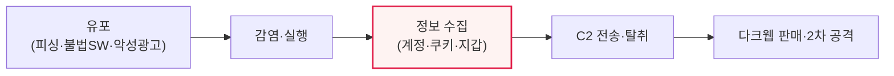

# 인포스틸러(InfoStealer)

## 1. 개요

### 가. 정의
> 감염된 시스템에서 **계정·비밀번호·쿠키·암호화폐 지갑·자동완성 정보 등 민감 데이터를 몰래 수집·탈취**하는 악성코드. 탈취한 정보는 다크웹에서 거래되거나 2차 공격에 활용된다.

인포스틸러가 위험한 근본 이유는 '**한 번의 감염으로 사용자의 디지털 자격증명 전체가 유출**'되기 때문이다. 랜섬웨어가 파일을 암호화해 즉시 눈에 띄는 피해를 준다면, 인포스틸러는 조용히 브라우저에 저장된 비밀번호, 로그인 세션을 유지하는 쿠키, 암호화폐 지갑 키 등을 빼내 서버로 전송한 뒤 흔적을 지운다. 특히 세션 쿠키를 탈취하면 비밀번호나 MFA를 몰라도 이미 로그인된 상태를 가로챌 수 있어 매우 위험하다. 탈취된 자격증명은 크리덴셜 스터핑·계정 탈취·랜섬웨어 초기 침투 등 2차 공격의 발판이 되므로, 인포스틸러는 사이버 범죄 생태계의 '원료 공급책' 역할을 한다. 최근에는 서비스형(MaaS)으로 판매되어 진입장벽이 크게 낮아졌다.

### 나. 등장 배경
브라우저·앱에 자격증명을 저장하는 습관이 보편화되고, 탈취 정보를 사고파는 다크웹 시장이 형성되면서, 인포스틸러가 서비스형 악성코드로 산업화되었다.

## 2. 공격 절차

인포스틸러는 피싱 메일, 불법 소프트웨어(크랙)·게임 치트, 악성 광고 등으로 유포된다. 실행되면 브라우저·이메일·메신저·암호화폐 지갑에서 저장된 자격증명과 쿠키·자동완성 데이터를 긁어모아 공격자 서버(C2)로 전송하고, 그 정보가 다크웹에서 거래되거나 추가 침투에 쓰인다.

## 3. 대응 방안 (정보보안 담당자 관점)

| 구분 | 대응 |
|---|---|
| **예방(사용자)** | 불법 SW·출처불명 파일 차단, 피싱 교육, 브라우저 비밀번호 저장 지양 |
| **인증 강화** | MFA·패스키, 세션 관리(짧은 만료·재인증), 유출 계정 강제 재설정 |
| **탐지** | EDR/XDR로 이상 행위 탐지, C2 통신 차단, 비정상 로그인 모니터링 |
| **관리** | 최소 권한, 자격증명 볼트·비밀 관리, 다크웹 유출 모니터링 |

정보보안 담당자는 예방(감염 차단)·인증 강화(탈취돼도 무력화)·탐지(EDR·C2 차단)·사후 관리(유출 모니터링·강제 재설정)의 다층 방어를 구축해야 한다. 특히 세션 쿠키 탈취에 대비해 MFA만으로 안심하지 말고 세션 재검증·이상탐지를 병행해야 한다.

## 4. 고려사항 및 시사점

1. **세션 쿠키 탈취가 MFA를 우회**한다. 이미 인증된 세션을 훔치면 MFA가 무력화되므로, 세션 수명 단축·디바이스 바인딩·이상 로그인 탐지가 필수다.
2. **자격증명 위생(Credential Hygiene)** 이 근본이다. 비밀번호 재사용 금지, 브라우저 저장 최소화, 패스키 전환, 볼트 사용으로 탈취 시 피해를 줄인다.
3. **2차 공격의 관문**임을 인식한다. 인포스틸러 감염은 랜섬웨어·계정 탈취로 이어지는 초기 침투이므로, EDR·다크웹 모니터링으로 조기에 차단해 연쇄 피해를 막아야 한다.

---

> **한 줄 요약**: 인포스틸러는 *계정·쿠키·지갑 등 민감 정보를 몰래 탈취* 하는 악성코드로 세션 쿠키 탈취로 MFA까지 우회하며, 예방·MFA/패스키·EDR 탐지·다크웹 모니터링의 다층 방어와 자격증명 위생으로 대응한다.
