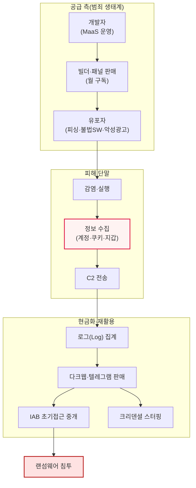
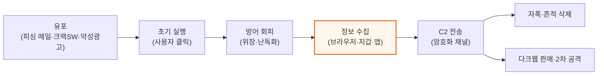

# 인포스틸러(InfoStealer)

## 1. 개요

### 가. 정의
> 인포스틸러는 감염된 시스템에서 **계정·비밀번호·세션 쿠키·암호화폐 지갑·자동완성 정보 등 민감 데이터를 은밀하게 수집·탈취**해 공격자 서버(C2)로 전송하는 정보 절취형 악성코드다. 탈취한 데이터는 로그(Log)라는 단위로 묶여 다크웹 시장에서 거래되거나, 계정 탈취·랜섬웨어 침투 등 2차 공격의 원료로 재사용된다.

인포스틸러가 다른 악성코드와 구별되는 근본 성격은 '**파괴가 아니라 절취**'라는 데 있다. 랜섬웨어가 파일을 암호화해 즉각적이고 가시적인 피해를 일으켜 몸값을 요구한다면, 인포스틸러는 정반대로 최대한 조용히 침투해 자격증명을 긁어낸 뒤 흔적을 지우고 사라진다. 피해자는 감염 사실 자체를 인지하지 못하는 경우가 많고, 수개월 뒤 계정이 탈취되거나 회사 시스템이 랜섬웨어에 감염된 뒤에야 최초 원인이 인포스틸러였음을 역추적하게 된다. 이 '지연된 피해'와 '낮은 가시성'이 인포스틸러를 특히 위험하게 만든다.

두 번째 핵심은 **세션 쿠키(Session Cookie) 탈취**가 인증 체계의 마지막 방어선을 무력화한다는 점이다. 사용자가 웹 서비스에 로그인하면 서버는 인증 상태를 유지하기 위한 세션 토큰을 쿠키에 담아 브라우저에 저장한다. 인포스틸러가 이 쿠키를 탈취하면 공격자는 피해자의 비밀번호나 다중인증(MFA) 코드를 전혀 몰라도 '이미 로그인된 세션'을 그대로 재현할 수 있다. 즉 MFA·패스키 같은 강력한 인증 수단을 도입해도, 인증 이후 발급된 세션을 통째로 훔치면 인증 절차를 건너뛰게 되는 것이다. 이 때문에 인포스틸러는 "MFA를 우회하는 현실적 위협"으로 자주 거론된다.

세 번째는 **범죄 생태계에서의 위치**다. 인포스틸러는 그 자체로 최종 목적이라기보다, 후속 공격에 필요한 자격증명을 대량 공급하는 '원료 공급책'이자 초기 침투 수단이다. 탈취된 기업 VPN·SSO 계정은 IAB(Initial Access Broker)를 거쳐 랜섬웨어 조직에 판매되고, 대량의 개인 계정은 크리덴셜 스터핑에 활용된다. 최근에는 서비스형 악성코드(MaaS, Malware-as-a-Service) 형태로 월 구독 방식으로 판매되면서, 기술이 부족한 공격자도 손쉽게 사용할 수 있게 되어 진입 장벽이 크게 낮아졌다.

### 나. 등장 배경과 필요성
인포스틸러가 산업화된 배경에는 세 가지 환경 변화가 맞물려 있다. 첫째, 브라우저와 애플리케이션에 아이디·비밀번호를 저장하는 습관이 보편화되면서, 한 대의 단말에 수십·수백 개의 자격증명이 집중 보관되는 구조가 만들어졌다. 둘째, 탈취 정보를 사고파는 다크웹 시장과 텔레그램 기반 판매 채널이 성숙하면서 '훔친 데이터의 현금화' 경로가 확립되었다. 셋째, MaaS 비즈니스 모델이 자리 잡으면서 개발자·유포자·구매자가 분업하는 정교한 공급망이 형성되었다.

방어 관점에서 인포스틸러를 별도 주제로 다뤄야 하는 이유는, 전통적 경계 방어(방화벽·안티바이러스)만으로는 대응이 어렵기 때문이다. 인포스틸러는 정상 프로세스처럼 위장하고, 수집 즉시 자폭(self-delete)하는 경우가 많아 탐지 시점이 짧다. 따라서 감염 예방뿐 아니라 '탈취를 전제한' 인증 강화와 사후 유출 모니터링까지 아우르는 다층 전략이 요구된다.

### 다. 주요 특징
인포스틸러의 기술적 특징은 다음과 같이 정리된다. 첫째, 수집 대상이 광범위하다 — 브라우저 저장 비밀번호·쿠키·자동완성, 이메일·메신저 계정, FTP/VPN/SSH 설정, 암호화폐 지갑 파일, 특정 파일 확장자 문서까지 대상으로 삼는다.

둘째, 짧은 실행 시간(fire-and-forget) 특성을 갖는다. 상주형 백도어와 달리 시스템에 오래 머무르지 않고, 한 번 실행해 정보를 긁어 전송한 뒤 스스로 종료·삭제하는 경우가 많다. 이 때문에 탐지 가능한 시간 창(window)이 극히 짧아, 시그니처 기반 백신보다 행위 기반 EDR이 유리하다.

셋째, 모듈화·결합성이 높다. 클리퍼(암호화폐 송금 주소를 공격자 주소로 몰래 치환), 로더(추가 페이로드 다운로드), 봇넷 클라이언트 등 다른 악성코드와 결합해 기능을 확장한다. 즉 인포스틸러 감염은 단일 사건으로 끝나지 않고 추가 악성코드 유입의 통로가 되기도 한다.

### 라. 대표 패밀리와 진화
인포스틸러는 특정 하나가 아니라 끊임없이 부침을 겪는 여러 패밀리의 총칭이다. RedLine·META는 오랫동안 시장을 주도했으나 2024년 단속으로 위축되었고, 그 공백을 LummaC2가 빠르게 메웠다. 이후 Vidar·StealC·Rhadamanthys·Meduza 등도 활발히 유통되며, 단속·재등장·대체가 반복되는 매우 유동적인 지형을 형성한다. 방어자는 특정 패밀리 이름을 좇기보다, 이들이 공통적으로 노리는 '자격증명·세션'이라는 자산을 중심으로 대응 체계를 설계하는 편이 지속가능하다.

## 2. 전체 구조 및 위협 흐름

인포스틸러 위협을 이해하려면 개별 악성코드 동작뿐 아니라, 그것을 둘러싼 범죄 생태계 전체 구조를 함께 봐야 한다. 아래 구조도는 개발·유포·수집·현금화·2차 공격으로 이어지는 순환 고리를 보여준다.

```mermaid
flowchart TB
  subgraph SUP["공급 측(범죄 생태계)"]
    DEV["개발자<br/>(MaaS 운영)"] --> BUILD["빌더·패널 판매<br/>(월 구독)"]
    BUILD --> DIST["유포자<br/>(피싱·불법SW·악성광고)"]
  end
  subgraph VIC["피해 단말"]
    INF["감염·실행"] --> COL["정보 수집<br/>(계정·쿠키·지갑)"]
    COL --> C2["C2 전송"]
  end
  subgraph MON["현금화·재활용"]
    LOG["로그(Log) 집계"] --> MKT["다크웹·텔레그램 판매"]
    MKT --> IAB["IAB 초기접근 중개"]
    MKT --> STUFF["크리덴셜 스터핑"]
  end
  DIST --> INF
  C2 --> LOG
  IAB --> RANS["랜섬웨어 침투"]
  style COL fill:#fef3f2,stroke:#e11d48,stroke-width:2px
  style RANS fill:#fee2e2,stroke:#b91c1c,stroke-width:2px
```

위 구조에서 주목할 점은 **역할의 분업**이다. 악성코드를 만드는 개발자, 이를 구독해 뿌리는 유포자, 탈취 로그를 사들여 침투하는 IAB, 최종적으로 랜섬웨어를 실행하는 조직이 각기 다른 주체다. 이 분업 구조 때문에 특정 악성코드 패밀리를 단속(takedown)해도 전체 생태계가 쉽게 무너지지 않는다. 실제로 2024년 10월 RedLine·META를 겨냥한 국제 공조(Operation Magnus)와 2025년 5월 LummaC2 단속에도 불구하고, 시장은 수 주 내에 대체 패밀리로 이동하며 회복하는 탄력성을 보였다.

## 3. 공격 절차(Kill Chain)

개별 감염 단말에서 벌어지는 일을 단계별로 세분화하면 다음과 같다.

```mermaid
flowchart LR
  A["유포<br/>(피싱 메일·크랙SW·악성광고)"] --> B["초기 실행<br/>(사용자 클릭)"]
  B --> C["방어 회피<br/>(위장·난독화)"]
  C --> D["정보 수집<br/>(브라우저·지갑·앱)"]
  D --> E["C2 전송<br/>(암호화 채널)"]
  E --> F["자폭·흔적 삭제"]
  E --> G["다크웹 판매·2차 공격"]
  style D fill:#fff7ed,stroke:#ea580c,stroke-width:2px
```

### 가. 유포와 초기 실행
인포스틸러의 최초 침투는 대부분 '사용자의 클릭'을 유도하는 사회공학에 의존한다. 대표적 경로는 (1) 송장·이력서·계약서를 사칭한 피싱 메일 첨부파일, (2) 불법 복제 소프트웨어·게임 치트·크랙 등 신뢰할 수 없는 실행 파일, (3) 검색 결과 상단에 노출되는 악성 광고(malvertising) 및 가짜 다운로드 사이트다. 최근에는 정상 사이트를 사칭해 "보안 인증을 위해 아래 명령을 붙여넣으라"며 사용자가 직접 PowerShell 명령을 실행하도록 유도하는 ClickFix 방식도 확산되고 있다. 공통점은 기술적 취약점 공격보다 **사람의 판단을 속이는 방식**이 주류라는 점으로, 이는 기술적 통제만으로 막기 어렵고 사용자 교육이 병행되어야 함을 시사한다.

### 나. 방어 회피와 정보 수집
실행된 인포스틸러는 백신·EDR 탐지를 피하기 위해 정상 프로세스 위장, 코드 난독화, 짧은 실행 후 자폭 등의 회피 기법을 사용한다. 이어 핵심 단계인 정보 수집에서는 브라우저가 로컬에 저장한 자격증명 데이터베이스(예: 크로미엄 계열의 `Login Data`, 쿠키 저장소)를 직접 읽어들인다. 여기서 결정적인 지점이 브라우저의 로컬 암호화를 어떻게 우회하느냐다. 구글은 크롬에 App-Bound Encryption을 도입해 쿠키 저장소를 특정 애플리케이션에 묶어 다른 프로세스가 복호화하지 못하도록 보호 수준을 높였으나, 공격자들은 수 주 내에 이를 우회하는 기법을 개발했다. 보안 업계 보고에 따르면 Lumma·Vidar·StealC·Rhadamanthys·Meduza 등 다수 패밀리가 App-Bound Encryption 우회에 성공한 것으로 알려져, 방어와 우회가 반복되는 '창과 방패'의 양상을 보인다.

### 다. C2 전송과 현금화
수집된 데이터는 압축·암호화되어 공격자 C2 서버로 전송된다. 이때 탐지를 피하기 위해 정상 클라우드 서비스나 텔레그램 API를 C2 채널로 악용하는 사례가 늘고 있어, 트래픽만으로 악성 여부를 구분하기가 점점 어려워진다. 전송이 끝나면 악성코드는 자신을 삭제해 흔적을 지운다. 탈취된 데이터는 '로그' 단위로 정리되어 다크웹 마켓·텔레그램 채널에서 건당 수 달러~수십 달러 수준에 거래되며, 기업 VPN·관리자 계정처럼 가치가 높은 로그는 IAB를 통해 훨씬 비싸게 판매된다.

## 4. 대응 방안(정보보안 담당자 관점)

인포스틸러 대응의 핵심 명제는 "**감염을 100% 막을 수 없다면, 탈취되더라도 피해가 확산되지 않도록 설계한다**"이다. 이에 따라 예방·인증 강화·탐지·사후관리의 4중 방어를 계층적으로 구축한다.

| 구분 | 목표 | 세부 대응 |
|---|---|---|
| **예방(감염 차단)** | 최초 침투 차단 | 불법 SW·출처불명 파일 차단, 첨부파일·매크로 통제, 지속적 피싱 훈련, 브라우저 비밀번호 저장 지양 |
| **인증 강화(탈취 무력화)** | 훔쳐도 못 쓰게 | MFA·패스키(FIDO2) 전환, 세션 짧은 만료·디바이스 바인딩·재인증, 유출 계정 강제 재설정 |
| **탐지(조기 발견)** | 감염·전송 포착 | EDR/XDR 이상행위 탐지, C2 통신·비정상 아웃바운드 차단, 비정상 로그인(위치·기기) 모니터링 |
| **사후관리(피해 최소화)** | 확산 억제 | 최소 권한 원칙, 자격증명 볼트·비밀 관리(Secret Manager), 다크웹 유출 모니터링, 침해사고 대응 절차(IR) |

표에 열거한 통제는 개별로가 아니라 **연쇄적으로** 작동해야 의미가 있다. 예방이 뚫려도 인증 강화가 탈취된 자격증명을 무력화하고, 그마저 세션 쿠키로 우회되면 탐지가 이상 로그인을 잡아내며, 그래도 새어 나간 정보는 사후 모니터링으로 조기에 재설정하는 식이다. 특히 세션 쿠키 탈취를 전제하면 MFA 도입만으로 안심해서는 안 되며, 세션 수명 단축·디바이스 바인딩·지속적 세션 재검증을 병행해야 한다.

한 가지 유의점은, 인포스틸러 피해가 개인 단말에서 시작해 조직 자산으로 번진다는 점이다. 재택근무 환경에서 직원이 개인 PC에 회사 SSO·VPN 계정을 저장해 두었다가 감염되면, 관리되지 않는(unmanaged) 단말이 조직 침해의 관문이 된다. 따라서 BYOD·재택 정책과 단말 위생(endpoint hygiene) 관리가 대응의 사각지대로 남지 않도록 해야 한다.

## 5. 심화 — 최신 동향과 실무 시사점

인포스틸러 위협은 2024~2025년에 걸쳐 규모와 정교함이 모두 확대되었다. 업계 보고에 따르면 2025년 한 해 동안 탈취·유통된 자격증명이 수십억 건 규모로 집계되었고, 침해 사고의 상당수가 자격증명 탈취와 연관된 것으로 분석된다(수치는 조사기관별로 차이가 있으므로 추세로 이해하는 것이 적절하다). 시장 구조 측면에서는 2024년 10월 Operation Magnus로 RedLine·META가 타격을 입은 뒤 사용자가 대체재로 이동하면서 LummaC2가 급부상했고, 2025년 5월 Lumma가 단속을 받았음에도 수 주 만에 다시 활동을 재개하는 등, **단속은 일시적 교란일 뿐 영구적 해결이 아니라는** 점이 반복 확인되었다.

기술적 진화의 대표 사례는 앞서 언급한 크롬 App-Bound Encryption 우회다. 구글이 쿠키 저장소 보호를 강화하자 인포스틸러 개발자들은 브라우저의 복호화 키를 탈취하거나 정상 프로세스 컨텍스트를 빌려 쓰는 방식으로 대응했고, 결과적으로 최신 크롬에서도 쿠키가 다시 유출되는 상황이 보고되었다. 또 다른 흐름은 세션 토큰·2FA 백업 코드·패스워드 매니저 데이터베이스까지 표적으로 삼는 등 수집 대상이 인증의 핵심으로 이동하고 있다는 점이다. 이는 방어자가 "무엇이 유출되었나(자격증명 건수)"뿐 아니라 "**어떤 악성코드 패밀리를 통해, 무엇이(세션·2FA 포함) 유출되었나**"까지 추적해야 정확한 대응이 가능함을 의미한다.

예상 출제 방향(기술사 관점)으로는, ① 인포스틸러의 공격 절차(Kill Chain)와 단계별 통제 매핑, ② 세션 쿠키 탈취가 MFA를 우회하는 원리와 세션 관리 대책, ③ MaaS 생태계·다크웹 유통 구조와 IAB·랜섬웨어 연계, ④ 제로트러스트·다크웹 모니터링·EDR을 결합한 종합 대응 아키텍처 설계를 서술형으로 요구할 가능성이 높다. 답안 구성 시에는 '탈취를 전제한 다층 방어'라는 관점을 축으로 삼아 예방·인증·탐지·사후관리를 유기적으로 엮어 서술하는 것이 효과적이다.

## 6. 고려사항 및 시사점(기술사 관점)

1. **세션 쿠키 탈취가 MFA를 우회한다 — 인증 이후를 방어하라.** 강력한 인증을 도입해도 인증 이후 발급된 세션이 통째로 탈취되면 무력화된다. 세션 수명 단축, 디바이스 바인딩(토큰과 기기 결합), 재인증 트리거, 이상 로그인 탐지를 결합해 '인증 이후'까지 방어 범위를 확장해야 한다.
2. **자격증명 위생(Credential Hygiene)이 근본 대책이다.** 비밀번호 재사용 금지, 브라우저 저장 최소화, 패스키(FIDO2)로의 전환, 비밀 관리 볼트 사용은 탈취가 발생하더라도 재사용·피해 확산을 억제하는 핵심 통제다. 기술적 통제와 함께 사용자 습관 개선이 병행되어야 한다.
3. **인포스틸러는 종착점이 아니라 초기 침투(관문)다.** 감염은 곧 랜섬웨어·계정 탈취로 이어지는 킬체인의 시작이므로, EDR·다크웹 모니터링으로 조기에 탐지·차단해 연쇄 피해를 끊어야 한다. 침해 지표(IOC)와 유출 로그를 위협 인텔리전스로 상시 수집·활용하는 체계가 필요하다.
4. **단속만으로 위협이 사라지지 않는다 — 회복탄력성을 전제하라.** MaaS 분업 구조 덕분에 특정 패밀리가 단속돼도 시장은 빠르게 대체된다. 특정 악성코드 대응이 아니라, 제로트러스트·최소권한·지속 모니터링에 기반한 구조적 방어로 전환해야 지속가능하다.
5. **개인 단말이 조직 침해의 관문이 된다 — 경계를 재정의하라.** 재택·BYOD 환경에서 관리되지 않는 단말에 저장된 회사 계정이 침해의 출발점이 되므로, 단말 위생 관리·조건부 접근(Conditional Access)·SSO 세션 통제를 통해 관리 사각지대를 없애야 한다.

## 참고자료
- Recorded Future, "2025 Identity Threat Landscape Report: Inside the Infostealer Economy" — https://www.recordedfuture.com/blog/identity-trend-report-march-blog
- SpyCloud, "How Infostealer Malware Bypassed Chrome's App-Bound Cookie Encryption" — https://spycloud.com/blog/infostealers-bypass-new-chrome-security-feature/
- CSO Online, "Infostealer malware poses potent threat despite recent takedowns" — https://www.csoonline.com/article/3951147/infostealer-malware-poses-potent-threat-despite-recent-takedowns.html
- Deepstrike, "Infostealer Malware & Credential Theft Trends in 2025" — https://deepstrike.io/blog/infostealer-malware-credential-theft-2025

---

> **한 줄 요약**: 인포스틸러는 *계정·세션 쿠키·지갑 등 민감정보를 은밀히 탈취* 하는 정보 절취형 악성코드로, 세션 쿠키 탈취로 MFA까지 우회하고 MaaS 생태계를 통해 랜섬웨어·계정탈취의 초기 침투 관문이 되므로, '탈취를 전제한' 예방·인증강화·EDR 탐지·다크웹 모니터링의 다층 방어와 자격증명 위생으로 대응해야 한다.
