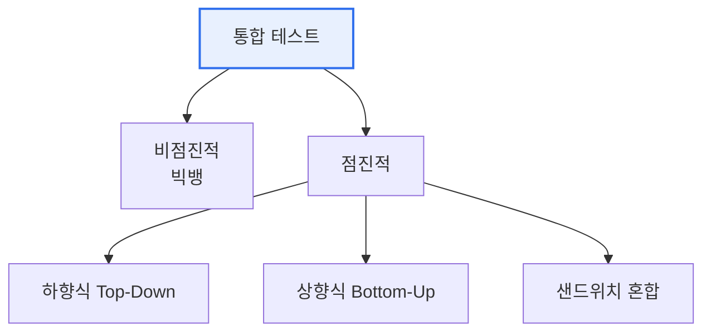

# 통합 테스트(Integration Test)

## 1. 개요

### 가. 정의
> 단위 테스트를 마친 **모듈들을 결합했을 때 인터페이스·상호작용이 올바른지** 검증하는 테스트. 모듈 간 데이터 전달·연동 오류를 찾는다.

통합 테스트가 별도로 필요한 이유는 '**각 모듈이 정상이어도 합치면 문제가 생기기**' 때문이다. 인터페이스 규약 불일치, 데이터 형식 차이, 호출 순서 오류 등은 모듈을 결합해야만 드러난다. 단위 테스트가 '부품 검사'라면 통합 테스트는 '조립 검사'다.

## 2. 통합 방식 (가)

| 방식 | 설명 | 특징 |
|---|---|---|
| **비점진적(빅뱅)** | 모든 모듈을 한 번에 결합해 테스트 | 준비 간단하나 오류 원인 파악 곤란 |
| **점진적** | 모듈을 단계적으로 추가하며 테스트 | 오류 격리 용이, 시간 소요 |

## 3. 하향식 vs 상향식 (나)

| 구분 | 하향식(Top-Down) | 상향식(Bottom-Up) |
|---|---|---|
| **순서** | 상위 모듈 → 하위 | 하위 모듈 → 상위 |
| **필요 도구** | 스텁(Stub) | 드라이버(Driver) |
| **장점** | 상위 설계 결함 조기 발견 | 하위 모듈 철저 검증 |
| **단점** | 하위 미완성 시 스텁 다수 | 상위 결함 늦게 발견 |

## 4. 테스트 드라이버와 테스트 스텁 (다)

| 구분 | 테스트 드라이버(Driver) | 테스트 스텁(Stub) |
|---|---|---|
| **역할** | 하위 모듈을 호출하는 **상위 대역** | 상위가 호출하는 **하위 대역** |
| **사용** | 상향식(하위부터 검증) | 하향식(상위부터 검증) |
| **기능** | 테스트 데이터 입력·결과 확인 | 최소한의 더미 응답 반환 |

> 드라이버는 "아직 없는 상위 모듈 대신 하위를 불러주는 껍데기", 스텁은 "아직 없는 하위 모듈 대신 값을 돌려주는 껍데기"다.

## 5. 시사점
- 실무는 하향식·상향식을 결합한 **샌드위치(혼합)** 통합이 일반적
- CI 파이프라인에 통합 테스트 자동화(계약 테스트·목서버)
- MSA에서는 서비스 간 계약 테스트(Contract Test)로 확장

---

> **한 줄 요약**: 통합 테스트는 모듈 결합 시 인터페이스 오류를 검증하며, *비점진적(빅뱅)·점진적(하향식·상향식)* 방식으로 수행하고, 하향식은 스텁을, 상향식은 드라이버를 사용한다.
