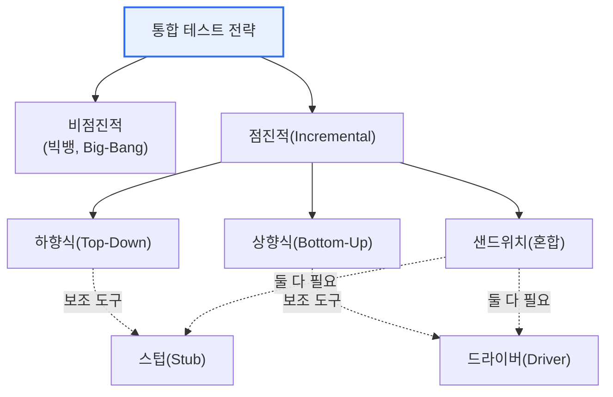
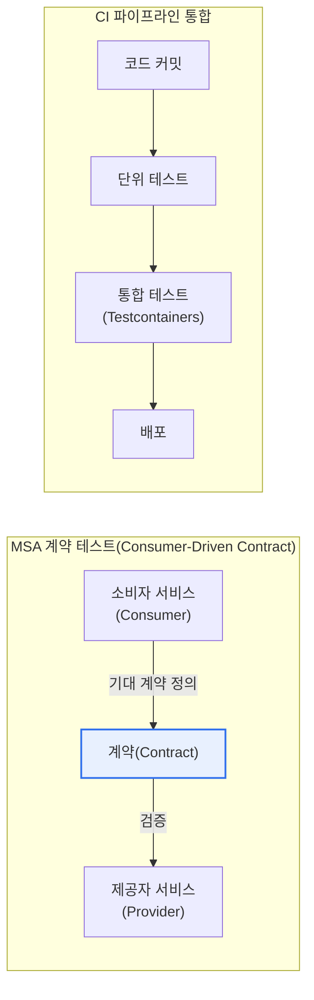

# 통합 테스트(Integration Test)

## 1. 개요

### 가. 정의
> 단위 테스트를 마친 **모듈(컴포넌트·서비스)들을 결합했을 때 그 인터페이스와 상호작용이 명세대로 올바른지** 검증하는 테스트 단계. 개별 모듈의 내부 로직이 아니라, 모듈이 주고받는 데이터·호출 규약·상태 전이 등 '경계(boundary)'에서 발생하는 결함을 찾는 것이 목적이다.

통합 테스트가 단위 테스트와 별개로 반드시 필요한 이유는 '**각 부품이 정상이어도 조립하면 문제가 생긴다**'는 소프트웨어 결합의 본질에 있다. 개별 모듈이 각자의 단위 테스트를 100% 통과했더라도, 막상 합치면 인터페이스 규약의 미세한 불일치, 데이터 형식·단위·인코딩의 차이, 호출 순서나 타이밍(경쟁 조건), 예외 전파 경로의 어긋남 때문에 오류가 발생한다. 단위 테스트가 '부품 개별 검사'라면 통합 테스트는 '조립 상태 검사'다. 부품이 규격에 맞아도 조립 공차가 누적되면 완성품이 어긋나듯, 소프트웨어도 결합 지점에서 결함이 새롭게 태어난다.

가장 흔한 예가 데이터 계약(contract)의 불일치다. A모듈이 날짜를 `YYYYMMDD` 문자열로 넘기는데 B모듈이 `YYYY-MM-DD`를 기대하면, 두 모듈 각각은 자기 단위 테스트를 통과했어도 결합하면 파싱 오류로 실패한다. 금액을 A는 '원' 단위 정수로, B는 '천 원' 단위 실수로 다룬다면 값은 전달되지만 1,000배 오차가 조용히 발생해 훨씬 위험하다. 이런 결함은 두 모듈을 실제로 연결해봐야만 드러나므로, 단위 테스트로는 원리적으로 잡을 수 없다.

이 관점에서 통합 테스트는 단순한 '테스트 종류'가 아니라 소프트웨어를 점점 크게 조립해 가는 **점증적 검증 활동**으로 이해해야 한다. V-모델에서 통합 테스트는 아키텍처 설계(구조 설계) 단계에 대응하는 검증 활동으로 배치되는데, 이는 통합 테스트가 곧 '설계한 대로 모듈이 맞물리는가'를 확인하는 작업임을 뜻한다. 따라서 좋은 통합 테스트는 코드 완성 후 뒤늦게 짜는 것이 아니라, 인터페이스 설계 시점에 그 검증 방법까지 함께 설계되어야 한다.

### 나. 필요성과 배경
결함은 발견이 늦을수록 수정 비용이 기하급수적으로 커진다는 것이 소프트웨어 공학의 오랜 경험칙이다. 요구·설계 단계에서 잡으면 저렴하지만, 인터페이스 오류를 통합 단계에서 놓쳐 시스템 테스트나 운영 단계에서 발견하면 원인 추적·회귀 테스트·재배포까지 겹쳐 비용이 급증한다. 통합 테스트는 이 '비용 급증 구간'의 앞단에서 결함을 걸러내는 방파제 역할을 한다.

배경적으로 통합 테스트의 중요성은 시스템이 모놀리식에서 분산·서비스 지향으로 진화하면서 오히려 커졌다. 과거에는 하나의 실행 파일 안에서 함수 호출로 모듈이 결합됐지만, 오늘날은 REST/gRPC API, 메시지 큐, 외부 SaaS 연동 등 '네트워크 경계를 넘는 결합'이 지배적이다. 경계가 많아질수록 계약 불일치·부분 장애·지연 문제가 늘어나므로, 통합 검증의 난도와 비중이 함께 커진 것이다.

## 2. 통합 방식: 비점진적 vs 점진적

```mermaid
flowchart TB
  I["통합 테스트 전략"] --> N["비점진적<br/>(빅뱅, Big-Bang)"]
  I --> P["점진적(Incremental)"]
  P --> P1["하향식(Top-Down)"]
  P --> P2["상향식(Bottom-Up)"]
  P --> P3["샌드위치(혼합)"]
  P1 -.보조 도구.-> S["스텁(Stub)"]
  P2 -.보조 도구.-> D["드라이버(Driver)"]
  P3 -.둘 다 필요.-> S
  P3 -.둘 다 필요.-> D
  style I fill:#e8f0fe,stroke:#2f6fed,stroke-width:2px
```

통합 방식은 '모듈을 한꺼번에 합치느냐, 단계적으로 합치느냐'라는 근본적 선택에서 갈린다. 이 선택은 단순한 취향이 아니라, 결함이 발생했을 때 **원인을 얼마나 빨리 격리할 수 있는가**라는 실무적 비용과 직결된다.

**비점진적(빅뱅)** 방식은 모든 모듈을 각자 완성한 뒤 한 번에 결합해 전체를 테스트한다. 준비 절차가 단순하고 드라이버·스텁 같은 보조 코드를 거의 만들지 않아도 되는 장점이 있다. 그러나 결합 후 오류가 발생하면 수십 개 모듈의 상호작용 중 어디서 문제가 생겼는지 원인 격리가 극도로 어렵다. 결함 A가 결함 B를 가리고, 두 결함이 상쇄되어 증상을 왜곡하기도 한다. 그래서 빅뱅은 모듈 수가 매우 적거나, 이미 검증된 라이브러리를 조합하는 소규모 상황에 한정된다.

**점진적** 방식은 모듈을 하나(또는 소수)씩 추가하며 그때마다 테스트한다. 새로 추가한 모듈에서 문제가 드러나므로 '방금 넣은 것이 원인'이라는 강한 단서를 주어 오류 격리가 쉽다. 대신 매 단계마다 아직 없는 모듈을 흉내 내는 보조 코드(스텁·드라이버)가 필요해 시간과 노력이 더 든다. 실무에서 압도적으로 점진적 방식이 선호되는 이유는, 결함 격리에 드는 디버깅 비용이 보조 코드 작성 비용을 훨씬 웃돌기 때문이다.

| 방식 | 결합 방법 | 장점 | 단점 | 적합한 상황 |
|---|---|---|---|---|
| **비점진적(빅뱅)** | 모든 모듈을 한 번에 결합 | 준비 간단, 보조 코드 최소 | 원인 격리 곤란, 결함 상쇄 | 모듈 수 적은 소규모 |
| **점진적** | 모듈을 단계적으로 추가 | 오류 격리 용이, 조기 검증 | 스텁·드라이버 작성 부담 | 대부분의 실무 프로젝트 |

## 3. 하향식(Top-Down)과 상향식(Bottom-Up)

점진적 통합은 결합을 어느 방향에서 시작하느냐에 따라 하향식과 상향식으로 나뉜다. 두 방식의 근본 차이는 '**무엇을 먼저 확신하고 싶은가**'라는 우선순위에 있다.

**하향식(Top-Down)** 은 최상위 제어 모듈부터 시작해 호출 구조를 따라 하위로 내려가며 결합한다. 아직 완성되지 않은 하위 모듈 자리에는 정해진 더미 응답을 돌려주는 **스텁(Stub)** 을 끼운다. 이 방식의 강점은 시스템의 큰 골격·제어 흐름·주요 시나리오를 프로젝트 초기에 실행해볼 수 있다는 점이다. 상위 설계나 화면 흐름의 결함을 빨리 발견하고, 경영진·고객에게 동작하는 뼈대를 조기에 시연할 수 있다. 반면 실제 연산·데이터 처리를 담당하는 하위 모듈이 계속 스텁으로 대체되므로, 정작 중요한 하위 로직 검증이 뒤로 밀리고 현실적 스텁을 많이 만들어야 하는 부담이 있다.

**상향식(Bottom-Up)** 은 가장 낮은 유틸리티·연산 모듈부터 시작해 위로 올라가며 결합한다. 아직 없는 상위 모듈 대신 하위를 호출하고 테스트 데이터를 넣어주는 **드라이버(Driver)** 가 필요하다. 이 방식은 시스템의 기반이 되는 저수준 모듈을 먼저 철저히 검증하므로, DB 접근·계산 엔진처럼 신뢰성이 핵심인 부분을 탄탄히 다질 수 있다. 대신 전체를 관장하는 상위 제어 로직과 사용자 시나리오는 통합 후반에야 실행되므로, 설계 수준의 결함이 늦게 발견될 위험이 있다.

이 차이가 실무적으로 중요한 이유는, 프로젝트의 리스크가 어디에 있느냐에 따라 선택이 달라지기 때문이다. UI·워크플로 리스크가 큰 프로젝트는 하향식으로 흐름을 먼저 잡고, 복잡한 계산·데이터 정합성이 핵심인 프로젝트는 상향식으로 기반을 먼저 다지는 것이 합리적이다.

| 구분 | 하향식(Top-Down) | 상향식(Bottom-Up) |
|---|---|---|
| **결합 순서** | 상위 → 하위 | 하위 → 상위 |
| **필요 보조 도구** | 스텁(Stub) | 드라이버(Driver) |
| **먼저 검증되는 것** | 제어 흐름·전체 골격 | 기반 연산·데이터 처리 |
| **장점** | 상위 설계 결함 조기 발견, 조기 시연 | 하위 모듈 철저 검증 |
| **단점** | 하위 미완성 시 스텁 다수 | 상위 결함 늦게 발견 |

## 4. 테스트 드라이버와 테스트 스텁

두 보조 모듈은 '아직 없는 이웃 모듈을 흉내 내는 가짜'라는 공통점을 갖되, 그 방향이 정반대다. 이 개념을 정확히 구분하는 것은 통합 테스트 문제에서 자주 출제되는 핵심이다.

**테스트 드라이버(Driver)** 는 아직 만들어지지 않은 **상위 모듈을 대신하는 '가짜 상위'** 다. 하위 모듈을 실제로 호출하고, 미리 준비한 테스트 데이터를 인자로 넣어준 뒤 반환값이 기대와 일치하는지 확인한다. 상향식은 하위부터 올라가며 검증하므로, 그 하위를 호출해줄 상위가 아직 없어 드라이버가 반드시 필요하다. 오늘날 JUnit·pytest 같은 테스트 프레임워크의 테스트 실행기가 사실상 드라이버 역할을 자동화해준다.

**테스트 스텁(Stub)** 은 아직 만들어지지 않은 **하위 모듈을 대신하는 '가짜 하위'** 다. 상위 모듈의 호출에 대해, 실제 로직 없이 미리 정한 최소한의 더미 응답(고정값)을 돌려준다. 하향식은 위에서 아래로 내려가며 검증하므로, 상위가 호출할 하위가 아직 없어 스텁으로 그 자리를 메운다. 스텁이 상황에 따라 다른 값을 돌려주거나 호출 여부를 기록하도록 발전한 것이 목(Mock)·페이크(Fake) 같은 **테스트 더블(Test Double)** 이며, 오늘날 외부 결제·인증 API 연동을 테스트할 때 광범위하게 쓰인다.

| 구분 | 테스트 드라이버(Driver) | 테스트 스텁(Stub) |
|---|---|---|
| **대체 대상** | 상위 모듈('가짜 상위') | 하위 모듈('가짜 하위') |
| **동작** | 하위를 호출·데이터 입력·결과 확인 | 호출에 더미 응답 반환 |
| **사용 방식** | 상향식(Bottom-Up) | 하향식(Top-Down) |
| **현대적 확장** | 테스트 러너(JUnit/pytest) | 목(Mock)·페이크(Fake) |

## 5. 비교와 실제 사례

앞의 방식들은 배타적이지 않고, 실무에서는 리스크를 좇아 혼합된다. 대표가 **샌드위치(혼합) 통합**으로, 상위는 하향식으로 하위는 상향식으로 동시에 진행해 중간 계층에서 만나게 한다. UI 흐름과 기반 연산을 병렬로 검증해 일정을 단축하는 장점이 있지만, 드라이버와 스텁을 모두 만들어야 하고 중간 계층 통합이 복잡해지는 대가가 있다. 즉 '속도-복잡도'의 트레이드오프를 감수하는 선택이다.

구체 사례로, 대형 전자상거래의 '주문 → 결제 → 배송' 파이프라인을 생각해보자. 결제 게이트웨이(외부 PG)는 실제 결제를 매번 호출할 수 없으므로 성공/실패/타임아웃을 반환하는 스텁(목)으로 대체하고, 주문 모듈은 이 스텁을 상대로 하향식 통합을 진행한다. 반대로 재고 차감·정산 계산 같은 하위 모듈은 드라이버로 다양한 경계값(재고 0, 음수, 대량 주문)을 주입해 상향식으로 먼저 굳힌다. 이렇게 방향을 섞으면 외부 의존성과 핵심 연산을 동시에 안전하게 검증할 수 있다.

수치적 관점에서도 통합 테스트의 위치는 분명하다. 널리 인용되는 '테스트 피라미드'는 빠르고 저렴한 단위 테스트를 다수(예: 전체의 70% 안팎), 통합 테스트를 중간층(20% 안팎), 느리고 값비싼 E2E(UI) 테스트를 최상단 소수(10% 안팎)로 두라고 권한다. 통합 테스트를 너무 적게 두면 결합 결함을 놓치고, 너무 많이 두면 실행 시간이 길어져 CI가 느려지므로, 이 균형점을 팀 상황에 맞게 조정하는 것이 핵심이다.

## 6. 심화: 현대 아키텍처의 통합 테스트

```mermaid
flowchart LR
  subgraph MSA["MSA 계약 테스트(Consumer-Driven Contract)"]
    C["소비자 서비스<br/>(Consumer)"] -->|"기대 계약 정의"| K["계약(Contract)"]
    K -->|"검증"| Pr["제공자 서비스<br/>(Provider)"]
  end
  subgraph CI["CI 파이프라인 통합"]
    Push["코드 커밋"] --> Unit["단위 테스트"] --> Int["통합 테스트<br/>(Testcontainers)"] --> Deploy["배포"]
  end
  style K fill:#e8f0fe,stroke:#2f6fed,stroke-width:2px
```

MSA(마이크로서비스 아키텍처)가 보편화되면서 통합 테스트는 '모듈 간 함수 호출 검증'에서 '**서비스 간 네트워크 계약 검증**'으로 무게중심이 옮겨졌다. 서비스가 수십·수백 개로 늘면 모든 조합을 동시에 띄워 테스트하기가 사실상 불가능하므로, 각 서비스의 인터페이스를 독립적으로 검증하는 기법이 발전했다.

대표가 **계약 테스트(Contract Test)**, 특히 소비자 주도 계약(Consumer-Driven Contract, CDC)이다. API를 소비하는 쪽이 '나는 이런 응답을 기대한다'는 계약을 정의하면, 제공자 쪽이 그 계약을 만족하는지 자기 CI에서 검증한다. Pact 같은 도구가 이를 자동화한다. 이 방식의 장점은, 제공자와 소비자를 동시에 띄우지 않고도 양쪽 배포 전에 계약 위반(예: 필드 삭제, 타입 변경)을 조기에 잡아 '깨진 배포'를 막는다는 데 있다.

또 하나의 축은 **테스트 환경의 재현성**이다. 과거에는 공유된 통합 테스트 서버를 여럿이 나눠 쓰다 상태가 오염되어 '남의 테스트 때문에 내 테스트가 깨지는' 문제가 잦았다. 오늘날은 Testcontainers처럼 실제 DB·메시지 브로커를 컨테이너로 즉석에서 띄웠다가 폐기하는 기법으로, 매 실행마다 깨끗하고 실제와 유사한 환경에서 통합 테스트를 돌린다. 이로써 통합 테스트를 CI 파이프라인에 상시 내재화(코드 변경마다 자동 실행)하여 회귀 결함을 조기에 차단하는 것이 표준적 실무가 되었다.

## 7. 고려사항 및 시사점

1. **전략은 리스크에 종속시킨다.** 하향식·상향식·빅뱅·샌드위치는 우열이 아니라 상황 적합성의 문제다. UI·워크플로 리스크가 크면 하향식, 핵심 연산·데이터 정합성이 관건이면 상향식, 일정 압박이 크면 샌드위치를 선택하되, 원인 격리 비용이 큰 빅뱅은 소규모에 한정한다. 아키텍트는 '무엇을 먼저 확신해야 하는가'를 기준으로 통합 순서를 설계해야 한다.

2. **인터페이스 설계 시점에 테스트를 함께 설계한다.** 통합 결함의 대부분은 데이터 계약 불일치에서 나오므로, API 스펙(OpenAPI/gRPC IDL)과 계약 테스트를 코드보다 먼저 확정하는 계약 우선(contract-first) 접근이 결함을 원천 차단한다. 이는 통합 테스트를 '나중에 짜는 것'에서 '설계 산출물'로 격상시킨다.

3. **테스트 더블의 과용을 경계한다.** 스텁·목으로 외부 의존을 대체하면 테스트가 빠르고 안정되지만, 가짜가 실제와 어긋나면 '통과했는데 운영에서 터지는' 착시가 생긴다. 계약 테스트로 더블과 실제 서비스의 일치를 주기적으로 검증하고, 핵심 경로는 Testcontainers 등 실제에 가까운 통합으로 보완하는 이중 안전장치가 필요하다.

4. **CI/CD 파이프라인 내재화와 실행 시간의 균형이 관건이다.** 통합 테스트를 자동화해 매 커밋마다 돌리면 회귀를 조기에 잡지만, 무거운 통합 테스트가 많아지면 파이프라인이 느려져 개발 속도가 떨어진다. 테스트 피라미드 원칙에 따라 통합 테스트의 범위·개수를 관리하고, 병렬 실행·선택적 실행(영향 범위 기반)으로 피드백 지연을 줄여야 한다.

5. **분산 환경의 부분 장애·비결정성까지 검증 범위에 포함한다.** MSA에서는 지연·타임아웃·재시도·부분 실패가 일상이므로, 정상 경로만이 아니라 의존 서비스가 느리거나 실패할 때의 회복탄력성(서킷 브레이커·폴백)까지 통합 테스트로 확인해야 운영 안정성을 확보할 수 있다.

## 참고자료
- ISTQB Foundation Level Syllabus — Integration Testing (https://www.istqb.org/)
- Martin Fowler, "Testing Strategies in a Microservice Architecture" (https://martinfowler.com/articles/microservice-testing/)
- Pact — Consumer-Driven Contract Testing (https://docs.pact.io/)
- Testcontainers 공식 문서 (https://testcontainers.com/)

---

> **한 줄 요약**: 통합 테스트는 모듈 결합 시 인터페이스·상호작용 오류를 검증하는 활동으로, *비점진적(빅뱅)·점진적(하향식은 스텁, 상향식은 드라이버)* 전략을 리스크에 맞게 선택하며, MSA 시대에는 계약 테스트(CDC)와 CI 내재화(Testcontainers)로 진화해 분산 환경의 결합 신뢰성을 확보한다.
