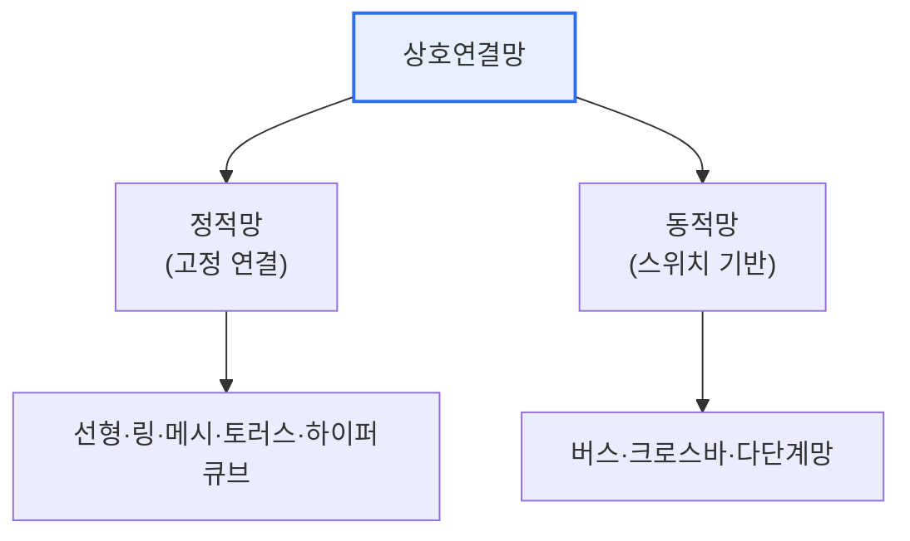

# 병렬처리 시스템의 상호연결망(Interconnection Network)

## 1. 개요

### 가. 개념
> **상호연결망**은 병렬처리 시스템에서 **다수의 프로세서·메모리·노드를 서로 연결해 데이터를 교환하게 하는 통신 구조**로, 병렬 시스템의 성능을 좌우하는 핵심 요소다.

상호연결망이 병렬처리의 성패를 가르는 근본 이유는 '**아무리 프로세서가 많아도, 그들이 데이터를 못 주고받으면 소용없다**'는 데 있다. 병렬처리는 여러 프로세서가 일을 나눠 동시에 수행해 속도를 높인다. 그런데 프로세서들은 끊임없이 데이터를 주고받아야 협력할 수 있다. 이 데이터 교환이 느리거나 병목이 생기면, 프로세서를 늘려도 성능이 오르지 않는다(통신 오버헤드). 상호연결망은 이 프로세서 간·프로세서와 메모리 간 통신을 담당한다. 어떻게 연결하느냐에 따라 통신 속도(지연)·동시 통신 능력(대역폭)·확장성·비용이 크게 달라진다. 모두를 직접 연결하면 빠르지만 연결 수가 폭발해 비용·복잡도가 감당 안 되고, 하나의 버스로 연결하면 단순하지만 병목이 생긴다. 그래서 성능·비용·확장성의 균형을 맞춘 다양한 연결 구조(토폴로지)가 고안됐다. 상호연결망 설계는 곧 이 트레이드오프를 어떻게 잡느냐의 문제다.

### 나. 평가 요소
지연시간(latency), 대역폭(bandwidth), 연결 비용, 확장성, 결함 허용성이 상호연결망의 성능을 평가하는 척도다.

## 2. 상호연결망의 종류

상호연결망은 연결이 고정된 **정적망**과, 스위치로 연결을 바꾸는 **동적망**으로 나뉜다.

| 유형 | 예 | 특징 |
|---|---|---|
| **버스(동적)** | 공유 버스 | 단순·저비용, 병목·확장성 한계 |
| **크로스바(동적)** | 격자 스위치 | 완전 연결·고성능, 비용 O(n²) |
| **다단계망(동적)** | Omega 망 | 버스와 크로스바의 절충 |
| **메시/토러스(정적)** | 격자형 | 확장성 우수, 국소 통신 효율 |
| **하이퍼큐브(정적)** | n차원 큐브 | 짧은 지름, 노드 수 증가에 유리 |

## 3. 토러스(Torus) 구조

**토러스**는 격자형 **메시(Mesh)** 구조의 양 끝(가장자리)을 서로 연결해 고리(wrap-around) 형태로 만든 구조다. 메시는 격자로 노드를 연결해 확장성이 좋지만, 가장자리 노드는 한쪽으로만 연결돼 통신 거리가 멀어지는 단점이 있다. 토러스는 양 끝을 이어 이 단점을 보완한다.

| 구분 | 메시 | 토러스 |
|---|---|---|
| **구조** | 격자형(가장자리 개방) | 격자 + 양끝 연결(고리) |
| **통신 거리** | 가장자리에서 김 | 평균 거리 단축(대칭적) |
| **대칭성** | 비대칭 | 대칭적(균등 부하) |

토러스는 양 끝을 이어 노드 간 평균 통신 거리를 줄이고, 모든 노드가 동일한 연결 수를 가져 부하가 대칭적으로 분산된다. 그래서 대규모 병렬 컴퓨터·슈퍼컴퓨터(예: 다차원 토러스)에 널리 쓰인다. 다만 wrap-around 연결로 배선 복잡도가 다소 증가한다.

## 4. 고려사항 및 시사점

1. **성능·비용·확장성의 균형**이 설계 핵심이다. 크로스바는 빠르지만 비싸고, 버스는 싸지만 병목이 있으므로, 시스템 규모·통신 패턴에 맞는 토폴로지를 선택해야 한다.
2. **통신 패턴과의 정합성**이 중요하다. 국소 통신이 많으면 메시·토러스가, 전역 통신이 많으면 하이퍼큐브·크로스바가 유리한 식으로, 응용의 데이터 교환 특성에 맞춰야 성능이 난다.
3. **대규모 시스템·데이터센터로 확장**된다. 토러스·하이퍼큐브 등은 슈퍼컴퓨터·GPU 클러스터·데이터센터 네트워크(예: 팻트리)로 이어지며, AI 대규모 학습의 노드 간 고속 통신 인프라로 중요성이 커지고 있다. [[multi-gpu]]

---

> **한 줄 요약**: 상호연결망은 *병렬 시스템의 프로세서·메모리를 연결하는 통신 구조* 로 성능을 좌우하며, 버스·크로스바·메시·하이퍼큐브 등이 있고, 토러스는 메시의 양끝을 이어 평균 통신 거리를 줄이고 부하를 대칭 분산해 대규모 병렬처리에 쓰인다.
