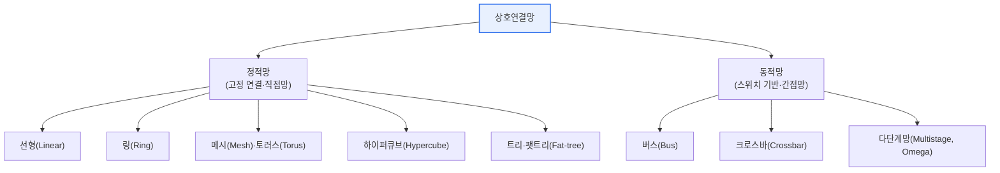
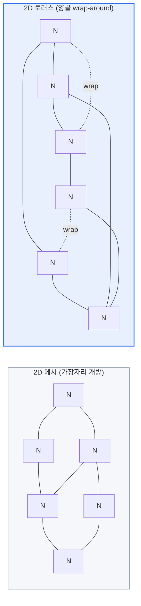

# 병렬처리 시스템의 상호연결망(Interconnection Network)

## 1. 개요

### 가. 개념

> **상호연결망**은 병렬처리 시스템에서 **다수의 프로세서·메모리·노드를 서로 연결해 데이터를 교환하게 하는 통신 구조**로, 병렬 시스템의 성능을 좌우하는 핵심 요소다. 노드를 어떤 위상(topology)으로 잇고, 어떤 방식으로 경로를 정하며(라우팅), 어떻게 스위칭하느냐가 상호연결망 설계의 세 축이다.

상호연결망이 병렬처리의 성패를 가르는 근본 이유는 '**아무리 프로세서가 많아도, 그들이 데이터를 못 주고받으면 소용없다**'는 데 있다. 병렬처리는 여러 프로세서가 일을 나눠 동시에 수행해 속도를 높인다. 그런데 프로세서들은 끊임없이 데이터를 주고받아야 협력할 수 있다. 이 데이터 교환이 느리거나 병목이 생기면, 프로세서를 늘려도 성능이 오르지 않는다(통신 오버헤드). 암달의 법칙이 말하듯 직렬 구간과 통신 지연이 병렬화 이득의 상한을 정하는데, 그 통신 지연의 물리적 실체가 바로 상호연결망이다.

상호연결망은 이 프로세서 간·프로세서와 메모리 간 통신을 담당한다. 어떻게 연결하느냐에 따라 통신 속도(지연)·동시 통신 능력(대역폭)·확장성·비용이 크게 달라진다. 모두를 직접 연결하면 빠르지만 연결 수가 폭발해(완전그래프는 노드 수의 제곱에 비례) 비용·복잡도가 감당 안 되고, 하나의 버스로 연결하면 단순하지만 모든 통신이 한 경로를 다투어 병목이 생긴다. 그래서 성능·비용·확장성의 균형을 맞춘 다양한 연결 구조(토폴로지)가 고안됐다. 상호연결망 설계는 곧 이 트레이드오프를 어떻게 잡느냐의 문제다. 오늘날 이 문제는 슈퍼컴퓨터·GPU 클러스터·칩 내부(NoC, Network-on-Chip)까지 규모만 달리한 채 동일하게 반복된다.

### 나. 평가 요소

상호연결망의 성능은 몇 가지 정량 지표로 평가한다. 이 지표들은 서로 상충하기 때문에, 어느 하나를 극대화하면 다른 것이 나빠진다는 점을 이해하는 것이 설계의 출발점이다.

| 지표 | 정의 | 의미 |
|---|---|---|
| **지연시간(Latency)** | 노드 간 데이터 전달에 걸리는 시간 | 응답성. 거리가 멀수록 증가 |
| **대역폭(Bandwidth)** | 단위 시간당 전송 데이터량 | 처리량 |
| **지름(Diameter)** | 가장 먼 두 노드 간 최단 거리(홉 수) | 최악 지연의 상한 |
| **이분대역폭(Bisection BW)** | 망을 절반으로 자를 때 절단되는 링크 수 | 전역 통신 능력·병목 척도 |
| **연결도(Degree)** | 한 노드가 갖는 링크 수 | 하드웨어 비용·핀 수 |
| **결함 허용성** | 링크·노드 고장 시 대체 경로 유무 | 신뢰성 |

**지름**은 최악의 경우 통신이 몇 홉을 거치는지를 나타내므로 지연의 상한을 규정한다. 지름이 작을수록 좋지만, 지름을 줄이려면 노드마다 링크를 더 달아야 해서 연결도(비용)가 올라간다. **이분대역폭**은 망을 반으로 갈랐을 때 두 절반 사이를 잇는 링크 수로, 전역적으로 데이터가 뒤섞이는 통신(예: 행렬 전치, all-to-all)에서 실질 병목을 결정한다. 이분대역폭이 크면 전역 통신에 강하지만 역시 링크와 배선이 많아져 비용이 커진다. 요컨대 좋은 상호연결망이란 '작은 지름·큰 이분대역폭·낮은 연결도'를 동시에 추구하지만 이 셋을 모두 만족시킬 수는 없어, 응용 특성에 맞춰 절충하는 것이다.

## 2. 상호연결망의 종류

```mermaid
flowchart TB
  I["상호연결망"] --> S["정적망<br/>(고정 연결·직접망)"]
  I --> D["동적망<br/>(스위치 기반·간접망)"]
  S --> S1["선형(Linear)"]
  S --> S2["링(Ring)"]
  S --> S3["메시(Mesh)·토러스(Torus)"]
  S --> S4["하이퍼큐브(Hypercube)"]
  S --> S5["트리·팻트리(Fat-tree)"]
  D --> D1["버스(Bus)"]
  D --> D2["크로스바(Crossbar)"]
  D --> D3["다단계망(Multistage, Omega)"]
  style I fill:#e8f0fe,stroke:#2f6fed,stroke-width:2px
```

상호연결망은 연결이 고정된 **정적망(직접망)** 과, 스위치로 연결을 그때그때 바꾸는 **동적망(간접망)** 으로 나뉜다. 정적망은 노드끼리 직접 링크로 이어져 있어 통신 패턴이 일정한 과학계산에 유리하고, 동적망은 스위치를 통해 임의의 두 노드를 연결하므로 유연하지만 스위치 자체가 비용·지연 요인이 된다.

| 유형 | 예 | 지름 | 특징 |
|---|---|---|---|
| **버스(동적)** | 공유 버스 | 1 | 단순·저비용, 병목·확장성 한계 |
| **크로스바(동적)** | 격자 스위치 | 1 | 완전 연결·고성능, 비용 O(n²) |
| **다단계망(동적)** | Omega 망 | log n | 버스와 크로스바의 절충 |
| **링(정적)** | 순환 연결 | n/2 | 단순, 지름 큼 |
| **메시(정적)** | 2D 격자 | 약 2√n | 확장성 우수, 국소 통신 효율 |
| **토러스(정적)** | 격자+wrap | 약 √n | 메시 대비 거리 단축·대칭 |
| **하이퍼큐브(정적)** | n차원 큐브 | log₂ n | 짧은 지름, 연결도 증가 |

**가. 버스와 크로스바 — 양 극단.** 버스는 하나의 공유 매체에 모든 노드를 붙인 가장 단순한 구조다. 배선이 하나뿐이라 저렴하고 지름이 1이지만, 동시에 한 쌍만 통신할 수 있어 노드가 늘면 곧바로 병목이 된다. 반대로 크로스바는 모든 입력·출력을 격자 스위치로 완전 연결해 어떤 노드 쌍도 동시에 충돌 없이 통신한다. 성능은 이상적이지만 스위치 수가 노드 수의 제곱(O(n²))으로 늘어 대규모 시스템에는 비용이 감당되지 않는다. 이 둘은 '싸고 느린 것'과 '비싸고 빠른 것'의 양 극단으로, 나머지 토폴로지는 대개 이 사이 어딘가에 위치한다.

**나. 다단계 상호연결망(MIN) — 절충.** Omega 망 같은 다단계망은 log n 단의 작은 스위치(보통 2×2)를 쌓아, 크로스바의 O(n²) 비용을 O(n log n)으로 낮추면서도 버스보다 훨씬 나은 동시성을 얻는다. 다만 특정 통신 패턴에서 내부 경로가 겹치는 블로킹이 생길 수 있어, 완전한 비차단(non-blocking)을 원하면 Clos/Benes 같은 더 복잡한 구조가 필요하다. 이는 '비용을 줄이면 경합 위험이 생긴다'는 트레이드오프의 전형이다.

**다. 격자 계열(메시·토러스·하이퍼큐브) — 확장성 지향.** 대규모 병렬 컴퓨터는 노드를 규칙적 격자로 잇는 정적망을 선호한다. 배선이 국소적(이웃끼리)이어서 물리적으로 구현하기 쉽고, 노드를 추가할 때 구조를 유지한 채 확장할 수 있기 때문이다. 이 계열의 대표가 메시·토러스·하이퍼큐브이며, 다음 절에서 토러스를 중심으로 상세히 본다.

## 3. 토러스(Torus) 구조 상세

```mermaid
flowchart LR
  subgraph Mesh["2D 메시 (가장자리 개방)"]
    M00["N"] --- M01["N"] --- M02["N"]
    M10["N"] --- M11["N"] --- M12["N"]
    M00 --- M10
    M01 --- M11
    M02 --- M12
  end
  subgraph Torus["2D 토러스 (양끝 wrap-around)"]
    T00["N"] --- T01["N"] --- T02["N"]
    T10["N"] --- T11["N"] --- T12["N"]
    T00 --- T10
    T01 --- T11
    T02 --- T12
    T02 -. wrap .- T00
    T12 -. wrap .- T10
  end
  style Mesh fill:#f5f7fa,stroke:#8a94a6
  style Torus fill:#e8f0fe,stroke:#2f6fed,stroke-width:2px
```

**토러스**는 격자형 **메시(Mesh)** 구조의 양 끝(가장자리)을 서로 연결해 고리(wrap-around) 형태로 만든 구조다. 메시는 격자로 노드를 연결해 확장성이 좋지만, 가장자리 노드는 한쪽으로만 연결돼 통신 거리가 멀어지고 부하가 한쪽으로 쏠리는 단점이 있다. n×n 메시의 지름은 약 2(n−1)로 규모가 커질수록 최악 지연이 크게 늘어난다. 토러스는 양 끝을 이어 이 단점을 보완한다.

| 구분 | 메시 | 토러스 |
|---|---|---|
| **구조** | 격자형(가장자리 개방) | 격자 + 양끝 연결(고리) |
| **지름** | 약 2(n−1) | 약 n (절반 수준) |
| **통신 거리** | 가장자리에서 김 | 평균 거리 단축(대칭적) |
| **대칭성** | 비대칭 | 대칭적(균등 부하) |
| **배선** | 단순 | wrap 링크로 다소 복잡 |

토러스가 메시보다 나은 이유는 세 가지로 정리된다. 첫째, **지름 단축**이다. wrap-around 링크가 가장자리를 반대편으로 이어주므로, 최악의 경우에도 격자의 절반 거리로 도달할 수 있어 지름이 대략 절반으로 줄어든다. 이는 지연에 민감한 통신에서 직접적 성능 이득이 된다. 둘째, **부하의 대칭적 분산**이다. 메시에서는 가장자리·중앙 노드의 연결 수가 달라 트래픽이 불균형하지만, 토러스는 모든 노드가 동일한 연결 수(2차원이면 4개)를 가져 어떤 노드도 특별히 병목이 되지 않는다. 셋째, **좋은 이분대역폭**이다. 대칭 구조 덕분에 망을 어디서 잘라도 절단 링크 수가 고르게 유지돼 전역 통신에 강하다.

이런 특성 때문에 토러스는 대규모 병렬 컴퓨터·슈퍼컴퓨터에 널리 쓰인다. 구체적으로 IBM Blue Gene/L·P는 3차원 토러스를, Blue Gene/Q는 5차원 토러스를 채택했고, Cray의 SeaStar/Gemini 인터커넥트도 3D 토러스 기반이며, 일본의 K 컴퓨터와 후속 Fugaku는 6차원 mesh/torus인 Tofu 인터커넥트를 사용했다. 차원을 높이면(k-ary n-cube 일반화) 같은 노드 수에서 지름이 더 줄지만 노드당 링크와 배선 복잡도가 늘어난다는 트레이드오프가 있다. 다만 wrap-around 배선은 물리적으로 반대편까지 긴 케이블을 요구하므로, 실제 구현에서는 노드를 접어 배치(folding)해 케이블 길이를 균등화하는 기법을 함께 쓴다.

## 4. 하이퍼큐브·팻트리와의 비교

토러스의 위치를 이해하려면 하이퍼큐브·팻트리와 견주는 것이 유용하다. 세 구조는 대규모 시스템에서 경쟁·공존하는 대표 토폴로지다.

**하이퍼큐브**는 n차원 큐브로, 노드 수 2ⁿ에 대해 지름이 log₂(2ⁿ)=n에 불과해 매우 짧다. 전역 통신이 잦은 응용에 유리하다. 그러나 노드당 연결도가 n으로 노드 수에 따라 함께 증가하기 때문에, 규모가 커지면 노드마다 포트를 계속 늘려야 해 하드웨어 확장이 어렵다. 즉 하이퍼큐브는 '지름은 작지만 연결도가 큰' 구조다.

이에 비해 토러스는 차원 n을 고정한 채 각 차원의 크기 k만 키우므로(k-ary n-cube), 노드당 연결도가 2n으로 일정하게 유지된다. 대신 지름은 하이퍼큐브보다 크다. 결국 **토러스는 '연결도를 일정하게 유지해 확장성을 얻는' 대신 지름을 다소 희생한 구조**이고, 하이퍼큐브는 그 반대다. 노드가 수만~수십만에 이르는 초대형 시스템에서 노드당 포트를 고정할 수 있다는 점이 토러스가 슈퍼컴퓨터에서 널리 채택된 실무적 이유다.

**팻트리(Fat-tree)** 는 트리 구조에서 위로 갈수록 링크 대역폭을 두껍게 해 상위 병목을 없앤 구조로, 오늘날 데이터센터·HPC 클러스터의 InfiniBand 네트워크에서 표준처럼 쓰인다. 팻트리는 어떤 노드 쌍이든 균일한 대역폭(full bisection)을 제공해 통신 패턴에 둔감하다는 장점이 있어, 통신이 불규칙한 범용 클러스터에 적합하다. 반면 토러스는 이웃 통신이 많은 정형화된 과학계산에 강하다. 즉 '규칙적 국소 통신이면 토러스, 불규칙 전역 통신이면 팻트리'가 대략의 선택 기준이 된다.

## 5. 심화 — AI·데이터센터로의 확장

상호연결망은 슈퍼컴퓨터의 전유물이 아니라, 오늘날 AI 대규모 학습 인프라의 성패를 가르는 요소로 부상했다. 수천 개의 GPU로 거대 모델을 학습할 때, 각 스텝마다 모든 GPU의 그래디언트를 합치는 all-reduce 통신이 발생하는데, 이 집합통신(collective communication)의 효율이 곧 학습 속도를 좌우한다. 통신이 느리면 값비싼 GPU가 데이터를 기다리며 놀게 되므로, 인터커넥트 설계가 전체 비용 효율을 결정한다.

이 맥락에서 앞서 본 토폴로지 개념이 그대로 재현된다. NVIDIA의 NVLink/NVSwitch는 GPU들을 크로스바에 가까운 완전 연결로 묶어 노드 내부의 고대역 통신을 제공하고, 노드 간에는 InfiniBand 팻트리나 토러스형 토폴로지를 쓴다. Google의 TPU Pod는 명시적으로 2D/3D 토러스로 칩을 연결해, 이웃 간 고속 통신에 최적화된 all-reduce를 구현한다. 즉 '국소 통신이 많은 정형 워크로드에 토러스가 유리하다'는 고전적 원리가 AI 학습에서 그대로 적용되는 것이다.

또한 칩 내부에서도 같은 문제가 반복된다. 멀티코어·메니코어 프로세서에서 수십~수백 개 코어를 잇는 **Network-on-Chip(NoC)** 은 대개 2D 메시·토러스 토폴로지를 채택한다. 칩 면적·전력 제약 아래에서 국소적 배선으로 확장 가능한 구조가 필요하기 때문이다. 이처럼 상호연결망은 슈퍼컴퓨터→데이터센터→칩 내부로 규모만 달리하며 동일한 트레이드오프(지름·대역폭·연결도·비용)를 다루는, 병렬 컴퓨팅의 보편 원리다. [[multi-gpu]]

## 6. 고려사항 및 시사점 (기술사 관점)

1. **성능·비용·확장성의 균형이 설계 핵심이다.** 크로스바는 빠르지만 O(n²)로 비싸고, 버스는 싸지만 병목이 있으므로, 시스템 규모·통신 패턴에 맞는 토폴로지를 선택해야 한다. 지름·이분대역폭·연결도가 서로 상충하는 만큼, 단일 최적해가 아니라 목적함수(비용 제약 하 성능 최대화)에 따른 선택 문제로 접근해야 한다.

2. **통신 패턴과의 정합성이 중요하다.** 국소 통신(이웃 격자 연산)이 많으면 메시·토러스가, 전역·불규칙 통신이 많으면 하이퍼큐브·팻트리가 유리하다. 응용의 데이터 교환 특성(스텐실 연산, all-to-all, all-reduce)을 프로파일링해 토폴로지를 정합시켜야 실효 성능이 난다.

3. **라우팅·결함 허용성을 함께 설계해야 한다.** 토폴로지만이 아니라 경로 결정 알고리즘(예: 차원순서 라우팅)과 교착(deadlock) 회피(가상채널), 링크 고장 시 우회 경로가 갖춰져야 대규모 시스템이 안정적으로 동작한다. 노드 수가 많을수록 부품 고장 확률이 높아지므로 결함 허용성은 선택이 아닌 필수다.

4. **AI 대규모 학습 인프라로 중요성이 커지고 있다.** GPU 클러스터의 집합통신 효율이 학습 비용을 좌우하면서, 토러스(TPU Pod)·팻트리(InfiniBand)·완전연결(NVLink)의 계층적 조합이 표준이 되고 있다. 인터커넥트가 곧 AI 경쟁력이라는 인식 아래, 통신-연산 중첩(overlap)·토폴로지 인지 집합통신 알고리즘이 핵심 최적화 대상이 된다.

5. **광연결·칩렛 등 물리 기술과의 연계가 전망이다.** 노드 간 거리·전력 한계를 넘기 위해 실리콘 포토닉스(광인터커넥트)와 칩렛(chiplet) 기반 패키징이 부상하고 있으며, 이는 상호연결망의 물리적 구현 한계를 완화해 더 큰 이분대역폭과 낮은 지연을 가능케 할 것으로 보인다.

## 참고자료

- Oregon State Univ., "Interconnection Networks: Direct/Indirect, Shared Memory" 강의자료 — https://web.engr.oregonstate.edu/~bose/cs572/InterconnectionNetworks.ppt
- "Fully twisted torus interconnection network for parallel systems", Discover Computing (Springer, 2025) — https://link.springer.com/article/10.1007/s10791-025-09891-w

---

> **한 줄 요약**: 상호연결망은 *병렬 시스템의 프로세서·메모리를 연결하는 통신 구조* 로 지름·대역폭·연결도의 트레이드오프 속에서 성능을 좌우하며, 버스·크로스바·메시·하이퍼큐브·팻트리 등이 있고, 토러스는 메시의 양끝을 이어 지름을 절반으로 줄이고 부하를 대칭 분산해 슈퍼컴퓨터·TPU Pod 등 대규모 병렬처리에 널리 쓰인다.
