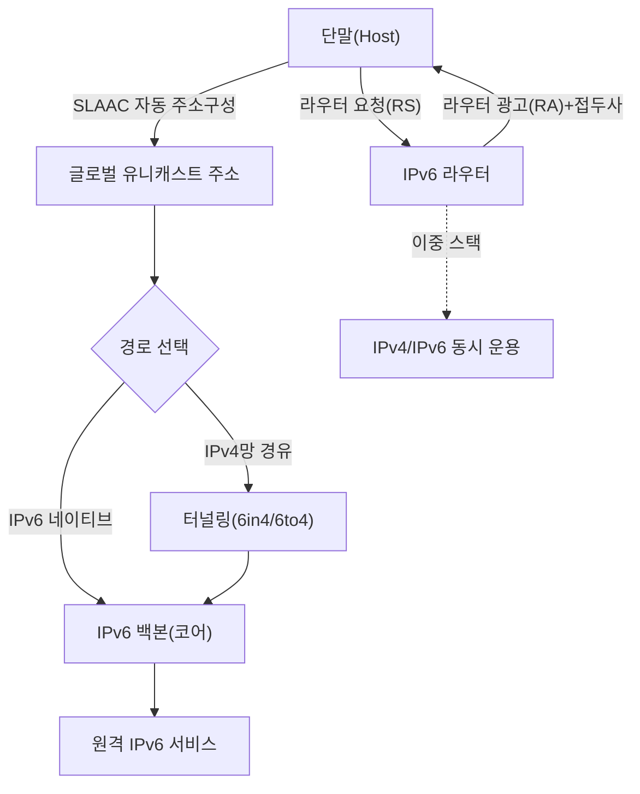
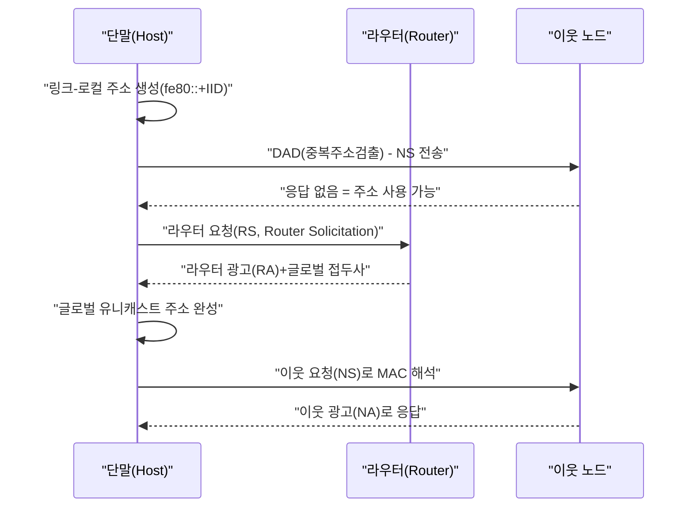

# IPv6와 IPv4→IPv6 전환 기술

## 1. 개요

> **IPv6(Internet Protocol version 6)** 는 기존 32비트 IPv4 주소 고갈을 근본적으로 해소하기 위해 IETF가 RFC 8200(2017, 舊 RFC 2460)으로 표준화한 128비트 체계의 차세대 인터넷 프로토콜로, 확장된 주소 공간·단순화된 헤더·내장 보안·자동 주소구성(SLAAC)을 통해 대규모 연결 환경을 지원한다.

IPv6가 등장한 근본 배경은 **주소 고갈(IPv4 Address Exhaustion)** 이다. IPv4는 약 43억 개(2³²)의 주소만을 제공하는데, 인터넷 초기 설계 당시에는 충분하다고 여겨졌으나 PC·스마트폰·IoT 단말의 폭증으로 한계에 부딪혔다. 실제로 IANA의 최상위 IPv4 주소 풀은 2011년 2월 소진되었고, 지역 인터넷 레지스트리(RIR) 중 APNIC(아·태), RIPE(유럽), ARIN(북미)도 순차적으로 신규 할당이 사실상 중단되었다. 그동안 NAT(Network Address Translation)와 CIDR가 고갈 시점을 늦추는 임시 방편으로 쓰였지만, NAT는 종단간(End-to-End) 통신 원칙을 훼손하고 P2P·VoIP·서버 개설에 제약을 주는 구조적 부작용을 낳았다.

두 번째 배경은 **네트워크의 성능·확장성·보안에 대한 새로운 요구**이다. IPv4 헤더는 가변 길이 옵션 필드와 라우터에서의 체크섬 재계산·단편화 처리로 라우팅 부하가 컸다. IPv6는 40바이트 고정 헤더와 옵션의 확장 헤더 분리, 라우터 단편화 금지 설계로 코어 라우터의 처리 부담을 줄였다. 또한 IPsec을 표준 구성요소로 정의(권고)하여 보안 통신의 기반을 프로토콜 수준에서 마련했고, 사물인터넷·5G·스마트시티처럼 방대한 단말에 고유 주소를 부여해야 하는 환경에서 필수 인프라로 자리 잡고 있다. 정보관리기술사 관점에서 IPv6는 단순한 "주소 확장"이 아니라 **주소·라우팅·보안·이동성·자동화**를 아우르는 아키텍처 전환으로 이해해야 한다.

세 번째 배경은 **종단간(End-to-End) 연결성의 복원**이다. IPv4 시대의 NAT는 다수 단말이 하나의 공인 주소를 공유하게 만들어 주소 고갈을 늦췄지만, 외부에서 내부 단말로 직접 도달할 수 없게 만들어 P2P·실시간 통신·홈 서버 운영을 어렵게 했고 애플리케이션이 이를 우회하려 STUN/TURN 같은 복잡한 보조 장치를 도입하게 만들었다. IPv6는 모든 단말에 공인 주소를 부여할 수 있어 인터넷 본래의 종단간 원칙을 복원하며, 이는 IoT·5G·실시간 협업처럼 단말 간 직접 통신이 중요한 서비스의 기반이 된다. 다만 종단간 도달성은 보안 노출면을 넓히므로 방화벽 정책과 병행해야 한다는 점이 함께 고려되어야 한다.

IPv6의 핵심 특징을 먼저 정리하면 다음과 같다.

| 구분 | IPv4 | IPv6 |
|------|------|------|
| 주소 길이 | 32비트(약 43억) | 128비트(약 3.4×10³⁸) |
| 표기법 | 점 십진(192.0.2.1) | 콜론 16진(2001:db8::1) |
| 헤더 | 가변(20~60B), 체크섬 有 | 고정 40B, 체크섬 無 |
| 단편화 | 라우터·송신자 모두 | 송신 종단만(PMTUD) |
| 주소 자동설정 | DHCP 필요 | SLAAC 내장 + DHCPv6 |
| 보안 | 별도(IPsec 선택) | IPsec 통합 설계 |
| 브로드캐스트 | 있음 | 없음(멀티캐스트·애니캐스트로 대체) |

## 2. IPv6 전체 구조와 주소 체계

아래는 IPv6가 적용된 네트워크의 전체 구조를 나타낸 개념도이다. 단말은 라우터 광고(RA)를 통해 접두사를 받아 스스로 주소를 구성하고, 이중 스택 구간과 터널을 거쳐 IPv6 백본과 통신한다.

**가. 주소 표기와 유형.** IPv6 주소는 128비트를 16비트씩 8개 그룹으로 나눠 콜론으로 구분한 16진수로 표기한다(예: `2001:0db8:0000:0000:0000:0000:0000:0001`). 각 그룹의 앞자리 0은 생략하고, 연속된 0 그룹은 `::`로 한 번만 압축할 수 있어 위 주소는 `2001:db8::1`로 축약된다. 주소는 목적에 따라 **유니캐스트(1:1), 멀티캐스트(1:다, ff00::/8), 애니캐스트(가장 가까운 하나에게)** 로 나뉘며, IPv4의 브로드캐스트는 폐지되고 멀티캐스트가 그 역할을 대체한다. 이 설계 덕분에 불필요한 브로드캐스트 폭주가 사라져 링크 효율이 개선된다.

**나. 주소 범위(Scope).** 유니캐스트는 다시 **글로벌 유니캐스트(2000::/3, 공인 라우팅 대상)**, **링크-로컬(fe80::/10, 동일 링크 내에서만 유효)**, **유니크 로컬(fc00::/7, 사설망용)** 으로 구분된다. 특히 링크-로컬 주소는 인터페이스가 활성화되면 자동 생성되어 이웃 탐색·라우터 통신의 기본 채널로 쓰인다. 예컨대 사내망에서 라우터를 재부팅하면 각 인터페이스는 별도 설정 없이 `fe80::`로 시작하는 주소를 즉시 확보해 초기 통신을 시작하는데, 이는 IPv4에서 DHCP 서버 응답을 기다려야 했던 것과 대비되는 실무적 이점이다.

**다. 헤더 단순화의 원리.** IPv6 헤더는 40바이트 고정이며 IPv4의 체크섬·헤더 길이·식별자 등 13개 필드를 8개로 줄였다. 라우터가 매 홉마다 체크섬을 재계산하지 않아도 되는 이유는, 상위 계층(TCP/UDP)과 링크 계층이 이미 오류 검출을 수행하므로 IP 계층의 중복 검사를 제거해 성능을 확보한 것이다. 대신 옵션은 **확장 헤더(Hop-by-Hop, Routing, Fragment, IPsec 등)** 로 분리해 필요할 때만 체인 형태로 삽입한다. 이로써 일반 패킷은 최소 헤더로 빠르게 처리되고, 특수 기능이 필요한 패킷만 추가 비용을 지불하는 "부담의 국지화"가 실현된다.

참고로 IPv6 기본 헤더(40바이트)의 주요 필드는 다음과 같이 구성된다.

| 필드 | 크기 | 역할 |
|------|------|------|
| Version | 4비트 | 프로토콜 버전(=6) |
| Traffic Class | 8비트 | 우선순위·DSCP(QoS) |
| Flow Label | 20비트 | 동일 흐름 식별·경로 고정 |
| Payload Length | 16비트 | 페이로드+확장헤더 길이 |
| Next Header | 8비트 | 다음 확장헤더/상위 프로토콜 |
| Hop Limit | 8비트 | IPv4 TTL 대응(홉 제한) |
| Source/Destination | 각 128비트 | 출발·목적지 주소 |

또한 IPv6 헤더에는 **플로우 레이블(Flow Label, 20비트)** 필드가 새로 도입되어, 동일한 흐름(Flow)에 속하는 패킷을 라우터가 심층 검사 없이 식별해 동일 경로·동일 QoS로 처리할 수 있다. 예컨대 실시간 화상회의 트래픽에 하나의 플로우 레이블을 부여하면 코어 라우터는 패킷마다 5-튜플을 재분석하지 않고도 지연에 민감한 흐름임을 인지해 우선 처리할 수 있어, 대규모 트래픽 환경에서 라우팅 효율과 QoS 정밀도를 동시에 높인다.

**라. 단편화 처리의 이동.** IPv4에서는 경로상의 어떤 라우터든 패킷이 링크 MTU보다 크면 이를 잘라 전달했으나, 이는 코어 라우터의 부하와 재조립 취약점(Teardrop 등)을 유발했다. IPv6는 **중간 라우터의 단편화를 금지**하고, 오직 송신 종단이 **경로 MTU 탐색(PMTUD, Path MTU Discovery)** 으로 경로 전체의 최소 MTU를 알아내 미리 적정 크기로 보내도록 바꿨다. 이 설계는 라우터를 가볍게 만드는 대신 PMTUD가 의존하는 ICMPv6 "Packet Too Big" 메시지가 방화벽에서 차단되면 통신이 멈추는 부작용을 낳으므로, 실무에서는 ICMPv6를 무분별하게 막지 않도록 정책을 세밀하게 설계해야 한다.

**마. 주소 계획의 실제.** IPv6는 주소가 방대해 오히려 체계적 계획이 중요하다. 통상 조직은 ISP로부터 **/48**(65,536개의 /64 서브넷)을 할당받아, 부서·지사·용도별로 **/56**이나 **/64**를 계층적으로 나눠 배정한다. 예컨대 `2001:db8:aced::/48`을 본사에 배정하고 층·부서를 `2001:db8:aced:0010::/64`, `2001:db8:aced:0020::/64` 식으로 구획하면, 접두사만 보고도 위치·용도를 식별할 수 있어 라우팅 요약과 보안 정책 적용이 단순해진다. IPv4에서 주소를 아끼느라 서브넷을 잘게 쪼개던 관행과 달리, IPv6는 서브넷당 /64를 넉넉히 쓰되 상위 비트로 구조를 표현하는 것이 모범 사례다.

## 3. 자동 주소구성과 이웃 탐색 프로세스

IPv6의 대표적 진보는 서버 없이도 단말이 스스로 주소를 만드는 **SLAAC(Stateless Address Autoconfiguration, RFC 4862)** 이다. 아래는 단말이 부팅 후 통신 가능 상태에 이르기까지의 절차를 나타낸 세부 흐름도이다.

**가. 링크-로컬 생성과 DAD.** 단말은 먼저 인터페이스 식별자(IID)를 결합해 링크-로컬 주소를 만든 뒤, 같은 링크에 동일 주소가 있는지 **DAD(Duplicate Address Detection)** 로 확인한다. 응답이 없으면 유일성이 보장된 것으로 판단하고 그 주소를 확정한다. 이는 IPv4에서 IP 충돌을 사후에 발견하던 방식보다 예방적이다. 초기에는 IID를 MAC 기반 EUI-64로 생성했으나, MAC이 노출되어 단말 추적이 가능하다는 프라이버시 문제 때문에 **RFC 8981(임시 주소)** 과 **RFC 7217(안정적 난수 IID)** 방식이 도입되어 현재 스마트폰·PC는 주기적으로 바뀌는 임시 주소를 함께 사용한다.

**나. 라우터 광고(RA) 기반 접두사 수신.** 단말이 RS를 보내면 라우터는 RA로 **네트워크 접두사(/64가 관례)** 와 기본 게이트웨이 정보를 알려준다. 단말은 접두사에 자신의 IID를 붙여 글로벌 주소를 완성한다. RA의 M/O 플래그에 따라 순수 SLAAC, DHCPv6 병행(주소는 SLAAC, DNS 등 부가정보는 DHCPv6), 또는 상태ful DHCPv6 중 하나로 동작한다. 실제 통신사·기업망에서는 주소 추적·감사 요구 때문에 SLAAC만으로는 부족해 DHCPv6를 병행하는 하이브리드 구성이 흔하다.

**다. ARP를 대체하는 NDP.** IPv4의 ARP·ICMP 리다이렉트·라우터 탐색 기능은 IPv6에서 **NDP(Neighbor Discovery Protocol, ICMPv6 기반)** 로 통합된다. NS(Neighbor Solicitation)/NA(Neighbor Advertisement)로 MAC 주소를 해석하고, 멀티캐스트를 사용하므로 링크 전체에 브로드캐스트를 뿌리던 ARP보다 부하가 낮다. 다만 NDP는 인증이 약해 **NS/NA 스푸핑, RA 스푸핑(가짜 라우터 광고)** 같은 위협에 노출되므로, 스위치의 **RA Guard·ND Inspection·SEND(Secure Neighbor Discovery)** 로 보완해야 한다.

**라. SLAAC와 DHCPv6의 역할 분담.** SLAAC는 서버 없이 주소를 배분해 관리 부담이 낮지만, "어느 단말이 언제 어떤 주소를 썼는지"를 중앙에서 관리·감사하기 어렵다는 약점이 있다. 이 때문에 보안·컴플라이언스가 중요한 기업·공공 환경에서는 **상태ful DHCPv6**로 주소를 중앙 할당·기록하거나, 주소는 SLAAC로 두되 DNS·NTP 같은 부가정보만 **상태less DHCPv6**로 배포하는 절충안을 택한다. 실제로 금융권 내부망에서는 단말 추적성과 사고 대응(포렌식) 요구 때문에 DHCPv6 로그를 필수로 남기는 사례가 일반적이며, 이는 IPv6 설계가 기술적 편의성과 운영·감사 요구 사이의 균형 문제임을 보여준다.

## 4. IPv4→IPv6 전환 기술 비교

IPv4와 IPv6는 헤더 구조가 달라 직접 상호운용되지 않으므로, 두 체계가 장기간 공존하는 현실에서 **전환(Transition) 기술**이 핵심이 된다. 전환 방식은 크게 이중 스택, 터널링, 주소 변환으로 구분되며 각각 적용 맥락이 다르다.

| 방식 | 원리 | 장점 | 단점·함의 |
|------|------|------|-----------|
| 이중 스택(Dual Stack) | 단말·라우터가 IPv4/IPv6 동시 탑재 | 호환성 높고 점진 전환 용이 | 두 주소체계 동시 운영·관리 부담, IPv4 주소 여전히 필요 |
| 터널링(6in4·6to4·6rd·ISATAP) | IPv6 패킷을 IPv4에 캡슐화 | 기존 IPv4망 위로 IPv6 섬 연결 | 캡슐화 오버헤드·MTU 문제, 종단간 지연 |
| 변환(NAT64/DNS64·464XLAT) | IPv6 단말이 IPv4 서버와 통신하도록 주소·DNS 변환 | IPv6 단독망에서 IPv4 자원 접근 | 상태 유지 부담, 일부 앱(IP 리터럴) 비호환 |

**가. 이중 스택의 실무 의미.** 이중 스택은 한 장비가 IPv4와 IPv6를 모두 처리하므로 상대가 어느 체계든 대응할 수 있다. 브라우저는 **Happy Eyeballs(RFC 8305)** 알고리즘으로 IPv6·IPv4 연결을 병행 시도해 빠른 쪽을 채택함으로써 사용자 체감 지연을 줄인다. 그러나 이중 스택은 IPv4 주소가 여전히 필요하고 방화벽·모니터링 정책을 이중으로 유지해야 하므로, 전환기의 과도적 해법이라는 한계가 있다.

**나. 터널링과 변환의 트레이드오프.** 터널링은 IPv4 인프라를 그대로 두고 IPv6 트래픽을 통과시키지만 캡슐화로 MTU가 줄어 단편화·경로 MTU 탐색 이슈가 발생한다. 반면 NAT64/DNS64와 이를 보완하는 464XLAT는 이동통신망에서 널리 쓰인다. 실제로 **T-Mobile US, 국내 통신사의 LTE/5G 모바일 코어**는 단말에 IPv6만 부여하고 IPv4 서비스는 464XLAT로 변환해 접속시키는 "IPv6 단독+변환" 구조를 운영하는데, 이는 관리해야 할 IPv4 주소를 극적으로 줄이는 대표적 산업 적용 사례다.

**다. 국내 보급 현황(추세).** 과학기술정보통신부·KISA 통계에 따르면 국내 IPv6 상용화는 이동통신 3사를 중심으로 꾸준히 확대되어 왔으며, 무선(모바일) 트래픽에서의 IPv6 이용 비중이 유선보다 앞서는 경향을 보인다. 다만 세부 수치는 시점에 따라 변동하므로 정책·투자 판단 시에는 KISA IPv6 통계 등 최신 자료를 확인하는 것이 바람직하다. 글로벌 지표로는 Google의 IPv6 채택률 통계가 널리 인용되며, 세계 평균 채택률은 40% 안팎 수준까지 상승한 것으로 보고된다(시점별 변동 있음).

**라. 선택 기준의 정리.** 세 방식은 배타적이지 않고 계층적으로 조합된다. 조직 내부망은 이중 스택으로 점진 전환하고, IPv4 인프라를 넘어 원격 IPv6 섬을 연결할 때는 터널링을, 단말에 IPv6만 부여하는 모바일·클라우드 환경에서는 NAT64/464XLAT를 쓰는 식이다. 선택의 핵심 기준은 ① 보유한 IPv4 주소의 여유, ② 레거시 애플리케이션의 IPv6 지원 성숙도, ③ 종단간 성능(터널 오버헤드 허용 여부), ④ 보안·감사 요구 수준이며, 이 네 축을 정량화해 방식을 배치하는 것이 전환 설계의 요체다.

## 5. 심화: 보안·이동성 관점과 예상 출제 방향

**가. IPv6 보안의 양면성.** IPv6는 IPsec을 통합 설계했지만 이것이 곧 "IPv6는 안전하다"를 의미하지 않는다. 방대한 주소 공간 덕분에 무차별 포트 스캐닝은 어려워졌으나, 앞서 언급한 **RA 스푸핑, NDP 캐시 고갈 공격, 확장 헤더를 악용한 방화벽 우회, 터널을 통한 탐지 회피** 등 IPv6 고유 위협이 존재한다. 특히 이중 스택 환경에서 IPv4 정책만 강화하고 IPv6 경로를 방치하면 "숨은 통로"가 되어 보안 사각지대가 생긴다. 따라서 IPv6 도입 시에는 방화벽·IPS·로그 수집을 IPv4와 동등 수준으로 이중 적용하는 것이 원칙이다.

대표적인 IPv6 고유 위협과 대응책을 정리하면 다음과 같다.

| 위협 | 원리 | 대응 |
|------|------|------|
| RA 스푸핑 | 가짜 라우터 광고로 트래픽 가로채기 | RA Guard, SEND |
| NDP 캐시 고갈 | 대량 NS로 이웃 캐시 소진(DoS) | ND 레이트 리밋, ND Inspection |
| 확장헤더 악용 | 다단 확장헤더로 방화벽 우회 | 확장헤더 검사·필터링 |
| 터널 은닉 | 6to4/Teredo 터널로 탐지 회피 | 불필요 터널 차단·모니터링 |

**나. 이동성과 IoT 확장.** Mobile IPv6는 단말이 네트워크를 이동해도 홈 주소를 유지하도록 설계되었고, 방대한 주소로 각 IoT 센서에 공인 주소를 직접 부여할 수 있어 종단간 통신을 복원한다. 저전력 무선 환경에서는 IPv6 헤더를 압축하는 **6LoWPAN(RFC 6282)** 이 활용되어 스마트 홈·산업 IoT의 표준 스택으로 자리 잡았다. 이는 IPv6가 5G·스마트시티·차량통신(V2X)의 기반 프로토콜로 지목되는 이유이기도 하다.

**다. 클라우드 네이티브와 IPv6.** 컨테이너 오케스트레이션 환경에서도 IPv6가 부상하고 있다. 쿠버네티스는 각 파드에 고유 IP를 부여하는데, 대규모 클러스터에서 사설 IPv4(RFC 1918) 주소가 오버레이 네트워크·다중 클러스터 상호연결 시 충돌·고갈되는 문제가 있다. 쿠버네티스 **듀얼 스택(v1.21+ 안정화)** 은 파드·서비스에 IPv4·IPv6를 동시 부여해 이 문제를 완화하고, IPv6 단독 클러스터는 주소 충돌 없이 사실상 무한한 파드 확장을 가능케 한다. 이는 IPv6가 레거시 통신망뿐 아니라 최신 플랫폼 인프라에서도 실질적 가치를 갖는다는 근거다.

**라. 예상 출제 방향과 답안 전략.** 기술사 시험에서 IPv6는 ① IPv4와의 헤더·주소체계 비교, ② SLAAC/NDP 동작 절차 설명, ③ 전환 기술(이중 스택·터널링·NAT64) 비교와 선택 기준, ④ IPv6 보안 위협과 대응 형태로 자주 출제된다. 답안 작성 시에는 단순 나열보다 "왜 그 설계를 택했는가(성능·확장성·보안의 균형)"와 "조직이 어떤 전환 전략을 선택해야 하는가(기존 자산·비용·보안 성숙도 고려)"를 논증하는 것이 고득점 포인트다. 특히 전환 기술 문항에서는 이중 스택·터널링·변환을 표로 비교한 뒤, 조직 상황(레거시 자산·주소 여유·보안 성숙도)에 따른 선택 로직을 결론에서 제시하면 차별화된다.

## 6. 고려사항 및 시사점

- **전환 전략의 선택(트레이드오프):** 신규 그린필드 네트워크는 IPv6 우선(IPv6-only+NAT64)으로 설계해 관리 복잡도를 줄이는 것이 유리하나, 레거시 자산이 많은 조직은 이중 스택으로 점진 전환하는 현실적 절충이 필요하다. 완전 전환 시점까지의 운영 비용(이중 정책 유지)을 총소유비용(TCO) 관점에서 산정해야 한다.
- **보안 동등성 확보:** IPv6 경로에 대해 방화벽·IPS·SIEM 로깅을 IPv4와 동일하게 적용하고, RA Guard·DHCPv6 Snooping·SEND로 링크 계층 위협을 통제해야 한다. "IPv6는 아직 안 쓰니 괜찮다"는 방치가 가장 위험하다.
- **주소 계획(Addressing Plan)과 거버넌스:** /48·/56·/64 등 계층적 접두사 할당 정책을 사전에 수립해 주소 낭비와 라우팅 테이블 비대화를 막고, 조직 표준으로 문서화해 감사·추적성을 확보해야 한다.
- **애플리케이션·운영 성숙도:** DNS AAAA 레코드 등록, 애플리케이션의 IPv6 리터럴 처리, 모니터링 도구의 IPv6 지원 여부를 사전 점검해야 하며, IP 주소 하드코딩·IPv4 전용 로직 같은 기술 부채를 함께 정비해야 한다.
- **전망과 연계 기술:** IPv6는 5G SA 코어, 대규모 IoT, 클라우드 네이티브(쿠버네티스 듀얼스택), Zero Trust(단말별 고유 식별) 등과 결합하며 확산될 전망이므로, 조직은 IPv6를 개별 프로젝트가 아닌 인프라 로드맵의 상수로 반영하는 것이 바람직하다.
- **점진 전환의 리스크 관리:** 전환은 한 번에 끝나지 않고 수년간 IPv4·IPv6가 병존하므로, 파일럿 도메인부터 단계적으로 적용하고 롤백 절차·모니터링 지표(IPv6 트래픽 비중, 오류율)를 사전에 정의해 전환 리스크를 통제해야 한다. 특히 DNS AAAA 등록 직후 Happy Eyeballs로 IPv6 경로가 우선 사용되므로, IPv6 경로의 품질을 검증하기 전에 AAAA를 성급히 노출하지 않는 것이 안전하다.

## 참고자료

- RFC 8200, "Internet Protocol, Version 6 (IPv6) Specification" — https://www.rfc-editor.org/rfc/rfc8200
- RFC 4862, "IPv6 Stateless Address Autoconfiguration (SLAAC)" — https://www.rfc-editor.org/rfc/rfc4862
- RFC 4861, "Neighbor Discovery for IP version 6 (NDP)" — https://www.rfc-editor.org/rfc/rfc4861
- RFC 6146(NAT64)/RFC 6147(DNS64), RFC 8305(Happy Eyeballs v2)
- RFC 8981(임시 주소)/RFC 7217(안정적 난수 IID), RFC 6282(6LoWPAN)
- KISA IPv6 통계·보급현황 — https://www.vsix.kr / Google IPv6 Statistics — https://www.google.com/intl/en/ipv6/statistics.html

---

> **한 줄 요약**: IPv6는 128비트 주소·고정 헤더·SLAAC/NDP·IPsec 통합으로 IPv4 고갈과 확장성·보안 한계를 해소한 차세대 프로토콜이며, 이중 스택·터널링·NAT64 전환 기술과 IPv6 고유 보안 위협에 대한 동등 수준의 통제를 함께 설계해야 성공적으로 도입할 수 있다.
