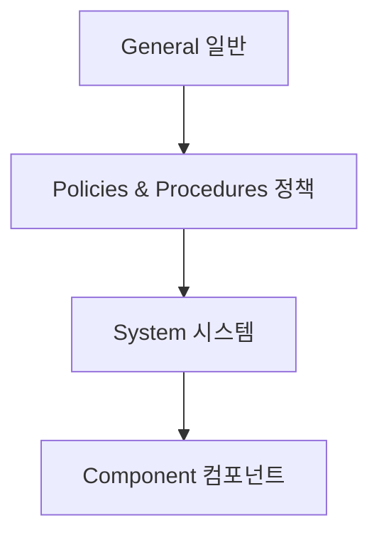

# ISA/IEC 62443 (산업제어시스템 보안)

## 1. 개요

### 가. 정의
> **산업자동화·제어시스템(IACS/ICS·OT)** 의 사이버보안을 위한 국제표준. 자산소유자·시스템통합자·제품공급자 등 이해관계자별 요구사항을 체계화.

### 나. 필요성
- OT/ICS의 **가용성·안전(Safety)** 중시, IT와 다른 보안 요구
- 스마트팩토리·기반시설 대상 사이버 위협(Stuxnet 등) 증가

## 2. 표준 구조(4개 계층)

| 계층 | 내용 |
|---|---|
| **General** | 용어·개념·모델 |
| **Policies & Procedures** | 보안 프로그램·패치 관리(자산소유자) |
| **System** | 시스템 보안 요구(SL), 존/컨듀잇 |
| **Component** | 제품 개발 보안(공급자) |

## 3. 핵심 개념

| 개념 | 설명 |
|---|---|
| **Zone & Conduit** | 자산을 보안 구역(Zone)과 통신 경로(Conduit)로 분리 |
| **Security Level(SL 1~4)** | 위협 수준별 목표 보안등급 |
| **7대 기본요구(FR)** | 식별·인증, 사용통제, 무결성, 기밀성, 데이터 흐름 제한, 이벤트 대응, 자원 가용성 |
| **다층방어(Defense in Depth)** | 계층적 방어 |

## 4. IT 보안과의 차이

| 구분 | IT | OT(62443) |
|---|---|---|
| **우선순위** | 기밀성 | **가용성·안전** |
| **패치** | 신속 | 신중(중단 위험) |
| **수명** | 짧음 | 길다(수십 년) |

## 5. 고려사항 및 시사점
- **IT/OT 융합** 보안 거버넌스, 망분리·존 분할
- 안전(Safety)과 보안(Security)의 통합 관리
- 기반시설(CI) 보호·스마트팩토리 보안의 국제 준거

---

> **한 줄 요약**: ISA/IEC 62443은 *산업제어시스템(OT) 보안 국제표준* 으로, General·정책·시스템·컴포넌트 4계층과 Zone/Conduit·Security Level·7대 기본요구로 가용성·안전 중심의 다층방어를 제시한다.
