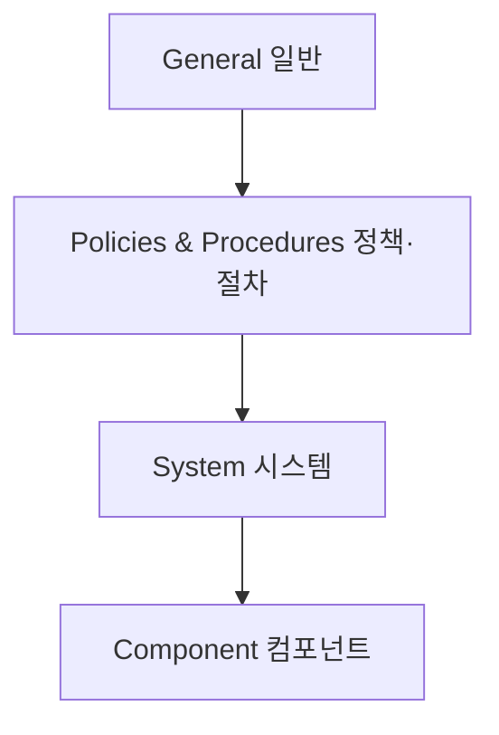

# ISA/IEC 62443 (산업제어시스템 보안)

## 1. 개요

### 가. 정의
> **산업자동화·제어시스템(IACS/ICS·OT)** 의 사이버보안을 확보하기 위해 자산소유자(Asset Owner)·시스템통합자(System Integrator)·제품공급자(Product Supplier) 등 이해관계자별 역할과 요구사항을 계층적으로 체계화한 국제표준.

ISA/IEC 62443은 원래 미국 자동화학회(ISA)의 ISA-99로 출발해 국제전기기술위원회(IEC)와 공동으로 국제표준화된 규격이다. 핵심 사상은 보안을 하나의 제품 기능이 아니라 **자산소유자의 운영·시스템통합자의 설계·제품공급자의 개발**이라는 공급망 전체가 함께 책임지는 **생애주기(Lifecycle) 관점**의 문제로 본다는 데 있다. 즉 특정 방화벽 하나를 잘 사는 것이 아니라, 누가 어떤 보안 책임을 지고 어느 수준(Security Level)까지 달성해야 하는지를 계약·설계·운영 전 과정에 못 박는 프레임워크다.

### 나. 등장 배경 및 필요성
전통적으로 발전소·정유·제조라인 같은 OT 환경은 외부망과 물리적으로 분리(air-gap)되어 있다는 믿음 아래 보안이 거의 고려되지 않았다. 그러나 2010년 이란 원심분리기를 파괴한 **Stuxnet**은 USB·내부망을 타고 폐쇄망까지 침투가 가능함을 실증했고, 이후 우크라이나 전력망 정전(2015)·독일 제철소 용광로 손상 등 물리적 피해로 이어지는 사고가 잇따랐다. IT 보안이 데이터 유출(기밀성)을 걱정한다면, OT 사고는 **설비 파손·인명 피해**로 직결된다는 점에서 위험의 성격이 근본적으로 다르다. 스마트팩토리·기반시설의 IT/OT 융합으로 폐쇄망 전제가 무너지면서, IT 보안 표준(ISO 27001)만으로는 담을 수 없는 **가용성·안전(Safety) 중심의 전용 표준**이 필요해졌고 62443이 그 사실상 국제 준거가 되었다.

## 2. 표준 구조(4개 계층)

62443은 문서군이 위 4개 계층으로 나뉘며, 각 계층은 서로 다른 이해관계자를 겨냥한다. **General(1-x)** 은 용어·개념·모델을 정의해 이후 모든 문서의 공통 언어를 제공한다. **Policies & Procedures(2-x)** 는 주로 **자산소유자**가 갖춰야 할 보안 프로그램·패치관리·서비스제공자 요건을 다룬다. **System(3-x)** 은 **시스템통합자**가 시스템을 설계·구축할 때 지켜야 할 보안 요구(3-3)와 위험평가·존 설계(3-2)를 규정한다. **Component(4-x)** 는 **제품공급자**가 개별 제품(PLC·센서·게이트웨이)을 안전하게 개발하기 위한 개발 생애주기(4-1)와 기술 요구(4-2)를 정한다. 이렇게 책임이 계층으로 분리되어 있어, 보안 사고 시 "누구의 책임 범위였는가"를 계약 기준으로 판별할 수 있다는 점이 실무적 강점이다.

| 계층 | 대상 이해관계자 | 내용 |
|---|---|---|
| **General** | 공통 | 용어·개념·모델(공통 언어) |
| **Policies & Procedures** | 자산소유자 | 보안 프로그램·패치 관리·운영 절차 |
| **System** | 시스템통합자 | 시스템 보안 요구(SL)·존/컨듀잇 설계 |
| **Component** | 제품공급자 | 제품 개발 보안 생애주기·기술 요구 |

## 3. 핵심 개념

62443의 방어 철학은 몇 가지 핵심 개념으로 구현된다. 가장 근간이 되는 것은 **Zone & Conduit** 로, 제어망을 위험 특성이 비슷한 자산끼리 묶어 **보안 구역(Zone)** 으로 나누고 구역 간 통신은 반드시 통제된 경로인 **컨듀잇(Conduit)** 만 통과하도록 강제한다. 이는 한 구역이 뚫려도 옆 구역으로 감염이 번지지 않게 하는 **격벽(bulkhead)** 개념으로, 예컨대 사무망·제어망·안전계장시스템(SIS)을 서로 다른 존으로 분리한다. 각 존에는 위협 수준에 맞춰 **Security Level(SL 1~4)** 목표를 부여하는데, SL 1은 우발적 침해, SL 2는 낮은 자원의 의도적 공격, SL 3은 중간 수준의 전문 공격, SL 4는 국가 수준의 고도 공격을 막는 것을 목표로 하여 단계가 올라갈수록 요구 통제가 강화된다.

이 목표를 실제 통제로 풀어낸 것이 **7대 기본요구(Foundational Requirements, FR)** 이며, 모든 보안 요구는 이 7가지로 귀속된다. **다층방어(Defense in Depth)** 는 이 모든 것을 관통하는 원칙으로, 어느 한 통제에 의존하지 않고 물리·네트워크·시스템·컴포넌트 여러 계층에 방어를 중첩한다.

| 개념 | 설명 |
|---|---|
| **Zone & Conduit** | 자산을 보안 구역(Zone)으로 격리, 구역 간 통신은 통제 경로(Conduit)로만 |
| **Security Level(SL 1~4)** | 위협 수준별 목표 보안등급(우발→국가급 공격) |
| **7대 기본요구(FR)** | ①식별·인증통제 ②사용통제 ③시스템 무결성 ④데이터 기밀성 ⑤데이터 흐름 제한 ⑥적시 대응 ⑦자원 가용성 |
| **다층방어(Defense in Depth)** | 물리·망·시스템·컴포넌트에 방어 중첩 |

## 4. IT 보안과의 차이(비교)

IT와 OT의 보안 우선순위가 갈리는 근본 이유는 **보호 대상의 가치가 다르기 때문**이다. IT는 정보(데이터)가 자산이라 유출을 막는 **기밀성(C)** 이 최우선이지만, OT는 공정이 멈추면 곧 생산 손실·안전 사고이므로 **가용성(A)·안전(Safety)** 이 최우선이 된다. 그래서 IT에서는 당연한 "취약점 발견 즉시 패치"가 OT에서는 오히려 위험하다. 가동 중인 발전 설비를 재부팅해야 하는 패치는 공정 중단을 유발할 수 있어, 유지보수 창(shutdown window)까지 기다리거나 보상통제(가상 패치)로 대체한다. 또 IT 장비는 3~5년이면 교체되지만 제어 설비는 20~30년을 쓰기 때문에, 이미 지원 종료된(EoL) OS가 현장에 남아 있는 것이 정상이며 이를 전제로 방어를 설계해야 한다.

| 구분 | IT | OT(62443) | 차이가 생기는 이유 |
|---|---|---|---|
| **우선순위** | 기밀성(C) | **가용성·안전(A·S)** | 사고가 데이터 유출이 아니라 설비 파손·인명으로 직결 |
| **패치** | 신속 적용 | 신중(중단 위험) | 재부팅이 공정 중단 유발, 유지보수 창 필요 |
| **수명** | 3~5년 | 20~30년 | 설비 자본재 특성, EoL OS 상존 |

## 5. 고려사항 및 시사점(기술사 관점)
- **IT/OT 융합 거버넌스**: 폐쇄망 전제가 무너진 만큼 IT-보안팀과 OT-현장팀의 책임 경계를 재정의하고, 스마트팩토리 도입 시 존 분할·단방향 게이트웨이(Data Diode)를 설계 단계부터 반영한다.
- **Safety와 Security의 통합**: 안전계장시스템(SIS)이 사이버 공격으로 무력화되면 안전 기능 자체가 무너지므로, 기능안전(IEC 61508/61511)과 62443을 함께 관리하는 것이 핵심 트렌드다.
- **공급망 보안**: 제품공급자 인증(62443-4-1/4-2)을 조달 요건으로 요구해, 보안이 내재된 제품만 도입하는 **Security by Design** 을 계약으로 강제한다.
- **국가기반보호와 연계**: 주요정보통신기반시설 보호·스마트공장 보안 가이드의 국제 준거로 활용되며, 규제 대응과 실질 방어를 동시에 만족시키는 기준선이 된다.

---

> **한 줄 요약**: ISA/IEC 62443은 *자산소유자·통합자·공급자별 책임을 4계층으로 체계화한 OT 보안 국제표준* 으로, Zone/Conduit 격리·SL 등급·7대 기본요구·다층방어를 통해 IT와 달리 **가용성·안전을 최우선**으로 하는 산업제어시스템 보안을 제시한다.
