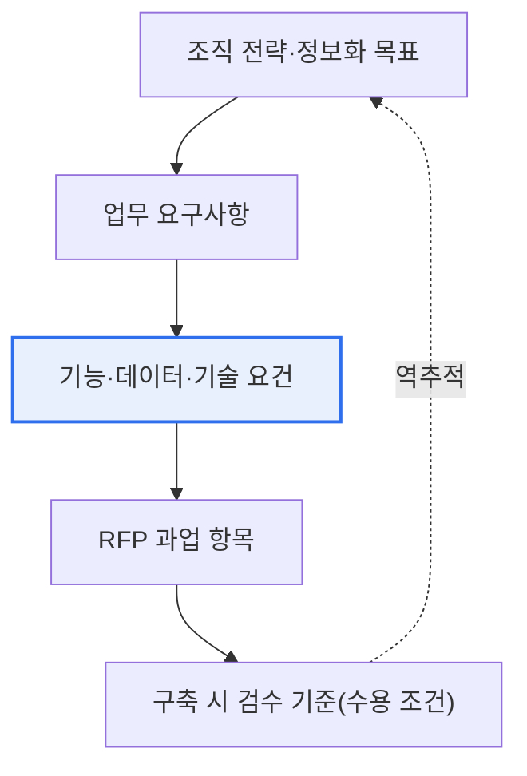

# 정보시스템 마스터플랜(ISMP)

## 1. 개요

### 가. 정의
> **ISMP(Information System Master Plan)** 는 특정 정보시스템 **구축 사업의 요구사항을 발주(계약) 전에 상세히 도출·분석·기획** 하여, 사업 발주에 필요한 제안요청서(RFP)와 실행계획을 정밀하게 수립하는 활동이다. 조직 전체의 중장기 정보화 전략을 다루는 ISP가 '어디로 갈 것인가'를 정한다면, ISMP는 **개별 사업 단위에서 '무엇을 어떻게 만들 것인가'를 발주 전에 구체화** 하는 상세 기획이다.

ISMP가 제도로 도입된 근본 배경은 '**모호한 요구로 발주된 소프트웨어 사업의 반복적 실패**'였다. 요구사항이 불명확한 상태로 사업을 시작하면, 개발 도중 요구가 계속 바뀌면서 과업 변경이 누적되고, 비용이 초과되며, 일정이 지연되고, 품질이 저하되는 악순환이 발생한다. 무엇보다 '무엇을 만들기로 했는가'가 계약서에 명확히 적혀 있지 않으므로, 발주자와 수행사 사이에 "이건 원래 범위였다 / 아니다"를 둘러싼 분쟁이 끊이지 않는다.

ISMP는 이 문제를 **'발주 전에 요구를 충분히 분석·확정한다'** 는 단순하지만 강력한 원리로 해결한다. 마치 집을 짓기 전에 상세 설계도와 견적을 확정하고 시공 계약을 맺는 것처럼, 소프트웨어 사업도 발주 이전에 무엇을 만들지를 구체화해 두면 사업 리스크를 크게 줄이고 발주 품질을 높일 수 있다. 국내에서는 소프트웨어 진흥법(구 소프트웨어산업진흥법) 체계 아래에서, 일정 규모 이상이거나 요구사항이 복잡해 사전 기획이 필요한 공공 정보화 사업에 대해 ISMP 또는 요구사항 상세화 절차를 권고·적용해 왔다. (구체적인 대상 기준·금액은 관련 고시·지침의 개정에 따라 달라질 수 있으므로 최신 규정을 확인해야 한다.)

### 나. 등장 배경과 필요성
정보화 사업은 요구가 불명확할수록 실패 위험이 기하급수적으로 커진다. 특히 대형·공공 사업은 예산 규모가 크고 이해관계자가 많으며 사회적 파급이 커서, 발주 단계에서 요구를 확정하지 않으면 통제 자체가 어려워진다. 과거 여러 공공 정보화 사업이 '저가 수주 후 과업 변경 폭증'이라는 패턴으로 실패한 경험이 ISMP 제도화의 직접적 동인이 되었다.

ISMP가 필요한 이유는 크게 세 가지로 정리된다. 첫째, **발주 품질 제고** 다. 요구사항이 명확하고 검증된 RFP는 수행사가 정확히 제안하고 공정하게 경쟁할 수 있는 토대가 된다. 둘째, **적정 대가 확보** 다. 무엇을 만들지가 구체화되어야 규모(기능점수 등)와 비용을 제대로 산정할 수 있고, 이는 무리한 저가 발주가 초래하는 품질 저하와 하도급 착취를 예방한다. 셋째, **분쟁 예방과 책임 명확화** 다. 계약 전에 범위를 확정해 두면 개발 중 "이것도 해달라"는 요구가 계약 범위 밖임을 명확히 가릴 수 있어, 발주자와 수행사 모두를 보호한다. 요컨대 ISMP는 '싸게 빨리 발주'가 아니라 '제대로 준비해 발주'로 사업의 성공 확률 자체를 끌어올리는 사전 투자다.

## 2. ISP와의 비교

ISMP를 정확히 이해하려면 상위 개념인 ISP(Information Strategy Planning)와의 관계를 짚어야 한다. 둘은 대립 개념이 아니라 **전략 → 사업 기획으로 이어지는 위계** 를 이룬다. ISP가 전사 차원에서 "우리 조직은 향후 3~5년간 어떤 정보시스템을 어떤 우선순위로 갖출 것인가"라는 큰 그림을 그린다면, ISMP는 그 그림 속 개별 과제 하나를 꺼내 "이 시스템을 실제로 발주하려면 무엇이 필요한가"를 상세화한다.

아래 표는 두 활동의 차이를 정리한 것이다. 다만 표의 항목 나열에 그치지 않고, 이 차이가 '왜' 생기는지를 이해하는 것이 중요하다. ISP는 **여러 사업을 아우르는 전략** 이므로 산출물이 방향성·우선순위 중심의 거시적 계획인 반면, ISMP는 **단일 사업의 실행 준비** 이므로 산출물이 그 사업 하나를 발주할 수 있을 만큼 구체적인 요구사항 정의서와 RFP다. 즉 추상화 수준과 목적이 다르기 때문에 산출물의 상세도와 형태가 달라지는 것이다.

| 구분 | ISP | ISMP |
|---|---|---|
| **범위** | 전사(全社) 정보화 전략 | 개별 시스템 구축 사업 |
| **목적** | 중장기 정보화 방향·우선순위 결정 | 사업 요구 확정·발주 상세 기획 |
| **시야** | 3~5년 로드맵(거시) | 특정 사업 1건(미시·실행) |
| **핵심 산출물** | 정보화 마스터플랜, 이행 로드맵 | 요구사항 정의서, 제안요청서(RFP) |
| **관계** | 상위 전략 | ISP를 구체화한 사업 기획 |

실무에서 ISP와 ISMP는 반드시 순차적으로만 진행되지는 않는다. ISP 없이 개별 사업만 급히 추진해야 하는 경우 ISMP가 사실상 전략 검토까지 일부 겸하기도 하고, 반대로 잘 수립된 ISP가 있으면 ISMP는 그 우선순위와 방향성을 그대로 이어받아 요구 상세화에 집중할 수 있다. 핵심은 **전략과 발주가 단절되지 않고 정합성 있게 연결** 되도록 하는 것이며, ISMP는 그 연결 고리 역할을 한다.

## 3. 단계별 활동과 산출물

ISMP는 착수부터 발주 준비까지 요구를 점진적으로 구체화하는 단계적 절차다. 각 단계는 앞 단계의 산출물을 입력으로 받아 요구를 한층 더 상세하게 만들며, 마지막 단계에서 발주 가능한 수준의 RFP에 도달한다. 아래 흐름도는 다섯 단계의 진행을 보여준다.

**가. 프로젝트 착수·계획** 단계에서는 ISMP 수행 자체의 범위와 추진 체계, 일정, 참여 조직을 정한다. 이 단계가 부실하면 이후 분석 범위가 흔들리므로, 경영진·현업·IT 부서의 역할과 의사결정 구조를 초기에 명확히 하는 것이 중요하다. 산출물은 ISMP 수행계획서다.

**나. 정보시스템 방향성 수립** 단계에서는 대내외 환경과 현행 시스템 현황(As-Is)을 분석하고, 목표 시스템의 방향(To-Be)과 목표모델을 정립한다. 여기서 조직의 전략·업무 목표와 정보시스템이 어떻게 정렬되어야 하는지를 규정하며, ISP가 있다면 그 방향성을 이어받는다. 이 단계의 결과가 이후 요건 분석의 나침반이 된다.

**다. 업무·기술 요건 분석** 단계는 ISMP의 심장부다. 현업 담당자 인터뷰·워크숍·현행 프로세스 분석을 통해 업무 요구사항을 상세히 도출하고, 이를 뒷받침할 기술 요건(성능·보안·연계·데이터 요건 등)을 함께 분석한다. 이 단계에서 요구가 얼마나 촘촘하게 발굴·검증되느냐가 사업 전체의 성패를 좌우하므로, 요구사항의 완전성·일관성·추적성을 확보하는 데 공을 들여야 한다. 산출물은 요구사항 분석서다.

**라. 정보시스템 구조·요건 정의** 단계에서는 분석된 요구를 바탕으로 기능·데이터·아키텍처(응용·데이터·기술 구조)를 정의하고, 요구사항을 발주 가능한 형태의 정의서로 정형화한다. 각 기능 요구에 우선순위와 수용 기준을 부여해, 수행사가 무엇을 어느 수준으로 구현해야 하는지 명확히 한다. 산출물은 요구사항 정의서다.

**마. 사업 이행방안 수립** 단계에서는 확정된 요구를 기반으로 사업 규모(예: 기능점수 기반 규모 산정)와 비용·기간을 산정하고, 사업 분할·추진 전략을 정한 뒤 이 모두를 담은 제안요청서(RFP)와 이행계획을 완성한다. 이 RFP가 곧 발주의 기준 문서가 되며, 이후 제안·계약·구축의 근거로 작동한다.

| 단계 | 세부 활동 | 핵심 산출물 |
|---|---|---|
| **착수·계획** | 범위·추진체계·일정 정의 | ISMP 수행계획서 |
| **방향성 수립** | 환경·현황(As-Is) 분석, 목표모델(To-Be) | 방향성 정의서 |
| **요건 분석** | 업무·기술 요구 상세 도출·검증 | 요구사항 분석서 |
| **구조·요건 정의** | 기능·데이터·아키텍처 정의, 우선순위화 | 요구사항 정의서 |
| **이행방안** | 규모·비용 산정, RFP·이행계획 작성 | 제안요청서(RFP), 이행계획 |

### 가. 요구사항 추적성 확보
ISMP 절차 전반을 관통하는 실무 원리는 **요구사항 추적성(traceability)** 이다. 방향성 수립에서 도출된 상위 목표가 요건 분석의 개별 요구로, 다시 구조·요건 정의의 기능·데이터 항목으로, 최종적으로 RFP의 과업 조항으로 끊김 없이 이어져야 한다. 아래는 이 추적 사슬을 나타낸 세부도다.

이 추적 사슬이 확보되면 개발 중 어떤 요구가 왜 필요한지, 어떤 상위 목표에서 비롯됐는지를 언제든 역추적할 수 있어, 불필요한 요구의 팽창(스코프 크리프)을 억제하고 검수 기준을 명확히 할 수 있다. 반대로 추적성이 끊기면 RFP에 근거 없는 요구가 섞이거나, 정작 필요한 요구가 누락되어 발주 품질이 떨어진다. ISMP의 각 산출물을 별개 문서가 아니라 하나로 연결된 요구 체계로 관리해야 하는 이유가 여기에 있다.

### 나. 실패·성공 사례 대비

ISMP의 가치는 실패 사례와 대비할 때 분명해진다. 요구를 확정하지 않고 발주한 전형적 공공 사업에서는, 착수 후 현업의 추가 요구가 쏟아지며 초기 계약 범위 대비 과업이 크게 부풀어 오른다. 예를 들어 초기에 100개 기능으로 계약했으나 개발 중 요구가 150개로 늘어나면, 수행사는 추가 대가 없이 50% 더 많은 일을 떠안거나 발주자와 분쟁에 들어간다. 이때 근거가 될 요구사항 문서가 부실하면 책임 소재를 가리기 어렵고, 결국 품질 저하·납기 지연·감사 지적으로 이어진다.

반대로 ISMP를 충실히 수행한 사업은 발주 시점에 이미 요구가 검증·확정되어 있으므로, 수행사는 정확히 제안하고 발주자는 공정하게 평가하며, 개발 중 변경은 정식 변경관리 절차로 통제된다. 요구가 명확하니 규모 산정이 정확해지고, 정확한 규모는 적정 예산 편성으로 이어져 무리한 저가 발주를 막는다. 실무적으로 ISMP는 단순한 문서 작업이 아니라 **사업 리스크를 발주 전에 선(先)정산하는 리스크 관리 활동** 이라는 점이 핵심 함의다.

또한 ISMP는 발주자의 내부 역량 강화에도 기여한다. 요구를 스스로 정의해 본 발주 조직은 이후 사업 관리·감리 단계에서도 수행사에 끌려다니지 않고 주도권을 유지할 수 있다. 즉 ISMP는 특정 사업 하나를 넘어, 발주 기관이 정보화 사업을 통제하는 성숙도(거버넌스)를 높이는 계기가 된다.

다만 ISMP가 만능은 아니라는 점도 실무적으로 유념해야 한다. 요구를 사전에 지나치게 확정하면 개발 중 발견되는 개선 여지를 반영하기 어려워, 애자일·반복 개발이 요구되는 사업과는 긴장 관계가 생길 수 있다. 따라서 요구의 안정성이 높은 대형 기간계 시스템에는 ISMP식 사전 확정이 적합한 반면, 불확실성이 큰 신규 서비스에는 RFP에 변경관리·우선순위 조정 여지를 명시하는 등 유연성을 함께 설계하는 균형이 필요하다. ISMP를 '요구를 동결하는 절차'가 아니라 '핵심 요구를 확정하되 변경을 통제 가능하게 만드는 절차'로 이해하는 것이 성숙한 적용이다.

## 5. 심화 — 요구공학·기출 연계와 답안 구성 전략

ISMP는 본질적으로 **요구공학(Requirements Engineering)을 발주 단계에 제도화한 것** 으로 볼 수 있다. 요구 도출(elicitation)·분석·명세·검증이라는 요구공학의 절차가 ISMP의 각 단계에 그대로 대응하며, 요구사항의 완전성·일관성·추적성·검증가능성이라는 품질 속성이 ISMP 산출물의 품질 기준이 된다. 따라서 답안에서는 ISMP를 요구공학·RFP·기능점수(FP) 기반 규모 산정·SLA 등 인접 주제와 엮어 서술하면 깊이가 살아난다.

기출 연계 관점에서 ISMP는 ISP, RFP, 소프트웨어 사업 대가 산정, 공공 SW 사업 제도(과업심의위원회·요구사항 상세화 등)와 함께 자주 출제된다. 최근 공공 SW 사업 관리 제도는 과업 변경의 통제와 적정 대가 보장을 강화하는 방향으로 개정되어 왔는데(과업심의위원회 운영, 요구사항 상세화 의무화 흐름 등), ISMP는 이러한 제도가 지향하는 '준비된 발주'의 대표 수단으로 자리한다. 구체적인 제도명·시행 시기·적용 기준은 지속적으로 개정되므로 답안에서는 큰 방향성 위주로 서술하고 단정적 수치 인용은 피하는 것이 안전하다.

답안 구성 전략으로는 ① 개요에서 'ISP와의 구분'을 명확히 하여 채점자에게 개념 이해를 각인시키고, ② 본론에서 5단계 절차와 산출물을 개념도와 함께 제시하되 각 단계의 '요구 구체화'라는 흐름을 강조하며, ③ ISP·RFP·규모 산정과의 연계로 확장한 뒤, ④ 결론에서 발주 품질·적정 대가·분쟁 예방이라는 기술사 관점의 함의로 마무리하는 구성이 효과적이다.

## 6. 고려사항 및 시사점

1. **발주 전 요구 상세화로 과업 변경·분쟁을 원천 예방한다.** ISMP의 핵심 가치는 사업 시작 전에 '무엇을 만들지'를 확정해, 개발 중 과업 변경 폭증과 발주자–수행사 분쟁을 구조적으로 줄이는 데 있다. 이는 사후 통제가 아닌 사전 예방이라는 점에서 리스크 관리의 정석이다.

2. **정확한 규모·비용 산정으로 적정 대가를 확보한다.** 요구가 명확해야 기능점수 등으로 규모를 제대로 산정할 수 있고, 이는 무리한 저가 발주로 인한 품질 저하와 하도급 부실을 예방한다. ISMP는 '싼 발주'가 아니라 '제값 발주'를 가능케 하는 근거를 제공한다.

3. **ISP–ISMP–구축–감리의 연계로 정합성을 확보한다.** 전사 전략(ISP)에서 개별 사업 기획(ISMP)으로, 다시 구축·감리·운영으로 이어지는 흐름이 일관되어야 정보화 투자가 조직 전략 목표에 정렬된다. ISMP는 전략과 실행 사이의 단절을 메우는 연결 고리다.

4. **발주 기관의 요구 정의 역량과 거버넌스 성숙도를 함께 끌어올린다.** ISMP는 문서 산출을 넘어, 발주 조직이 요구를 스스로 통제하고 사업을 주도하는 역량을 키우는 계기가 된다. 이 역량이 축적되어야 이후 사업에서도 수행사에 종속되지 않는 건강한 발주 생태계가 형성된다.

5. **제도·환경 변화에 맞춘 지속적 정합화가 필요하다.** 공공 SW 사업 제도는 과업 변경 통제·적정 대가 보장 방향으로 계속 진화하고 있으므로, ISMP의 산출물과 절차도 최신 법령·고시·지침에 맞춰 지속적으로 정합화해야 실효성을 유지한다.

## 참고자료
- 과학기술정보통신부, 소프트웨어 진흥법 및 하위 고시(소프트웨어 사업 관련 지침) — https://www.law.go.kr/
- 한국지능정보사회진흥원(NIA), 정보화사업 관련 안내·가이드 — https://www.nia.or.kr/

---

> **한 줄 요약**: ISMP는 *개별 정보시스템 사업의 요구사항을 발주 전에 상세 기획* 하는 활동으로, 착수→방향성→요건분석→구조정의→이행방안의 5단계로 요구를 점진 구체화해 RFP·요구사항 정의서를 산출하고, 과업 변경·분쟁을 예방하며 적정 대가와 발주 품질을 확보한다.
