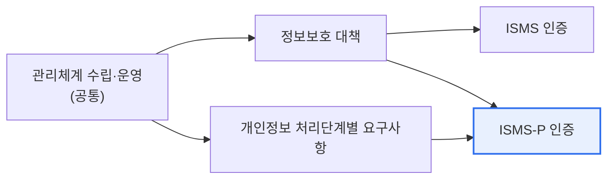

# 정보보호 및 개인정보보호 관리체계(ISMS / ISMS-P)

## 1. 개요

### 가. 정의
> **ISMS(정보보호 관리체계)** 는 정보자산의 기밀성·무결성·가용성을 보호하기 위한 관리체계 인증이고, **ISMS-P** 는 여기에 **개인정보보호**까지 통합한 인증이다. 한국인터넷진흥원(KISA)과 개인정보보호위원회가 운영한다.

인증제도의 본질적 목적은 조직이 보안을 '**일회성 대책이 아니라 지속적으로 관리되는 체계**'로 갖추도록 강제하고 검증하는 데 있다. 방화벽을 하나 샀다고 안전한 것이 아니라, 정책을 세우고(Plan) 실행하며(Do) 점검하고(Check) 개선하는(Act) PDCA 순환이 조직에 뿌리내려야 진짜 보안이 된다. 인증은 제3의 심사기관이 이 관리체계가 제대로 돌아가는지를 객관적으로 확인해주는 장치다. 정보만 다루는 조직에는 ISMS가, 개인정보를 대량으로 다루는 조직에는 개인정보 처리 요구사항까지 검증하는 ISMS-P가 적합하다.

### 나. 필요성
개인정보 유출·해킹 사고가 사회적 신뢰와 직결되면서, 일정 규모 이상 사업자에게는 관리체계 인증이 법적 의무가 되었다. 인증은 대외 신뢰 확보와 규제 준수를 동시에 달성하는 수단이다.

## 2. ISMS와 ISMS-P 차이점

두 인증은 '관리체계 수립·운영'이라는 공통 기반을 공유하되, 보호 대상과 점검 범위에서 갈린다. ISMS는 정보자산의 보안 통제(접근통제·암호화·물리보안 등)를 검증한다. ISMS-P는 여기에 더해 개인정보의 **수집→이용·제공→보관→파기** 라는 처리 생애주기 전반의 요구사항을 추가로 점검한다. 즉 ISMS-P는 ISMS를 포함하는 더 넓은 인증으로, 개인정보를 다루는 조직이 선택한다.

| 구분 | ISMS | ISMS-P |
|---|---|---|
| **보호 대상** | 정보자산(보안) | 정보자산 + **개인정보** |
| **인증 범위** | 관리체계 + 정보보호 대책 | + 개인정보 처리단계별 요구사항 |
| **점검 항목** | 보안 통제 | 보안 + 개인정보 생애주기 |
| **적합 조직** | 정보보호 중심 | 개인정보 다량 처리 |

## 3. ISMS 의무 대상 기준

「정보통신망법」에 따라 일정 요건을 충족하는 정보통신서비스 제공자는 ISMS 인증이 의무다. 통신사업자(ISP)나 데이터센터(IDC) 같은 인프라 사업자, 그리고 매출액·이용자 수가 일정 기준을 넘는 서비스 사업자, 대형 병원·대학 등이 대상이 된다. 의무 대상이 규모 기준으로 설정된 이유는, 다루는 정보·이용자가 많을수록 사고 시 사회적 파급이 크기 때문이다.

| 대상 유형 | 기준(예) |
|---|---|
| **통신사업자(ISP)** | 전기통신사업자 |
| **집적정보통신시설(IDC)** | 데이터센터 사업자 |
| **매출·이용자 규모** | 정보통신서비스 매출·일평균 이용자 수 기준 초과 |
| **병원·대학** | 일정 규모 이상 상급종합병원·대학 |

## 4. 인증 체계와 절차

인증은 '관리체계 수립·운영'과 '보호대책 요구사항', 그리고 ISMS-P의 경우 '개인정보 처리단계별 요구사항'의 통제 항목을 심사한다. 신청 → 심사(문서·현장) → 결함 보완 → 인증위원회 심의 → 인증서 발급의 절차를 거치며, 인증 후에도 매년 사후심사와 3년 주기 갱신심사로 지속성을 확인한다.

## 5. 고려사항 및 시사점

1. **인증은 목적이 아니라 수단**이다. 인증서를 받는 것 자체가 아니라 실질적 보안 수준 향상이 본질이므로, 형식적 준비에 그치지 않아야 한다.
2. **개인정보 비중이 큰 조직은 ISMS-P로 통합 관리**하는 것이 효율적이다. 보안과 개인정보보호를 하나의 체계로 관리하면 중복을 줄이고 정합성을 높인다.
3. **다른 인증체계와의 연계**를 고려한다. 클라우드는 CSAP, 국제적으로는 ISO/IEC 27001과 상호 인정·연계해 인증 부담을 줄이고 글로벌 신뢰를 확보할 수 있다.

---

> **한 줄 요약**: ISMS는 정보보호 관리체계 인증, ISMS-P는 여기에 개인정보 처리 생애주기 요구사항을 더한 통합 인증이며, 정보통신망법상 매출·이용자 규모 등 기준을 충족하는 사업자는 ISMS 인증이 의무이고 실질적 보안 수준 향상이 인증의 본질이다.
